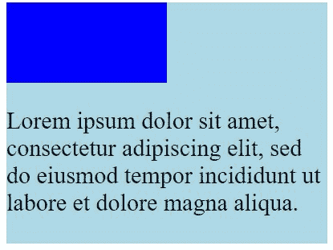
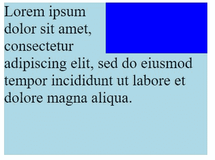

# 用 CSS 制作布局(Pt a)——前端开发系列之五

> 原文：<https://dev.to/dillionmegida/making-layouts-with-css-pt-a-part-5-of-frontend-development-series-3opd>

*这篇文章最初是在我的博客上分享的——[迪里昂·梅吉达的博客](https://www.dillionmegida.com/p/making-layouts-with-css/)*

在这个系列中，今天的主题是用 CSS 制作布局——用 CSS 设计布局。

我们已经明白 CSS 通过赋予网页风格来给网页增添美感。有很多库，比如 Bootstrap，它已经为你设计了布局，但是我建议在进入这些库之前，先了解它们是如何工作的。它们使用相同的 CSS 规则。

根据我们的指南- [路线图-前端](//www.roadmap.sh/frontend)，我们有；

### 目录

*   漂浮物
*   配置
*   显示
*   箱式模型
*   CSS 网格
*   柔性盒
*   结论

这是一个有点长的阅读，所以为什么不抓住一些咖啡☕

> 我将在本系列的下一篇文章中解释 Flexbox 和 CSS Grid。

在我深入内容之前，我想陈述一些 CSS 技巧
**正确地命名你的类**——合乎逻辑和正确的大小写，明智的是，camelCase
**理解`id`和`class`**——`id`对于一个元素来说是唯一的，并且不能被重用。`class`可用于多种元素。
T14】！重要信息 -一旦为针对元素的属性指定了值，这些值就不能被覆盖。
**了解尺寸** - `px`、`em`、`rem`应适当使用，以确保页面的一致性。
**网站兼容性**——有些网站不接受某些属性。解决这个问题的方法有时是添加某些前缀。

## 浮动

```
.element {
    float: none | right | left;
} 
```

Enter fullscreen mode Exit fullscreen mode

该属性允许元素位于其容器左侧的右侧。none 的意思是不要浮动。
看看这段代码，

```
<!-- index.html -->
<div class='container'>
    <div>

    </div>
    <p>Lorem ipsum dolor sit amet, consectetur adipiscing elit, sed do eiusmod tempor incididunt ut labore et dolore magna aliqua.</p>
</div> 
```

Enter fullscreen mode Exit fullscreen mode

```
/* style.css */
.container {
    width: 400px;
    background-color: lightblue;
    height: 400px;
}
.container div {
    height: 200px;
    width: 200px;
    background-color: blue;
}
.container p {
    font-size: 30px;
} 
```

Enter fullscreen mode Exit fullscreen mode

[](https://res.cloudinary.com/practicaldev/image/fetch/s--GPsjgqK3--/c_limit%2Cf_auto%2Cfl_progressive%2Cq_auto%2Cw_880/https://res.cloudinary.com/dillionmegida/image/upload/v15672611img/code_samples/div_on_paragraph_edit_kqunde.jpg) 
这是我们期望发生的正常结果，因为 div 元素是在`p`元素之前声明的。让我们让`div`向右浮动。

```
/* Add the property of float to the above program */
.container div {
    float: right;
} 
```

Enter fullscreen mode Exit fullscreen mode

我们的结果是，

[](https://res.cloudinary.com/practicaldev/image/fetch/s--1fnxUPyj--/c_limit%2Cf_auto%2Cfl_progressive%2Cq_auto%2Cw_880/https://res.cloudinary.com/dillionmegida/image/upload/v15672612img/code_samples/div_on_paragraph_qk3bsg.jpg)

#### 你注意到了什么？

`div`向右浮动，不仅如此，文本还包装了 div。文本占据了可用的空间。这是 float 的基本实现。
在这里阅读更多关于 CSS 浮动的内容- [CSS 浮动](https://developer.mozilla.org/en-US/docs/Web/CSS/float)

## 定位

此属性允许您在页面的某些部分放置元素。
应用的一些方法可能受父元素的限制，而其他一些方法允许元素独立。
CSS 的定位值为`static`、`fixed`、`relative`和`absolute`。
使用`top`、`down`、`left`和`right`属性进一步定位元素。

> 这些属性只能在设置了 display 属性时使用。

##### - `position: static`

这是任何元素的默认位置。它的位置取决于页面的流向。它们不受`top`、`bottom`、`left`或`right`的影响。

##### - `position: relative`

这相对于元素的默认位置来定位元素。例如，当应用`top`时，它向下推动元素。元素顶部留下的空间不容纳任何其他元素。这些元素依赖于父元素来确定其位置。

##### - `position: absolute`

这个属性使一个元素失去对其默认位置的占有，从而允许其他元素占用它的空间。当`top`被应用时，它相对于父元素起作用，但是它不推动任何其他元素。

##### - `position: fixed`

该值确保元素被赋予一个特定的位置，而不管它被放置在哪里。该元素独立于父元素，因为它可以放置在任何位置。相反，它们是相对于视口定位的。因此，任何页面滚动都不会扰乱元素的位置。它们也失去了它们默认占据的空间的所有权，因此，其他元素可以占据它们先前的位置。例如，`position: fixed; top: 0`会将元素放在页面的顶部。

> “固定”和“绝对”的区别在于,“固定”是相对于视口定位的，而“绝对”是相对于父元素定位的。相似之处在于它们不影响其他元素，不像`relative`、`static`和`sticky`。

##### - `position: sticky`

该值在相对位置和固定位置之间切换。为元素声明了一些条件。元素从相对位置开始，一旦满足这些条件，位置就变成固定的。比如`position: sticky, top: 0`。在这里，一旦元素到达浏览器的顶部(可能在页面滚动之后)，它就变成固定的了。
无论是什么使元素失去了它的顶属性 0，它就变成了相对的。

## 显示

顾名思义，该属性控制元素的显示方式。这个属性有许多不同的值，但我会解释其中的主要值。默认显示值为`block`或`inline`。每个都是在不同的用例中确定的。

##### - `display: block`

值`block`允许元素显示在新的一行上，并延伸到最大可用空间的左侧和右侧。我们有块级标签，比如`<p>`、`<h1-h6>`等等，你可能已经注意到了，这些标签最大化了可用的宽度，因此，其他元素被推到新的一行。

##### - `display: inline`

值`inline`允许元素占据所需的最大宽度。它不显示新的一行，除非没有可用的空间。行内元素包括`<a>`、`<span>`等。

> 使用`display: inline`，像`height` & `width`这样的属性将不起作用，因为正如我提到的，这些元素只占用它们显示所需的最大空间。这只有在`display: inline-block`中才有可能。
> 
> **注意:**这些是默认值。您可以覆盖它们，例如手动更改`<a>`元素的显示以阻止显示，或将`<p>`元素的显示更改为内嵌显示，这取决于您希望它们如何显示。

##### - `display: none`

值`none`在浏览器上与 display 属性一起使用时，只是告诉浏览器在呈现页面时，应该删除该元素。另一种选择是值为`hidden`的属性`visibility`。这两种方法的区别在于，`display: none`将元素从其位置移除，从而允许其他元素占据该区域，而`visibility: hidden`确保没有其他元素占据该区域，但该元素保持不可见。

##### - `display: inline-block`

值`inline-block`允许元素表现得像行内元素，但是像`height`和`width`这样的属性可以应用于它们。

##### - `display: flex`

值`flex`将元素显示为块级 flex 容器。

##### - `display: grid`

值`grid`将元素显示为块级网格容器。

这些是主要的显示值。你可以在这里找到其他值的列表[，你可以在这里](https://www.w3schools.com/cssref/pr_class_display.asp)阅读更多关于显示属性

查看这个 W3Schools 资源的位置属性。

## 箱式模型

页面上的每个元素都被视为一个盒子。
盒子模型是指盒子中围绕一个元素的一切。这样的东西就是`padding`、`margin`、`borders`和实际内容。
对于作为框的默认元素，说`<p class='name'>Dillion`

and we have this css;

```
.name {
    width: 400px;
    padding: 10px;
    margin-left: 30px;
    border: 2px;
} 
```

Enter fullscreen mode Exit fullscreen mode

框的总宽度为 400px(内容宽度)+ 10px * 2(左填充和右填充)+ 30px(左边距)+ 2px * 2(左边界和右边界)====== 454px。我们的内容是 400px，但是盒子的宽度是 454px。这是盒子模型背后的概念——其中的元素被视为一个带有额外属性和内容本身的盒子。
阅读更多关于箱式模型的信息[点击这里](https://developer.mozilla.org/en-US/docs/Learn/CSS/Building_blocks/The_box_model)

正如我之前所说，我将在下一篇文章中解释 CSS 网格和 CSS Flex。

## 结论

通过适当地使用布局的上述属性，一个漂亮的网页就会产生。

我希望它值得一读。

我相信你现在已经理解 CSS 布局的概念了(不包括 flex 和 grid)。如果你不完全理解，请参考上面的分享文章。

请关注我在这个系列中的下一篇文章。你可以在推特上联系我

谢谢你🤗

## 结论