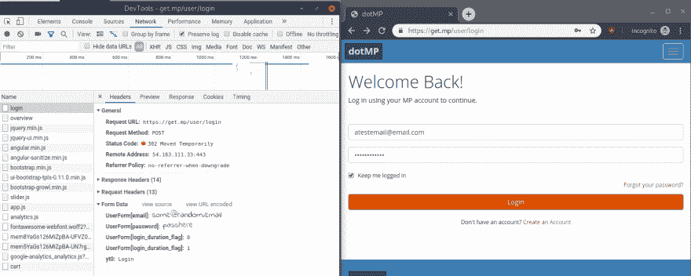

# 制作你自己的 DDNS

> 原文：<https://dev.to/igormp/making-your-own-ddns-823>

首先，你一定想知道什么是 DDNS。它代表[动态 DNS](https://en.wikipedia.org/wiki/Dynamic_DNS) ，基本上是一种自动更新一个域所指向的 IP 地址的方式。

但是为什么会有人需要它呢？嗯，作为一个喜欢在家里访问他们的桌面、路由器和其他设备的开发人员，并且还购买了一个漂亮的域名，这种东西在你没有从互联网提供商那里获得静态 IP 的情况下可以派上用场。因此，你不必每次都记住你当前的 IP 地址，或者在你外出时让你的兄弟帮你检查(这种情况发生在我身上不止一次)，你只需要记住一个众所周知的地址，并且很高兴知道它总是指向正确的 IP 地址。

已经有一些可用的解决方案，如 No-IP、DuckDNS 或 DynDNS，但它们通常不允许你免费使用自己的自定义域名，自己制作一些东西总是更好。

在我们开始之前，请确保您的域提供商没有自己的 DDNS 解决方案，就像 [namecheap](https://www.namecheap.com/support/knowledgebase/article.aspx/595/11/how-do-i-enable-dynamic-dns-for-a-domain) 那样，或者如果他们有一个容易获得的 API，就像 [Cloudflare](https://api.cloudflare.com/#getting-started-endpoints) 那样。

就我而言，由于我选择了异国情调的`.mp` TLD，上述解决方案对我不起作用，所以我不得不通过注册网站找到自己的方法来更新我的一个子域所指向的 IP。幸运的是，这个网站有点烂，Chrome 的 DevTools 帮了我很多，让我可以检查他们如何管理登录会话，以及记录的更新过程是如何工作的。

<figure>

[](https://res.cloudinary.com/practicaldev/image/fetch/s--2SuImREY--/c_limit%2Cf_auto%2Cfl_progressive%2Cq_auto%2Cw_880/https://thepracticaldev.s3.amazonaws.com/i/6nflgpe737fks3cbzzi9.png)

<figcaption>A simple POST request to get our login cookie</figcaption>

</figure>

<figure>

[](https://res.cloudinary.com/practicaldev/image/fetch/s--vrv4O7Yp--/c_limit%2Cf_auto%2Cfl_progressive%2Cq_auto%2Cw_880/https://thepracticaldev.s3.amazonaws.com/i/p3bq5fp2g8m20i0eofmg.png)

<figcaption>An even simpler PUT request to update our records</figcaption>

</figure>

通过 Postman 模拟这些请求以确保它们能够工作是轻而易举的事情。

<figure>

[](https://res.cloudinary.com/practicaldev/image/fetch/s--6cNI1njt--/c_limit%2Cf_auto%2Cfl_progressive%2Cq_auto%2Cw_880/https://thepracticaldev.s3.amazonaws.com/i/zf49v3jbvvhyrvshgoly.png)

<figcaption>Simulated login request</figcaption>

</figure>

<figure>

[](https://res.cloudinary.com/practicaldev/image/fetch/s--8ifPqLRc--/c_limit%2Cf_auto%2Cfl_progressive%2Cq_auto%2Cw_880/https://thepracticaldev.s3.amazonaws.com/i/8idlpauba3gcbu8fx8ac.png)

<figcaption>Simulated update request</figcaption>

</figure>

现在让我们进入一些代码。我选择了围棋，因为它简单，而且我喜欢它。通过我们的客户端创建登录会话非常简单，只需设置一个 [cookie jar](https://golang.org/pkg/net/http/cookiejar/) 和一个包含它的 http 客户端，填充你的 POST 值并发送数据。

```
// Our client with its cookies
jar, _ := cookiejar.New(nil)
client := &http.Client{
    Jar: jar,
}

// Login form data
postData := url.Values{}
postData.Add("UserForm[email]", YOURUSERNAMEHERE)
postData.Add("UserForm[password]:", YOURPASSWORDHERE)

// Perform a login in order to get our credentials cookie
login, err := client.PostForm(ADDRESSTOPOST, postData)
if err != nil {
    return err
} 
```

这应该让我们在 cookie jar 中保留登录 cookie。下一步是实际模拟更新我们的 IP 地址的请求。

```
// That's awful and there should be a better way to do that
mockJSON := `{"id":"123","domain_id":"456","name":"home","type":"A","content":"1.1.1.1","ttl":1800,"prio":null,"change_date":null,"disabled":"0","ordername":null,"auth":"1","description":"Host","selected_ttl":{"name":"30 minutes","value":1800}}`
var jsonMap map[string]interface{}
json.Unmarshal([]byte(mockJSON), &jsonMap)

// Our relevant data to update the IP
jsonMap["content"] = NEWIPADDRESSHERE

formattedJSON, err := json.Marshal(jsonMap)
if err != nil {
    return err
}

// Actual request to update the IP
req, _ := http.NewRequest("PUT", ADDRESSTOUPDATEIP, strings.NewReader(string(formattedJSON)))
req.Header.Add("Content-Type", "application/json")

resp, err := client.Do(req)
if err != nil {
    return err
} 
```

一个好主意是将上述两者都包含到一个函数中，这个函数可以用我们想要更新到的新 IP 来调用，比如`func updateIP(newIp string) error{}`，如果出现任何问题，它都会返回一个错误。

我们需要的另一件事是找出我们的 IP 是否改变了，如果改变了，就调用我们新创建的函数。为此，我使用了 [ipify](https://www.ipify.org/) ，主要是因为它们提供了几乎每种语言的代码片段。将它们的代码片段封装到一个函数中并检查更改也应该很容易。

```
ip := ""
for {
    // Call for our ipify function
    newIP, err := getCurIP()
    if err != nil {
        log.Fatal("[ERROR]", err)
    }
    if ip != newIP {
        if err := updateIP(newIP); err != nil {
            log.Fatal("[ERROR]", err)
        } else {
            log.Println("[INFO] IP updated to", newIP)
            ip = newIP
        }
    }
    // Sleeps for 5 minutes before checking for changes again
    time.Sleep(5 * time.Minute)
} 
```

就是这样！您可以让这段代码通过 cron、systemd 或任何您喜欢的系统管理器保持运行。我使用的实际代码，以及一些额外的东西，比如从 env 变量和 systemd 单元文件加载数据，可以在 [my github](https://github.com/igormp/GoDDNS) 中找到。

到目前为止，它对我来说工作得非常好，正如下面的图片所示，我希望这对任何人都有用。

<figure>

[](https://res.cloudinary.com/practicaldev/image/fetch/s--BcSaytDr--/c_limit%2Cf_auto%2Cfl_progressive%2Cq_auto%2Cw_880/https://thepracticaldev.s3.amazonaws.com/i/1r0u8qw3dihme2u361p5.png)

<figcaption>Service running in my machine through systemd</figcaption>

</figure>