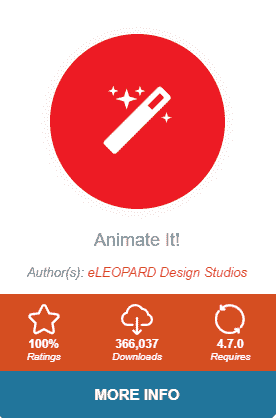
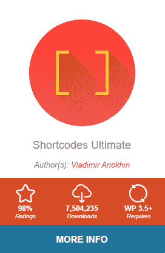

# 初级开发者的微交互教程:如何用 CSS 和 JavaScript 创建一个交互式的“喜欢”按钮

> 原文：<https://dev.to/codeinwp/micro-interactions-tutorial-for-beginner-developers-how-to-create-an-interactive-like-button-with-css-and-javascript-ce>

我觉得可以肯定地说，微互动很酷。我们——网民——普遍都喜欢它们。不管你是否注意到它们，它们都提供了显著的用户体验改善。通过让你的网站或网络工具以一种微妙而友好的方式变得生动，他们只是让用户更加享受整个交互过程。

本着这种精神，我想给你一个快速的微交互教程，告诉你如何为你的网站创建一个很酷的“喜欢”按钮。用最少的代码。这就是它的作用:

[](https://res.cloudinary.com/practicaldev/image/fetch/s--2aTItNTC--/c_limit%2Cf_auto%2Cfl_progressive%2Cq_66%2Cw_880/https://mk0codeinwp10tp0961a.kinstacdn.com/wp-content/uploads/2019/08/microinteraction-gif.gif)

但是首先:

### **首先为什么要费心去做微互动呢？**

我不会试图在这里说服你太多，但让我们看看几件事。

微互动已经存在了一段时间——以至于他们甚至有了关于微互动的书籍。此外，已经有许多实验和研究在探究它们实际上有多有用和有效。

最著名的研究机构之一尼尔森诺曼集团(Nielsen Norman Group)在 2018 年更加密切地关注了微观互动。根据他们的结论，微互动已经被证明，除了其他方面，通过鼓励参与和传播品牌来改善用户体验。

简而言之，如果使用得当，微互动会非常有益，而且不要太多。今天，我们将向您展示一个简单的微互动实例:

### **微交互教程:我们竖起大拇指按钮的标记和基本 CSS**

💡注意；在底部，我们为您提供了一些不涉及手工编写代码的选项。

首先，我们需要一些好的旧 HTML 和 CSS 魔法来使它工作。结构非常简单。

我们将为 like 图标本身使用一个 *SVG* 标签——这来自[字体牛逼](https://fontawesome.com/)；你可以在这里找到大多数的图标。为了调整 SVG 标签的宽度和高度属性，我们将使用下面的 HTML:

```
<html>
  <body>
    <a href="#" class="like-button">
      <path d="M320 1344q0-26-19-45t-45-19q-27 0-45.5 19t-18.5 45q0 27 18.5 45.5t45.5 18.5q26 0 45-18.5t19-45.5zm160-512v640q0 26-19 45t-45 19h-288q-26 0-45-19t-19-45v-640q0-26 19-45t45-19h288q26 0 45 19t19 45zm1184 0q0 86-55 149 15 44 15 76 3 76-43 137 17 56 0 117-15 57-54 94 9 112-49 181-64 76-197 78h-129q-66 0-144-15.5t-121.5-29-120.5-39.5q-123-43-158-44-26-1-45-19.5t-19-44.5v-641q0-25 18-43.5t43-20.5q24-2 76-59t101-121q68-87 101-120 18-18 31-48t17.5-48.5 13.5-60.5q7-39 12.5-61t19.5-52 34-50q19-19 45-19 46 0 82.5 10.5t60 26 40 40.5 24 45 12 50 5 45 .5 39q0 38-9.5 76t-19 60-27.5 56q-3 6-10 18t-11 22-8 24h277q78 0 135 57t57 135z"/>
      
    </a>
  </body>
</html> 
```

对于 CSS，我们将从最基本的开始。这里我们想要做的是给我们的 like 按钮一个漂亮的外观，并且让所有的东西都很好地集中在屏幕上。我们已经知道我们将在点击时切换一个类(活动的*类),所以我们需要考虑这一点。我们将在图标激活时用蓝色填充，不激活时用深灰色填充:* 

```
body {
  display: flex;
  align-items: center;
  justify-content: center;
  height: 100vh;
}

.like-button {
  display: flex;
  align-items: center;
  justify-content: center;
}

.like-button.active {
  -webkit-animation: pop 0.9s both;
  animation: pop 0.9s both;
}

.like-button svg {
  opacity: 1;
}

.like-button svg path {
  fill: #333;
  transition: fill .4s ease-out;
}

.like-button.active svg path {   
  fill: #2196f3;
} 
```

这里我们需要的另一个东西是按钮激活时使用的 *pop* 动画，所以我们要把它添加到我们的 CSS 文件:

```
@-webkit-keyframes pop {
  0% {
    -webkit-transform: scale3d(1, 1, 1);
    transform: scale3d(1, 1, 1);
  }
  30% {
    -webkit-transform: scale3d(1.25, 0.75, 1);
    transform: scale3d(1.25, 0.75, 1);
  }
  40% {
    -webkit-transform: scale3d(0.75, 1.25, 1);
    transform: scale3d(0.75, 1.25, 1);
  }
  50% {
    -webkit-transform: scale3d(1.15, 0.85, 1);
    transform: scale3d(1.15, 0.85, 1);
  }
  65% {
    -webkit-transform: scale3d(0.95, 1.05, 1);
    transform: scale3d(0.95, 1.05, 1);
  }
  75% {
    -webkit-transform: scale3d(1.05, 0.95, 1);
    transform: scale3d(1.05, 0.95, 1);
  }
  100% {
    -webkit-transform: scale3d(1, 1, 1);
    transform: scale3d(1, 1, 1);
  }
}

@keyframes pop {
  0% {
    -webkit-transform: scale3d(1, 1, 1);
    transform: scale3d(1, 1, 1);
  }
  30% {
    -webkit-transform: scale3d(1.25, 0.75, 1);
    transform: scale3d(1.25, 0.75, 1);
  }
  40% {
    -webkit-transform: scale3d(0.75, 1.25, 1);
    transform: scale3d(0.75, 1.25, 1);
  }
  50% {
    -webkit-transform: scale3d(1.15, 0.85, 1);
    transform: scale3d(1.15, 0.85, 1);
  }
  65% {
    -webkit-transform: scale3d(0.95, 1.05, 1);
    transform: scale3d(0.95, 1.05, 1);
  }
  75% {
    -webkit-transform: scale3d(1.05, 0.95, 1);
    transform: scale3d(1.05, 0.95, 1);
  }
  100% {
    -webkit-transform: scale3d(1, 1, 1);
    transform: scale3d(1, 1, 1);
  }
} 
```

### **本微互动教程的“互动”部分**

现在我们已经有了基本的样式，是时候处理实际的交互了——这意味着 [JavaScript](https://www.codeinwp.com/blog/learning-javascript-for-wordpress/) ！

首先，我们需要一个 JavaScript 函数来生成一个给定区间(最小值和最大值)内的随机整数:

```
function randomInt(min, max) {
  return Math.floor(Math.random() * (max - min + 1) + min);
} 
```

接下来，我们需要另一个随机返回 *+1* 或 *-1* 的函数，这样我们就可以得到随机的负值或正值:

```
function plusOrMinus() {
  return Math.random() < 0.5 ? -1 : 1;
} 
```

现在进行实际的交互处理；让我们看一下代码来正确地解释它:

*   首先，我们将把按钮保存在一个变量中，并向它添加一个 click 事件侦听器。
*   单击按钮时，我们将添加一个 *preventDefault()* 函数，这样我们就可以确保不会发生任何不必要的事情。
*   之后，我们将把我们的*活动*类添加到按钮上，我们之前通过 CSS 把它设计成蓝色。
*   然后我们将运行 *generateClones()* 函数(尚未定义)，通过 *this* 将我们的按钮作为参数传递。

```
let button = document.querySelector(".like-button");

button.addEventListener("click", function(e) {
  e.preventDefault();
  this.classList.toggle("active");
  generateClones(this);
}); 
```

现在让我们定义 *generateClones()* 函数，并使用它运行以下步骤:

*   首先，让我们决定一个随机的克隆数量。我们将为图标实例化两到四个克隆体。我们将使用之前定义的 *randomInt()* 函数。
*   然后，对于每个克隆，我们将使用按钮中的 SVG 标签作为“模型”，并使用*clone node(true)*JavaScript 函数将其克隆到一个新变量中。我们还将使用随机整数生成器函数为我们的克隆定义一个介于 5 和 16 之间的大小。
*   接下来，我们将添加我们的克隆到按钮，用之前生成的数字设置它们的宽度和高度，并使它们的位置绝对，这样我们就可以独立于按钮移动它们。
*   我们需要的另一件事是为我们的克隆体做一个过渡，这样它们就不会在点击的时候突然出现在新的地方。
*   现在，为了添加实际的变换来移动我们的图标，我们将会变得有点疯狂。我们希望我们的克隆体从按钮的中心随机向外移动。使用我们的 *randomInt()* 和 *plusOrMinus()* 函数的组合，我们将使用 *translate3d* CSS 属性在 XY 轴上移动我们的克隆体。我们还将使用“hack ”,因为我们的转换不适用于其他情况。所以添加一个简单的 *setTimeout()* 函数将帮助我们实现这一点。与此同时，我们将移动不透明度为 0，使克隆消失。
*   删除我们的克隆体。我们做完所有的爵士乐后，必须清理大教堂。所以我们需要另一个 *setTimeout()* 函数，它将在一秒钟后从 DOM 中删除我们的克隆。

```
generateClones(button) {
  // 1\. Generate clones and iterate over the set number
  let clones = randomInt(2, 4);
  for (let it = 1; it <= clones; it++) {
    // 2\. Get the SVG tag clone in a variable and generate a random size
    let clone = button.querySelector("svg").cloneNode(true),
        size = randomInt(5, 16);
    // 3\. Add our clone to the button and change its' width/height/position
    button.appendChild(clone);
    clone.setAttribute("width", size);
    clone.setAttribute("height", size);
    clone.style.position = "absolute";
    // 4\. Add some flashy transitions
    clone.style.transition =
      "transform 0.5s cubic-bezier(0.12, 0.74, 0.58, 0.99) 0.3s, opacity 1s ease-out .5s";
    // 5\. Animate our icon outwards with a setTimeout function so that CSS complies.
    let animTimeout = setTimeout(function() {
      clone.style.transform =
        "translate3d(" +
        plusOrMinus() * randomInt(10, 25) +
        "px," +
        plusOrMinus() * randomInt(10, 25) +
        "px,0)";
      clone.style.opacity = 0;
      clearTimeout(animTimeout);
    }, 1);
    // 6\. Removing the clones after 0.9 seconds
    let removeNodeTimeout = setTimeout(function() {
      clone.parentNode.removeChild(clone);
      clearTimeout(removeNodeTimeout);
    }, 900);
  }
} 
```

就是这样！我们已经熬到最后了！下面是 CodePen 的例子:

[https://codepen.io/abaicus/embed/gNXdQP?height=600&default-tab=result&embed-version=2](https://codepen.io/abaicus/embed/gNXdQP?height=600&default-tab=result&embed-version=2)

感谢你经历这一切！

### **其他选项添加微互动到 WordPress**

如果手动编写代码不完全是你的事情，实际上有相当多的 WordPress 插件，你可以用它们在你的网站上进行微交互，而不需要担心它们是如何工作的。

首先，你可以使用[动画制作它](https://wordpress.org/plugins/animate-it/)！使用 CSS3 可以让你的页面上的几乎所有元素都变成动画的插件。

例如，您可以添加一个按钮或一段文本，然后将其设置为在单击时以某种方式显示动画。

这里有一个插件可以做什么的例子—[视频](https://www.youtube.com/watch?v=Np_t43pfrh4)📹。

[](https://res.cloudinary.com/practicaldev/image/fetch/s--Dg4CDY0q--/c_limit%2Cf_auto%2Cfl_progressive%2Cq_auto%2Cw_880/https://thepracticaldev.s3.amazonaws.com/i/wuimqhh6f6uyguuxhgpq.png)

另一个插件，也是我们编辑的最爱之一，是 [Shortcodes Ultimate](https://wordpress.org/plugins/shortcodes-ultimate/) 。

在众多不同的短代码中，有一种是用于简单动画的。有一些关于动画应该如何表现的预设，你可以在将要被动画化的块中放入几乎任何东西。

下面是一个动画按钮的示例:

[](https://res.cloudinary.com/practicaldev/image/fetch/s--2dwLivh1--/c_limit%2Cf_auto%2Cfl_progressive%2Cq_66%2Cw_880/https://thepracticaldev.s3.amazonaws.com/i/uolqrrsiyo4v4bbzvmaa.gif)

[](https://res.cloudinary.com/practicaldev/image/fetch/s--h733Vscp--/c_limit%2Cf_auto%2Cfl_progressive%2Cq_auto%2Cw_880/https://thepracticaldev.s3.amazonaws.com/i/szeyee2n70m3r5kshwy4.png)

这两个插件应该给你足够多的选项来激活页面上的某些元素，让它们在用户与它们交互时更流行一些。当然，你不希望做得太过火，但是当用户与你的关键[行动号召](https://www.codeinwp.com/blog/optimize-call-to-action-buttons/)交互时，给他们额外的轻推可能会有很大帮助。

你对微互动有什么看法，你是否在考虑好好利用这个微互动教程，为你的网站增加一些东西？请在评论中告诉我们。

*文章最初发表于[CodeinWP.com](https://www.codeinwp.com/blog/micro-interactions-tutorial/)T3】*