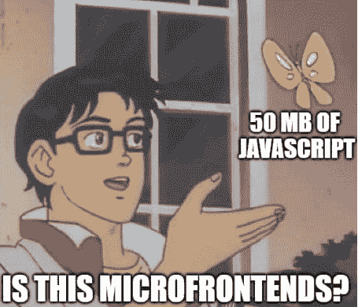

# 微前端:好的、坏的和丑陋的

> 原文：<https://dev.to/kball/microfrontends-the-good-the-bad-and-the-ugly-2b3c>

前端 twitter 上周大爆谈论‘微前端’，双方都有强有力的论据和强烈的观点跳出来。

> 肖恩·拉金(廖肖恩)[@ thelarkinn](https://dev.to/thelarkinn)有人让我 perf。使用“微前端”分析网站。
> 
> Memebait 相关:21:22PM-2019 年 6 月 13 日42326

这场争论让我想起了很多关于“JS 中的 CSS”的争论，双方都在谈论对方。

在过去，我当然对那件事感到内疚，但这次我将尝试一种更微妙的方法。

我认为就像 JS 中的 CSS 一样，根据您的项目和组织约束，存在真正的权衡和差异。实现微前端也有好方法和坏方法。

那么我们开始吧，让我们看看微前端的好、坏和丑。

## 首先，微前端到底是什么？

“微前端架构”是一种基于[微服务](https://martinfowler.com/articles/microservices.html)构建前端应用的方法。

这个想法是将您的前端分成一组独立可部署的、松散耦合的应用程序。然后将这些应用程序组装在一起，创建一个面向用户的应用程序。

做这件事的技术方法各不相同，不同的公司做不同的事情，从服务器端的跨独占(听起来很奇特，但基本相当于跨越应用障碍的老式 php 语句`include`)到 iframes，再到 JavaScript 元框架和 web 组件。

如果你正在寻找关于微前端、它们的好处和不同方法的全面介绍，我推荐 Cam Jackson 的这篇文章。

## 好:组织的灵活性和一致性

与微服务非常相似，微前端的倡导者强调了减少跨团队依赖对组织的好处。微前端的一些优势包括:

*   针对不同的服务进行不同的部署
*   自主团队独立迭代和创新的能力
*   围绕业务部门或产品组织团队的能力

所有这些都是有效的好处，特别是对于大型和复杂的项目，但是即使是较小的应用程序也可以从独立部署中获益。

当我在 2010 年开发一个电子商务应用程序(微服务出现之前)时，我一直担心会因为一个不相关的变化而破坏结账。我们构建了广泛的测试框架来防止这种情况，但回过头来看，这对于隔离服务+微前端来说是一个完美的情况。

## 不好:操作复杂

随着我们从编辑静态文件发展到复杂的构建系统、编译和大型框架，获得一个正常运行的前端环境已经大大增加了复杂性。微前端进一步加剧了这种趋势，现在对整个应用程序进行任何类型的测试都可能需要多个协调的前端，更不用说使用任何工具将它们缝合在一起了。

微服务领域的资深人士可能对挑战很熟悉:

*   需要在开发中运行许多不同的应用程序来测试完整的体验
*   跟踪和调试整个系统中的问题
*   处理整个系统的版本控制

本质上，我们是在用单个前端的简单性换取整个系统的复杂性。

## 丑陋:表现，不连贯的经历，

twitter 上有很多关于微前端的扣篮。

> 肖恩·拉金(廖肖恩)[@ thelarkinn](https://dev.to/thelarkinn)微前端:怎么能只针对开发者优化到第 n 度。将性能、UI/AX 一致性和可预测的设计扔在门外(戏剧性的)。
> 
> 如果说，我们还在做微前端系统编程是有意义的。但这是网络。Diff 约束2019 年 6 月 12 日下午 16:0453268

这些看起来是相当糟糕的问题:

*   随着每个团队做出自己的技术选择，浏览器可能会下载多个框架&重复的代码
*   用户不会孤立地体验你的公司或产品。这是反对将样式完全限定在组件范围内的理由之一——对于完全分离的团队，这个问题可能会更严重。
*   微前端的一些实现(特别是嵌入 iframes)会导致巨大的可访问性挑战。

虽然支持者会争辩说这些不会发生，但这种方法似乎使我们更有可能看到这些问题。

## 妥协:微前端体验的光谱

这些利弊如何将取决于你和你的情况。对于一个小的、位于同一地点的团队和相对简单的产品，微前端的好处相对于缺点来说是很小的，而对于一个大的、多方面的产品和多个分布式团队，好处可能开始超过挑战。

也有相当多的方法可以获得许多好处，而没有所有的缺点。

> 科里豪斯@ housecor下面是我的看谱。人们关心的微前端模式是完全独立。我已经看到，当你通过团队之间的战略协作使它变得柔和一点时，这种模式也能工作。这样做可以减轻负面影响。2019 年 6 月 14 日 12 点 08 分016

通过坚持单一的框架选择并利用像 [single-spa.js](https://single-spa.js.org/) 这样的协调框架，你可以通过共享资源&只下载一次公共代码来减轻很多性能损失。

有了共享组件库，您可以消除许多用户体验不一致的问题。

当然，每走一步，你都要放弃一些独立性。在某种程度上，你不再拥有微前端架构。光谱上对您有意义的确切点将取决于您的产品和您的组织。

这就是要点- **工程都是关于权衡的，微框架给了你另一个可以权衡的维度**。

* * *

如果前端开发是你关心的事情，你可能也会对我的每周时事通讯《星期五前端》感兴趣。每周五我会发出 15 个链接，链接到 CSS/SCSS、JavaScript 和其他各种精彩的前端新闻中的最佳文章、教程和公告。在这里报名:[https://zendev.com/friday-frontend.html](https://zendev.com/friday-frontend.html)