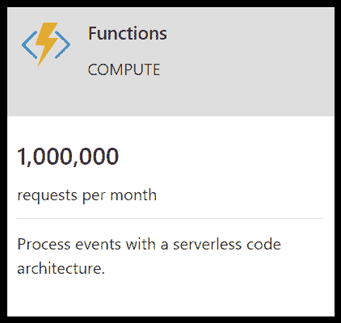
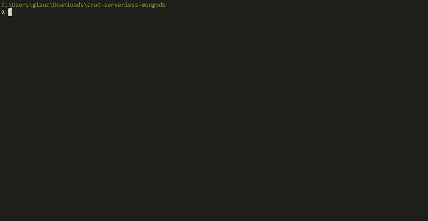
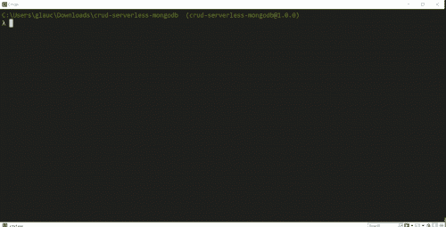
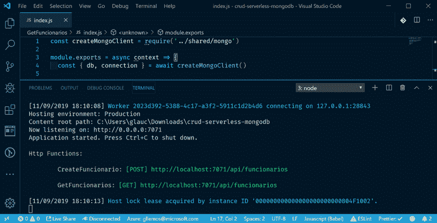

# 将应用程序迁移到无服务器体系结构和蓝色功能

> 原文：<https://dev.to/azure/migracion-de-una-aplicacion-mean-a-arquitectura-serverless-y-azure-functions-44no>

本文是内容集[# server esssetember](https://dev.to/azure/serverless-september-content-collection-2fhb)的一部分。您将在此找到 2019 年 9 月期间发表的所有文章。

本文将学习如何使用 Azure Functions 轻松、快速、动态地将应用程序迁移到无服务器体系结构！

项目意思是已经准备好了，您可以制作 git cline 或下载它

我们走吧？！

## 了解项目结构意思

在本项目中，我们将侧重于两个文件夹:API 和 **front** 。如下图所示:

[](https://postimg.cc/RJKKF34d)

如果您运行此应用程序，您将注意到我们仍在 mongodb 中，并且正在使用后端，在本例中，我们使用 Node.js。

持久数据包括:

**分类:Funcionario**

*   **官员:**(蒙古包生成的编号 guid)
*   公务员姓名:字符串
*   **货物:**字符串
*   号码识别元:号码

如果要在本地运行此项目，请仅执行项目存储库中 README.md 中的步骤。

好吧，现在你有了 MEAN 计划，迁移到 Azure Functions？

但首先，让我们来了解一下什么是蓝色函数！

## 它们是蓝色功能吗？⚡️

**[【azure functions】](https://azure.microsoft.com/es-es/services/functions/?WT.mc_id=servsept_devto-blog-gllemos)**是一种无需服务器的流程服务，使您无需明确配置或管理基础架构即可按需运行代码。

Azure Functions 支持多种编程语言，包括:

*   **c#**
*   **[JavaScript](https://docs.microsoft.com/es-es/azure/azure-functions/functions-reference-node?WT.mc_id=servsept_devto-blog-gllemos)**
*   **[F#](https://docs.microsoft.com/es-es/azure/azure-functions/functions-reference-fsharp?WT.mc_id=servsept_devto-blog-gllemos)**
*   **[Java](https://docs.microsoft.com/es-es/azure/azure-functions/functions-reference-java?WT.mc_id=servsept_devto-blog-gllemos)**
*   **[PowerShell](https://docs.microsoft.com/es-es/azure/azure-functions/functions-reference-powershell?WT.mc_id=servsept_devto-blog-gllemos)**
*   **[Python](https://docs.microsoft.com/es-es/azure/azure-functions/functions-reference-python?WT.mc_id=servsept_devto-blog-gllemos)**
*   **[打字稿](https://docs.microsoft.com/es-es/azure/azure-functions/functions-reference-node?WT.mc_id=servsept_devto-blog-gllemos#typescript)**

下面的语言已经受支持，但在它们的 preview 版本中:

*   **痛击**
*   **PHP**

有关 Azure Functions 支持的语言的更多详细信息，请访问此处的链接

但是，对于本文，我们将重点讨论 JavaScript。😉

## 蓝色功能中的重要模板

开始迁移之前，请务必注意 Azure Functions 有几个现成的模板。其中包括:

*   **[HTTPTrigger](https://docs.microsoft.com/es-es/azure/azure-functions/functions-create-first-azure-function?WT.mc_id=servsept_devto-blog-gllemos)**
*   **[TimerTrigger](https://docs.microsoft.com/es-es/azure/azure-functions/functions-create-scheduled-function?WT.mc_id=servsept_devto-blog-gllemos)**
*   **[CosmosDBTrigger](https://docs.microsoft.com/es-es/azure/azure-functions/functions-bindings-cosmosdb-v2?WT.mc_id=servsept_devto-blog-gllemos)**

*   **[队列触发器](https://docs.microsoft.com/es-es/azure/azure-functions/functions-bindings-storage-queue?WT.mc_id=servsept_devto-blog-gllemos)**
*   **[EventGridTrigger](https://docs.microsoft.com/es-es/azure/event-grid/resize-images-on-storage-blob-upload-event?tabs=dotnet&WT.mc_id=servsept_devto-blog-gllemos)**
*   **[事件触发](https://docs.microsoft.com/es-es/azure/azure-functions/functions-bindings-event-hubs?WT.mc_id=servsept_devto-blog-gllemos)**
*   **[ServiceBusQueueTrigger](https://docs.microsoft.com/es-es/azure/azure-functions/functions-bindings-service-bus?WT.mc_id=servsept_devto-blog-gllemos)**
*   **[ServiceBusTopicTrigger](https://docs.microsoft.com/es-es/azure/azure-functions/functions-bindings-service-bus?WT.mc_id=servsept_devto-blog-gllemos)T3】**

我不会逐一详述模板，否则这篇文章会很大。但是，如果您想进一步了解每个模板及其在特定应用程序中的最佳用途，我建议您阅读文档。

对于此帖子，我们将使用**[【HTTP trigger】](https://docs.microsoft.com/es-es/azure/azure-functions/functions-create-first-azure-function?WT.mc_id=servsept_devto-blog-gllemos)**，因为此模板启用使用 http 请求执行代码。这正是我们所需要的！

如果你是任何一所学校或大学的学生，你可以设立你的学生蓝账户。此帐户将为您提供 100.00 美元的信用，让您无需信用卡即可免费使用服务。要激活此账户，只需访问旁边的链接: **[【这里】](https://azure.microsoft.com/es-es/free/students/?WT.mc_id=servsept_devto-blog-gllemos)** 【此账户每月可使用 **1，000，000 份免费申请处理蓝色功能事件！**

[](https://postimg.cc/5HCTSV5r)

嗯，在这种蓝函数的概述之后，我们就可以开始迁移了！往前走！

## 蓝色功能核心工具套装的安装

**[【蓝色功能核心工具】](https://docs.microsoft.com/azure/azure-functions/functions-run-local?WT.mc_id=servsept_devto-blog-gllemos)** 允许您从系统命令提示符或使用终端在本地计算机上开发和测试功能。

以下是继续本教程所需的程序和软件包:

*   **[node . js-LTS](https://nodejs.org/en/)T3】**
*   **[Azure 功能核心工具](https://www.npmjs.com/package/azure-functions-core-tools)**
*   **[蒙哥罗盘](https://www.mongodb.com/products/compass)**

在计算机上安装 Node.js 后，只需键入以下命令:

*   **窗户**

```
npm install -g azure-functions-core-tools 
```

Enter fullscreen mode Exit fullscreen mode

*   **苹果电脑**

```
brew tap azure/functions
brew install azure-functions-core-tools 
```

Enter fullscreen mode Exit fullscreen mode

*   **Linux(Ubuntu/Debian)com APT**

```
curl https://packages.microsoft.com/keys/microsoft.asc | gpg --dearmor > microsoft.gpg
sudo mv microsoft.gpg /etc/apt/trusted.gpg.d/microsoft.gpg 
```

Enter fullscreen mode Exit fullscreen mode

有关正确安装蓝色功能核心工具的更多信息，请访问此处的链接

我如何知道是否正确安装了蓝色功能核心工具？只需在终端上键入以下命令:

```
> func 
```

Enter fullscreen mode Exit fullscreen mode

如果根据以下 gif 发生这种情况，则说明软件包安装成功。

[](https://gifyu.com/image/hYvM)

太好了！现在我们可以创建自己的功能。为此，请在您的计算机上创建本地文件夹并□！

## 创建蓝色函数新应用

既然我们已经安装了软件包，我们就创建一个新的应用程序。为此，只需按照 gif 等步骤进行操作:

[](https://gifyu.com/image/hYqP)

请注意，打开 Visual Studio 代码时，我们必须单击右下角的“`YES`”按钮以启用项目中的某些重要文件。

## 在蒙戈布建立连接

现在，让我们对我们新创建的项目做一些必要的修改。为此，我们将在我们的项目中本地安装[【mong odb】](https://www.npmjs.com/package/mongodb)。键入以下命令:

```
> npm install mongodb 
```

Enter fullscreen mode Exit fullscreen mode

在项目中安装 mongodb 时，请注意文件“`package.json`”已发生更改。最后，该文件应如下所示:

*   **档案:package.json**

```
{  "name":  "crud-serverless-mongodb",  "version":  "1.0.0",  "description":  "Projeto azure functions com persistencia com o mongoDb",  "scripts":  {  "test":  "echo \"No tests yet...\""  },  "author":  "",  "dependencies":  {  "mongodb":  "^3.3.2"  }  } 
```

Enter fullscreen mode Exit fullscreen mode

现在，我们创建一个名为:“T0”的文件夹，并在其中创建文件:`mongo.js`。现在项目结构如下所示:

[](https://postimg.cc/CRVryLtH)

现在让我们更改文件`mongo.js`。为此，请包括以下代码:

*   **archivo: shared/mongo.js**

```
/**
 * Arquivo: mongo.js
 * Data: 10/11/2019
 * Descrição: arquivo responsável por tratar a conexão da Base de Dados localmente
 * Author: Glaucia Lemos
 */

const { MongoClient } = require("mongodb");

const config = {
  url: "mongodb://localhost:27017/crud-serverless-mongodb",
  dbName: "crud-serverless-mongodb"
};

async function createConnection() {
  const connection = await MongoClient.connect(config.url, {
    useNewUrlParser: true
  });
  const db = connection.db(config.dbName);
  return {
    connection,
    db
  };
}

module.exports = createConnection; 
```

Enter fullscreen mode Exit fullscreen mode

∞我们正在建立与蒙戈布的本地联系！∞类似于我们已经在后端使用 Node.js 做的事情！

并且我们还更改了文件`local.settings.json`。此文件负责“存储”我们不想在提交时暴露的所有密钥。请注意，此文件位于“`.gitignore`”的文件列表中。

打开文件“`local.settings.json`”并进行以下更改:

*   **档案:local.settings.json**

```
{  "IsEncrypted":  false,  "Values":  {  "FUNCTIONS_WORKER_RUNTIME":  "node",  "AzureWebJobsStorage":  "{AzureWebJobsStorage}"  },  "Host":  {  "LocalHttpPort":  7071,  "CORS":  "*"  }  } 
```

Enter fullscreen mode Exit fullscreen mode

请注意，在上面的代码中，我们已经启用了颜色。∞没有他，我们不能在前端执行 cru 操作！如果你想多了解一些颜色，我建议你读一下。

第一部分准备好了！我们相信我们的信条是蓝色功能！

## 创建‘create official’功能

要创建新函数，只需键入以下命令:

```
func new 
```

Enter fullscreen mode Exit fullscreen mode

输入此命令将为您提供各种模板选项，蓝色函式可供我们使用。就我们而言，如前所述，选择模板:`HttpTrigger`。遵循 gif 的步骤:

[](https://gifyu.com/image/hYI8)

请注意，已创建了一个文件夹“`CreateFuncionario`”和两个文件:

*   **function.json** :这里我们将定义我们端点的路径和方法。

*   **index.json** :这里我们将发展终点逻辑。

我们开始修改这些文件。以`function.json`开头

*   **档案:create official/function . JSON**

```
{  "bindings":  [{  "authLevel":  "anonymous",  "type":  "httpTrigger",  "direction":  "in",  "name":  "req",  "methods":  ["post"],  "route":  "funcionarios"  },  {  "type":  "http",  "direction":  "out",  "name":  "res"  }  ]  } 
```

Enter fullscreen mode Exit fullscreen mode

现在让我们更改文件`index.js`:

*   **档案:create official/index . js**

```
/**
 * Arquivo: CreateFuncionario/index.js
 * Data: 10/11/2019
 * Descrição: arquivo responsável por criar um novo 'Funcionário'
 * Author: Glaucia Lemos
 */

const createMongoClient = require('../shared/mongo')

module.exports = async function (context, req) {
  const funcionario = req.body || {}

  if (funcionario) {
    context.res = {
      status: 400,
      body: 'Os dados do(a) Funcionário(a) é obrigatório!'
    }
  }

  const { db, connection } = await createMongoClient()

  const Funcionarios = db.collection('funcionarios')

  try {
    const funcionarios = await Funcionarios.insert(funcionario)
    connection.close()

    context.res = {
      status: 201,
      body: funcionarios.ops[0]
    }
  } catch (error) {
    context.res = {
      status: 500,
      body: 'Error ao criar um novo Funcionário(a)'
    }
  }
} 
```

Enter fullscreen mode Exit fullscreen mode

这里我们基本上是定义了`POST`的路线，并发展了创建新员工的逻辑。

我们要运行这个端点吗？要运行，只需键入以下命令:

```
> func host start 
```

Enter fullscreen mode Exit fullscreen mode

∞将列出我们创建的端点！看看 gif:

[](https://gifyu.com/image/hYI5)

是以下端点:`[POST] http://localhost:7071/api/funcionario`

`7071`门是蓝色功能的默认门。这正是我们需要放在前端的东西！

好吧，现在我们走这条路，把它加到前端。为此，我们需要对项目`Front`做一些修改。转到位于:`front -> src -> app -> funcionario.service.ts`的文件夹`front`，然后更改以下文件`funcionario.service.ts`

*   **档案:官员。service.ts**

```
import { Injectable } from '@angular/core';
import { HttpClient } from '@angular/common/http';

@Injectable({
  providedIn: 'root'
})
export class FuncionarioService {

  // ==> Uri da api (Back-End)
  uri = 'http://localhost:7071/api';

  constructor(private http: HttpClient) { }

(...) 
```

Enter fullscreen mode Exit fullscreen mode

我们只需要更改角度服务中定义的 uri。

在这一点上，我们需要处决 Mongo Compass 和 Front End。□在 gif 中，新员工将如何坚持下去，我们不再需要项目文件夹□□□□□！

**(点击图片观看 gif)**

[](https://gifyu.com/image/hYuM)

妙极了！😍

∞让我们列出员工名单！

## 创建‘get officers’功能

和以前一样，我们用命令创建了一个新的函数:`func new`，命名函数`GetFuncionarios`，然后更改文件:`function.json` e `index.js`

**(点击图片观看 gif)**

[](https://gifyu.com/image/hYuz)

*   **get officers/function . JSON**

```
{  "bindings":  [{  "authLevel":  "anonymous",  "type":  "httpTrigger",  "direction":  "in",  "name":  "req",  "methods":  ["get"],  "route":  "funcionarios"  },  {  "type":  "http",  "direction":  "out",  "name":  "res"  }  ]  } 
```

Enter fullscreen mode Exit fullscreen mode

*   **GetFuncionarios/index.js**

```
/**
 * Arquivo: GetFuncionarios/index.js
 * Data: 10/11/2019
 * Descrição: arquivo responsável por listar todos os 'Funcionários'
 * Author: Glaucia Lemos
 */

const createMongoClient = require('../shared/mongo')

module.exports = async context => {
  const { db, connection } = await createMongoClient()

  const Funcionarios = db.collection('funcionarios')
  const res = await Funcionarios.find({})
  const body = await res.toArray()

  connection.close()

  context.res = {
    status: 200,
    body
  }
} 
```

Enter fullscreen mode Exit fullscreen mode

又来了！gif 又来了！

[](https://gifyu.com/image/hYdI)

它又恢复正常了。你已经注意到用蓝色函数创建 CRUD 很容易，∞吗？遵循相同的步骤创建下一个函数！

## Creando la función ' GetFuncionarioById '

现在这里的大家都很清楚制作一个带有蓝色功能的 CRUD 是多么容易，我将开始加快制作过程，只在文件`function.json`和`index.js`中报告发生了什么变化

*   **get 官员 ById/index.js**

```
{  "bindings":  [{  "authLevel":  "anonymous",  "type":  "httpTrigger",  "direction":  "in",  "name":  "req",  "methods":  ["get"],  "route":  "funcionarios/{id}"  },  {  "type":  "http",  "direction":  "out",  "name":  "res"  }  ]  } 
```

Enter fullscreen mode Exit fullscreen mode

*   **GetFuncionarioById/function . JSON**

```
// @ts-nocheck
/**
 * Arquivo: GetFuncionarioById/index.js
 * Data: 10/11/2019
 * Descrição: arquivo responsável por listar Funcionário pelo Id
 * Author: Glaucia Lemos
 */

const { ObjectID } = require('mongodb')
const createMongoClient = require('../shared/mongo')

module.exports = async function (context, req) {
  const { id } = req.params

  if (!id) {
    context.res = {
      status: 400,
      body: 'Por favor, passe o número correto do Id do Funcionário!'
    }

    return
  }

  const { db, connection } = await createMongoClient()

  const Funcionarios = db.collection('funcionarios')

  try {
    const body = await Funcionarios.findOne({ _id: ObjectID(id) })

    connection.close()
    context.res = {
      status: 200,
      body
    }
  } catch (error) {
    context.res = {
      status: 500,
      body: 'Erro ao listar o Funcionário pelo Id.'
    }
  }
} 
```

Enter fullscreen mode Exit fullscreen mode

我们现在不试试。让我们开发最后两个功能:`Update`和`Delete`。

## 创建‘更新官员’功能

再一次，我们将创建一个新功能并更改文件和`function.json`:

*   **UpdateFuncionario/index . js**

```
{  "bindings":  [{  "authLevel":  "anonymous",  "type":  "httpTrigger",  "direction":  "in",  "name":  "req",  "methods":  ["put"],  "route":  "funcionarios/{id}"  },  {  "type":  "http",  "direction":  "out",  "name":  "res"  }  ]  } 
```

Enter fullscreen mode Exit fullscreen mode

*   **UpdateFuncionario/index . js**

```
// @ts-nocheck
/**
 * Arquivo: UpdateFuncionario/index.js
 * Data: 10/11/2019
 * Descrição: arquivo responsável por atualizar 'Funcionário' por Id
 * Author: Glaucia Lemos
 */

const { ObjectID } = require('mongodb')
const createMongoClient = require('../shared/mongo')

module.exports = async function (context, req) {
  const { id } = req.params
  const funcionario = req.body || {}

  if (!id || !funcionario) {
    context.res = {
      status: 400,
      body: 'Os campos são obrigatórios'
    }

    return
  }

  const { db, connection } = await createMongoClient()
  const Funcionarios = db.collection('funcionarios')

  try {
    const funcionarios = await Funcionarios.findOneAndUpdate(
      { _id: ObjectID(id) },
      { set: funcionario }
    )

    connection.close()

    context.res = {
      status: 200,
      body: funcionarios
    }
  } catch (error) {
    context.res = {
      status: 500,
      body: 'Erro ao atualizar o Funcionário'
    }
  }
} 
```

Enter fullscreen mode Exit fullscreen mode

-好吧。现在让我们发展我们最后的功能:`Delete`。

## 创建【删除官员】功能

再次，只需创建一个新函数，选择选项:`DeleteFuncionario`，将函数命名为`DeleteFuncionario`，然后更改文件`function.json`和`index.js`:

*   **删除公务员/职能。json**

```
{  "bindings":  [{  "authLevel":  "anonymous",  "type":  "httpTrigger",  "direction":  "in",  "name":  "req",  "methods":  ["delete"],  "route":  "funcionarios/{id}"  },  {  "type":  "http",  "direction":  "out",  "name":  "res"  }  ]  } 
```

Enter fullscreen mode Exit fullscreen mode

*   **DeleteFuncionario/index . js**

```
// @ts-nocheck
/**
 * Arquivo: DeleteFuncionario/index.js
 * Data: 10/11/2019
 * Descrição: arquivo responsável excluir um 'Funcionário' pelo Id
 * Author: Glaucia Lemos
 */

const { ObjectID } = require('mongodb')
const createMongoClient = require('../shared/mongo')

module.exports = async function (context, req) {
  const { id } = req.params

  if (!id) {
    context.res = {
      status: 400,
      body: 'Os campos são obrigatórios!'
    }

    return
  }

  const { db, connection } = await createMongoClient()

  const Funcionarios = db.collection('funcionarios')

  try {
    await Funcionarios.findOneAndDelete({ _id: ObjectID(id) })
    connection.close()
    context.res = {
      status: 204,
      body: 'Funcionário excluído com sucesso!'
    }
  } catch (error) {
    context.res = {
      status: 500,
      body: 'Erro ao excluir Funcionário' + id
    }
  }
} 
```

Enter fullscreen mode Exit fullscreen mode

我们的原油准备好了！我们要测试所有端点吗？gif！gif！

**(点击图片观看 gif)**

[](https://gifyu.com/image/hYnX)

最美丽的不是吗？再次请注意，包含大量文件的文件夹“`api`”将不需要它！

所有开发的代码都在这里:

**[前端工程](https://github.com/glaucia86/workshop-mean-serverless)**

👉 **[Projeto Api -无服务器](https://github.com/glaucia86/crud-serverless-mongodb)**

## 结论

今天，我们学习了如何将 MEAN 应用程序迁移到 Azure Functions，但在本地保留这些数据并在本地执行这些功能。如果我们需要将此应用程序部署到云上，会发生什么情况？我们的后端会是什么样子？

在下一篇文章中，我将向您介绍如何从 mongodb 迁移到 CosmosDb，以及如何在 Visual Studio 代码中使用 Azure Tools 扩展实现这些功能。

如需有关 Azure Functions 的更多信息，建议您参加以下完全免费的 Serverless & Azure Functions 课程和其他一些重要资源:

**[免费课程-蓝色功能](https://docs.microsoft.com/es-es/learn/paths/create-serverless-applications/?WT.mc_id=servsept_devto-blog-gllemos)**

**[JavaScript 和 Node.js](https://docs.microsoft.com/es-es/javascript/azure/?WT.mc_id=servsept_devto-blog-gllemos&view=azure-node-latest)** 开发者用蓝色

**[蓝皮书功能](https://docs.microsoft.com/es-es/azure/azure-functions/?WT.mc_id=servsept_devto-blog-gllemos)**

**[通过 Visual Studio 代码](https://docs.microsoft.com/es-es/azure/azure-functions/functions-create-first-function-vs-code?WT.mc_id=servsept_devto-blog-gllemos)** 创建其第一个功能

✅ **[VS 代码扩展——azure 函数](https://marketplace.visualstudio.com/items?itemName=ms-azuretools.vscode-azurefunctions&WT.mc_id=servsept_devto-blog-gllemos)**

✅ **[电子书 Grátis - Azure 无服务器计算食谱](https://azure.microsoft.com/es-es/resources/azure-serverless-computing-cookbook/?WT.mc_id=servsept_devto-blog-gllemos)**

并且为了了解这个和其他的事态发展，∞在 twitter 上！

[](https://twitter.com/glaucia_lemos86)

一会儿见。❤️ ❤️ ❤️