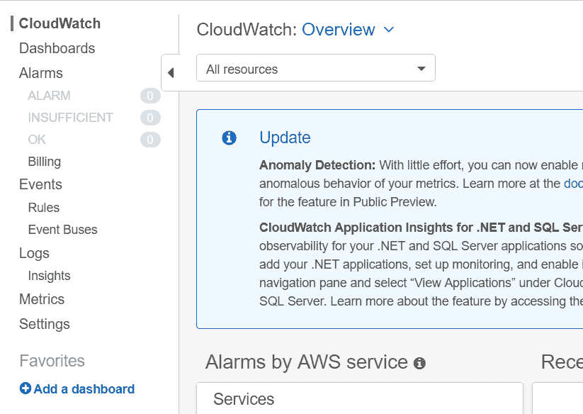
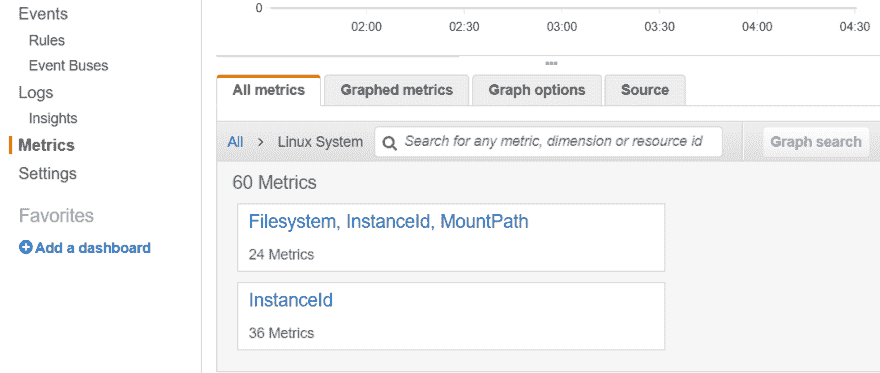

# 监视 AWS EC2 实例的内存和磁盘度量

> 原文：<https://dev.to/idrisrampurawala/monitoring-memory-and-disk-metrics-for-aws-ec2-instances-2eg2>

Amazon Web Services(AWS)默认会在控制台上报告一些好的指标，比如 CPU，但缺少一些关键指标，比如内存使用情况或磁盘空间；这些对于监控以确保实例正常运行和健康非常重要。

在这篇文章中，我们将看看如何使用 [CloudWatch](https://aws.amazon.com/cloudwatch/) 来监控这些扩展的指标，允许您构建报告、仪表板和警报。

**📘注意**
在我们开始之前，请注意标准的亚马逊 CloudWatch 使用费将适用于这些脚本。更多信息，请参见[亚马逊云观察](https://aws.amazon.com/cloudwatch/pricing/)定价页面。

✋:为了简单起见，让我们假设我们使用 EC2 和 Amazon Linux 操作系统。对于其他操作系统，您可以使用各自的命令来实现这些结果。

# 创建 IAM 角色以访问指标

为了将度量数据从 EC2 传递到 AWS Cloudwatch，我们必须创建一个具有以下 IAM 角色访问权限的用户:

*   `cloudwatch:PutMetricData`
*   `cloudwatch:GetMetricStatistics`
*   `cloudwatch:ListMetrics`
*   `ec2:DescribeTags`

迷茫了？只需用上述权限创建一个策略(比如- cloudwatch-ec2-access)。之后，创建一个用户(cloudwatch-stats-user)并将创建的策略(cloudwatch-ec2-access)附加到该用户。此外，存储该用户生成的`AWSAccessKeyId`和`AWSSecretKey`，稍后将会用到它们。

# SSH 到 EC2

SSH 到您的 EC2 实例，并执行以下步骤:

### 1。创建脚本文件夹

为了清晰起见，我通常喜欢把所有东西都放在一个单独的文件夹里，尽管这不是强制性的。由于我们使用的是 Amazon Linux 2 AMI，步骤看起来类似于此:

```
# current folder /home/ec2-user
$ mkdir cloudwatch_logs
$ cd cloudwatch_logs 
```

Enter fullscreen mode Exit fullscreen mode

### 2。安装所需的软件包

为了能够运行 AWS 脚本，我们必须安装一些包。另外，请注意，该命令可能会因操作系统而异。查看此[链接](https://docs.aws.amazon.com/AWSEC2/latest/UserGuide/mon-scripts.html)了解更多信息。

```
sudo yum install -y perl-Switch perl-DateTime perl-Sys-Syslog perl-LWP-Protocol-https perl-Digest-SHA.x86_64 
```

Enter fullscreen mode Exit fullscreen mode

### 3。从 AWS 下载脚本

现在我们已经安装了所有的包，我们需要下载 AWS 提供的 Perl 脚本。

```
curl https://aws-cloudwatch.s3.amazonaws.com/downloads/CloudWatchMonitoringScripts-1.2.2.zip -O 
```

Enter fullscreen mode Exit fullscreen mode

### 4。解压缩脚本

```
unzip CloudWatchMonitoringScripts-1.2.2.zip
# remove the zip
rm CloudWatchMonitoringScripts-1.2.2.zip
# move to the unzipped folder
cd aws-scripts-mon 
```

Enter fullscreen mode Exit fullscreen mode

监控脚本包包含以下文件:

*   `CloudWatchClient.pm`–共享 Perl 模块，简化了从其他脚本调用 Amazon CloudWatch。
*   `mon-put-instance-data.pl`–收集 Amazon EC2 实例的系统指标(内存、交换空间、磁盘空间利用率)，并将它们发送到 Amazon CloudWatch。
*   `mon-get-instance-stats.pl`–查询 Amazon CloudWatch 并显示执行该脚本的 EC2 实例的最新利用率统计数据。
*   `awscreds.template`–存储您的访问密钥 ID 和秘密访问密钥的 AWS 凭证的文件模板。
*   `LICENSE.txt`–包含 Apache 2.0 许可证的文本文件。
*   `NOTICE.txt`–版权声明。

### 5。添加云观察用户(cloudwatch-stats-user)的`Access ID`和`Secret Key`

正如前面提到的，amazon 提供了一个模板文件`awscreds.template`，它可以用来创建一个`conf`文件来存储 AWS 凭证。

```
# creates a conf file from the template. Make sure the filename is as is
cp awscreds.template awscreds.conf 
```

Enter fullscreen mode Exit fullscreen mode

接下来，在这个文件中添加 AWS `Access ID`和`secret key`并保存它。

### 6。验证统计数据是否被正确捕获

现在，我们将使用下面的命令来验证一切是否就绪并顺利工作:

```
# change the paths according to your folder structure
/home/ec2-user/cloudwatch_logs/aws-scripts-mon/mon-put-instance-data.pl --mem-used-incl-cache-buff --mem-util --mem-used --mem-avail --disk-space-util --disk-space-avail --disk-path=/ --verify --verbose 
```

Enter fullscreen mode Exit fullscreen mode

### 7。最后一步

恭喜你！👏您已经在 EC2 实例上成功配置了 Cloudwatch 指标。现在，最后一步是将它添加到 cron，这样它可以每隔 5 分钟发送一次指标。

```
# Open the crontab file
crontab -e

# Add the following line and save it

# Cloudwatch Monitoring Metrics (AWS)
*/5 * * * * /home/ec2-user/cloudwatch_logs/aws-scripts-mon/mon-put-instance-data.pl --mem-used-incl-cache-buff --mem-util --mem-used --mem-avail --disk-space-util --disk-space-avail --disk-path=/ --from-cron 
```

Enter fullscreen mode Exit fullscreen mode

# 在 AWS 上哪里可以找到这些指标？

在 AWS 控制台中，转到 Cloudwatch 服务。
[T3】](https://res.cloudinary.com/practicaldev/image/fetch/s---gQzT8RR--/c_limit%2Cf_auto%2Cfl_progressive%2Cq_auto%2Cw_880/https://res.cloudinary.com/idr/image/upload/v1567136936/dev.to/cloudwatch_screen_1_jc48in.png)

您的所有指标都可以在`Metrics`菜单中找到。一旦 Cloudwatch 开始从脚本接收指标，一个新的`Custom Namespaces`将被添加到您的指标视图中。
T3T5】

点击它，你会得到如下图所示的 2 个选项:
[](https://res.cloudinary.com/practicaldev/image/fetch/s--UA0fmrFJ--/c_limit%2Cf_auto%2Cfl_progressive%2Cq_auto%2Cw_880/https://res.cloudinary.com/idr/image/upload/v1567136936/dev.to/cloudwatch_screen_3_wcxzhs.png)

1.  `Filesystem, InstanceId, MountPath` -您的所有 EC2 磁盘指标都将在此选项中可用。
2.  `InstanceId` -您的所有 EC2 内存指标将在此选项中可用。

# 点记

*   每当您重新启动或分配/取消分配磁盘空间时，您的 EC2 磁盘文件系统路径可能会改变，因此您可能需要重新配置您为监控 EC2 而创建的任何警报或仪表板。
*   如果您已经从配置了这些指标的 AMI 启动了 EC2 实例，那么上面的设置已经存在。只需通过命令`rm /var/tmp/aws-mon/instance-id`清除缓存
*   AWS 最近推出了`CloudWatch Agent`来从 Amazon EC2 实例中收集系统指标和日志文件。因此，建议使用`CloudWatch Agent`来收集指标和日志，而不是这些监控脚本。然而，在某些情况下，你可能需要使用这些监控脚本，这篇文章可能会帮助你配置它。

我希望你喜欢这篇文章。再见！直到我的下一篇文章😋