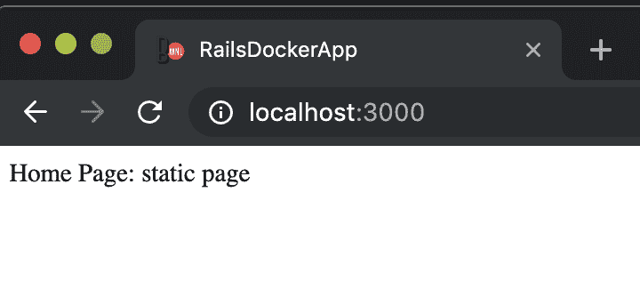
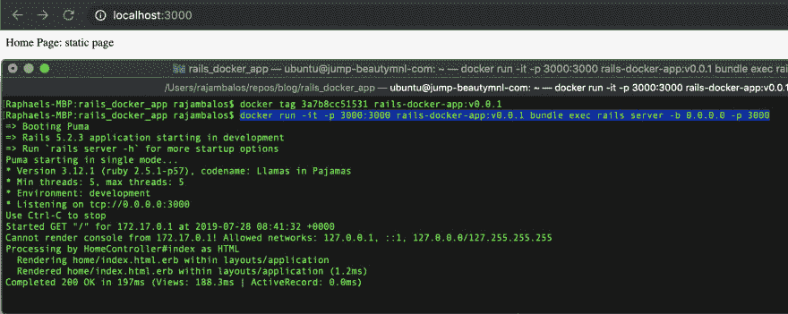
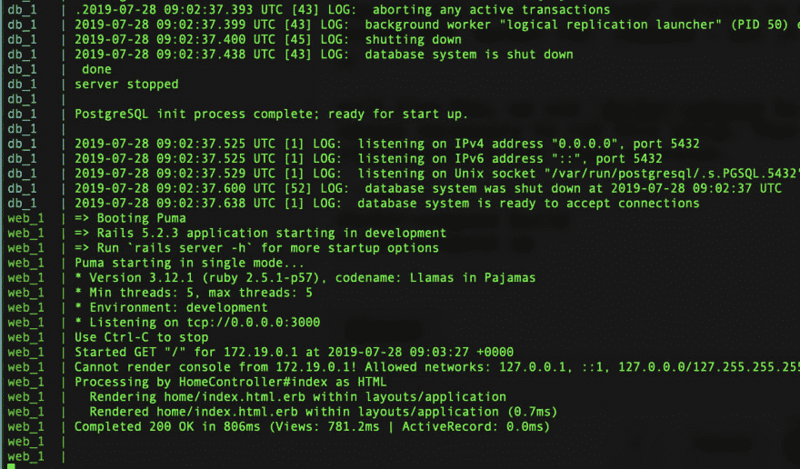
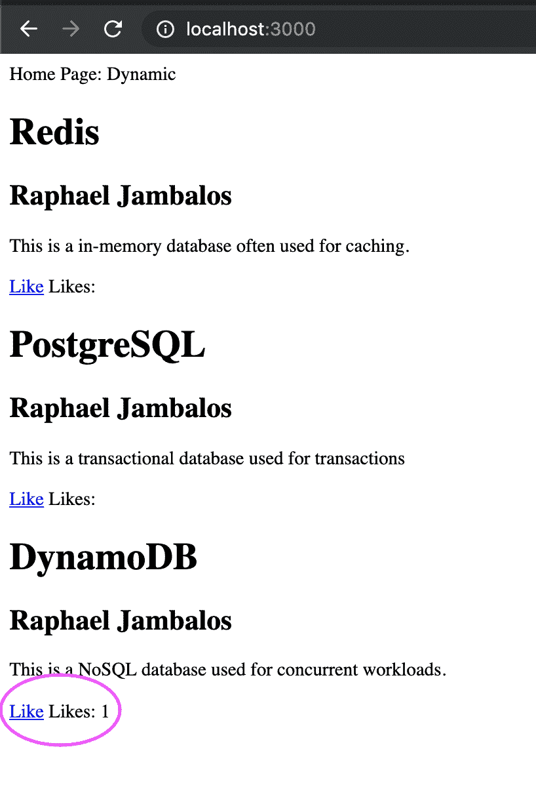

# 不仅仅是 Docker 中的“Hello World ”:在 Docker 中构建 Rails + Sidekiq web 应用程序

> 原文：<https://dev.to/raphael_jambalos/more-than-hello-world-in-docker-run-rails-sidekiq-web-apps-in-docker-1b37>

这是 Docker 系列中*多于“Hello World”的第一篇帖子。该系列将帮助您准备好您的应用程序:从在本地设置它到在 AWS 中将它部署为生产级工作负载。*

*   **在 Docker** 中构建 Rails + Sidekiq web 应用——我们来了
*   在 Amazon ECS 中部署 Rails
    *   [概念](https://dev.to/jamby1100/deploy-rails-in-amazon-ecs-part-1-concepts-26nl)
    *   [将图像推送到 ECR](https://dev.to/jamby1100/deploy-rails-in-amazon-ecs-part-2-push-an-image-to-ecr-43fl)
    *   [创建 RDS 数据库、任务定义和负载平衡器](https://dev.to/jamby1100/deploy-rails-in-amazon-ecs-part-3-create-the-rds-database-task-definition-and-load-balancer-1ffe)
    *   [创建 ECS 群集并将其全部连接在一起](https://dev.to/jamby1100/deploy-rails-in-amazon-ecs-part-4-create-an-ecs-cluster-338f)
    *   [配置 Sidekiq](https://dev.to/jamby1100/deploy-rails-in-amazon-ecs-part-5-integrate-sidekiq-and-redis-for-background-processing-150f)
*   [使用 AWS CodeDeploy 自动部署](https://dev.to/raphael_jambalos/automate-deployments-with-aws-codepipeline-52f5)
    *   [深入了解 AWS 代码构建](https://dev.to/jamby1100/automate-docker-build-with-aws-codebuild-9om)
*   高级 ECS 概念:
    *   服务发现和自动扩展-即将推出
    *   Fargate -即将推出

关于如何在 Docker 中显示“Hello World”的 web 教程并不缺乏。问题是，从让你的应用程序在 Docker 中说“Hello World”到在 AWS 中运行生产级应用程序的路径通常不那么简单。即使你的应用不是 Rails / Ruby，*通读这一系列文章将有助于你了解在你决定在生产中使用 Docker 之后所面临的挑战。*

我已经在生产中使用了 7 个月的 Docker，并且在此之前已经学习了 4 个月。在简单的设置中，使用 Docker 非常简单。然而，在生产中使用它会增加复杂性，因为会有许多其他事情要考虑。这篇文章将帮助你管理这种复杂性。

对于本帖，我们将:

*   了解 Docker 的基本概念以及为什么使用 Docker。
*   将 Rails 应用程序连接到 PostgreSQL 服务器。
*   运行 Sidekiq 服务器，从 Redis 数据库获取作业。
*   通过在 Redis 中添加作业，向 Sidekiq 服务器提供简单的任务。
*   使用 Docker compose 运行 Rails 应用程序

这是一个基础性的岗位。我们将在这里构建的 Rails 应用程序将是我们将在以后的帖子中使用的示例应用程序。如果你刚刚开始使用 Docker，我推荐你跟随这篇文章。

如果您以前有过使用 Docker 的经验，我建议您阅读本系列的下一篇文章。本教程的源代码可以在 [GitHub](https://github.com/jamby1100/rails-docker-project) 上的 [v0.0.1](https://github.com/jamby1100/rails-docker-project/releases/tag/v0.0.1) 版本下获得。

## 0 |概念

在这一节中，我将快速浏览一下 Docker 背后的基本概念。为了对 Docker 有更深一层的概念理解，我推荐[克里斯·诺林的简介](https://dev.to/azure/docker---from-the-beginning-part-i-28c6)。

本质上，Docker 允许我们在主机操作系统(如 Ubuntu、Mac 或 Windows)上生成容器。我们可以在一个主机操作系统中运行多个容器。

这是一个运行在 Linux 内核之上的进程。它被分配了自己的资源:CPU、内存和文件系统。通过拥有自己的资源，容器变得与实例中运行的其他容器相隔离。当一个容器由于某种原因发生故障时，它不会影响在同一主机操作系统中运行的其他容器/进程。

这是一个包含执行代码所需的一切的文件:依赖项、二进制文件、源代码等等。它们是通过执行名为 Dockerfile 的类似脚本的文件中的命令来构建的。图像用于产生多个相同的容器。容器是这些图像的“实例化”——并且是为您的客户流量服务的。

`Dockerfile` -这是一个包含构建映像所需指令的文件。您在这里输入的命令应该指定如何将应用程序需要的所有内容放入图像中。

如果这一切看起来不清楚，本帖中的实践将在实践中说明这些概念。

## 1 |为什么是 Docker？

**降低成本**

传统上，您提供一个[实例](https://www.quora.com/What-is-the-exact-meaning-of-AWS-Instance-EC2)，并且只有一个[应用服务器](https://www.webopedia.com/TERM/A/application_server.html)在那里运行。如果需要扩展应用程序，可以添加多个实例，每个实例上运行一个应用服务器。您通常不会通过在一个实例中添加更多的应用服务器来进行扩展——因为这很难管理。但这也导致您的大多数实例有未使用的容量。

在 Docker 中，您可以在一个实例中运行多个容器。因为您可以将实例的资源分配给一个容器，所以只要实例上有足够的资源，您就可以在实例中添加尽可能多的容器。例如，如果您有一个内存为 8GB 的实例，而您的每个容器只需要 1GB，那么在这个实例中您可以有多达 8 个容器。

生产环境中的另一个著名问题是内存膨胀。当您的应用程序消耗了比预期多得多的内存时，就会发生内存膨胀。常见的解决方法是增加实例的大小，这当然会增加成本。

在 Ruby 中，[内存膨胀问题](https://www.engineyard.com/blog/thats-not-a-memory-leak-its-bloat)在大量多线程应用程序中臭名昭著，比如 [Sidekiq](https://www.mikeperham.com/2018/04/25/taming-rails-memory-bloat/) 。在 Docker 中，可以为容器设置硬内存分配。如果应用程序消耗的空间超过了硬分配的空间(比如 1GB)，Docker 会终止容器并启动一个新的容器。这可以防止内存膨胀，并帮助您更有效地使用资源。

这样，您就可以充分利用实例的资源。您不必像以往那样调配那么多实例。

**标准化**

您的应用程序在本地运行的环境将*与生产环境中的*完全相同。不再有“它在我的机器上工作，但在 prod 上不工作。”

新开发人员的入职也变得很容易:您所要做的就是让他们安装 Docker，并让他们在本地机器上运行您的 Docker 映像。没有更多的 7 页文件，关于如何安装您的应用程序及其所有依赖于他们的机器。

**更快的部署**

部署预对接看起来像这样:AWS 检测到您的流量峰值，它提供一个新的实例，安装所有的依赖项，测试您的实例是否显示流量，然后新实例接收流量。这个过程可能需要几分钟，因为它每次都会加载整个操作系统。

Docker 中的部署要快得多。由于容器只是进程，启动它比加载整个操作系统要轻得多。

**其他**

还不服气？你可以在这里阅读其他益处[。](https://apiumhub.com/tech-blog-barcelona/top-benefits-using-docker/)

## 2 |安装

对于本教程，我使用了 Rails 5.2.3 和 Ruby 2.5.1。你可以从这个[教程](https://gorails.com/setup/osx/10.14-mojave)安装 Ruby 和 Rails。确保在下拉列表中选择 Ruby 2.5.x 和 Rails 5.2.x，并选择您将使用的操作系统。

我们还将使用 Docker。如果你和我一样是 Mac 用户，使用这个[教程](https://docs.docker.com/docker-for-mac/install/)。对于 Windows 用户，可以使用[这个](https://docs.docker.com/docker-for-windows/install/)。

## 3 |创建 Rails 应用程序

**(3.0)** 转到一个你想要安装 Rails 应用的文件夹，然后执行:

```
rails new rails_docker_app
cd rails_docker_app
git init && git add .
git commit -m "Initialize Rails project" 
```

然后，让我们创建在主页上显示消息所需的路由、控制器和视图。

**(3.1)** 打开`config/routes.rb`，进入首页。我们将在接下来的步骤中创建主页。

```
 root to: "home#index" 
```

**(3.2)** 在`app/controllers`文件夹中创建文件`home_controller.rb`。在变量`@message`中放入一个基本信息。因为变量名前面有@符号，所以可以从视图中访问它。

```
class HomeController < ApplicationController
  def index
    @message = "static page"
  end
end 
```

**(3.3)** 创建`app/views/home`文件夹。在该文件夹中，创建一个名为`index.html.erb`的文件。注意，我们引用了在上一步中创建的`@message`变量。这将显示消息“静态页面”。

```
Home Page:

<%= @message %> 
```

**(3.4)** 现在，启动 rails 服务器，您应该会看到我们刚刚创建的简单主页。

```
rails server -p 3000 
```

您应该会看到如下所示的简单页面:

[](https://res.cloudinary.com/practicaldev/image/fetch/s--V-lwcRaB--/c_limit%2Cf_auto%2Cfl_progressive%2Cq_auto%2Cw_880/https://thepracticaldev.s3.amazonaws.com/i/b2rx0qwh8dtpj3fv7snk.png)

当你满意时，提交你的进度

```
git add .
git commit -m "Add basic routes, views, controller" 
```

## 4 |设置轨道对接器

**(4.1)** 用`touch Dockerfile`命令在 app 根目录下创建 Dockerfile。

```
# gets the docker image of ruby 2.5 and lets us build on top of that
FROM ruby:2.5.1-slim

# install rails dependencies
RUN apt-get update -qq && apt-get install -y build-essential libpq-dev nodejs libsqlite3-dev

# create a folder /myapp in the docker container and go into that folder
RUN mkdir /myapp
WORKDIR /myapp

# Copy the Gemfile and Gemfile.lock from app root directory into the /myapp/ folder in the docker container
COPY Gemfile /myapp/Gemfile
COPY Gemfile.lock /myapp/Gemfile.lock

# Run bundle install to install gems inside the gemfile
RUN bundle install

# Copy the whole app
COPY . /myapp 
```

本质上，Dockerfile 只是放在一个文件中的一堆人类可读的 shell 命令。第一行从 [Docker Hub](//hub.docker.com) 获取一个名为“ruby:2.5.1-slim”的 Docker 映像。这个图像被称为*基础图像*。它有一个名为“slim”的轻量级操作系统，预装了 ruby 2.5.1。我们将在这个基础映像上使用下面的命令。

下一个命令安装 Rails 的依赖项。

图像内部有自己的“文件夹结构”。在接下来的命令中，我们创建了`/myapp`文件夹，并将其设为“默认”文件夹。

我们复制`Gemfile`和`Gemfile.lock`，然后运行`bundle install`。这将在映像中安装所有需要的 gem。然后，我们继续将整个应用程序复制到映像中。

**(4.2)** 既然我们理解了它的作用，让我们执行`docker build .`让 Docker 浏览指令并为我们创建一个 Docker 映像。

您应该看到 Docker 在您的 Docker 文件中运行命令:

[](https://res.cloudinary.com/practicaldev/image/fetch/s--b2m3qVMp--/c_limit%2Cf_auto%2Cfl_progressive%2Cq_auto%2Cw_880/https://thepracticaldev.s3.amazonaws.com/i/bluw9ftlbea0dxnfy2xq.png)

**(4.3)** 一旦执行完毕，运行`docker images`查看您刚刚构建的 docker 映像:

[](https://res.cloudinary.com/practicaldev/image/fetch/s--3iIiFczo--/c_limit%2Cf_auto%2Cfl_progressive%2Cq_auto%2Cw_880/https://thepracticaldev.s3.amazonaws.com/i/5i4geje7qf9m6o5wwjab.png)

您可以看到这是一个相当大的文件(~641MB)。这是因为 it *字面上的*拥有运行应用程序所需的一切。

**(4.4)** 从`docker images`中，查找您新创建的图像的 image_id。我的是这样的:“2f1a0fabe8c6”。让我们标记我们的图像，这样它会有一个漂亮的名字，我们很容易记住。

```
# for me
docker tag 2f1a0fabe8c6 rails-docker-app:v0.0.1

# for you: replace --chash-- with your image_id
docker tag --chash-- rails-docker-app:v0.0.1 
```

再次运行一个`docker images`，你会看到你的图像有正确的名字。
[](https://res.cloudinary.com/practicaldev/image/fetch/s--e4nX2N8v--/c_limit%2Cf_auto%2Cfl_progressive%2Cq_auto%2Cw_880/https://thepracticaldev.s3.amazonaws.com/i/h28r6jaejehk6h6g81y4.png)

**(4.5)** 现在我们有了一个 Docker 映像，让我们运行它。

```
docker run -it -p 3000:3000 rails-docker-app:v0.0.1 bundle exec rails server -b 0.0.0.0 -p 3000 
```

`-it`标志允许您拥有一个终端，在这里您可以看到来自 Rails 服务器的日志。`-p 3000:3000`标志将容器的端口 3000 暴露给本地机器的端口 3000。然后，我指定了我们之前标记的 Docker 映像和运行 Rails 服务器的命令。

您应该再次看到这个简单的页面，这次运行在 Docker 之上:
[](https://res.cloudinary.com/practicaldev/image/fetch/s--MX5X0RaT--/c_limit%2Cf_auto%2Cfl_progressive%2Cq_auto%2Cw_880/https://thepracticaldev.s3.amazonaws.com/i/l9f4w5p055jzjr3ec29h.png)

如果你对结果满意，提交你的进度。

```
git add .
git commit -m "Add Dockerfile and run via docker run" 
```

## 5 |使用 docker-compose 轻松运行 Docker

我们现在在 Docker 的基础上有了一个运行良好的 Ruby on Rails 应用程序🎉 🎉 🎉。

然而，通常的生产工作负载并没有这么简单。我们通常有其他与 Rails 应用一起运行的服务:数据库、Redis、Sidekiq 等。因此，本地设置通常会有 5 个不同的终端窗口，包含 5 个独立的 docker 运行命令。现在有很多东西需要记录。Docker 想到了这一点，推出了 *docker-compose* 。

服务 docker-compose 允许您在一个 YAML 文件中简洁地声明所有这些服务。它还让您能够在一个窗口中启动所有这些服务。

让我们开始吧:

**(5.1)** 在你的 app 根目录下创建一个 docker 文件夹，里面有一个开发文件夹:`mkdir docker && mkdir docker/development`。然后，创建一个名为 docker-compose.yml 的文件，并输入以下内容:

```
version: '3'
services:
  db:
    image: postgres
    volumes:
      - ../../tmp/db:/var/lib/postgresql/data
  web:
    build: ../../
    command: bundle exec rails s -p 3000 -b '0.0.0.0'
    volumes:
      - ../../:/myapp
    ports:
      - "3000:3000"
    depends_on:
      - db 
```

这个 docker-compose 文件夹定义了 2 个服务:db 和 web。“db”服务是一个 PostgreSQL 容器，它将作为我们的数据库服务。“web”服务是我们的 Rails 应用程序的应用服务器。

“web”服务中的内容就是我们通常放在`docker run`命令- *中的内容，但是这样读起来要容易得多！*📖

**(5.2)** 现在，我们使用`docker-compose build`命令构建运行该设置所需的 docker 映像。然后，我们使用`docker-compose up`来同时运行这些服务。

```
cd docker/development
docker-compose build
docker-compose up 
```

您将看到来自这两个服务的日志:

[](https://res.cloudinary.com/practicaldev/image/fetch/s--1jJahBXZ--/c_limit%2Cf_auto%2Cfl_progressive%2Cq_auto%2Cw_880/https://thepracticaldev.s3.amazonaws.com/i/jsds03lb7m8s6fvoen20.png)

如果你对结果满意，提交你的进度。

```
git add .
git commit -m "Add docker-compose.yml for easier docker runs" 
```

## 6 |更进一步:集成 PostgreSQL

现在，大多数 web 教程都停留在第 5 节，到此为止。这篇文章旨在尽可能地满足你的生产需求。连接 PostgreSQL 数据库和通过 Redis 集成 Sidekiq 是两个常见的生产任务，在周围的博客文章中没有给出太多的报道。

**(6.1)** 是时候创建我们的模型了。运行下面的两个命令，为 Author 和 Post 生成模型和迁移。

```
rails generate model Author name:string kind:string
rails generate model Post title:string body:text author:references likes_count:integer 
```

**(6.2)** 打开你的 gem 文件，用下面一行替换`gem 'sqlite3'`。我们将使用 PostgreSQL 作为我们的数据库，并删除对 SQLite3 的引用。

```
gem 'pg', '>= 0.18', '< 2.0' 
```

然后做`bundle install`。

**(6.3)** 为了能够连接到我们的数据库，用下面的内容替换`config/database.yml`的内容(如果文件不存在，自己创建)。

```
development:
  adapter: postgresql
  encoding: unicode
  host: db
  username: postgres
  password:
  pool: 5
  database: sample_app_docker_development 
```

然后，将种子添加到`db/seeds.rb`文件中，这样我们就可以在数据库中拥有样本数据。

```
author = Author.create(name: "Raphael Jambalos", kind: "Programmer")
post = Post.create(title: "Redis", body: "This is a in-memory database often used for caching.", author_id: author.id)
post = Post.create(title: "PostgreSQL", body: "This is a transactional database used for transactions", author_id: author.id)
post = Post.create(title: "DynamoDB", body: "This is a NoSQL database used for concurrent workloads.", author_id: author.id) 
```

**(6.4)** 我们要向视图显示样本数据。为此，让我们将`app/controllers/home_controller.rb`文件的内容改为:

```
class HomeController < ApplicationController
  def index
    @message = "Dynamic"

    @posts = Post.all
  end
end 
```

然后，让我们更改`app/views/home/index.html.erb`的内容，这样我们就可以将帖子整齐地呈现给视图。

```
Home Page:

<%= @message %>

<% @posts.each do |post| %>
  <h1> <%= post.title %> </h1>
  <h2> <%= post.author.name %> </h2>
  <p> <%= post.body %>
<% end %> 
```

**(6.5)** 现在，让我们再跑一次`docker-compose`。

```
cd docker/development/
docker-compose build
docker-compose up 
```

在单独的窗口中，依次运行这些命令

```
docker-compose run web rake db:create
docker-compose run web rake db:migrate
docker-compose run web rake db:seed 
```

如果你对自己的进步感到满意，那就提交吧:

```
git add .
git commit -m "Add models, migration, seeds; Modify views to show seeded data." 
```

## 7 |更进一步:整合 Sidekiq

**(7.1)** 将`gem 'sidekiq'`添加到 Gemfile 并运行`bundle`。

Sidekiq 用于后台处理。想象一个网站，里面有一个表单。填写完表格中所需的所有信息后，您可以按 Submit。浏览器会将你写的所有信息发送到网络服务器。默认情况下，web 服务器有 60 秒的时间来处理请求；否则，会导致请求超时。这种类型的处理是前台处理。

现在，我们不想让我们的客户等待信息被处理(更不用说向他们显示超时页面)。所以我们把处理信息的工作丢给后台处理器(“Sidekiq”)。一旦我们将任务分配给 Sidekiq，客户将会看到一个带有“请稍等片刻”的页面。Sidekiq 发出请求，几分钟后，客户就可以看到更新后的结果。

**(7.2)** 运行`rails g sidekiq:worker IncrementCount`创建一个工人档案。我们转到 Sidekiq 刚刚创建的文件`app/workers/increment_count_worker.rb`，用下面的代码片段替换它的内容。

本质上，我们获取一个 post，并在它的 like_count 属性上加 1。

```
class IncrementCountWorker
  include Sidekiq::Worker

  def perform(post_id)
    post = Post.find(post_id)

    post.likes_count ||= 0
    post.likes_count += 1
    post.save
  end
end 
```

**(7.3)** 默认情况下，`app/workers/`文件夹中的文件不会被 Rails 读取。你必须走到`config/application.rb`处，将这条线插入`class Application`块中。

```
 config.autoload_paths += %W(#{config.root}/app/workers) 
```

**(7.4)** 要显示每个帖子的赞，并为每个帖子添加一个赞按钮，我们来更改`app/views/home/index.html.erb`
的内容

```
Home Page:

<%= @message %>

<% @posts.each do |post| %>
  <h1> <%= post.title %> </h1>
  <h2> <%= post.author.name %> </h2>
  <p> <%= post.body %>

  <br>

  <p> 
    <%= link_to "Like", increment_async_path(post_id: post.id), method: :post %>

    Likes:
    <%= post.likes_count %> 
  </p>
<% end %> 
```

**(7.5)** 然后，我们在`config/routes.rb`中添加了一个路由，在`app/controllers/home_controller.rb`中添加了一个控制器方法来适应这个请求。

```
 post "/increment_async", to: "home#increment_async" 
```

控制器方法调用我们的 Sidekiq 服务，并调用 worker“IncrementCountWorker”。

```
class HomeController < ApplicationController
  def index
    @message = "Dynamic"

    @posts = Post.all
  end

  def increment_async
    ::IncrementCountWorker.perform_async(params[:post_id])
    redirect_to root_path
  end
end 
```

我们的新设置需要一个 Sidekiq 服务和一个 Redis 服务。

Redis 是一个内存数据库。每当客户按下我们在 7.4 中制作的按钮，Redis 数据库中就会添加一个条目。Sidekiq 服务轮询 Redis 服务，以获取其数据库中的新条目。如果有，它就执行它。

```
version: '3'
services:
  db:
    image: postgres
    volumes:
      - ../../tmp/db:/var/lib/postgresql/data
  web:
    build: ../../
    command: bundle exec rails s -p 3000 -b '0.0.0.0'
    volumes:
      - ../../:/myapp
    environment:
      RAILS_ENV: "development"
      REDIS_URL: "redis://redis:6379/12"
    ports:
      - "3000:3000"
    depends_on:
      - db
  redis:
    image: redis
    volumes:
      - ../../tmp/db:/var/lib/redis/data
  sidekiq:
    build: ../../
    command: 'bundle  exec  sidekiq'
    volumes:
      - ../../:/myapp
    environment:
      RAILS_ENV: "development"
      REDIS_URL: "redis://redis:6379/12"
    depends_on:
      - redis 
```

**(7.7)** 现在，让我们再次运行 docker-compose。

```
cd docker/development/
docker-compose build
docker-compose up 
```

在您的浏览器上返回到`localhost:3000`，您应该能够看到:

[](https://res.cloudinary.com/practicaldev/image/fetch/s--zOL0j9TZ--/c_limit%2Cf_auto%2Cfl_progressive%2Cq_auto%2Cw_880/https://thepracticaldev.s3.amazonaws.com/i/hkgq8ie3y9meh1kuyldh.png)

按下链接按钮，你可以增加每个帖子的点击数。当 Rails 收到请求时，它在 Redis 上放置一个任务，Sidekiq 获取它，在指定的 post 上添加“1”并保存它。

## 8 |接下来是什么？

现在，您已经有了一个在 Docker 上运行的成熟的 Rails 5 应用程序。这并不多，但是拥有 Sidekiq 和 PostgreSQL 是一个很好的基础。您甚至可以使用这个模板将现有的 Rails 应用程序迁移到 Docker。

开发完 Rails 应用程序后，下一步是通过云提供商部署它，这样你的客户就可以看到你的应用程序了。在下一篇文章中，我们将把这个项目部署到 [AWS 弹性容器服务](https://aws.amazon.com/ecs/)。敬请期待！

## 鸣谢

特别感谢我的编辑艾伦，他帮助这篇文章变得更加连贯。

帕特里克·布林克斯马的封面照片归功于他。

我很高兴听取你对这篇文章的评论/反馈。就在下面评论吧，或者给我留言！