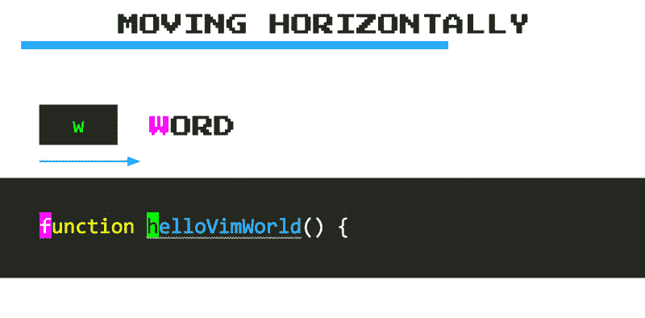
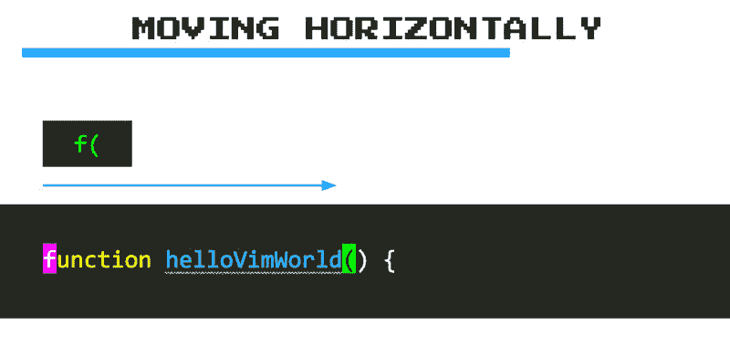

# 随着核心 Vim 动作快速移动

> 原文：<https://dev.to/vintharas/moving-blazingly-fast-with-the-code-vim-motions-2i1n>

> 这是《用 VSCode 和 Vim 提升你的编码能力》[一书中的一章](https://www.barbarianmeetscoding.com/boost-your-coding-fu-with-vscode-and-vim)[,以惊人的速度移动核心 Vim 动作](https://www.barbarianmeetscoding.com/boost-your-coding-fu-with-vscode-and-vim/moving-blazingly-fast-with-the-core-vim-motions/)。

**动作(就像在运动中一样)是你在 Vim** 中如何移动。它们是命令，当被键入时，以高速度和精度移动光标。它们有许多种，每一种都最适合不同类型和长度的运动。我发现它们与 Visual Studio 原生代码*转到*功能配合得很好，比如*转到文件*和*转到符号*。

以下是最有用的一个简明列表，以及何时和如何使用它们:

## 逐字水平移动

**单词运动**让你可以从一个单词跳到另一个单词(从左到右或从右到左)。因此，它们允许你比基本的水平运动 **`h`** 和 **`l`** 移动得更快。

你可以使用 **`w`** ( **w** ord)命令跳到下一个 **w** ord 的开头，如下所示:

[](https://res.cloudinary.com/practicaldev/image/fetch/s--4ZAa3wY3--/c_limit%2Cf_auto%2Cfl_progressive%2Cq_auto%2Cw_880/https://www.barbarianmeetscoding.cimg/vim-motions-word.jpg)

同样，您可以:

*   使用 **`b`** ( **b** ack)向后跳到一个单词的开头
*   用 **`e`** ( **e** nd)跳到一个单词的末尾
*   使用 **`ge`** 向后跳到一个单词的末尾

> ### 借助记忆法学习命令
> 
> Vim 有大量的命令。随着时间的推移，当您成为一个有经验的 Vim 用户时，这些命令将成为您的第二天性，是反射性的和自动的。不过在开始的时候，你需要一个一个地学习它们。
> 
> 学习 Vim 命令的一个好方法是使用助记法，比如将一个字母与一个更容易记住的单词联系起来。例如，你可以记住 **`w`** 通过将它与**单词**相关联来让你在单词之间移动，或者 **`b`** 通过将它与**向后**相关联来让你在单词之间向后移动。
> 
> 按照这个技巧，你会发现你可以不费吹灰之力就学会并回忆起许多命令。

### 词与词

于是 **`w`** ， **`b`** ， **`e`** ， **`ge`** 让你在 Vim 中逐字移动。但是到底什么是单词呢？Vim 中的一句话是:

1.  字母、数字和数字的序列
2.  其他非空白字符的序列

```
these are 4 words
and these below too
,,, ..... ((((( ,.( 
```

但是 Vim 也有特殊种类单词(字母、数字和数字)的概念，这些单词也包括特殊字符，如 **`.`** 、 **`(`** 、 **`{`** 等。在 Vim 行话中，它们被称为单词:

[](https://res.cloudinary.com/practicaldev/image/fetch/s--V1YRg9sK--/c_limit%2Cf_auto%2Cfl_progressive%2Cq_auto%2Cw_880/https://www.barbarianmeetscoding.cimg/vim-motions-word-vs-WORD.jpg)

单词对我们程序员特别有帮助，因为代码中经常有很多单词:

```
this is a WORD: Iam_A_WORD(WORD)
this function call sum(2,3) is also a WORD
this array [1,2,3,4,5] is a WORD as well 
```

如果你想一个字一个字地移动，你可以使用前面描述的动作的大写等价物( **`W`** ， **`B`** ， **`E`** ， **`gE`** )。

一般来说，**单词运动允许更精确的变化，而单词运动允许更快的移动** :

```
wwww ==> v   v v   v   v
         word. are two words
         word. is one WORD
WWW  ==> ^     ^  ^   ^ 
```

## 移动到特定的字符

**寻找角色动作**让你快速水平移动**高精度**:

*   使用 **`f{character}`** ( **f** ind)移动到一行中出现的下一个字符。例如， **`f"`** 会将您转到下一个双引号。
*   如果您的目标在光标后面，您可以使用 **`F{character}`** 来查找前一个字符

[](https://res.cloudinary.com/practicaldev/image/fetch/s--dkZL4-Xu--/c_limit%2Cf_auto%2Cfl_progressive%2Cq_auto%2Cw_880/https://www.barbarianmeetscoding.cimg/vim-motions-find.jpg)

在一个例子中，我们可以清楚地看到 **`f`** 比使用文字运动更快更精确

```
f(   ==> v                        v
         const fireball = function(target){
wwww ==> ^     ^        ^ ^       ^ 
```

除了 **`f`** Vim 还提供了 **`t`** (un* *t* *il)命令:

*   使用 **`t{character}`** 将光标移动到下一个字符之前(想象一下`t{character}`将光标移动到 un* *t* *il 那个字符)。
*   同样，您可以使用 **`T{character}`** 来做与`t{character}`相同的事情，但要反过来

如果 **`f`** 和 **`t`** 命令之间的区别还不太清楚，这里有一个比较两者的例子:

```
t(   ==> v                       v
         const fireball = function(target){
f(   ==> ^                        ^ 
```

**`t`** 真的很有用，当你将动作和操作符结合起来执行文本更改时，你很快就会发现(例如，你可以*删除直到`(`的所有内容，并将其更改为其他内容*)。

使用 **`f{character}`** 后，您可以键入 **`;`** 转到下一个出现的字符，或键入 **`,`** 转到上一个字符。**你可以看到`;`和`,`是重复最后一次字符搜索**的命令。这很好，因为它让你不用一遍又一遍地输入相同的搜索:

```
fdfdfd ==> v   v               v        v
           let damage = weapon.damage * d20();
           let damage = weapon.damage * d20();
fd;;   ==> v   v               v        v 
```

> ### 关于音符、旋律和和弦
> 
> Vim 很特别。如果你使用过其他编辑器，你可能习惯于键入和弦。即同时键入组合键。例如，`CTRL-C`用于复制，`CTRL-V`用于粘贴。尽管 Vim 对和弦并不陌生，但它更依赖于琴键的旋律。
> 
> **旋律**是一系列一个接一个演奏的音符。如果你认为琴键是音符，那么琴键的旋律就是一个接一个快速连续按下的琴键。所以，当你读到你需要键入`f{character}`来找到一行中的一个字符，这意味着你首先键入`f`，然后你键入字符`{character}`。因此，这两个键是作为一段旋律来演奏的。
> 
> 使用调的旋律是你与 Vim 互动的最常见的方式。而且，虽然不熟悉而且有点奇怪，但它非常方便，因为控制编辑器突然感觉就像你只是在输入文本。这对你的手腕健康也有好处，因为你不再需要依赖复杂和不自然的组合键，这些组合键会使你可怜的关节 <sup id="fnref1">[1](#fn1)</sup> 。

## 水平极度移动

要使**极度水平移动**,使用:

*   **`0`** :移动到**行的第一个字符**
*   **`^`** :移动到**一行的第一个非空白字符**
*   **`$`** :移动到**行尾**
*   **`g_`** :移动到行尾的**非空白字符**

## 垂直移动

从 **`k`** 和**`j`**开始，我们转向一种更快的垂直机动方式**:**

 ***   **`}`** 跳整段**往下**
*   **`{`** 同理但**往上**
*   **`CTRL-D`** 让你**通过滚动页面向下移动半页**
*   **`CTRL-U`** 让你**上移半页**也通过滚动

这些都不是我最喜欢的，但暂时还可以。在“自定义映射”一章中，您将学习如何为最终的中程垂直运动创建自定义关键点绑定。

## 带搜索模式的高精度垂直运动

为了让**垂直移动得更快**当你心中有了目标，你最好的选择是**用 **`/{pattern}`** 和 **`?{pattern}`** 命令搜索**那个目标:

*   使用**`/{pattern}`****向前搜索**里面的一个文件
*   使用 **`?{pattern}`** 到**向后搜索**

其中,`{pattern}`片段通常是一个字符串(方法、类或变量的名称),但也可以是一个正则表达式。

如果你在电脑旁边，现在就试着输入一个搜索命令。您会发现，当您键入搜索命令时，文件中与您的模式匹配的任何文本都会被高亮显示。随着您继续键入模式，突出显示的区域将会更新并反映新的匹配。当你找到你要找的东西时，输入 **`<Enter>`** ，你的光标就会跳到文档中的第一个匹配项。如果你愿意，你可以在那里进行一些编辑，然后使用 **`n`** 跳转到下一场比赛(或者使用 **`N`** 跳转到上一场比赛)。**你可以把`n`想象成重复一次搜索**。

> ### 启用高亮搜索
> 
> 出于某些我不知道的原因，在 VSCodeVim 中默认情况下高亮搜索是不启用的。要解决这个问题，请转到*首选项*并启用 *Vim: Hlsearch* 选项(或者，使用配置的 json 版本中的`vim.hlsearch`选项)。

Vim 喜欢为您节省时间:在任何时候输入 **`/<Enter>`** 或 **`?<Enter>`** 运行最后一次搜索(向前或向后)。或者使用 **`*`** 对光标下的单词进行搜索( **`#`** 反过来也一样)。

## 随着计数移动得更快

**计数是让你倍增命令**效果的数字。您可以通过在任何命令前面加上计数来使用它们，比如:

```
{count}{command} 
```

例如:

*   **`2w`** 允许我们将光标向前移动 2 个字。
*   **`5j`** 将光标位置改变到下面 5 行。
*   **`3;`** 让您跳到下一个第三次出现的字符。
*   **`2/baby`** 让您飞到文档中第二个出现的`baby`。

一般情况下，用 **`{count}{motion}`** 将一个动作乘以 **`{count}`** 次。

> ### 相对行号
> 
> 在 Vim 中垂直移动的一个很好的方法是将计数与 **`j`** 和 **`k`** 动作结合使用。但是有时很难知道需要跳多少行才能到达期望的位置。这就是**相对行号**可以派上用场的地方。
> 
> 相对行号显示与当前行相关的行号:如果当前行是光标所在的位置，下面一行的行号是 1，下一行的行号是 2，依此类推。使用相对行号，可以非常直观地看到您需要跳转多少行才能到达您想去的地方。只需先看一眼相对行号，作为计数即可。
> 
> 您可以通过进入*首选项*来启用 VSCode 中的相对行号(记住！使用带有 **`CMD-SHIFT-P`** 或 **`CTRL-SHIFT-P` )** 的命令面板，搜索*行号*配置并将其设置为**相对**。

## 语义移动

除了前面没有真正考虑代码含义的动作，Vim 还提供了考虑代码语义的附加绑定:

*   使用 **`gd`** 跳转到光标下的定义。
*   使用 **`gf`** 跳转到导入的文件。

## 还有一些更俏皮的核心动作

这些动作有时会派上用场:

*   键入 **`gg`** 转到文件顶部。
*   使用 **`{line}gg`** 转到特定行。
*   使用 **`G`** 转到文件的末尾。
*   键入 **`%`** 跳转到匹配的 **`({[]})`** 。

## 总结

**动作是让你在 Vim 中高速精确移动的命令**。它们由一个或多个键入为**旋律**的键组成。它们可以让你以不同的长度和精度完成不同类型的动作。

最基本的是 **`hjkl`** ，非常适合小的修正。然后我们有**单词和段落动作** ( **`w`** ， **`{`** )，它们对于更快地浏览代码来说很好。之后，我们有了**高精度的类似搜索的动作** ( **`f`** ， **`/`** )，让我们快速传送到一个角色或搜索模式。

查找字符和搜索动作有**重复器** ( **`n`** ， **`;`** )，让我们只需输入一个字符就可以重复上一次的搜索。我们可以用它们快速地从一场比赛跳到另一场比赛。中继器的概念是 Vim 中的一个常见主题，在整本书中你会学到很多。训练自己依赖复读机，你会变得更有效率。

**您可以将计数与动作结合起来，以获得更好的效果**。我们的大脑计数很慢，所以你应该**限制计数的使用，只限于短跳**。使用垂直运动计数时，最好启用**相对数字**，因为它们给你一个清晰的目标参考。**如果你还没有**，考虑启用相对数字。

现在让我们转到 Vim 中的另一个基础模块，它将允许您像使用魔法一样编辑文本:**操作符**。

* * *

1.  如果你经历过腕管综合症或其他腕关节问题，这是非常好的。也帮自己一个忙，买一个漂亮的符合人体工程学的键盘。你将长期参与其中。 [↩](#fnref1)**