# 颤振中的 MVC 第 3 部分

> 原文：<https://dev.to/andrious/mvc-in-flutter-part-3-1o7a>

用 MVC 软件框架编写的漫游应用。

在下面检查这个类。知道它扩展了类， *StateMVC* ，那个来自 Dart 包， [**mvc_pattern**](https://pub.dev/packages/mvc_pattern) ，本身扩展了类， *State* 。注意，这个类是一个抽象类，所以需要实现一些函数。最后，请注意指定给 MaterialApp 小部件的许多参数。

[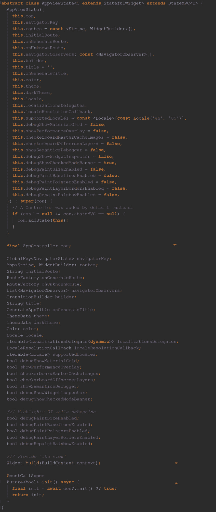](https://github.com/AndriousSolutions/mvc_application/blob/40ece0fb020c2a13ac87dde17d66b64d7ef2daf5/lib/src/view/app.dart#L635)

<figcaption>[AppViewState 类](https://github.com/AndriousSolutions/mvc_application/blob/40ece0fb020c2a13ac87dde17d66b64d7ef2daf5/lib/src/view/app.dart#L635)</figcaption>

这个类可以在 Dart 包中找到， [**mvc_application**](https://pub.dev/packages/mvc_application) ，因为它属于 mvc 设计模式，所以被认为是应用程序的“视图”方面。查看上面的第一个红色小箭头，您可以看到有一个对此视图的相应控制器的引用。这个类被赋予了一个非常有描述性的名字， *AppViewState* ，而它的控制器被称为， *AppController* 。因此，他们既是应用程序整体的“视图”又是“控制器”。

在本文中，我们将详细研究 Dart 包， [**mvc_application**](https://pub.dev/packages/mvc_application) 。为此，我们将浏览两个示例应用程序， [*weather_cast*](https://github.com/Andrious/weathercast/tree/3cb7fd9b512a7368b2e134861472135076bb68f0) 和[*contact services*](https://github.com/Andrious/weathercast/tree/3cb7fd9b512a7368b2e134861472135076bb68f0)，同时不断“深入了解”用于制作它们的 MVC 软件框架。

### 截图！不是 Gists！

和往常一样，我更喜欢用截图而不是 gists 来展示我的文章中的代码。我发现它们更容易使用，也更容易阅读。然而，你可以点击它们来查看代码的要点或在 Github 中。讽刺的是，这篇关于移动开发的文章，在电脑上看比在手机上看更好。此外，我们大多在电脑上编程；我们的手机上没有。暂时如此。

 

<figcaption>[MVC 在颤振部分 1](https://dev.to/andrious/mvc-in-flutter-part-1-57jn-temp-slug-6910729) 和 [MVC 在颤振部分 2](https://dev.to/andrious/mvc-in-flutter-part-2-jk5-temp-slug-9196818)</figcaption>

这是一个“免费”的三部分系列的第 3 部分，研究了一种遵循 MVC 设计模式背后的概念来组织和开发你的 Flutter 应用程序的方法。本系列进一步介绍了 Dart 包， [**mvc_application**](https://pub.dev/packages/mvc_application) ，因为它是提供通用功能和标准方法来制作 Flutter 应用程序的软件框架——使用 mvc 作为指南。

 

<figcaption>[其他故事作者格雷格·佩里](https://medium.com/@greg.perry)</figcaption>

我们开始吧。

现在回到类， *AppViewState* 。这是一个抽象类，函数 **build** ()，是要实现的函数。在对 MVC 设计模式的解释中， **build** ()函数的内容展示了 MVC 设计模式的“视图”方面。

 

<figcaption>[主镖](https://github.com/Andrious/weathercast/blob/8c4b7dc620db52a515aa53e9c4402ccac1ebb85c/lib/main.dart#L24)</figcaption>

在示例应用程序 *weather_cast* 的 main.dart 文件中(见上文)，应用程序的“视图”被视为类 *WeatherApp* 。现在，它扩展了类， *AppView* 。猜猜这个类扩展了什么？它扩展了你上面看到的第一个类， *AppViewState* 。下面列出了 WeatherApp 类。看看传递给其父类 *AppView* 的参数值。

 

<figcaption>[韦瑟 App 类](https://github.com/Andrious/weathercast/blob/8c4b7dc620db52a515aa53e9c4402ccac1ebb85c/lib/src/app/view/weatherapp.dart#L24)</figcaption>

在上面的截图中，我们看到“视图”已经传入了以下参数:应用程序的标题，它的控制器和主屏幕小部件。注意，这个类还用控制器类 **con.ThemeCon.theme** 中的 *getter* 覆盖了函数 **onTheme** ()。

此外，请注意使用了“as”子句，因为视图类和控制器类具有相同的名称 WeatherApp。子句进行了区分，允许我引用两个类的属性。

让我们继续学习类的层次结构。接下来是 AppView 类。我们正在进入软件框架的内部。记住，这个类扩展了抽象类 *AppViewState* 。MaterialApp 小部件就是在这个类中实例化的；这些参数中的许多参数最终被投入使用。第一个红色箭头突出显示了“debugPaint”属性也在这里使用，允许开发人员在开发他们的应用程序时访问这些可视化工具。

 

<figcaption>[AppView 类](https://github.com/AndriousSolutions/mvc_application/blob/40ece0fb020c2a13ac87dde17d66b64d7ef2daf5/lib/src/view/app.dart#L468)</figcaption>

注意，上面的第二个箭头描述了这样一个事实，如果没有提供“应用程序控制器”，它将被创建并提供给类 *AppViewState* 。下面，该类继续，您可以看到，MaterialApp 小部件确实被实例化了。下一个红色箭头指引你到**？？**如果可能的话，运算符被重复用于向 MaterialApp 小部件提供一个非空参数值。

最后，最后一个红色箭头显示，如果没有主题参数值传递给应用程序， *weather_cast，*(本来没有)，则调用函数， **onTheme** ()，如果实现了该函数(确实实现了)，它将提供应用程序的“主题”。在这种情况下，当示例应用程序改变其位置，从而改变其天气条件时，应用程序界面的颜色将随之改变，因为覆盖了 **onTheme** ()函数。

[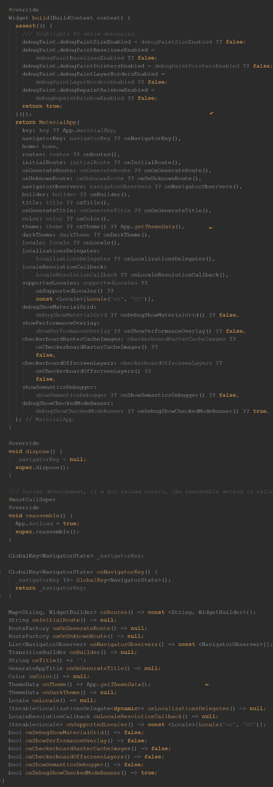](https://github.com/AndriousSolutions/mvc_application/blob/40ece0fb020c2a13ac87dde17d66b64d7ef2daf5/lib/src/view/app.dart#L537) 

<figcaption>[AppView 类](https://github.com/AndriousSolutions/mvc_application/blob/40ece0fb020c2a13ac87dde17d66b64d7ef2daf5/lib/src/view/app.dart#L537)</figcaption>

在 main.dart 文件中，我们看到了 **main** ()函数。当然，这是 Flutter 应用程序开始的地方。这也是底层软件框架的开始。你可以看到 MyApp 类扩展了 App 类。App 类来自 Dart 包， [**mvc_application**](https://pub.dev/packages/mvc_application) 。

 

<figcaption>[主镖](https://github.com/Andrious/weathercast/blob/8c4b7dc620db52a515aa53e9c4402ccac1ebb85c/lib/main.dart#L24)</figcaption>

让我们深入了解一下，检查一下 App 类。它没有列出整个课程，但下面的截图显示了前半部分课程的大部分内容，用箭头突出显示了感兴趣的特定点。

例如，第一个箭头指向抽象函数， **createView** ()。你以前见过。看上面。它是抽象的，这是有道理的。毕竟，你要在启动应用程序时提供“视图”。现在，下面的第二个箭头显示了这个函数， **createView** ()，然后在函数 **initApp** ()中被调用。

[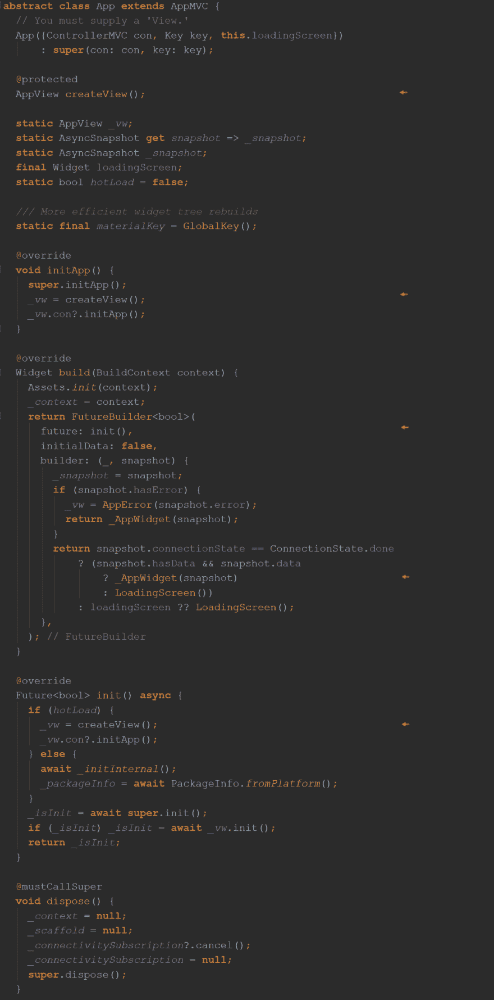](https://github.com/AndriousSolutions/mvc_application/blob/40ece0fb020c2a13ac87dde17d66b64d7ef2daf5/lib/src/view/app.dart#L118) 

<figcaption>[App 类](https://github.com/AndriousSolutions/mvc_application/blob/40ece0fb020c2a13ac87dde17d66b64d7ef2daf5/lib/src/view/app.dart#L118)</figcaption>

第三个箭头突出显示了一个特别的兴趣点。这个框架利用一个 FutureBuilder 小部件来“设置和准备”应用程序。换句话说，任何在应用程序继续运行之前必须完成的异步操作都是使用 FutureBuilder 小部件实现的。注意，参数 *future* 接受函数调用 **init** ()。

第四个箭头显示了异步操作完成时，屏幕中央出现一个小微调器的位置。它来自类 LoadingScreen。当它们完成时，StatefulWidget， *_AppWidget* ，然后被实例化。猜猜它对应的状态对象用它的 **createState** ()函数返回什么？就是这个类，*AppView*(weather app 扩展的类)。换句话说，最初在 main.dart 中实例化的类 *WeatherApp* 的 **build** ()函数现在运行了。

 

<figcaption>[_AppWidget 类](https://github.com/AndriousSolutions/mvc_application/blob/40ece0fb020c2a13ac87dde17d66b64d7ef2daf5/lib/src/view/app.dart#L463)</figcaption>

最后，App 类中列出了 **init** ()函数本身。下面再次展示。顺便说一句，如果发出“热重装”，App class' **build** ()函数再次运行。App 类的**重新组装**()函数在发出“热重装”时被触发。注意，属性 *hotLoad* 被设置为 true，因此 **createView** ()函数被再次触发。

[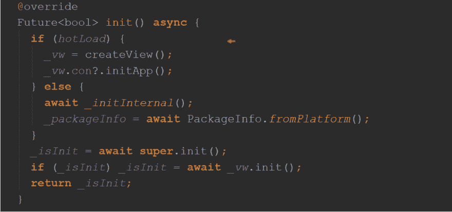](https://github.com/AndriousSolutions/mvc_application/blob/40ece0fb020c2a13ac87dde17d66b64d7ef2daf5/lib/src/view/app.dart#L164) 

<figcaption>[AppView 类](https://github.com/AndriousSolutions/mvc_application/blob/40ece0fb020c2a13ac87dde17d66b64d7ef2daf5/lib/src/view/app.dart#L597)和 [App 类](https://github.com/AndriousSolutions/mvc_application/blob/40ece0fb020c2a13ac87dde17d66b64d7ef2daf5/lib/src/view/app.dart#L164)</figcaption>

### 这一切是如何开始的

注意，App 类扩展了类 AppMVC，AppMVC 类扩展了 StatefulWidget 类。同样，传递给函数的是 App 类， **runApp** ()。知道它对应的状态对象类是 _AppState，而且是在这个类的' **initState** ()函数中调用了类 App 的 **initApp** ()函数。实际上是让应用程序开始运行。

[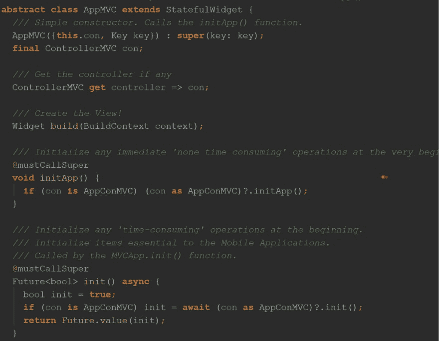](https://res.cloudinary.com/practicaldev/image/fetch/s--bnTl76bi--/c_limit%2Cf_auto%2Cfl_progressive%2Cq_auto%2Cw_880/https://cdn-images-1.medium.com/max/1024/1%2AquAn91YiKQRD5TJ2LfczGw.png)

[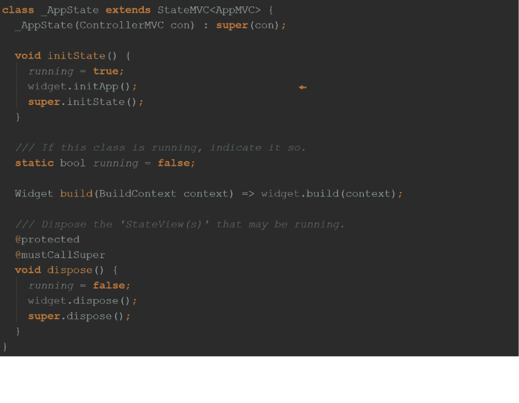](https://res.cloudinary.com/practicaldev/image/fetch/s--v-Kq-YNo--/c_limit%2Cf_auto%2Cfl_progressive%2Cq_auto%2Cw_880/https://cdn-images-1.medium.com/max/1024/1%2AQAHPYMr-rn6VN62WX-Jbgg.png) 

<figcaption>[AppMVC 类](https://github.com/AndriousSolutions/mvc_pattern/blob/master/lib/mvc_pattern.dart#L1129)和 [_AppState 类](https://github.com/AndriousSolutions/mvc_pattern/blob/master/lib/mvc_pattern.dart#L1218)</figcaption>

在上面的第二个屏幕截图中，函数调用 **widget.initApp()** ，将您带到 App 类中的函数 **initApp** ()。见下文。注意，在那个函数里，有一行， **_vw.con？。initApp()** 。当这一行启动时，在示例应用 weather_cast 的情况下，它将我们带到 WeatherApp 类中的 **initApp** ()函数。碰巧的是，在那里，这个控制器的状态对象添加了第二个控制器，名为 *ThemeCon* 。当切换到新的天气预报时，控制器*主题图标*会改变应用程序的颜色。

[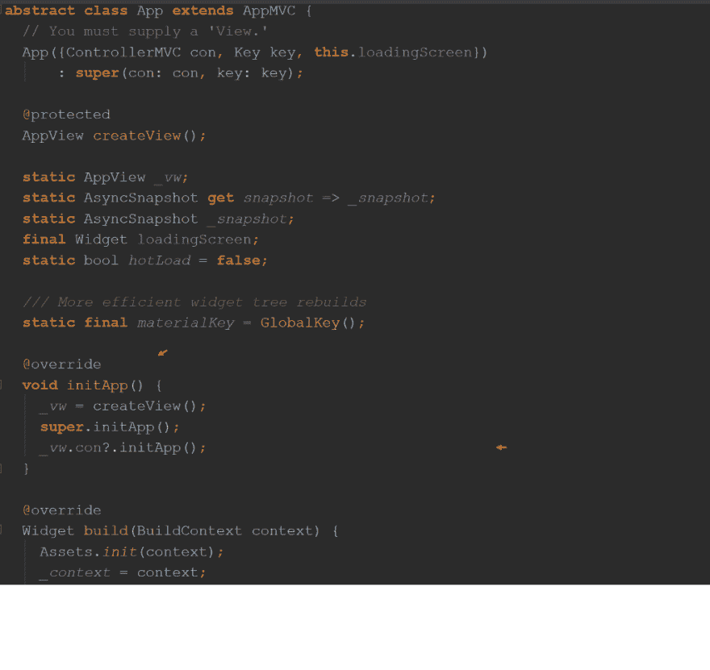](https://github.com/AndriousSolutions/mvc_application/blob/40ece0fb020c2a13ac87dde17d66b64d7ef2daf5/lib/src/view/app.dart#L118)

[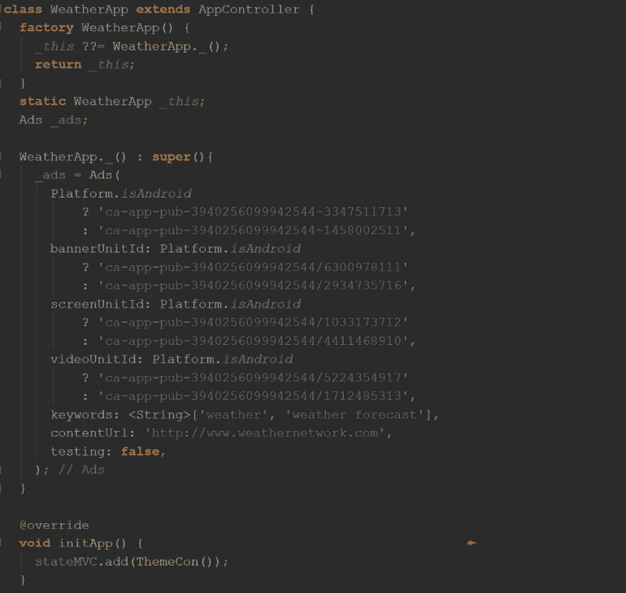](https://github.com/Andrious/weathercast/blob/8c4b7dc620db52a515aa53e9c4402ccac1ebb85c/lib/src/app/controller/weatherapp.dart#L32) 

<figcaption>[App 类](https://github.com/AndriousSolutions/mvc_application/blob/40ece0fb020c2a13ac87dde17d66b64d7ef2daf5/lib/src/view/app.dart#L118)和 [WeatherApp 类](https://github.com/Andrious/weathercast/blob/8c4b7dc620db52a515aa53e9c4402ccac1ebb85c/lib/src/app/controller/weatherapp.dart#L32)</figcaption>

### 框架中的一致性

如果您已经阅读了前两篇文章，您会知道甚至目录结构和文件名都符合传达 MVC 方法的标准。所以，即使是类库文件，[**【MVC _ application】**](https://pub.dev/packages/mvc_application)，也遵循这样的方法来组织它的文件和目录。像示例应用程序 weather_cast 一样，右边下面列出的类库也有它的“MVC”文件和目录。

[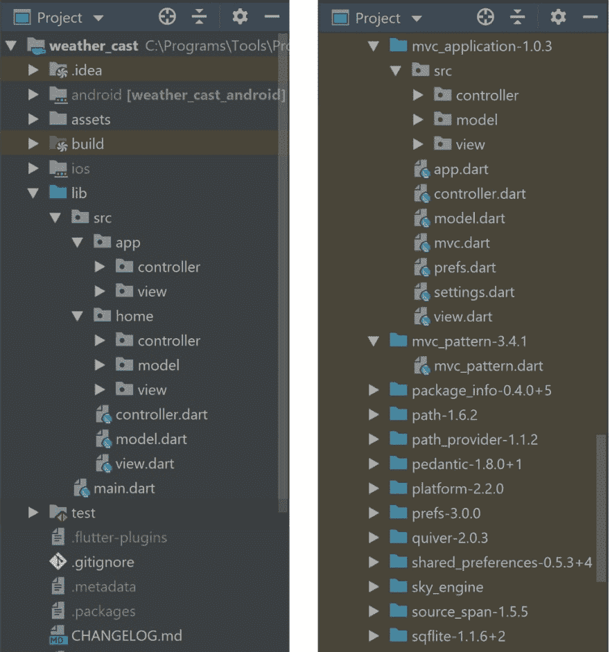](https://res.cloudinary.com/practicaldev/image/fetch/s--HnIdVuKv--/c_limit%2Cf_auto%2Cfl_progressive%2Cq_auto%2Cw_880/https://cdn-images-1.medium.com/max/1024/1%2AKvJ0BaaXeW1qIa908Li5Ag.png)

### MVC 的 API

设计模式是关于组织代码的标准方式，它是关于工作和责任的分离。因此，无论如何，这也是为了提供一个标准的 API，这样这些独立的工作和职责领域就可以互相交流了。

在两个示例应用程序中，当控制器被'[注入到视图中时，你会看到有一个一致的方法。在这两种情况下，控制器类都被实例化为非默认超类构造函数的参数。然后，软件框架为该控制器的对象引用提供属性*控制器*。正是这些对象作为 API 的一部分与控制器进行通信。](https://www.google.com/search?q=%22Dependency+Injection%22&oq=%22Dependency+Injection%22&aqs=chrome..69i57j0j69i65l3j0.2017j0j7&sourceid=chrome&ie=UTF-8)

 

<figcaption>[天气类](https://github.com/Andrious/weathercast/blob/8c4b7dc620db52a515aa53e9c4402ccac1ebb85c/lib/src/home/view/home.dart#L44)和[联系人列表页面类](https://github.com/Andrious/contacts_service_example/blob/29900ac0c8dd4a6a7ae876747572db941dcbf73b/lib/src/view/ContactListPage.dart#L62)</figcaption>

在上面的每个截图中，您都有一个对控制器的实例引用。在一个例子中，它是 weatherCon 类型的实例变量 *_weatherCon* 。在另一个例子中，它是控制器类型的实例变量 *con* 。属性的类型，*控制器*，当然是 ControllerMVC 类型。

现在，您将使用这些实例变量与控制器“对话”,并检索由该视图显示的数据，因为它与 MVC 相关。那么 API 会是什么样子呢？设想“视图团队”从“控制器团队”获得一个用于访问数据的函数调用列表。那么函数调用列表会是什么样的呢？

一种选择是你喜欢的任何东西。由项目规范要求的功能和特性决定，公共功能名称和公共属性名称可以反映所需的功能。

例如，在 weather_cast 应用程序中，我们知道要输入一个城市名称，然后返回该城市的当前天气情况。因此，在 **build** ()函数中(即在视图中)，您可以猜测有单词“城市”，某个地方，可能还有单词“位置”，当然，可能还有单词“天气”。你是对的。你可以看到下面，看着红色的箭头，视图是能够与模型对话的，**模型。weather weather = _ weather con . weather**，以及控制器 **_weatherCon** ，因此知道控制器和模型的公共函数和*getter*，以提供项目规范所规定的数据和功能。

<figcaption>[_ 韦瑟邦](https://github.com/Andrious/weathercast/blob/8c4b7dc620db52a515aa53e9c4402ccac1ebb85c/lib/src/home/view/home.dart#L61)</figcaption>

### 旋舞是你的向导

就我个人而言，虽然我还没有完全投入到这种方法中，但我正在尝试使用 Flutter 自己的 API(它自己的公共函数名、 *getters* 和属性)作为指南，来指导我使用自己的函数名、 *getters* 和属性。因此，在下面的截图中，回头看一下**构建**()函数，您会看到有两个实例，在实现指定功能时，我只是将小部件的命名参数的名称镜像到回调函数。换句话说，命名参数有一个 **onPressed** ()函数， *onPressed* ，命名参数有一个 **onRefresh** ()函数， *onRefresh* 。但是，请注意， **onPressed** ()函数仍然有必要接受参数 *city* 。

[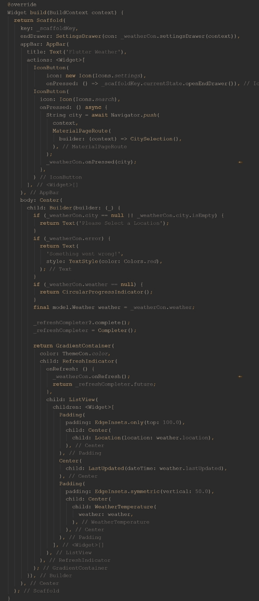](http://_WeatherState%20class)

<figcaption>[_ 韦瑟邦](https://github.com/Andrious/weathercast/blob/8c4b7dc620db52a515aa53e9c4402ccac1ebb85c/lib/src/home/view/home.dart#L61)</figcaption>

在 StockMVC 示例应用程序中，您可以进一步看到一个您可以施加的变化示例。下面，是两个例子。在第一个屏幕截图中，视图(**构建**()函数)必须知道要显示的特定“字段”的名称。它不需要知道小部件的类型，但是它必须知道要显示的特定数据项的名称。

截图中的控制器引用都是紫色的。请注意，在有两个红色箭头的两个实例中，Flutter API 只是由控制器的 *getters* 在名称上进行镜像。第二个截图更进一步，所有用于与控制器对话的函数和*getter*的名字都反映了 Flutter 自己的 API。

[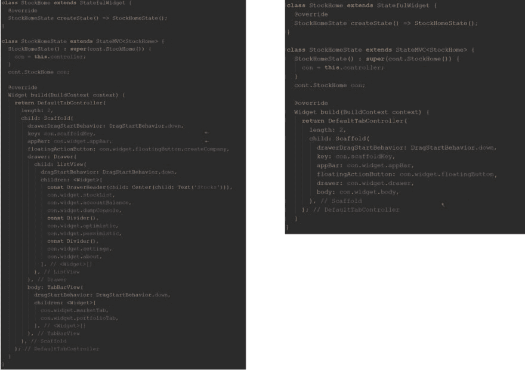](https://res.cloudinary.com/practicaldev/image/fetch/s--PmJPIIEj--/c_limit%2Cf_auto%2Cfl_progressive%2Cq_auto%2Cw_880/https://cdn-images-1.medium.com/max/1024/1%2AtOZ1IJpIPfW5W98Cxo7KsQ.png) 

<figcaption>[库存状态类](https://github.com/Andrious/stocks_mvc/blob/d899bfe05ea9121dee8c4043f82eb44f3c3b9149/lib/src/home/view/stock_home.dart#L109)和[库存状态类](https://github.com/Andrious/stocks_mvc/blob/d899bfe05ea9121dee8c4043f82eb44f3c3b9149/lib/src/home/view/stock_home.dart#L143)</figcaption>

查看第二个截图，您会看到完全采用了“Flutter API 作为您的指南”的方法，视图只需要知道有一个控制器 *getter* 与名称匹配，在本例中，是其 Scaffold 小部件的特定命名参数。使工作和职责领域之间的对话更容易开发和维护。

### 追踪呼叫

接下来，我们将做一个小练习，看看在 Contact Services 应用程序中通过什么途径获得视图所需的数据。在这个特定的应用程序中，视图从模型中获取数据，但只能通过控制器。让我们看看所走的路。

在第一个截图中， *getter* ， *list* ，引用了包含实例化类 ContactList 的库私有变量。查看第二个屏幕截图中的 ContactList 类，我们现在处于应用程序的模型部分。ContactList 类扩展了第三个屏幕截图中列出的 ContactFields 类。最后一个屏幕截图突出显示了视图中控制器提供的所有“数据”引用。

[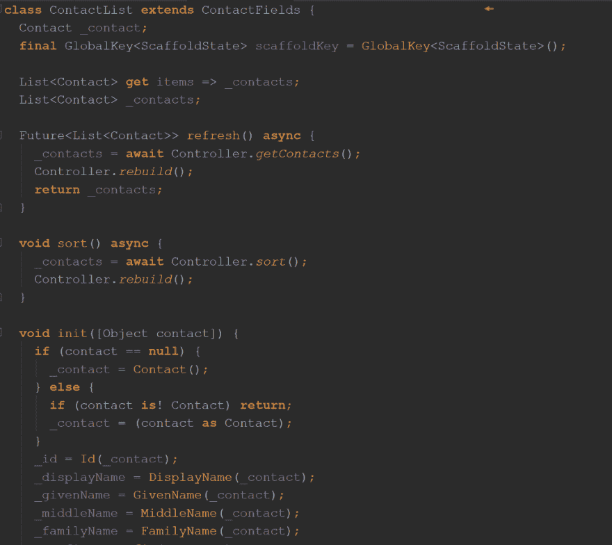](https://github.com/Andrious/contacts_service_example/blob/29900ac0c8dd4a6a7ae876747572db941dcbf73b/lib/src/model/Contacts.dart#L106) 

<figcaption>[控制器类](https://github.com/Andrious/contacts_service_example/blob/29900ac0c8dd4a6a7ae876747572db941dcbf73b/lib/src/controller/Controller.dart#L33)和[联系人列表类](https://github.com/Andrious/contacts_service_example/blob/29900ac0c8dd4a6a7ae876747572db941dcbf73b/lib/src/model/Contacts.dart#L106)</figcaption>

[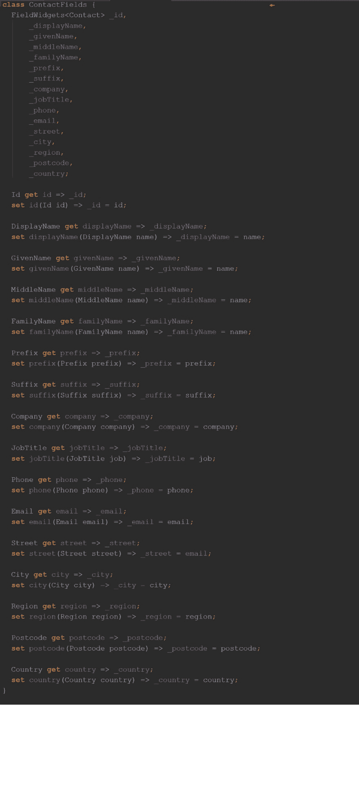](https://github.com/Andrious/contacts_service_example/blob/29900ac0c8dd4a6a7ae876747572db941dcbf73b/lib/src/model/Contacts.dart#L150)

[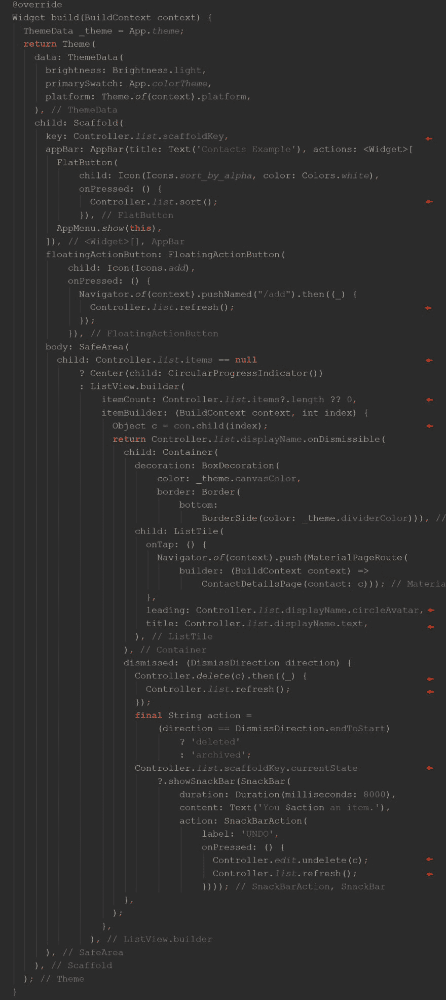](https://github.com/Andrious/contacts_service_example/blob/29900ac0c8dd4a6a7ae876747572db941dcbf73b/lib/src/view/ContactListPage.dart#L74) 

<figcaption>[联系人字段类](https://github.com/Andrious/contacts_service_example/blob/29900ac0c8dd4a6a7ae876747572db941dcbf73b/lib/src/model/Contacts.dart#L150)和[_ 联系人列表状态类](https://github.com/Andrious/contacts_service_example/blob/29900ac0c8dd4a6a7ae876747572db941dcbf73b/lib/src/view/ContactListPage.dart#L74)</figcaption>

### 你更喜欢什么？

示例应用程序 *weather_cast* 记录了用户在应用程序的首选项中输入的位置。因此，下一次应用程序启动时，最后一个位置会被显示出来——显示其当前的天气状况。当您使用这个 Flutter 框架时，preferences 功能很容易获得。

[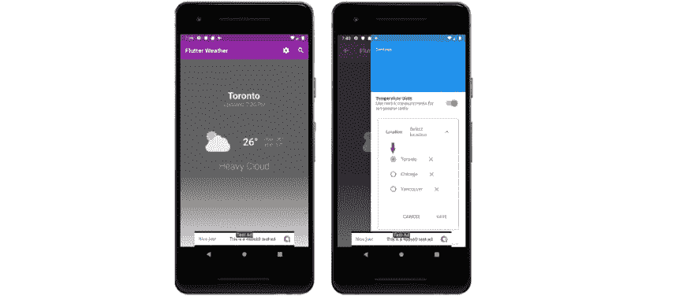](https://res.cloudinary.com/practicaldev/image/fetch/s--OZyXINKC--/c_limit%2Cf_auto%2Cfl_progressive%2Cq_auto%2Cw_880/https://cdn-images-1.medium.com/max/1024/1%2A0I44cbb4tPVkFBx_DsxCUA.png)

回到主屏幕的控制器 *WeatherCon* ，我们看到提供了存储和检索上次输入的“城市”位置的机制。红色箭头突出显示了最初检索位置的位置，以及系统首选项中记录的最后输入的城市。

[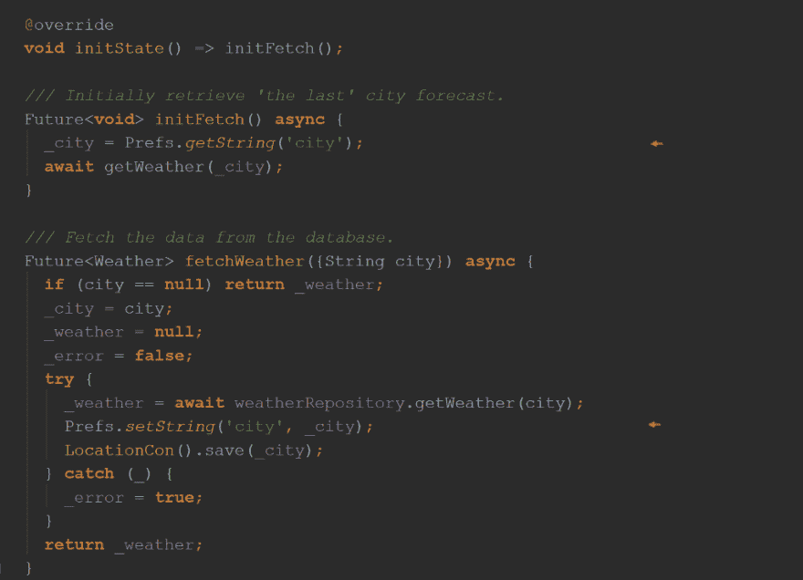](https://github.com/Andrious/weathercast/blob/8c4b7dc620db52a515aa53e9c4402ccac1ebb85c/lib/src/home/controller/home.dart#L55) 

<figcaption>[风标类](https://github.com/Andrious/weathercast/blob/8c4b7dc620db52a515aa53e9c4402ccac1ebb85c/lib/src/home/controller/home.dart#L55)</figcaption>

### 使用你的库

这个框架使用另一个名为[*【Prefs】*](https://pub.dev/packages/prefs)的函数库包，在读写系统参数时使用这个插件。这个库被初始化，然后由框架处理，所以你不必担心。你只需调用任何一个对你可用的[静态函数](https://pub.dev/packages/prefs#you-get-ten)。

下面是描述执行路径的截图，当任何使用该软件框架的应用首次启动时，Prefs 库最终被初始化。App 类将实例化 FutureBuilder 小部件，提供一个 false 的初始数据值，然后执行函数 **init** ()，返回一个 boolean 类型的 Future 对象。在 **init** ()函数中，您可以看到这个视图的控制器(如果有的话)调用了自己的 **init** ()函数。

[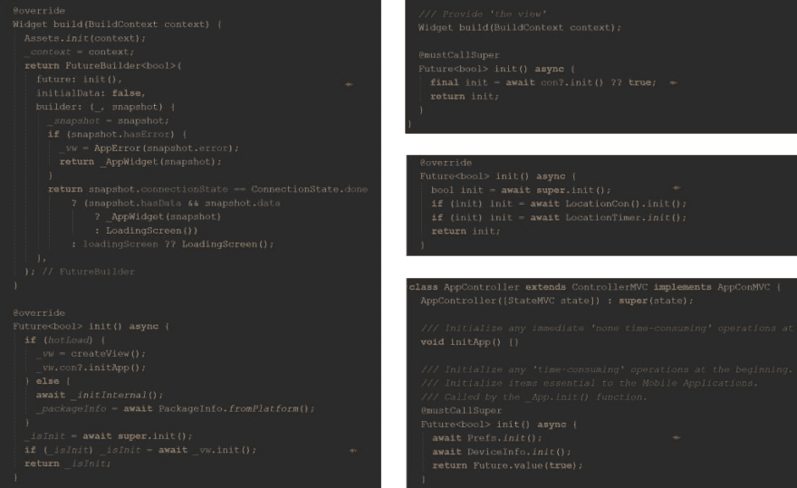](https://res.cloudinary.com/practicaldev/image/fetch/s--zWETNBm8--/c_limit%2Cf_auto%2Cfl_progressive%2Cq_auto%2Cw_880/https://cdn-images-1.medium.com/max/1024/1%2AFoa_z9yf52Ob4mvKJyBRAg.png) 

<figcaption>[App 类](https://github.com/AndriousSolutions/mvc_application/blob/40ece0fb020c2a13ac87dde17d66b64d7ef2daf5/lib/src/view/app.dart#L142)[AppViewState 类](https://github.com/AndriousSolutions/mvc_application/blob/40ece0fb020c2a13ac87dde17d66b64d7ef2daf5/lib/src/view/app.dart#L706)[weather App 类](https://github.com/Andrious/weathercast/blob/8c4b7dc620db52a515aa53e9c4402ccac1ebb85c/lib/src/app/controller/weatherapp.dart#L65)和 [AppController 类](https://github.com/AndriousSolutions/mvc_application/blob/40ece0fb020c2a13ac87dde17d66b64d7ef2daf5/lib/src/controller/app.dart#L37)</figcaption>

在示例应用程序 *weather_cast* 中，确实有一个视图控制器，它是 WeatherApp 类。你可以看到它的父类 *AppController* ，它的 **init** ()函数首先被调用， **super.init()** ，软件框架就是在这个函数中初始化 Prefs 库的。然后，它返回到“天气预报”控制器，设置特定应用程序特有的功能。

### 获取手机信息

在上面最后一个截图中，有静态函数调用， **DeviceInfo.init()** 。这为软件框架以及随后用它编写的任何应用程序提供了关于其底层平台(即移动电话)的大量信息。看看下面，你会看到很多关于手机的信息，如果你需要的话，随时都可以得到。

[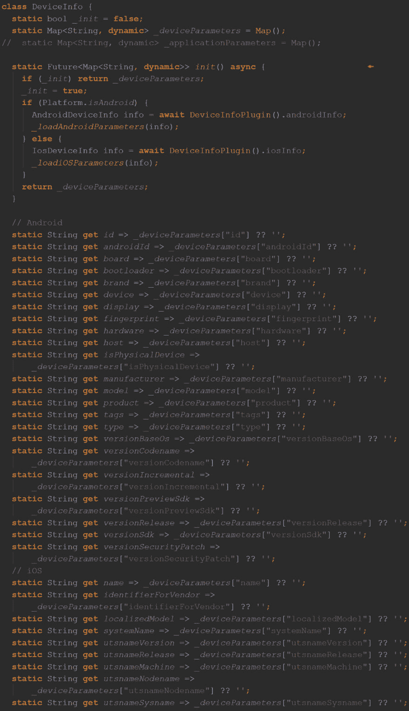](https://github.com/AndriousSolutions/mvc_application/blob/40ece0fb020c2a13ac87dde17d66b64d7ef2daf5/lib/src/controller/deviceinfo.dart#L29) 

<figcaption>[DeviceInfo 类](https://github.com/AndriousSolutions/mvc_application/blob/40ece0fb020c2a13ac87dde17d66b64d7ef2daf5/lib/src/controller/deviceinfo.dart#L29)</figcaption>

### 也有数据

当然，框架中包括一种与数据库“对话”的方式。诚然，它目前在 Dart 包中只有 SQLite、 [**、dbutils**](https://pub.dev/packages/dbutils) ，但将来会有其他的空间。我们现在来看看示例应用程序，[联系服务](https://github.com/Andrious/weathercast/tree/3cb7fd9b512a7368b2e134861472135076bb68f0)，因为它涉及到使用数据库。注意，有一篇文章专门针对这个 Dart 包， [SQLite in Flutter](https://dev.to/andrious/sqlite-in-flutter-3na5-temp-slug-5894831) ，供大家回顾。

 

<figcaption>[SQLite in 扑](https://dev.to/andrious/sqlite-in-flutter-3na5-temp-slug-5894831)</figcaption>

下面的三个截图展示了示例应用程序 [contact services](https://github.com/Andrious/weathercast/tree/3cb7fd9b512a7368b2e134861472135076bb68f0) 首次启动时的执行路径。这个应用程序的“主屏幕”是这个类，*联系人列表页面*。

[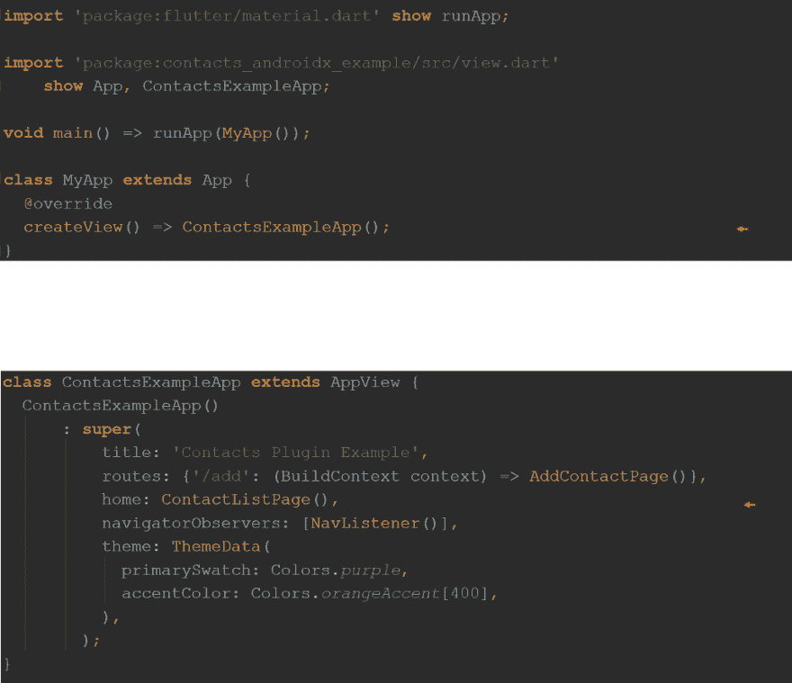](https://res.cloudinary.com/practicaldev/image/fetch/s--0IrEnbIQ--/c_limit%2Cf_auto%2Cfl_progressive%2Cq_auto%2Cw_880/https://cdn-images-1.medium.com/max/1024/1%2AuMyRUMpWOhemMo0sVwcUsQ.png)

<figcaption>[main . dart](https://github.com/Andrious/contacts_service_example/blob/29900ac0c8dd4a6a7ae876747572db941dcbf73b/lib/main.dart#L4)和[contactsesampleapp 类](https://github.com/Andrious/contacts_service_example/blob/29900ac0c8dd4a6a7ae876747572db941dcbf73b/lib/src/view/ContractsExampleApp.dart#L31)和 [ContactListPage 类](https://github.com/Andrious/contacts_service_example/blob/29900ac0c8dd4a6a7ae876747572db941dcbf73b/lib/src/view/ContactListPage.dart#L62)</figcaption>

注意，在最后一个截图中，这个“视图”也被注入了它的“控制器”在这个应用中，控制器类被命名为*控制器*。红色箭头突出显示了控制器被引用的位置。其中两个是静态调用。注意，属性*控制器*是类 controller 的实例化对象。这里只是演示框架如何提供这样的属性。

### 数据库的路径

让我们看看工作中的框架。下面第一张截图是状态对象的 **initState** ()函数。在这里，它遍历所有添加/关联到 StateMVC 对象(即类)的控制器。第二张截图是万物的控制器，*控制器*。它覆盖了自己的 **initState** ()函数，引入了自己的 **init** ()函数，这个函数调用系统的偏好设置(按字母顺序排序或不排序)，并“刷新”联系人列表。 **init** ()函数调用模型自己的 **initState** ()函数。

[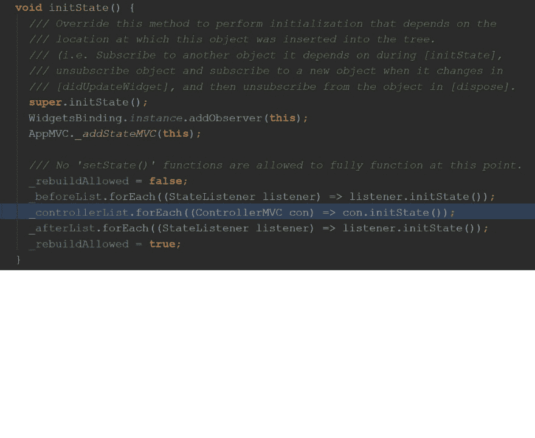](https://res.cloudinary.com/practicaldev/image/fetch/s--nRBqdsc4--/c_limit%2Cf_auto%2Cfl_progressive%2Cq_auto%2Cw_880/https://cdn-images-1.medium.com/max/1024/1%2A6_jCmLyNSF90yVLKaNHOYw.png)

 

<figcaption>[StateMVC 类](https://github.com/AndriousSolutions/mvc_pattern/blob/90a76e00f8a95ad1dc8cf73ae55ebe6b0806324c/lib/mvc_pattern.dart#L405)和[控制器类](https://github.com/Andrious/contacts_service_example/blob/29900ac0c8dd4a6a7ae876747572db941dcbf73b/lib/src/controller/Controller.dart#L33)</figcaption>

从控制器开始，我们现在转到模型端。模型类中的 **initState** ()函数， *ContactsServices* ，调用它的父类， *DBInterface* ，own 函数， **init** ()。在最后一个截图中，我们看到了这个类， *DBInterface* 。我们可以看到它的 **init** ()函数包含它的 **open** ()函数——到达数据库并打开它。

 

<figcaption>[联系人服务类](https://github.com/Andrious/contacts_service_example/blob/29900ac0c8dd4a6a7ae876747572db941dcbf73b/lib/src/model/ContactsService.dart#L33)和[数据库接口类](https://github.com/AndriousSolutions/dbutils/blob/master/lib/src/sqlite/DBInterface.dart#L48)</figcaption>

### 列出您的联系人

让我们浏览一下用于列出应用程序中当前联系人(如果有的话)的代码。回到那个 **initState** ()函数，我们看到在打开数据库之后，它被赋予列出其内容的任务。你在下面看到的列表是“刷新的”**刷新**()函数也可以在*联系人列表*类中找到。

[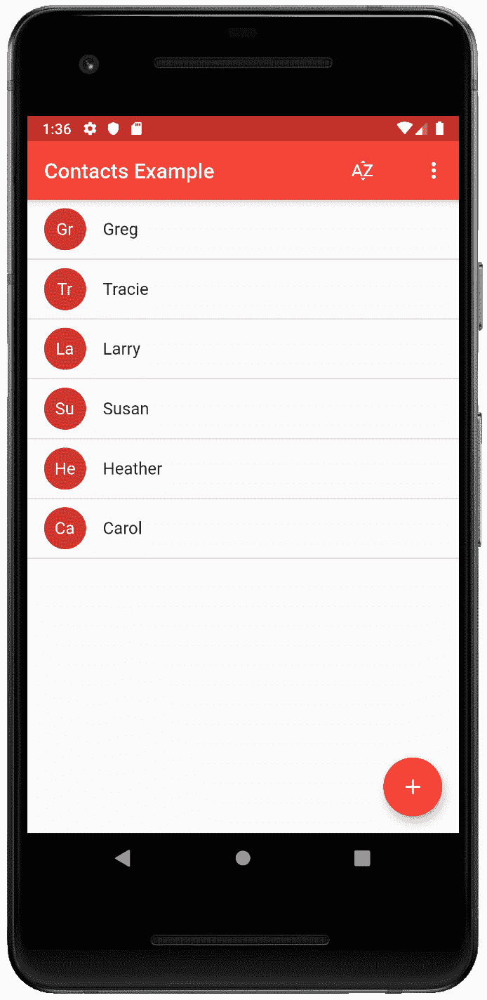](https://res.cloudinary.com/practicaldev/image/fetch/s--Hiwh4stB--/c_limit%2Cf_auto%2Cfl_progressive%2Cq_auto%2Cw_880/https://cdn-images-1.medium.com/max/694/1%2An1JU7d_9OJi5KMZ-3_9xsw.png)

 

<figcaption>[控制器类](https://github.com/Andrious/contacts_service_example/blob/29900ac0c8dd4a6a7ae876747572db941dcbf73b/lib/src/controller/Controller.dart#L33)</figcaption>

因此，在类 ContactList 中，我们看到了函数 refresh()，具有讽刺意味的是，在这种情况下，控制器调用它只是为了依次调用控制器。它调用控制器的 **getContacts** ()函数，然后调用其 **rebuild** ()函数来“重建”(通过调用 setState())小部件树。

在控制器的 **getContacts** ()函数中，调用了应用程序模型中的一个函数。ContactService 类有自己的函数， **getContacts** ()，叫做返回类类型 Contacts 的对象列表。最后，如果应用程序中有指示，返回的“联系人”列表将按字母顺序排序。

[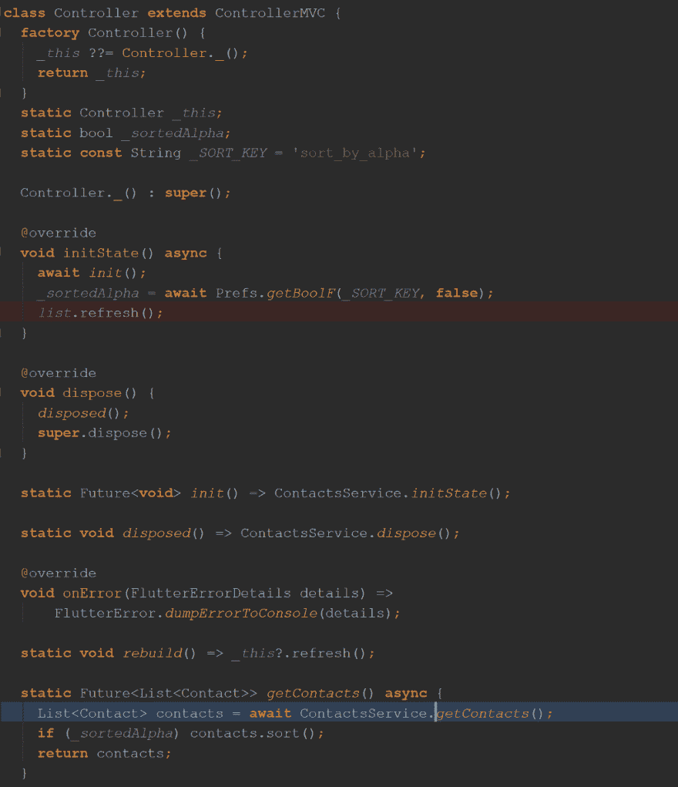](https://res.cloudinary.com/practicaldev/image/fetch/s--n9oI1Sr4--/c_limit%2Cf_auto%2Cfl_progressive%2Cq_auto%2Cw_880/https://cdn-images-1.medium.com/max/1024/1%2AWEJw9XwvIl-fsjIZJWOeZQ.png) 

<figcaption>[联系人列表类](https://github.com/Andrious/contacts_service_example/blob/29900ac0c8dd4a6a7ae876747572db941dcbf73b/lib/src/view/ContactListPage.dart#L62)和[控制器类](https://github.com/Andrious/contacts_service_example/blob/29900ac0c8dd4a6a7ae876747572db941dcbf73b/lib/src/controller/Controller.dart#L33)</figcaption>

这个应用程序的模型 ContactsService 扩展了一个类，它是 Dart 包的一部分， [**dbutils**](https://pub.dev/packages/dbutils) ，称为 DBInterface。因此，调用它的函数 **getContacts** ()，检索存储在数据库中的所有联系人将调用 SELECT 语句，**SELECT * FROM Contacts WHERE deleted = 0**。

当它进行这个调用时，dbutils 库中的函数 **rawQuery** ())会进行查询。如果在数据库中找到数据，则返回一个地图对象列表，**地图**。

[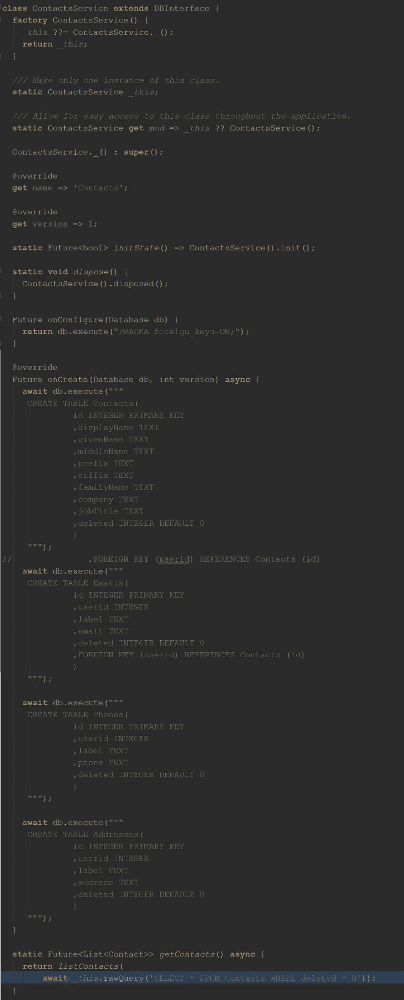](https://res.cloudinary.com/practicaldev/image/fetch/s--KMy7uBar--/c_limit%2Cf_auto%2Cfl_progressive%2Cq_auto%2Cw_880/https://cdn-images-1.medium.com/max/1024/1%2AQHkfPAB5wRU-WfTSWhiMXg.png)

[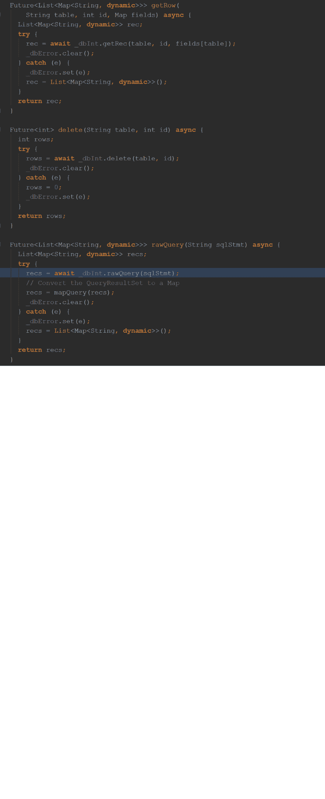](https://res.cloudinary.com/practicaldev/image/fetch/s--OKrUtjT4--/c_limit%2Cf_auto%2Cfl_progressive%2Cq_auto%2Cw_880/https://cdn-images-1.medium.com/max/1024/1%2AGJzYf71LWpAY9n7kV3hcFg.png) 

<figcaption>[联系人服务类](https://github.com/Andrious/contacts_service_example/blob/29900ac0c8dd4a6a7ae876747572db941dcbf73b/lib/src/model/ContactsService.dart#L33)和[数据库接口类](https://github.com/AndriousSolutions/dbutils/blob/master/lib/src/sqlite/DBInterface.dart#L215)</figcaption>

### 该应用的广告

运行应用程序时，您可能会注意到屏幕底部显示的横幅广告。那是一个 Admob 广告。实际上，这是一个测试广告，但它展示了在这个示例广告中使用的 Ads 库包。现在，它不是强调框架的一部分。我确实也写了 [Ads](https://pub.dev/packages/ads) 库包，但是选择不包含在 MVC 框架中。这是一个“沉重”的资源，让它作为一个 Dart 包随时可用在大多数情况下就足够了。

[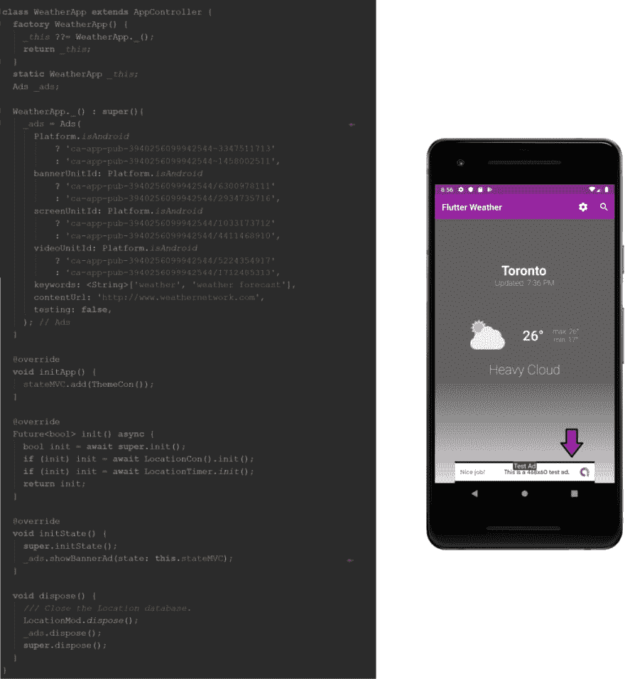](https://github.com/Andrious/weathercast/blob/8c4b7dc620db52a515aa53e9c4402ccac1ebb85c/lib/src/app/controller/weatherapp.dart#L32) 

<figcaption>[韦瑟 App 类](https://github.com/Andrious/weathercast/blob/8c4b7dc620db52a515aa53e9c4402ccac1ebb85c/lib/src/app/controller/weatherapp.dart#L32)</figcaption>

您可以看到 Ads 对象是在上面列出的“library-private”构造函数中初始化的。注意，该类有一个工厂构造函数，确保单例模式只产生这个“应用控制器”的一个实例该类将有它的 **initState** ()函数。

干杯。

每个月的第一个星期五期待一篇新文章。

[→格雷格·佩里的其他故事](https://medium.com/@greg.perry)

[颤振社区](https://www.twitter.com/FlutterComm)

* * *