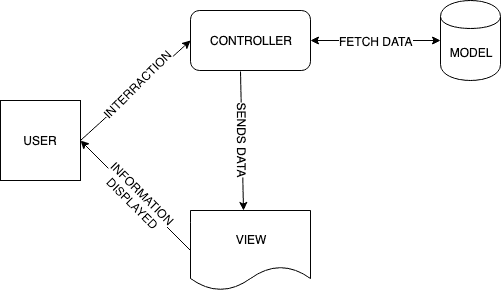
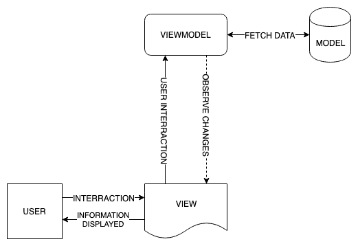
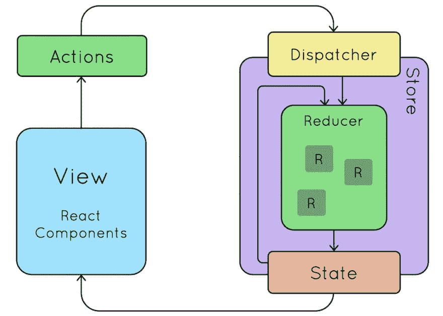

# MVWTF:揭开架构模式的神秘面纱

> 原文：<https://dev.to/adammc331/mvwtf-demystifying-architecture-patterns-ap1>

原载于[安卓精华](https://androidessence.com/mvwtf)。

你可以在 YouTube 上观看这个来自安卓峰会的演讲:

[https://www.youtube.com/embed/T7A-JbJBjyg](https://www.youtube.com/embed/T7A-JbJBjyg)

* * *

作为一名 Android 开发人员，我在社区中经常看到的一个问题是“我应该使用什么架构模式？”

这种讨论通常会引出一些时髦的首字母缩写词:

*   手动音量调节
*   最有价值球员
*   MVVM
*   MVI
*   MVU？？(我们不谈论这个，但显然这是新来的孩子)

这对于新的 Android 开发人员，以及那些经常质疑他们是否在使用正确的设备的经验丰富的老手来说，可能是非常可怕的。无论你是想决定学习哪一个，还是想知道你已经使用的那个是否最适合你，这篇文章将帮助你做出正确的决定。

我们应该首先理解为什么我们需要架构模式。当这个问题被问及时，我们得到了更多的流行词，说我们想要这样的代码:

*   可维持的
*   可扩张的
*   粗野的
*   可试验的

从表面上看，这些听起来可能不像是流行语，但往往只是一种填充。无论如何，编写可维护的代码意味着什么？健壮这个词意味着强壮和健康。什么是强大而健康的代码？

我们要从头开始。抛开所有的流行词汇，我们需要从一个事实开始，这个事实是这篇文章的基础:

> 您不能将所有代码都放在活动中。

我们都知道这一点，我们将代码放在单独的文件中。然而，这不仅仅是将各种类放入它们自己的文件中。我们决定如何分解我们的代码是非常重要的，这个过程就是架构模式的目的。架构模式是描述如何拆分代码的方式。

让我们从头开始，从顶部开始，通过处理缩略词列表，来解决一些拆分代码的选项。

# 模型-视图-控制器

MVC 值得一个简短的章节，因为它是最古老的架构模式之一。它是在 20 世纪 70 年代开发的，作为一种将应用程序分成三个部分的方法:一个模型、一个视图和一个控制器。了解每个组件的功能很重要。

## 型号

模型组件是您的数据源。这可以是数据库、远程服务器、本地文本文件或其他任何东西。需要记住的重要一点是，它不关心视图。

你的模型不应该负责任何与数据显示方式相关的行为，只负责检索数据。

例如，如果您想获取一个用户并显示一个包含用户名和年龄的标签，您可以在其他地方创建该标签。不在模型组件内部。

## 视图

视图组件是数据的可视化表示。这就是它的全部责任。它不应该关心数据来自哪里。视图不应该做任何决定。如果您发现自己在视图组件中编写条件逻辑，可以考虑重构它。

## 控制器

作为最后一个组件，控制器负责几乎所有其他的事情。它应该:

1.  处理用户输入
2.  如有必要，验证输入
3.  将输入传递到模型中
4.  将模型响应传递给视图

考虑这个流程的一个简单方法是考虑一个表单。控制器读取您的所有文本输入，确保您已经填写了所有内容，将其发送到模型，然后告诉 UI 显示一个成功屏幕。

## MVC 图

让我们看看这一切是如何联系在一起的:

[](https://res.cloudinary.com/practicaldev/image/fetch/s--STiYr4TG--/c_limit%2Cf_auto%2Cfl_progressive%2Cq_auto%2Cw_880/https://thepracticaldev.s3.amazonaws.com/i/0o42x7ijrmr9noxcqyxk.png)

## 为什么我们不在安卓上用这个？

从表面上看，这看起来相当不错。我们的关注点是分开的，信息流是非常清楚的。

然而，在这篇文章的所有模式中，MVC 是 Android 上讨论最少的一个。对此有一个简单的解释。

[](https://res.cloudinary.com/practicaldev/image/fetch/s--FSwBythr--/c_limit%2Cf_auto%2Cfl_progressive%2Cq_auto%2Cw_880/https://thepracticaldev.s3.amazonaws.com/i/g20x0eegvcika5z1m27w.png)

当您考虑控制器的职责(接受用户输入)和视图的职责(显示数据)时，您可能会意识到在 Android 中它们是由同一件事情处理的。这是你的活动或片段。

## 为什么这样不好？

我想强调我们不希望在 Android 上实现这一点的两个原因:

1.  我们不能为一个活动或片段编写 Junit 测试，所以我们应该尽可能多地将代码移出那里。
2.  如果三个组件中的两个在同一个类中，我们的关注点实际上不会分开。

## 我们如何解决这个问题？

让我们将控制器/UI 逻辑移出活动/片段。

# 模型-视图-演示者

通过将 UI 和业务逻辑从活动/片段中分离出来，我们创建了一个稍微不同的信息流。这就产生了 MVP 模式。

[](https://res.cloudinary.com/practicaldev/image/fetch/s--BZHaH1My--/c_limit%2Cf_auto%2Cfl_progressive%2Cq_auto%2Cw_880/https://thepracticaldev.s3.amazonaws.com/i/15uwjej52fhhxzb1npxi.png)

现在我们有了一个关注点分离，所有的非 UI 代码都在活动/片段之外，我们可以对其进行单元测试。

## MVP 实现

在我们进入下一个模式之前，我认为了解一点像 MVP 这样的模式的实现是很重要的，这样我们也可以比较代码是如何发展的。

### 契约类

要在 MVP 中构建一个特性，我们需要做的第一件事是设计一个契约类，它具有定义我们三个组件行为的接口:

```
class TaskListContract {

    interface View {
        fun showTasks(tasks: List<Task>)
    }

    interface Presenter {
        fun viewCreated()
        fun viewDestroyed()
    }

    interface Model {
        fun getTasks(): List<Task>
    }
} 
```

### 型号

对于这个例子，我们的模型可以是一个简单的内存列表。

请注意，我们的模型实际上并没有引用其他组件。

```
class InMemoryTaskService : TaskListContract.Model {
    override fun getTasks(): List<Task> {
        return listOf(...)
    }
} 
```

### 视图

这个视图实际上只需要做两件事:

1.  通知演示者任何相关的生命周期方法，如果相关，请单击“监听器”
2.  重写我们的契约类中的任何方法来显示数据

请注意，我们的视图只引用了演示者。

```
class TaskListActivity : AppCompatActivity(), TaskListContract.View {
    private val presenter = TaskListPresenter(this, TaskRepository())

    override fun onCreate(savedInstanceState: Bundle?) {
        super.onCreate(savedInstanceState)
        // ...

        presenter.viewCreated()
    }

    override fun onDestroy() {
        presenter.viewDestroyed()
        super.onDestroy()
    }

    override fun showTasks(tasks: List<Task>) {
        taskAdapter.tasks = tasks
    }
} 
```

### 演示者

演示者需要覆盖 contract 类中的方法，在必要时调用视图，并进行任何必要的清理以避免内存泄漏(比如删除对视图的引用)。

请注意，我们的演示者既有对视图的引用，也有对模型的引用。

```
class TaskListPresenter(
        private var view: TaskListContract.View?,
        private val model: TaskListContract.Model
) : TaskListContract.Presenter {

    override fun viewCreated() {
        val tasks = model.getTasks()
        view?.showTasks(tasks)
    }

    override fun viewDestroyed() {
        view = null
    }
} 
```

## 这样够好了吗？

*   我们的视图只负责显示数据
*   我们的模型处理获取数据
*   演示者处理所有的输入和 UI 逻辑
*   一切都是分离的，一切都是可测试的
*   如果你觉得这样就够好了，那就用吧！

## MVVM 有什么不同？

我们原始列表中的每个架构模式都通向下一个。MVP 是我们讨论 MVVM 的基础，因为它们之间只有一个细微的区别:演示者不需要关心观点。

# 模型-视图-视图模型

在最后一个模式中，我们看到演示者明确地告诉视图要显示什么。作为一种选择，我们可以考虑一种基于事件的方法，在这种方法中，我们只公开视图应该处于的状态，任何需要显示该状态的人都可以订阅这些更改。

这正是 MVVM 的工作方式。它打破了演示者和视图之间的联系，而是通过一些可观察的类型来公开信息，比如 LiveData 或 RxJava。

[](https://res.cloudinary.com/practicaldev/image/fetch/s--wnhmT4T0--/c_limit%2Cf_auto%2Cfl_progressive%2Cq_auto%2Cw_880/https://thepracticaldev.s3.amazonaws.com/i/ukpejkp1tmzatyrgrjtr.png)

## MVVM 实现

让我们看看实现 MVP 和 MVVM 之间的代码比较。

### 型号

模型组件实际上变化不大。尽管我们不再有契约类，但我仍然建议为您的数据获取行为设置一个接口。

```
interface TaskRepository {
    fun getTasks(): List<Task>
}

class InMemoryTaskService : TaskRepository {

    override fun getTasks(): List<Task> {
        return listOf(...)
    }
} 
```

### 视图

该视图的行为类似于上一个示例，因为我们需要:

1.  创建对我们的视图模型的引用
2.  观察 ViewModel 变化以相应地更新 UI

```
class TaskListActivity : AppCompatActivity() {
    private val viewModel = TaskListviewModel(repository = InMemoryTaskService())

    override fun onCreate(savedInstanceState: Bundle?) {
        super.onCreate(savedInstanceState)
        // ...

        subscribeToViewModel()
    }

    private fun subscribeToViewModel() {
        viewModel.getTasks().observe(this, Observer { tasks ->
            adapter.tasks = tasks
        })
    }
} 
```

### viewmode

我们的视图模型看起来与演示者相似，但有几个主要区别:

1.  我们不再有对视图的引用，只有模型组件
2.  我们通过 LiveData 对象公开信息
3.  我们可以一初始化就获取信息，所以我们不需要被通知视图创建

```
class TaskListViewModel(
        private val repository: TaskRepository
) {
    private val tasks = MutableLiveData<List<Task>>()
    fun getTasks(): LiveData<List<Task>> = tasks

    init {
        fetchTasks()
    }

    private fun fetchTasks() {
        tasks.value = repository.getTasks()
    }
} 
```

## 是什么让 MVVM 胜过 MVP？

到目前为止，我们的代码看起来和以前完全一样，只是没有对视图的直接引用。放弃这种连接的好处是，现在我们可以利用 Android 的 [ViewModel](https://developer.android.com/topic/libraries/architecture/viewmodel) 架构组件来帮助更好地处理配置更改。

在 MVP 中，我们的演示者有一个对视图的引用，这通常是一个活动。如果我旋转我的手机，该活动将被重新创建，现在演示者正在引用一个不再存在的活动。

有了 ViewModel，我们就有了比那些配置更改更持久的东西，并且永远不会丢失状态。

### 在 MVP 中处理旋转

在 MVP 中，我们必须遵循许多步骤来处理轮换:

1.  将两个新方法添加到我们的演示者契约中，分别为`getState()`和`restoreState()`
2.  更新我们的视图，在相应的生命周期步骤中调用这些方法
3.  实现方法以检索状态并在演示者中还原它

根据您的状态的复杂程度，步骤 3 可能会花费大量时间并需要大量代码。

### MVVM 手柄旋转

为了确保我们能够轻松处理 MVVM 的轮换，我们执行了以下操作:

1.  更新我们的视图模型以扩展 Android 视图模型架构组件
2.  在我们的活动中，使用 ViewModelProviders 获取已经存在的视图模型
3.  重新订阅 LiveData 以获取状态

前两步与前一节中的步骤一样，但是现在我们不必考虑保存和恢复状态。我们只需要重新订阅 LiveData。

这为我们节省了很多时间。

如果你想在那里看到代码比较，请查看本文作为演示时的[幻灯片](https://github.com/AdamMc331/MVWTF/blob/master/presentation/mvwtf.pdf)。

## 为什么 MVVM 不够好？

当我们研究这些架构模式时，每一个听起来都更好。现在我们有了 MVP、*和*的所有分离和可测试性的好处，我们有了更好的轮换状态管理！

不过，我们的列表中还有一个首字母缩略词，它破坏了 MVVM 不是我们所能做到的最好的乐趣。为了理解它的不足之处，我们来看一个更复杂的状态。

考虑一个获取任务列表并支持加载和错误状态的特性。你可以尝试将你的状态放入某个 Kotlin 密封类:

```
sealed class TaskListState {
    object Loading : TaskListState()
    data class Loaded(val tasks: List<Task>) : TaskListState()
    data class Error(val error: Throwable?) : TaskListState()
} 
```

接下来，您更新您的 ViewModel 以根据正在发生的事情显示状态:

```
class TaskListViewModel(private val repository: TaskRepository) : ViewModel() {

    init {
        showLoading()
        try {
            fetchTasks()
        } catch (e: Exception) {
            showError()
        }
    }

    private fun showLoading() {
        state.value = TaskListState.Loading
    }

    private fun fetchTasks() {
        val tasks = repository.getItems()
        state.value = TaskListState.Loaded(tasks)
    }

    private fun showError() {
        state.value = TaskListState.Error(Throwable("Unable to fetch tasks."))
    }
} 
```

这看起来很不错。然而，`showLoading()`、`fetchTasks()`和`showError()`方法有一些风险。

1.  类中的任何方法都可以调用它们
2.  我们不能保证它们与特定的行为或意图相关联
3.  我们有多种方法来操作我们的状态，我们必须确保它们彼此不冲突

举个简单的例子，MVVM 可能没问题。我可以很容易地测试一切，以确保我以正确的顺序调用这些方法，并避免那些风险。然而，随着我们的视图模型变得更加复杂，它们会变得更加普遍。下一个模式可以解决这个问题。

# 模型-视图-意图

与前面的模式不同，“意图”不是指某个特定的组件，而是指我们想要在状态中捕获的做某事的*意图*。

## 用减速器管理可预测的状态变化

我们可以解决的 MVVM 的第一个问题是缺乏可预测的状态变化。我们应该有一个管道，而不是有多个方法来操纵我们的状态。这个流将接受一些动作和一个当前状态，并为我们输出一个新状态。

下面是方法签名的样子:

```
abstract class Reducer {
    abstract fun reduce(action: Action, state: State): State
} 
```

如果你使用一个像我们之前看到的密封类来表示你的状态，我们可以有非常清晰定义的输入和输出:

```
class TaskListReducer : Reducer<TaskListState>() {

    override fun reduce(action: Action, state: TaskListState): TaskListState {
        return when (action) {
            is TaskListAction.TasksLoading -> TaskListState.Loading()
            is TaskListAction.TasksLoaded -> TaskListState.Loaded(action.tasks)
            is TaskListAction.TasksErrored -> TaskListState.Error()
            else -> state
        }
    }
} 
```

如果您没有使用密封类，我们也可以利用数据类的`copy()`方法来处理状态更新:

```
class TaskListReducer : Reducer<TaskListState>() {

    override fun reduce(action: BaseAction, state: TaskListState): TaskListState {
        return when (action) {
            is TaskListAction.TasksLoading -> state.copy(
                isLoading = true,
                isError = false,
                tasks = null
            )
            is TaskListAction.TasksLoaded -> state.copy(
                isLoading = false,
                isError = false,
                tasks = action.tasks
            )
            is TaskListAction.TasksErrored -> state.copy(
                isLoading = false,
                isError = true,
                tasks = null
            )
            else -> state
        }
    }
} 
```

## 利用一个储存为单一来源的真理

另一个目标，我们想完成的 MVI 是有一个单一的来源的真相为我们的国家。我们可以通过创建一个名为`Store`的状态容器来实现。它有以下责任:

*   存储维护对我们当前状态的引用
*   商店保存着我们减速器的参考资料
*   存储负责将动作分派到 reducer 中以更新状态

这里有一个关于我们如何实现所有这些的简短片段。在这个例子中，我通过某个监听器来公开状态，只要它发生变化，这个监听器就会被调用，但是您也可以使用 RxJava、LiveData 等来实现这一点。

```
class BaseStore<S : State>(
    initialState: S,
    private val reducer: Reducer<S>
) {
    private var stateListener: ((S) -> Unit)? = null

    private var currentState: S = initialState
        set(value) {
            field = value
            stateListener?.invoke(value)
        }

    fun dispatch(action: Action) {
        currentState = reducer.reduce(action, currentState)
    }

    fun subscribe(stateListener: ((S) -> Unit)?) {
        this.stateListener = stateListener
    }
} 
```

这比我们以前拥有的要好，因为状态只存在于一个地方(存储)，并且只能被一个东西(缩减器)修改。我们不仅从中获得了明确定义的输入和输出，还能够获得单向的数据流，如来自 [Esri](https://www.esri.com/arcgis-blog/products/3d-gis/3d-gis/react-redux-building-modern-web-apps-with-the-arcgis-js-api/) 的图表所示:

[](https://res.cloudinary.com/practicaldev/image/fetch/s--Xk9-Dois--/c_limit%2Cf_auto%2Cfl_progressive%2Cq_auto%2Cw_880/https://thepracticaldev.s3.amazonaws.com/i/ynwdqq12l4bkfunntd87.png)

## 将此连接到我们的视图模型或演示者

请注意，在图表中，我们有一个分派动作的组件。这可以是任何东西，意味着您不需要使用 MVVM 来实现这个流。您也可以创建一个存储和缩减器，并将它们插入到一个演示器中！

对于这篇文章，我们将把它连接到一个视图模型。我们所需要做的就是创建一个对商店的引用，在我们之前修改状态的地方，我们将向它发送动作:

```
class TaskListViewModel(private val repository: TaskRepository) : ViewModel() {
    private val store: BaseStore<TaskListState> = BaseStore(
        TaskListState.Loading(),
        TaskListReducer()
    )

    // ...

    private fun fetchTasks() {
        store.dispatch(TaskListAction.TasksLoading)

        try {
            val tasks = repository.getTasks()
            store.dispatch(TaskListAction.TasksLoaded(tasks))
        } catch (e: Throwable) {
            store.dispatch(TaskListAction.TasksErrored(e))
        }
    }
} 
```

# 重述

哇！很难接受，谢谢你能走这么远。咱们 TL；博士我们刚才看到的一切:

MVP 是有帮助的，因为它分离了我们的关注点，给了我们所有 junit 可测试的代码。然而，状态管理是不可预测的，轮换需要更多的工作来支持。

MVVM 是一个进步，因为我们打破了视图和演示者之间的双向通信，允许更好的旋转支持，但我们仍然有不可预测的状态管理。

MVI 让我们走得更远，为我们提供了具有明确定义的投入和产出的可预测的国家管理。

# 那么我该用什么呢？

虽然很明显 MVI 是我们讨论过的最强的模式，但它并不总是对每个人都合适。如果您的特性非常复杂，并且有令人困惑的用户流，那么您可以从可预测的状态管理中受益匪浅。

但是，如果您的特性只是获取和显示一些数据，那么 MVI 的学习曲线和所需的额外代码可能不值得付出努力。作为开发人员，您可以决定自己需要多复杂。

你当然不应该对使用 MVVM 感到不舒服，事实上，在我构建的大多数特性中，它对我来说工作得很好。

# 代码样本

对查看特定模式的实现感兴趣吗？查看这个 [GitHub 仓库](https://github.com/AdamMc331/MVWTF)，它有一个示例应用程序，每个模块对应一个架构模式。

如果您有任何问题，请在下方留言或通过 [Twitter](https://twitter.com/AdamMc331) 联系我！如果您受到了某个特定部分的启发，并且想更深入地了解某个特定模式，请告诉我！