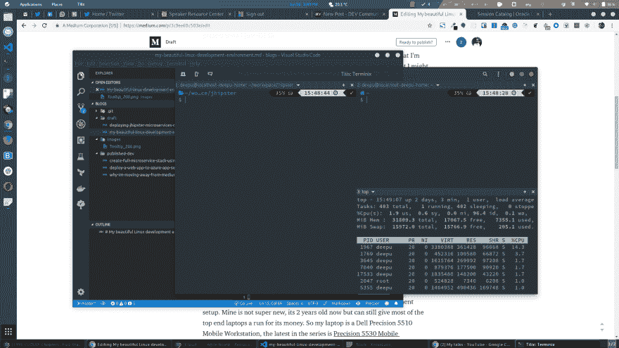

# 我美丽的 Linux 开发环境

> 原文：<https://dev.to/deepu105/my-beautiful-linux-development-environment-2afc>

*最初发布于[deepu . tech](https://deepu.tech/my-beautiful-linux-development-environment/)T3。*

> 这篇文章有一个新版本，我在那里写了我目前的设置。[点击这里查看](https://deepu.tech/my-beautiful-linux-development-environment-2021)。

在一次会议演讲后，我经常被问到的一个问题，奇怪的不是关于我演讲的内容，而是关于我的 Linux 桌面环境。人们更感兴趣的是那个漂亮的发行版，而不是我刚刚做的精彩演示😂

我不是在抱怨，我喜欢我的桌面设置。我太喜欢它了，以至于当我该买一台新电脑的时候，我害怕再买一台。我担心我会把事情搞砸(我过去已经这样做过很多次了，我想 Linux 用户会认同我)

所以我决定为那些有兴趣使用 Linux 作为主要开发操作系统的人捕捉我的发行版中最重要的方面。

这不仅仅是我的工作笔记本电脑；这是我的主要机器，我用它来做下面所有的事情。

*   Java、JS、TS、Go、Python 和 web 开发
*   捷普斯特开发公司
*   在本地运行多个 web 应用程序
*   运行码头集装箱
*   用于 Windows 测试和其他虚拟机的 VirtualBox
*   Kubernetes、Terraform、CloudFormation 开发和部署
*   使用必需的 CLI 工具进行 Azure、AWS 和 GCP 部署
*   大量使用浏览器
*   电子邮件、聊天和视频会议
*   Plex 媒体服务器
*   博客
*   Youtube 和社交媒体

## 机器配置

机器的配置对于任何开发设置也是非常重要的。我的笔记本电脑是一台 Dell Precision 5530 移动工作站。我的旧戴尔 5510 也有完全相同的设置，它与 5530 的配置非常相似。我仍然把它作为备用笔记本电脑，它已经用了两年了，但它仍然可以与当今大多数高端笔记本电脑相媲美。

我使用了戴尔的[定制配置](https://www.dell.com/nl-nl/work/shop/isv-gecertificeerd-en-geoptimaliseerd-workstation/precision-5530/spd/precision-15-5530-laptop/xctop5530emea?selectionState=eyJGUHJpY2UiOjMwODcuNDUsIklVUHJpY2UiOjMwODcuNDUsIk9DIjoieGN0b3A1NTMwZW1lYSIsIlF0eSI6MSwiUHJTdCI6IiIsIk1vZHMiOlt7IklkIjoxNDYsIk9wdHMiOlt7IklkIjoiR0NCV1pVMiJ9XX0seyJJZCI6MTEsIk9wdHMiOlt7IklkIjoiR1JFUEZVMiJ9XX0seyJJZCI6MTQ5LCJPcHRzIjpbeyJJZCI6Ikc1R0FJQzgifV19LHsiSWQiOjYsIk9wdHMiOlt7IklkIjoiRzBTTVk1OSJ9XX0seyJJZCI6MywiT3B0cyI6W3siSWQiOiJHSk1TVDRLIn1dfSx7IklkIjo4LCJPcHRzIjpbeyJJZCI6IkdSMlNHSkgifV19LHsiSWQiOjM3MiwiT3B0cyI6W3siSWQiOiJHM1c1QzZIIn1dfSx7IklkIjoxMDAyLCJPcHRzIjpbeyJJZCI6IkdFODBUOVcifV19LHsiSWQiOjc0OSwiT3B0cyI6W3siSWQiOiJHOEJYV1lJIn1dfSx7IklkIjo1NSwiT3B0cyI6W3siSWQiOiJHSkVWUDNYIn1dfSx7IklkIjoxMTIsIk9wdHMiOlt7IklkIjoiR1c5SUs3RiJ9XX0seyJJZCI6MTAwMywiT3B0cyI6W3siSWQiOiJHNlE1WFo0In1dfSx7IklkIjoyMDAwNzYsIk9wdHMiOlt7IklkIjoiR1cyRVNBNyJ9XX0seyJJZCI6MzAsIk9wdHMiOlt7IklkIjoiODI3ODc1In1dfV19&cartItemId=c4d9c6f5-9956-4c6f-87ac-d0472018ad78)选项，以获得当时可能的最佳设置。它并不便宜，但我的公司 [XebiaLabs](https://xebialabs.com/) 提供了可观的预算，我认为它物有所值。在我看来，这是开发人员最好的笔记本电脑之一。这是我所知道的。

**处理器**:英特尔酷睿 i9-8950HK CPU @ 2.90GHz × 12

**内存** : 32GB，DDR4-2666MHz SDRAM，2 个 DIMMS，非 ECC

**硬盘** : M.2 1TB NVMe PCIe SED class 40 固态硬盘

**显卡** : NVIDIA Quadro P2000 配 4 GB GDDR5 内存&英特尔 UHD 显卡 630 (Coffeelake 3x8 GT2)

**无线**:英特尔 Wifi Link 9260 2x2 802.11AC + BT 4.2 博锐无线网卡

**键盘**:英文 QWERTY US，背光

**显示屏** : 15.6 英寸 FHD 1920x1080 防眩光 LED 背光非触摸 IPS UltraSharp

**电池**:带 ExpressCharge 的 6 芯(97 瓦时)锂离子电池

## 操作系统和桌面环境

最重要的，当然是操作系统。我目前正在以 [GNOME 3.32.2](https://www.gnome.org/) 为桌面运行 [Fedora 30](https://getfedora.org/) ，我对它非常满意。我发现 Fedora 比其他发行版更适合开发机器，因为它发布周期短，而且相当稳定，所以你可以一直得到最新的&稳定软件。

没有好主题的桌面有什么用呢？GNOME 在主题方面很棒，我选择了 [Arc-Flatabulous](https://github.com/andreisergiu98/arc-flatabulous-theme) 主题，并且从未回头。对于图标，我使用[纸](https://github.com/snwh/paper-icon-theme)作为我喜欢的材料图标主题。

当然，如果没有一些漂亮的 GNOME 插件，它是不完整的。以下是我使用的插件。

*   [冲向码头](https://extensions.gnome.org/extension/307/dash-to-dock/)
*   [始终缩放工作区](https://extensions.gnome.org/extension/503/always-zoom-workspaces/)
*   [自动移动窗口](https://extensions.gnome.org/extension/16/auto-move-windows/)
*   [原生窗口放置](https://extensions.gnome.org/extension/18/native-window-placement/)
*   [启动新实例](https://extensions.gnome.org/extension/600/launch-new-instance/)
*   [偷走我的焦点](https://extensions.gnome.org/extension/234/steal-my-focus/)
*   [替代标签](https://extensions.gnome.org/extension/15/alternatetab/)
*   [窗口列表](https://extensions.gnome.org/extension/602/window-list/)
*   [应用菜单](https://extensions.gnome.org/extension/6/applications-menu/)
*   [咖啡因](https://extensions.gnome.org/extension/517/caffeine/)
*   [剪贴板指示器](https://extensions.gnome.org/extension/779/clipboard-indicator/)
*   [密码句](https://extensions.gnome.org/extension/917/gistnotes/)
*   [OpenWeather](https://extensions.gnome.org/extension/750/openweather/)
*   [位置状态指示器](https://extensions.gnome.org/extension/8/places-status-indicator/)
*   [系统监视器](https://extensions.gnome.org/extension/120/system-monitor/)
*   [Todo.txt](https://extensions.gnome.org/extension/570/todotxt/)
*   老鼠加
*   [用户主题](https://extensions.gnome.org/extension/19/user-themes/)

## 开发工具

现在，这些大多是客观的选择，只要你对自己选择的工具感到满意，这些都没关系。以下是我对一些重要发展类别的选择。我没有包括 Vim、Git、NodeJS、Docker、Kubernetes 等显而易见的东西。

壳牌:这对于开发者来说是最重要的。我使用 [ZSH](https://www.zsh.org/) 和令人敬畏的[哦我的 ZSH](https://ohmyz.sh/) 作为我的外壳。现在，如果没有一些漂亮的插件和主题，这将是不完整的。我使用 [powerlevel9k](https://github.com/bhilburn/powerlevel9k) 主题进行一些定制。我还为我的 zsh 使用了[zsh-自动建议](https://github.com/zsh-users/zsh-autosuggestions)、git、docker、docker-compose、autojump、[zsh-语法-高亮显示](https://github.com/zsh-users/zsh-syntax-highlighting)、dnf 和 npm 插件。这是我的 [`.zshrc`](https://gist.github.com/deepu105/9723cb70032eca98ff09d110369af67a) 和所有的定制。**更新**:这个帖子上的一个[评论](https://dev.to/java4africa/comment/c319)建议将 [powerlevel10k](https://github.com/romkatv/powerlevel10k) 作为替代主题，我试了一下，结果它确实比`powerlevel9k`快得多。所以我想我会用`powerlevel10k`作为我的外壳主题。

**终端**:没有好的终端，一个好看的外壳有什么用。幸运的是，我们有 [Tilix](https://gnunn1.github.io/tilix-web/) ，最好的终端应用之一。它有工作区、标签、分割窗口、地震模式等等。

**集成开发环境**:[IntelliJ IDEA Ultimate](https://www.jetbrains.com/idea/)——我用这个进行 Java &其他 JVM 语言的开发

**代码编辑器** : [Visual Studio 代码](https://code.visualstudio.com/)——我的得力助手。我喜欢它。我用 VSCode 做 web 开发，Go，Python，JS 开发，DevOps，还有 JVM 语言以外的一切。没有一些好的插件，VSCode 的设置是不完整的。[这里的](https://gist.github.com/deepu105/4599d3b381218b9d1a63119fbf9ca537)是我正在使用的插件。您可以运行脚本来安装它们。

我使用的其他值得注意的开发工具有用于 Git 回购管理的 [GitKraken](https://www.gitkraken.com/) 、用于代码比较的 [Beyond Compare](https://www.scootersoftware.com) 、用于 NodeJS 版本管理的 [VirtualBox](https://www.virtualbox.org/) 、 [NVM](https://github.com/nvm-sh/nvm) 以及用于 JDK 版本管理的 [SDKMan](https://sdkman.io) 。

## 生产力工具

生产力工具也相当重要，以下是我的选择。

浏览器:谷歌浏览器是我的主要浏览器。我有时也用火狐& Opera。就 UX 而言，我确实喜欢 Opera，我想把它作为我的主要浏览器，但我想念我在 Chrome 中与谷歌账户同步的一切。

电子邮件:我用 T2 的 Mailspring 作为我的电子邮件客户端。这是一个相当不错的邮件客户端，有很好的主题和简单的用户界面。

办公套件:我通常使用谷歌文档(Google Docs)&和微软在线办公软件，但当我需要在桌面上处理一些东西时，我会使用 [LibreOffice](https://www.libreoffice.org/) ，这是一个很好的办公套件，甚至可以处理微软 Office & Keynote 格式。

**通讯**:当然我用 [Slack](https://slack.com) ，视频会议我用[蓝战士](https://www.bluejeans.com/)。

**截屏**:我用这个叫做 [Peek](https://github.com/phw/peek) 的漂亮工具进行截屏，用[快门](https://launchpad.net/shutter)进行截屏。

## 结论

我还使用了许多其他小巧的实用工具；大多数是命令行实用程序。有一些值得注意的提及，如 [Timeshift](https://github.com/teejee2008/timeshift) ，这是很好的备份你的机器。

当然，在 Linux 世界中，并不是一切都是完美的，但对于每个操作系统来说都是一样的。在切换到 Linux 之前，我是一个长期的 Windows 用户。所以像每个 Linux 用户一样，我时不时会把事情搞砸(能力越大，责任越大，Peter)。Linux 世界有很多怪癖，但是没有什么让我很困扰的。下面是我过去遇到的一些最烦人的问题，现在，我没有任何明显的问题。

*   切换应用程序时滚动位置跳跃-升级到 Fedora 30 后修复
*   休眠被打破-升级到 Fedora 30 后修复
*   插入耳机时音频输出选择被破坏-为我修复了 Fedora 28 之后的问题

液体错误:内部

我希望你觉得这是有用的。如果你有任何问题，或者如果你认为我错过了什么，请添加评论。

如果你喜欢这篇文章，请留下赞或评论。

你可以在 [Twitter](https://twitter.com/deepu105) 和 [LinkedIn](https://www.linkedin.com/in/deepu05/) 上关注我。