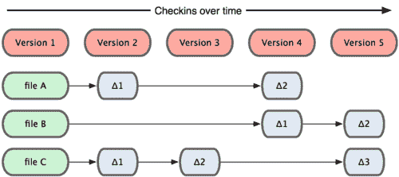

# 我的旅程:从单个开发人员到团队生产力工具

> 原文：<https://dev.to/codestream/my-journey-from-single-developer-to-team-productivity-tools-4pma>

如果您是或者曾经是 Atom 编辑器的粉丝，您可能会遇到 git-plus，这是从他们的市场上下载最多的扩展之一。我在 5 年前创建了这个扩展，它已经被下载了 250 万次。我现在从事团队生产力工具的工作，但是我的第一个热情是让 git 对个人开发者更容易访问和有用。

对于任何不熟悉 git 的人(我假设这意味着几乎没有开发人员)，git 是一个分布式版本控制系统，用于在软件开发过程中跟踪源代码的变化。它是为跟踪文件集的变化而设计的，这使得它非常适合程序员之间的协调工作。其目标包括速度、数据完整性和对分布式非线性工作流的支持。

# git 擅长什么

### 撤销错误

我们都会犯错。其中一些成本高昂，另一些则微不足道。Git 为从错误中恢复提供了很多支持。提交可以撤消、删除、重新排序，甚至合并在一起。

### 维护历史

Git 可以存储大量关于存储库的元数据。例如，自 2005 年 4 月以来，GitHub 上的官方 linux repo 有近 850，000 次提交，这也是 git 最初发布和从 linux 团队以前的源代码控制系统创建存储库的同一个月。如果您需要了解变更是如何发生的以及为什么会发生，那么能够引用存储库的历史是非常重要的(尽管“为什么”很大程度上取决于提交消息的数量和质量)。

### 实验

Git 有分支的概念，这是与大多数其他版本控制系统的一大区别。分支允许我们在不影响“主”分支或代码的可发布版本的情况下尝试不同的方法，这非常有用，因为它支持并发开发。

# 什么是 git 不擅长的

### 用户体验

用户体验并不总是直观的，因为有些任务可以通过不同的命令组合以不同的方式完成。因为 git 是作为命令行实用程序创建的，所以它是主要的接口，那些不住在终端中的人必须中断他们的工作流，以便上下文切换到终端并执行 git 任务。因为这种上下文切换代价很高，而且很麻烦，所以许多编辑器都有插件或内置特性，至少可以执行简单的 git。正是这种糟糕的用户体验部分激发了 git-plus 的诞生。虽然我最初创建 git-plus 是为了好玩，但它很快就对其他人有用了。在最初发布的同一天，我在我的 GitHub repo 中发现了一些小的安装问题，人们会表达他们对使用它的兴奋和渴望。在接下来的几周里，当其他用户要求新的特性时，我添加了它们，主要是因为我认为我也满足了自己的需求。然后我意识到我已经构建了一些真正能引起其他开发者共鸣的东西。

这个包裹在受欢迎程度排行榜上迅速上升，我收到了人们的电子邮件，分享他们的感激之情，甚至给我钱！知道自己创造了一些有价值的东西，我感到非常高兴和满意。随着 git-plus 越来越流行，第三方开发了免费和付费的视频教程。今天，git-plus 已经有了一个健康的用户群，来自 63 个其他人的贡献，并且激发了其他针对 Atom 编辑器的 git 和生产力包。有人甚至发现这个项目非常有趣，以至于创建了一个非常整洁的[视频](https://www.youtube.com/watch?v=ZTSWFItBgj8)来可视化 1.5 年期间的源代码提交信息。相当酷！

当 VS 代码第一次发布时，有许多为它创建 git-plus 的请求。当时我还不是 VS 代码的用户，所以我没有接受 than。尽管如此，我还是愿意支持任何想发起这个项目的人。我现在是 VS Code 的兼职用户，我现在和 GitLens 的创造者 Eric Amodio 一起在 CodeStream 工作，我们分享关于我们插件的故事。

我有过奇妙体验的一个插件是[vim-逃犯](https://github.com/tpope/vim-fugitive)，当我第一次在 alpha 阶段收到使用 Atom 编辑器的邀请时，我感到震惊的是，还没有一种内置的方法来执行甚至是最基本和最常见的 git 操作，如暂存和提交文件。所以我决定构建一个( [git-plus](https://github.com/akonwi/git-plus) )作为一个有趣的项目。我希望通用 git 操作的用户友好的抽象。Git-plus 有像`Add all and commit`这样的命令，它将存放所有修改过的文件并启动提交，它还有另一个版本，一旦提交完成，它也将立即推送更改。我们经常一天执行多次的这些多步骤任务中的许多已经变成了可以绑定到一次按键的简单命令。除了这些命令之外，还有检查 git 历史的方法。Git-plus 可以显示整个 repo 或特定文件的提交日志，显示提交的细节，并显示分支(本地和远程)之间的差异。

能够通过几次点击或击键来创建、访问和使用 git 信息通常可以节省时间。只要任务完成了，对于普通用户的生产力来说，数据是如何创建或访问的肮脏细节通常并不重要。我和不喜欢 git-plus 这样的工具的开发人员交流过，因为他们说这些工具不会教人 git。对于这样的评论，我的回答是“它们不应该这样做”，这正是这些工具如此有用的原因。它们不会让我们陷入 git 如何工作的血淋淋的细节中，它们使我们能够做我们需要做的事情并继续前进。也就是说，这些细节可能很有趣，在创建这个包的过程中，我不得不学习更多关于 git 的知识，我很喜欢并推荐任何 git 用户这样做。我在构建 git-plus 中所学到的东西，帮助我形成了对未来生产力的看法。开发团队的生产力是下一个前沿
开发人员的生产力很重要，不仅对我个人来说，因为我为减少开发优雅软件所需的工作量而自豪，对数百万开发人员和他们帮助建立的企业来说也是如此。事实上，每个写软件的人都使用某种版本控制系统，git 现在是最常见的。使用 git 可能很棒，如果得到适当的补充，可以提高生产率。

### 广泛分享知识

当我努力提高开发人员的生产力时，我在不同的环境中开发了各种与开发工作流相关的工具。我意识到，提高生产率的下一步将不是关注单个开发人员，而是团队动力和知识共享。帮助开发团队变得更加高效是我现在的全职工作。

今天，我正在帮助构建 CodeStream，这是另一个插件(支持多 IDE ),它利用 git 和其他技术来实现关于编辑器中代码的实时讨论。目标是通过简化关于代码的交流，允许开发人员缩短问题和答案、问题和解决之间的时间。我们正在帮助他们将通常发生在 Slack、微软团队、电子邮件或 GitHub 中的代码对话转移到更容易、更自然、最终最有用的地方:就在代码本身旁边。

因为这些对话与代码一起存在，所以我们可以使用 git 元数据将对话链接到特定的文件、代码块和 repos，这样开发人员就不会再次切换上下文来讨论他们的代码库或收集有关它的信息。使用 CodeStream，查找关于代码历史的信息变得没有必要，因为它在您的缓冲区中突出显示了正在讨论的特定代码。通过这种方式，我们可以将今天的外部对话转化为符合人体工程学的、可访问的文档。

# 总结

希望我提到的这些工具继续对开发人员有用，甚至可能启发更多的方法来更好地改善开发人员的体验和生产力。我的 git-plus 之旅既有趣又有用，它教会了我许多关于软件开发需求、过程和流程的知识。我希望对我目前的项目产生同样大的影响。走向团队开发被证明是有趣和具有挑战性的。我很乐意与任何认为这项工作重要且有影响力的人联系并讨论这个问题。