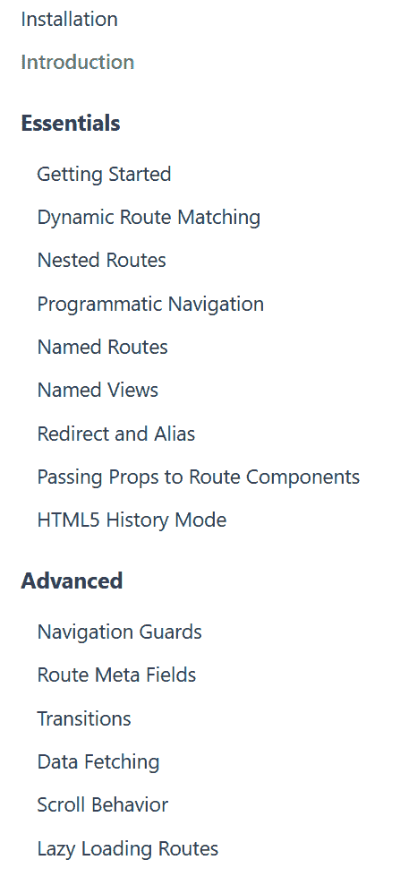
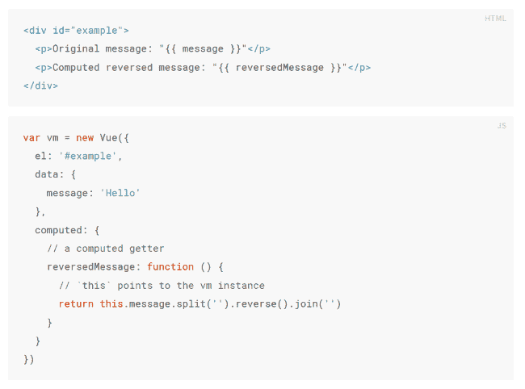
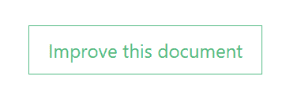

# 我对文档的思考

> 原文：<https://dev.to/raymondcamden/my-thoughts-on-documentation-581b>

我对技术文档非常固执己见。虽然我的学位是英语，但我在大学的重点是技术写作。我已经写了六千多篇博文，写了大约十五本书。我并不是在吹嘘我的能力(相信我，我总是可以利用编辑的技能)，而是提供一些背景，说明为什么当我测试一个很酷的新实用程序或 API 时，我会根据文档的水平以及对它的关注程度(或关注程度)来判断它。

考虑到这一点，我想我应该分享一些关于以开发人员为中心的文档的意见和建议。我不想假装什么都知道，我非常鼓励你在下面分享你的观点。

## 文档是必需的功能

我觉得这样做很愚蠢，但是经验告诉我，开发人员通常会很好地发布代码，并简单地跳过文档。您(或您的公司)必须形成这样一种思维模式，即在文档编写完成之前，特性是不完整的。你不会(希望)在没有安全审查的情况下发货。或者测试。但是由于某些原因，文档经常被认为是事后才想到的，或者仅仅是可以在最后一分钟完成的事情。

为了解决这个问题，让文档成为流程的一部分。像审查代码一样审查它。更好的是，让没有参与该特性的人来审阅它。当开发人员编写文档时，他们很容易对读者知道的内容做出假设。你太接近代码了，以至于不能理解一个新的开发人员可能会是什么样子。

## 权衡你所包含的内容(和时间)

在我最近的一份工作中，我在检查文档时做的一件事就是发现许多要删除的东西。该产品的文档从一开始就包含了该产品的历史和理论。这都是…事实信息，但也完全没有必要，而且分散了实际学习如何使用产品的注意力。

当我刚开始学习一个产品时，我的目标是关注它的基本工作原理以及我能用它做什么。我不需要一下子知道所有的事情。给我一些基本的东西，带我完成一些简单的东西，给我一个早期的成功来激励我。介绍完之后，是时候深入了。

所以从理论上讲，这是我喜欢在文档中看到的:

*   一个介绍，轻量级，快速阅读。
*   安装，向我介绍如何安装产品并准备使用。完全可以*关注最简单的路径，稍后介绍其他方法。*
*   开始，一个快速演示，我可以看到事情在行动，正如我所说的，兴奋/激励做更多
*   其他一切

好了，最后一点有点宽泛，但一般来说，安装和开始后的主题是我可能不需要立即阅读或甚至按顺序阅读的内容。

考虑一下 [Vue 路由器文档](https://router.vuejs.org/):

[](https://res.cloudinary.com/practicaldev/image/fetch/s--SBg41OAi--/c_limit%2Cf_auto%2Cfl_progressive%2Cq_auto%2Cw_880/https://static.raymondcamden.cimg/2019/08/doc1.png)

我在学习路由器的时候，重点放在前三个要点上，实际上在“动态路由导航”之后就停止了。这确实让我到了我需要的地方，并且从那以后涵盖了我的大部分使用。我最近需要学习关于警卫的知识，所以我直接跳到了文档部分。

当然，我应该从头到尾读完所有的东西，但是说实话，开发人员不会这样做。

通过关注“让我带你开始并自己运行”的方法，这些文档对我来说变得非常有用。正如我所说的，我可以在需要时回来讨论具体的议题。

## 代码样本

这个有点难定义。是的，开发者文档应该有代码样本。但是在使用它们的时候有很多要考虑的。

首先，示例中包含了多少代码？例如，如果我想在 Vue 中演示一个[计算属性](https://vuejs.org/v2/guide/computed.html)，我会在文档中看到如下内容:

[](https://res.cloudinary.com/practicaldev/image/fetch/s--Fd9Q26uK--/c_limit%2Cf_auto%2Cfl_progressive%2Cq_auto%2Cw_880/https://static.raymondcamden.cimg/2019/08/doc2.png)

演示使用和 JavaScript 需要 HTML。但是那里的*不是*是什么？在 HTML 中，我们不包括`<html>`或`<body>`标签。我们不包括用于加载 Vue 或代码的脚本标签。

在 JavaScript 中，我们有一个最简单的 Vue.js 应用程序来使它工作。JavaScript 本来可以更短，也许只是显示这个:

```
computed: {
    // a computed getter
    reverseMessage: function () {
        // stuff
    }
} 
```

Enter fullscreen mode Exit fullscreen mode

然而，通过在一个更大的应用范围内展示它，读者可以在一个可能更清晰的上下文中看到它。

这里的作者处理得很好。你有足够的上下文让代码学习特性，并且最小的“噪音”会分散你的注意力。

不幸的是，这里没有神奇的方法来做到这一点。一般来说，你希望你的代码清单保持“简短”,但是这意味着什么将取决于你想展示什么，甚至语言本身。

还有一个问题——读者应该能够复制和粘贴代码吗？在 Vue 的例子中…他们实际上做不到。如果你将两者复制并粘贴到一个 HTML 文件中，JavaScript 就不起作用了。它缺少 JavaScript 代码周围的`<script>`标签和加载 Vue 的`<script>`标签。我不认为这是一个失败，正如我所说的，我认为这里的 Vue 文档很棒，但这里有一个有意识的决定，假设读者会知道什么。

如果你去 Vue 文档的[开头](https://vuejs.org/v2/guide/index.html)，他们[链接](https://gist.githubusercontent.com/chrisvfritz/7f8d7d63000b48493c336e48b3db3e52/raw/ed60c4e5d5c6fec48b0921edaed0cb60be30e87c/index.html)到一个要点，显示一个完整的 HTML 页面，所有的位都在里面。我可能已经把它放在页面上了，这样读者就能一次看到所有内容的一个例子。

关于代码示例的更多信息:

*   不要使用屏幕截图。即使我不能复制粘贴来运行代码，我可能还是想复制代码。
*   使用一个好的代码格式化程序。我最喜欢的是[棱镜](https://prismjs.com/)。

## 动画 gif 是用于社交媒体的，而不是文档

看到这张可爱的猫的动画 Gif 了吗？

[](https://res.cloudinary.com/practicaldev/image/fetch/s--WiUSFUOM--/c_limit%2Cf_auto%2Cfl_progressive%2Cq_66%2Cw_880/https://static.raymondcamden.cimg/2019/08/tenor.gif)

是啊，那很好。巨大的尺寸和所有，但谁在乎性能，对不对？现在想象这个动画展示了你的 API 是如何工作的。读者来到这里，向下滚动，中途接住 gif。至少他们是这么认为的。这不是视频，所以你看不到他们有多远。哦，他们也不能暂停。所以他们想专注于动画 gif，希望它非常清晰，因为，记住，你不能暂停或倒带或任何东西。

上周，我偶然发现了一个网站，不骗你，它有一个一分钟长的动画 gif，展示了一个十步的过程，这是我尝试过的最分散注意力、最难跟随的流程。

[](https://res.cloudinary.com/practicaldev/image/fetch/s--pt0MuV4j--/c_limit%2Cf_auto%2Cfl_progressive%2Cq_auto%2Cw_880/https://static.raymondcamden.cimg/2019/08/justdont.jpg)

## 保存(大部分)笑话

说到可爱的图片，包括上图，虽然我喜欢在我的博客帖子和演示中使用“轻松有趣的语气”,但我实际上认为 docs 应该更严肃一点。这并不是说它们应该是无聊的，或者你不能有一个幽默的例子，但我肯定会为了文档而把事情变得低调。我也避免类似上面两张的图片。这对于演示来说很好，但是在你的文档中尽量避免使用它。

## 不需要登录

就是这样。说真的。我知道网站需要用户注册。这是一个重要的用户指标。但是如果你要求我在看到文档之前注册你的应用程序/服务，如果我可以选择的话，我会去别的地方，我通常会这样做。

建议登录是好的，如果你的代码样本能够动态更新以反映你的个人信息，比如 API 密匙之类的，那就更好了。

## 我来帮忙！

我的最后一个建议是提供一种对文档进行反馈的方式。我无法告诉你我遇到了多少次错别字或其他错误。如果我看到一个快速的方法给你发邮件，我会的。如果你的文档使用 GitHub，那就更好了。GitHub 有一个*非常简单的 UI 工作流程，带你完成创建分叉、编写文档变更和提交 PR。我的意思是，它真的可以让这个过程变得简单。即使你的公司在 GitHub 上什么也不做，我也强烈建议你把它用在你的文档上，根据你如何托管你的文档，你甚至可以设置它，一旦一个文件被编辑，或者一个修复程序被接受，它就会自动发布。*

[NativeScript-Vue](https://nativescript-vue.org) 文档有一个这样的例子。在每页的底部，您会看到:

[](https://res.cloudinary.com/practicaldev/image/fetch/s--KxCLTKGx--/c_limit%2Cf_auto%2Cfl_progressive%2Cq_auto%2Cw_880/https://static.raymondcamden.cimg/2019/08/doc3.png)

该按钮会将您直接带到该文档的 GitHub 存储库页面。在那里，用户可以编辑文档以提交快速修复。

## 聘请编辑

我很幸运在过去和编辑们一起在我的博客上工作，当然还有我的文章和书籍项目。一个编辑器可以帮助你找到你确定已经检查过但不知何故漏掉的东西。显然，这并不总是一个选项，尤其是对于开源项目。但是如果你能请得起专业编辑，那么 T2 绝对物有所值。

## 还有什么？

在结束这篇文章之前，我想指出*优秀的*资源，[写文档](https://www.writethedocs.org/)。Write the Docs 是一个网站、社区、会议集等等，你猜对了，它致力于编写文档。这是一个很好的开始和认识其他从事技术文档工作的人的地方。

好吧，伙计们，那么你还有什么别的建议吗？什么网站有特别好的文档？你曾经因为糟糕的文档而停止使用一个产品吗？下面分享一下你的经历吧！

另外，说到编辑，我要感谢布莱恩·里纳尔迪在我发表之前编辑了这篇文章！

*由[帕特里克·托马索](https://unsplash.com/@impatrickt?utm_source=unsplash&utm_medium=referral&utm_content=creditCopyText)在 Unsplash 上拍摄的标题照片*