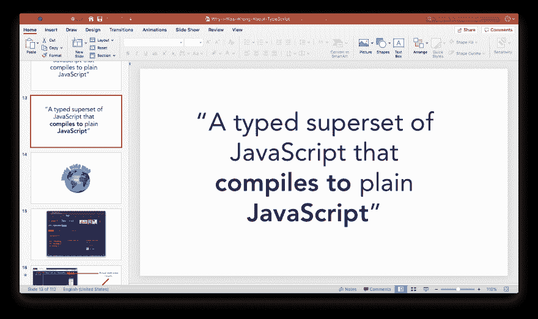
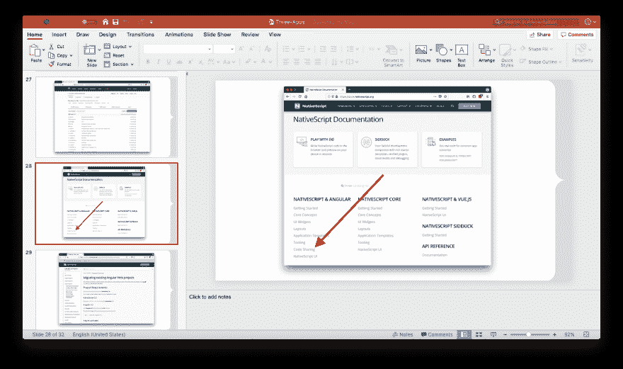
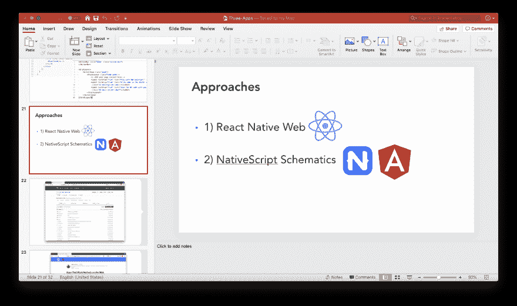
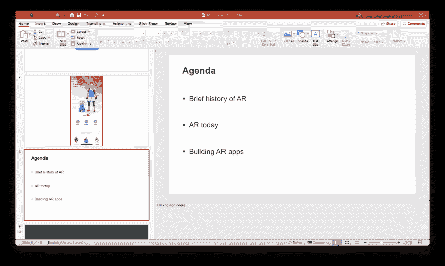
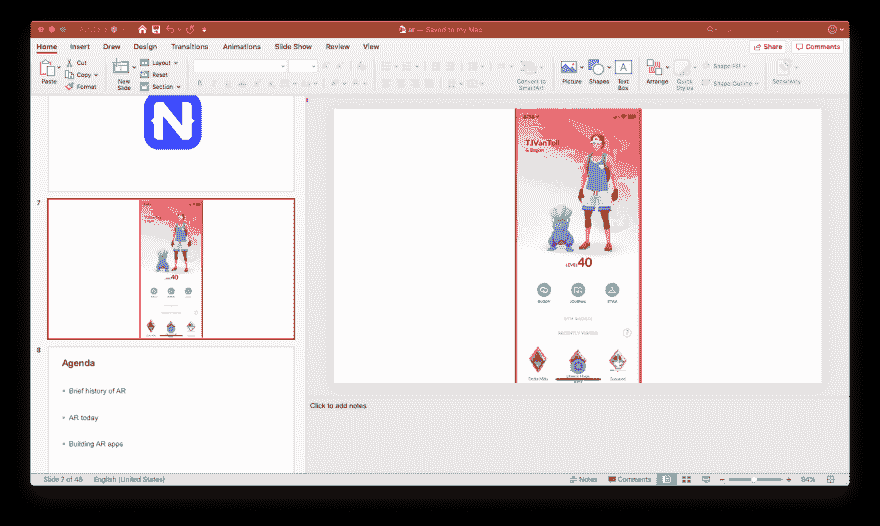
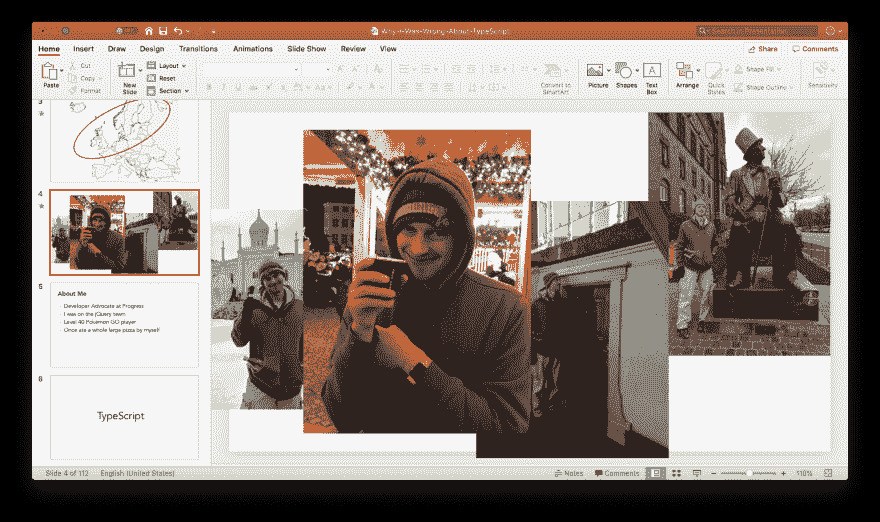
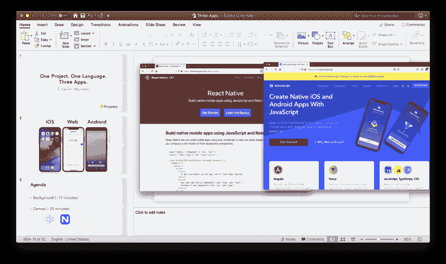

# 我的 5 大科技演讲技巧

> 原文：<https://dev.to/progress/my-top-5-tech-speaking-tips-4dej>

这篇文章是我从在世界各地的会议上做的几十次技术演讲中学到的一套折衷的演讲技巧。我希望这些建议能帮助新演讲者准备他们的第一次演讲，并给有经验的演讲者一些潜在的改进意见。

不过有一点我要注意:这些是我为自己找到的方法，并不意味着它们一定对你有用。每个演讲者都需要找到自己的风格和工作流程，所以试着从这些提示中获取灵感，不要把它们解释为硬性规定。

有了免责声明，我们来看看技巧！

*   [提示 1:不要担心幻灯片设计](#tip-1)
*   技巧 2:写一个提纲
*   [提示#3:在幻灯片制作过程中，让你的介绍幻灯片在最后](#tip-3)
*   [技巧 4:让观众做事情](#tip-4)
*   [技巧 5:多说](#tip-5)

## 提示 1:不要担心幻灯片设计

我从来不关心幻灯片设计，你可能也不应该关心。

我提供这一点作为提示，因为我发现新的演讲者花了很多时间试图为他们的幻灯片找到一个好的配色方案或字体。或者对是否使用 PowerPoint、Keynote 或其他基于网络的工具感到困惑。

你不会希望这种事情妨碍你的。从你喜欢的工具开始(对我来说是 PowerPoint，因为它很简单)，选择空白幻灯片模板，然后开始。

给你一个概念，我通常使用三种类型的幻灯片。

### 设计 1:纯文本

我经常使用简单的幻灯片，上面只有文字。对于颜色，为了可读性，我使用白底黑字，我使用 Avenir 字体——但只是因为那是我几年前开始使用的幻灯片上的字体。不过对我来说看起来不错。

### 设计#2:截图

对于我的很多幻灯片，我只是截取一些东西的截图，然后把它放在幻灯片上。它工作了。

### 设计三:项目符号

当我需要展示一个列表时，我会使用带项目符号的幻灯片，我只是使用默认的 PowerPoint 设计。

我偶尔会把事情搞混，但这是我制作的 95%的幻灯片都采用的方法。在大多数情况下，这也是你所需要的。

除非你是一个真正的设计师，想花时间创造一些真正独特的东西，否则我会鼓励你只选择你选择的工具中的空白幻灯片，称之为足够好。

我的第二个技巧是关于下一步做什么。

## 秘诀 2:列一个提纲

我为我的每一次演讲做一个提纲。大纲非常简单，只包括三件事:演讲的主要受众，3-4 个有助于支持这一点的主题，以及可操作的下一步。

写出来后，这个结构看起来像这样。

*   陈述要点，也就是我希望听众从演讲中得到什么。
*   话题#1
*   话题 2
*   话题#3
*   如有必要，话题#4
*   再次重申要点
*   给出可操作的下一步

例如，下面是我对一个 [*的概述，增强现实是未来吗？*谈](https://www.tjvantoll.com/speaking/slides/AR/Montreal/ar.pdf)我最近在蒙特利尔给。

*   要点:AR(增强现实)很酷，但对于普通开发者来说仍然很难。
*   主题# 1:AR 的历史
*   话题 2:今天的 AR
*   主题#3:构建增强现实应用
*   重申要点
*   提供我开始构建 AR 应用程序的首选位置。

一旦我有了这个大纲，我就开始把它直接放入我的幻灯片中。具体来说，我创建了一个名为“议程”的幻灯片，看起来像这样。

这种创建大纲的行为有助于你在头脑中组织演讲，将大纲放入幻灯片有助于你直观地看到你为每个主题创建内容的进度。听众也喜欢结构，因为这有助于他们知道你的演讲会带来什么，从而让他们更容易理解。

为了让观众更容易理解，当我在不同主题之间转换时，我总是在我的幻灯片中包含相同的议程幻灯片。例如，在我完成“AR 简史”主题后，我会播放下面的幻灯片。

这些幻灯片为我总结上一个主题并进入下一个主题提供了一个合理的位置。

接下来，我制作了一张幻灯片，在演讲的开头和结尾总结了我演讲的要点。这是我 AR 演讲的幻灯片。

当我在演讲开始时展示这张幻灯片时，我会说这样的话，*“这是我今天打算向你们证明/展示的东西”*，在结束时，我会重申这些观点，通常会谈到我所展示的主题是如何支持这些观点的。

一旦你有了这个基本的大纲，你就可以开始写你的介绍和主要内容了。

## 技巧 3:在创建幻灯片的过程中，把你的介绍幻灯片放在最后

在制作幻灯片时，大多数人都从介绍开始，因为这是你实际展示的第一件东西。问题是，即使对有经验的演讲者来说，创建引人注目的介绍也很难。

正因为如此，我们很容易浪费大量的时间去寻找完美的方式来介绍你的话题，而实际上这并不重要。

你的介绍可以简单到陈述以下几点，尤其是当你刚刚开始的时候。

*   我是 *<你的名字>* 。
*   状态主题
*   州观众外卖
*   显示议程
*   开始说话题 1。

把介绍留到最后，你会更好地知道你可能想说些什么来开始你的谈话。您也可以放心，您的大部分工作已经完成。

话虽如此，我并不是说介绍不值得花时间，因为做得好的话，可以吸引听众，让他们加入你的谈话。我会把它们留到最后。

当你创建一个介绍时，你需要尝试一下，找到适合你的。我的开场白是讲述一个与我的主题或我演讲的地方相关的故事。例如，为了开始我的 AR 演讲，我讲述了一个关于我对 Pokémon GO 的热爱的故事，以及这是如何让我对 AR 感兴趣的。

去年，我很幸运地在丹麦做了一次演讲，为了好玩，我用一张我在这个地区的照片作为开场白。

如果你有一个要讲的故事的想法，我会鼓励你把它拿出来，用它来运行。自信地讲述故事，并从中获得乐趣。

但是如果你没有主意，也不用担心。把介绍留到最后，如果你想不出任何东西，坚持基本的，马上进入你的谈话内容。

当你交付大部分内容时，我也有一个提示。

## 技巧 4:让观众做一些事情

在一个随机的技术讲座进行到一半的时候走进一个房间，你可能会看到至少一半的与会者在看他们的手机或笔记本电脑。

问题是，很难让人们的注意力集中在任何事情上，科技话题也不是世界上最吸引人的话题。作为一名演讲者，你可以做一些事情来吸引听众的注意力。

你能做的最简单的事情就是在你演讲的特定时刻对你的听众进行民意调查。我经常在引入一个新话题之前这样做。例如，在我最近做的一个名为 *One Project 的演讲中。一种语言。三个应用。*我用下面的幻灯片介绍了两个框架，NativeScript 和 React Native。

在我介绍每一个框架之前，我会问观众，*“这里有多少人熟悉 React Native”*，然后，*“这里有多少人熟悉 Native script”*。

这些简单的问题完成了两件事。首先，它迫使听众抬起头来参与谈话，哪怕只有一分钟。第二，它帮助我了解房间的情况。如果我看到 5%的人举手，我知道我需要做一个全面的介绍，而如果每个人都举手，我知道一个简短的解释就足够了。

对观众进行投票是吸引观众的最简单的方法，但是有许多更有创造性的方法可以达到同样的目的。

例如，我的另一半做了关于 CSS 的演讲，她做的一件有趣的事情是在她的幻灯片中加入小测验，如下图所示。

这又解决了多个目标。首先，它迫使观众不仅要注意，而且要真正尝试理解内容以获得正确的答案。(对了是 600px。)

第二，它让演示者清楚地知道观众是否在跟着内容走。如果你看到很多人举手，并且有很多正确的答案，你知道人们正在理解你的材料。

有专业的工具可以让这种观众提问变得更有吸引力。例如服务 [Kahoot！](https://kahoot.com/)便于配置测验，观众可以在笔记本电脑和智能手机上轻松完成。

总的来说，具体的工具或方法并不重要。重要的是找到一些方法，通过吸引观众来打破技术演讲固有的单调。

## 秘诀 5:多说

短语*熟能生巧*比任何其他生活技能更适用于公众演讲。在镜子前再多的练习也不会让你准备好面对现场观众演讲的经历，唯一的最佳改进方法就是继续做下去——反复演讲。

这并不意味着你必须不断地在世界各地的会议上发表演讲。偶尔在当地的用户群中做一次演讲，或者为几个同事做一次演讲，会帮助你学会如何面对观众，有效地传递你的材料。

随着你对演讲越来越熟悉，你会想努力提高你演讲的质量。为此，我有两条建议。

### 在视频上观看自己

大多数人会选择择期手术，而不是看自己展示的视频——包括我自己。但是这是非常重要的，因为你会从你的演讲中学到一些你只能从第三人称视角看到的东西。

就我个人而言，我一开始是一个重度用户，直到我在视频上看到自己，我才意识到这一点。后来，我养成了用手的习惯...很多。很尴尬。但了解这些倾向有助于我有意识地思考避免这些习惯，并最终帮助我在未来不再重复这些习惯。

这很重要。找个朋友给你录音，看视频。你会讨厌它，但它是值得的。保证。

### 找一个信得过的朋友进行反馈

除了观察自己的发言，从别人那里获得反馈也是很好的。然而，这里你必须非常小心，原因有二。

**原因#1** : **有些人很可怕**，会因为一些愚蠢的原因对你的谈话留下负面反馈，比如不喜欢你正在使用的框架(说真的)。

即使你知道反馈是不合理的，人类的大脑有一种不幸的倾向，那就是专注于消极的方面，即使你得到了积极的反馈。

而且我可以从很多个人经历来说这个。还记得我之前提到的在丹麦的演讲吗？这是我做过的最受欢迎的演讲。我在会议上有随机的人称赞我；它出现在各种积极的推文中，并在流行的时事通讯中被多次提及。

这很棒，直到我犯了一个经典的错误，那就是[阅读了 YouTube 视频](https://www.youtube.com/watch?v=AQOEZVG2WY0)上的负面评论，老实说，这毁了我在准备和发表演讲时的许多正面体验。

总的来说，在广泛征求反馈的时候要小心，因为人类的大脑有一种完全无用的倾向，那就是过多地关注负面的东西。

**原因#2** : **大多数人不会诚实**。如果你向一群朋友或同事发表演讲并寻求反馈，绝大多数人会像*这样回答:“很好。”*或*“我喜欢。”*。

虽然这是支持性的，但获得关于如何改进的诚实反馈也是很好的。为此，你需要在你的生活中找到一个直言不讳的人，他不怕告诉你事情的真相，并且会指出你可以改进的地方。

问朋友和随便问人的最大区别是朋友可以提供你需要做的事情的背景和细节。*“那个演讲糟透了”*和*之间有很大的区别，“我在演讲的中间部分很难跟上。我认为你可以更好地解释这些概念，或者用更多的例子来证明你的观点。”*

你也可以向你的朋友提问，比如“你理解第一个题目了吗？”，或者*“我是不是用手太多了？”*。

如果你在生活中找不到那个直言不讳的人，试着对自己直言不讳。我发现，如果你催促那些给出一般*“很好”*反馈的人，他们会有更多的话要说。

## 最后提示:照做就是了！

好了，现在就这样。我有很多话要说，因为在我过去 6-7 年的生活中，演讲对我来说非常重要，它打开了我否则不会拥有的大量机会。

希望这些提示对你有所帮助。如果是这样，请让我知道，因为我可以很容易地拿出 5 个以上😉

> 提示:如果你想亲自看我演讲，我会在 10 月的保加利亚索非亚[dev reach](https://www.telerik.com/devreach)和 11 月的波斯顿[jsmobilecoff](https://jsmobileconf.com/)参加。两者都是大事。