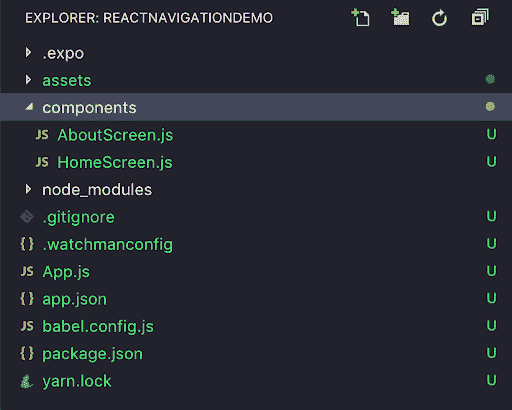
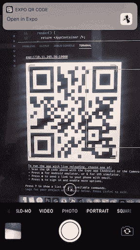
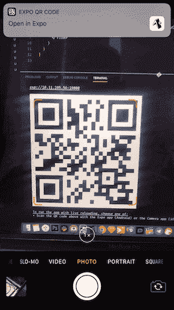
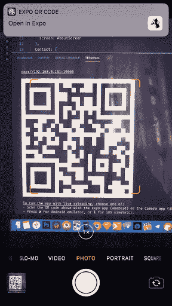
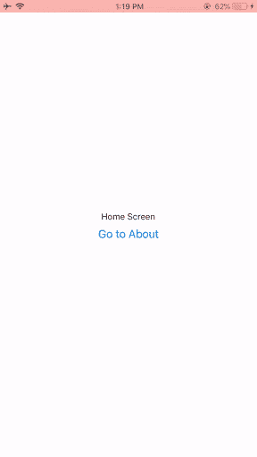

# 使用 React 导航导航 React 本机应用程序

> 原文：<https://dev.to/bnevilleoneill/navigating-react-native-apps-using-react-navigation-28jm>

[](https://res.cloudinary.com/practicaldev/image/fetch/s--6qLKzsT2--/c_limit%2Cf_auto%2Cfl_progressive%2Cq_auto%2Cw_880/https://thepracticaldev.s3.amazonaws.com/i/izf4rtu06jh1t3rtnmg8.png)

## 简介

移动应用程序由多个屏幕组成。当构建移动应用程序时，主要关注的是我们如何处理用户在应用程序中的导航——屏幕的呈现和它们之间的转换。React Navigation 是一个独立的库，允许开发人员轻松实现该功能。

## React 导航与 React 原生导航

在现有的几个导航库中，React Navigation 和 React Native Navigation 是比较著名的两个。

React 导航用 JavaScript 编写，不直接使用 iOS 和 Android 上的原生导航 APIs 相反，它重新创建了这些 API 的子集。这允许集成第三方 JS 插件，最大化定制，更容易调试，不需要学习 Objective-C，Swift，Java，Kotlin 等。

React 原生导航略有不同，它直接使用 iOS 和 Android 上的原生导航 API，这允许更原生的外观和感觉。

要更详细地探究他们的差异，请查看这篇博客文章。

## 安装

假设你已经安装了 [Yarn](https://yarnpkg.com/en/) ，第一步就是设置一个 React 原生 app。开始使用 React Native 最简单的方法是使用 Expo 工具，因为它们允许您在不安装和配置 Xcode 或 Android Studio 的情况下启动项目。通过运行以下命令安装 Expo:

```
npm install -g expo-cli 
```

Enter fullscreen mode Exit fullscreen mode

如果你在 Mac 上遇到任何错误，试着这样运行:

```
sudo npm install --unsafe-perm -g expo-cli 
```

Enter fullscreen mode Exit fullscreen mode

然后运行下面的代码来创建一个新的 React 本地项目:

```
expo init ReactNavigationDemo 
```

Enter fullscreen mode Exit fullscreen mode

这将启动一些下载，并要求您输入一些配置变量。选择`expo-template-blank`，选择`yarn`进行依赖安装，如下图:

[](https://res.cloudinary.com/practicaldev/image/fetch/s--d_HaDzGA--/c_limit%2Cf_auto%2Cfl_progressive%2Cq_auto%2Cw_880/https://i0.wp.com/blog.logrocket.com/wp-content/uploads/2019/06/creating-react-native-project.png%3Fresize%3D2066%252C404%26ssl%3D1)

[](https://res.cloudinary.com/practicaldev/image/fetch/s--sQT-ANSJ--/c_limit%2Cf_auto%2Cfl_progressive%2Cq_auto%2Cw_880/https://i2.wp.com/blog.logrocket.com/wp-content/uploads/2019/06/initial-configuration-values.png%3Fresize%3D2066%252C370%26ssl%3D1)

[](https://res.cloudinary.com/practicaldev/image/fetch/s--DrXL52kr--/c_limit%2Cf_auto%2Cfl_progressive%2Cq_auto%2Cw_880/https://i2.wp.com/blog.logrocket.com/wp-content/uploads/2019/06/choosing-expo-template.png%3Fresize%3D2064%252C476%26ssl%3D1)

接下来，将 cd 放入项目文件夹并打开您的代码编辑器:

```
cd ReactNavigationDemo 
```

Enter fullscreen mode Exit fullscreen mode

如果您使用的是 VS 代码，您可以使用
在编辑器中打开当前文件夹

```
code . 
```

Enter fullscreen mode Exit fullscreen mode

使用
启动应用程序

```
yarn start 
```

Enter fullscreen mode Exit fullscreen mode

下一步是在您的 [React Native](https://facebook.github.io/react-native/docs/getting-started) 项目:
中安装`react-navigation`库

```
yarn add react-navigation 
```

Enter fullscreen mode Exit fullscreen mode

[](https://logrocket.com/signup/)

## 导航模式

正如我们前面所讨论的，React 导航是用 JavaScript 构建的，它允许您创建看起来和感觉起来都像真正的本地组件和导航模式。

React Navigation 使用所谓的堆栈导航器来管理导航历史，并根据用户在应用程序中选择的路线显示相应的屏幕。

在给定时间，仅向用户呈现一个屏幕。想象一叠纸；导航到一个新的屏幕会将它放在堆栈的顶部，向后导航会将它从堆栈中移除。stack navigator 还提供了类似于原生 iOS 和 Android 的过渡和手势。

> 请注意，一个应用程序可以有多个堆栈导航器。

在本节中，我们将探索移动应用程序中使用的各种导航模式，以及如何使用 React 导航库来实现它们。

### 1。使用堆栈导航器在屏幕组件之间导航

让我们首先在项目的根目录下创建一个`/components`文件夹。然后我们创建两个文件，即`Homescreen.js`和`Aboutscreen`。

```
// Homescreen.js
import React, { Component } from 'react';
import { Button, View, Text } from 'react-native';
import { createStackNavigator, createAppContainer } from 'react-navigation';

export default class Homescreen extends Component {
  render() {
    return (
      <View style={{ flex: 1, alignItems: 'center', justifyContent: 'center' }}>
        <Text>Home Screen</Text>
          <Button
          title="Go to About"
          onPress={() => this.props.navigation.navigate('About')}
/>
      </View>
    )
  }
} 
```

Enter fullscreen mode Exit fullscreen mode

注意上面按钮的`onPress`道具——我们稍后会解释它的作用。

```
// Aboutscreen.js
import React, { Component } from 'react';
import { Button, View, Text } from 'react-native';
import { createStackNavigator, createAppContainer } from 'react-navigation';

export default class Aboutscreen extends Component {
  render() {
    return (
      <View style={{ flex: 1, alignItems: 'center', justifyContent: 'center' }}>
        <Text>About Screen</Text>
      </View>
    )
  }
} 
```

Enter fullscreen mode Exit fullscreen mode

您的项目文件夹应该如下图所示:

[](https://res.cloudinary.com/practicaldev/image/fetch/s--YhNJgmuK--/c_limit%2Cf_auto%2Cfl_progressive%2Cq_auto%2Cw_880/https://i1.wp.com/blog.logrocket.com/wp-content/uploads/2019/06/project-folder-contents.png%3Fresize%3D512%252C410%26ssl%3D1)

我们也来对`App.js`做一些改动。我们将从`react-navigation`导入我们需要的东西，并在那里实现我们的导航。

在根`App.js`文件中实现我们的导航是很有用的，因为从`App.js`导出的组件是 React 本机应用程序的入口点(或根组件),其他所有组件都是它的后代。

正如您将看到的，我们将在导航功能中封装所有其他组件。

```
// App.js
import React from 'react';
import { StyleSheet, Text, View } from 'react-native';
import { createStackNavigator, createAppContainer } from "react-navigation";

import HomeScreen from './components/HomeScreen';
import AboutScreen from './components/AboutScreen';

export default class App extends React.Component {
  render() {
    return <AppContainer />;
  }
}

const AppNavigator = createStackNavigator({
  Home: {
    screen: HomeScreen
  },
  About: {
    screen: AboutScreen
  }
});

const AppContainer = createAppContainer(AppNavigator);

const styles = StyleSheet.create({
  container: {
    flex: 1,
    backgroundColor: '#fff',
    alignItems: 'center',
    justifyContent: 'center',
  },
}); 
```

Enter fullscreen mode Exit fullscreen mode

在上面的代码中，`createStackNavigator`为我们的应用程序提供了一种在屏幕之间转换的方法，其中每个新屏幕都被放置在一个堆栈的顶部。它被配置为具有熟悉的 iOS 和 Android 外观和感觉:在 iOS 上新屏幕从右边滑入，在 Android 上从底部淡入。

我们将一个路由配置对象传递给`createStackNavigator`函数。`Home`路线对应`HomeScreen`，而`About`路线对应`AboutScreen`。

注意，编写路由配置的一种可选的、更简洁的方式是`{ screen: HomeScreen }`配置格式。

此外，我们可以有选择地添加另一个选项对象，由 [API](https://reactnavigation.org/docs/en/stack-navigator.html#api-definition) 指定。如果我们想指出哪一条是初始路线，我们可以添加一个单独的对象:

```
const AppNavigator = createStackNavigator({
  Home: {
    screen: HomeScreen
  },
  About: {
    screen: AboutScreen
  }
},{
        initialRouteName: "Home"
}); 
```

Enter fullscreen mode Exit fullscreen mode

注意，`Home`和`About`路由名称-值对被一个整体路由对象包围。options 对象不是封闭的，而是一个单独的对象。

`createStackNavigator`函数在幕后传递，一个导航道具传递给`HomeScreen`和`AboutScreen`组件。navigate prop 允许导航到指定屏幕组件。这就是为什么我们能够在`HomeScreen.js`的一个按钮上使用它，当按下这个按钮时，会导向`AboutScreen`页面，如下所示。

```
<Button title="Go to About" 
onPress={() => this.props.navigation.navigate('About')}
/> 
```

Enter fullscreen mode Exit fullscreen mode

在`App.js`代码中，我们最终使用`const AppContainer = createAppContainer(AppNavigator);`创建了一个应用容器。该容器管理导航状态。

要运行该应用程序，您需要下载 Expo 客户端应用程序。可以获得[iOS](https://itunes.apple.com/us/app/expo-client/id982107779?mt=8)和 [Android](https://play.google.com/store/apps/details?id=host.exp.exponent&hl=en) 版本。确保您的命令行指向项目文件夹，并运行以下命令。

```
npm start 
```

Enter fullscreen mode Exit fullscreen mode

您应该会在终端上看到一个二维码。用 Android 上的 Expo app 扫描二维码，对于 iOS 的 app，可以用普通的 iPhone 摄像头扫描，会有命令提示你点击打开 Expo app。

[](https://res.cloudinary.com/practicaldev/image/fetch/s--nugbX24T--/c_limit%2Cf_auto%2Cfl_progressive%2Cq_66%2Cw_880/https://i2.wp.com/blog.logrocket.com/wp-content/uploads/2019/06/scanning-qr-code-stack-nav-1.gif%3Fresize%3D288%252C512%26ssl%3D1)

### 2。使用选项卡导航

大多数移动应用程序都有不止一个屏幕。此类移动应用程序中常见的导航方式是基于标签的导航。这里我们将重点介绍如何使用`createBottomTabNavigator`实现标签导航。

让我们通过在`/components`下创建一个`ContactScreen.js`文件，在我们的应用程序中添加另一个屏幕。

```
import React, { Component } from 'react'

export default class ContactScreen extends Component {
  render() {
    return (
      <View style={{ flex: 1, alignItems: 'center', justifyContent: 'center' }}>
        <Text>Contact Screen</Text>
      </View>
    )
  }
} 
```

Enter fullscreen mode Exit fullscreen mode

现在让我们将导入添加到我们的`App.js`文件的顶部:

```
import ContactScreen from './components/ContactScreen'; 
```

Enter fullscreen mode Exit fullscreen mode

回想一下，在根`App.js`组件中实现导航是很有用的。因此，我们将通过在`App.js`中导入`createBottomTabNavigator`来实现我们的选项卡导航。让我们替换`createStackNavigator` :

```
import { createBottomTabNavigator, createAppContainer } from "react-navigation"; 
```

Enter fullscreen mode Exit fullscreen mode

同样在`AppNavigator`对象:
中用`createBottomTabNavigator`替换`createStackNavigator`

```
const AppNavigator = createBottomTabNavigator({
  Home: {
    screen: HomeScreen
  },
  About: {
    screen: AboutScreen
  }
}, {
  initialRouteName: "Home"
}); 
```

Enter fullscreen mode Exit fullscreen mode

将新屏幕添加到`navigator`对象:

```
const AppNavigator = createBottomTabNavigator({
  Home: {
    screen: HomeScreen
  },
  About: {
    screen: AboutScreen
  },
  Contact: {
    screen: ContactScreen
  }
}, {
  initialRouteName: "Home"
}); 
```

Enter fullscreen mode Exit fullscreen mode

如果你用`npm start`运行这个应用程序，并在 Expo 客户端打开它，你应该会看到底部的导航已经实现。

[](https://res.cloudinary.com/practicaldev/image/fetch/s--0i7qY7vA--/c_limit%2Cf_auto%2Cfl_progressive%2Cq_66%2Cw_880/https://i2.wp.com/blog.logrocket.com/wp-content/uploads/2019/06/scanning-qr-code-bottom-nav-2.gif%3Fresize%3D288%252C512%26ssl%3D1)

### 3。使用抽屉导航

要立即开始实现抽屉导航，将代码中的`createBottomTabNavigator`替换为`createDrawerNavigator`。

让我们从导入语句开始:

```
import { createDrawerNavigator, createAppContainer } from "react-navigation"; 
```

Enter fullscreen mode Exit fullscreen mode

让我们也更新一下`AppNavigator`变量:

```
const AppNavigator = createDrawerNavigator({
  Home: {
    screen: HomeScreen
  },
  About: {
    screen: AboutScreen
  },
  Contact: {
    screen: ContactScreen
  }
}, {
    initialRouteName: "Home"
  }); 
```

Enter fullscreen mode Exit fullscreen mode

如果你`npm start`，你应该能马上看到变化。从左侧轻扫以查看抽屉导航。

[](https://res.cloudinary.com/practicaldev/image/fetch/s--CKVmGtPv--/c_limit%2Cf_auto%2Cfl_progressive%2Cq_66%2Cw_880/https://i2.wp.com/blog.logrocket.com/wp-content/uploads/2019/06/scanning-qr-code-drawer-example.gif%3Fresize%3D288%252C512%26ssl%3D1)

您可以通过在路线名称旁边添加图标来自定义抽屉导航。在该项目的“资产”文件夹中，当前有三个图标:

[](https://res.cloudinary.com/practicaldev/image/fetch/s--QThxQhA---/c_limit%2Cf_auto%2Cfl_progressive%2Cq_auto%2Cw_880/https://i0.wp.com/blog.logrocket.com/wp-content/uploads/2019/06/icons-in-assets-folder.png%3Fresize%3D824%252C272%26ssl%3D1)

我们可以通过在下面的屏幕组件文件中添加`navigationOptions`来定制:

```
// in HomeScreen.js

import React, { Component } from 'react';
import { Button, View, Text, Image, StyleSheet } from 'react-native';
import { createStackNavigator, createAppContainer } from 'react-navigation';

export default class HomeScreen extends Component {

  static navigationOptions = {
    drawerLabel: 'Home',
    drawerIcon: ({ tintColor }) => (
      <Image
        source={require('../assets/home-icon.png')}
        style={[styles.icon, { tintColor: tintColor }]}
      />
    ),
  };

  render() {
    return (
      <View style={{ flex: 1, alignItems: 'center', justifyContent: 'center' }}>
        <Text>Home Screen</Text>
        <Button
          title="Go to About"
          onPress={() => this.props.navigation.navigate('About')}
        />
      </View>
    )
  }
}

const styles = StyleSheet.create({
  icon: {
    width: 24,
    height: 24,
  }
}); 
```

Enter fullscreen mode Exit fullscreen mode

```
// in AboutScreen.js

import React, { Component } from 'react';
import { Button, View, Text, Image, StyleSheet } from 'react-native';
import { createStackNavigator, createAppContainer } from 'react-navigation';

export default class AboutScreen extends Component {

  static navigationOptions = {
    drawerLabel: 'About',
    drawerIcon: ({ tintColor }) => (

    ),
  };
  render() {
    return (

        About Screen

    )
  }
}

const styles = StyleSheet.create({
  icon: {
    width: 24,
    height: 24,
  }
}); 
```

Enter fullscreen mode Exit fullscreen mode

```
// in ContactScreen.js

import React, { Component } from 'react';
import { Button, View, Text, Image, StyleSheet } from 'react-native';

export default class ContactScreen extends Component {

  static navigationOptions = {
    drawerLabel: 'Contact',
    drawerIcon: ({ tintColor }) => (

    ),
  };

  render() {
    return (

        Contact Screen

    )
  }
}

const styles = StyleSheet.create({
  icon: {
    width: 24,
    height: 24,
  }
}); 
```

Enter fullscreen mode Exit fullscreen mode

[](https://res.cloudinary.com/practicaldev/image/fetch/s--SiM9WsWi--/c_limit%2Cf_auto%2Cfl_progressive%2Cq_66%2Cw_880/https://i0.wp.com/blog.logrocket.com/wp-content/uploads/2019/06/navigation-icons-in-drawer-nav.gif%3Fresize%3D288%252C512%26ssl%3D1)

`tintColor` prop 允许你根据导航标签的活动或不活动状态应用任何颜色。例如，我们可以改变导航抽屉标签的活动状态颜色。转到`AppNavigator`变量并添加到选项对象:

```
const AppNavigator = createDrawerNavigator({
  Home: {
    screen: HomeScreen
  },
  About: {
    screen: AboutScreen
  },
  Contact: {
    screen: ContactScreen
  }
}, {
    initialRouteName: "Home",
      contentOptions: {
        activeTintColor: '#e91e63'
     }
  }); 
```

Enter fullscreen mode Exit fullscreen mode

这导致了颜色的变化:

[](https://res.cloudinary.com/practicaldev/image/fetch/s--zVR68CYS--/c_limit%2Cf_auto%2Cfl_progressive%2Cq_auto%2Cw_880/https://i2.wp.com/blog.logrocket.com/wp-content/uploads/2019/06/color-change-in-drawer-nav.jpg%3Fresize%3D1242%252C597%26ssl%3D1)

## 向屏幕传递参数

将参数传递给路由有两个简单的步骤:

1.  通过将参数作为`navigation.navigate`函数的第二个参数放入对象中，将参数传递给路线:

```
this.props.navigation.navigate('RouteName', { /* params go here */ }) 
```

Enter fullscreen mode Exit fullscreen mode

1.  读取屏幕组件中的参数:

```
this.props.navigation.getParam(paramName, defaultValue) 
```

Enter fullscreen mode Exit fullscreen mode

## 结论

我希望这篇文章能够帮助您在现有或未来的 React 原生项目中使用 React 导航包。还有很多事情可以做。你的大部分需要将由这个包裹来满足。请随意探索更多的[文档](https://reactnavigation.org/docs/en/getting-started.html)并从我的 GitHub repo 中获取[最终代码](https://github.com/emmyyusufu/react-navigation-demo)。

* * *

## Plug: [LogRocket](https://logrocket.com/signup/) ，一款适用于网络应用的 DVR

[](https://logrocket.com/signup/)

LogRocket 是一个前端日志工具，可以让你回放问题，就像它们发生在你自己的浏览器中一样。LogRocket 不需要猜测错误发生的原因，也不需要向用户询问截图和日志转储，而是让您重放会话以快速了解哪里出错了。它可以与任何应用程序完美配合，不管是什么框架，并且有插件可以记录来自 Redux、Vuex 和@ngrx/store 的额外上下文。

除了记录 Redux 操作和状态，LogRocket 还记录控制台日志、JavaScript 错误、堆栈跟踪、带有头+正文的网络请求/响应、浏览器元数据和自定义日志。它还使用 DOM 来记录页面上的 HTML 和 CSS，甚至为最复杂的单页面应用程序重新创建像素级完美视频。

[免费试用](https://logrocket.com/signup/)。

* * *

帖子[使用 React 导航](https://blog.logrocket.com/navigating-react-native-apps-using-react-navigation/)导航 React 本地应用首先出现在[日志博客](https://blog.logrocket.com)上。