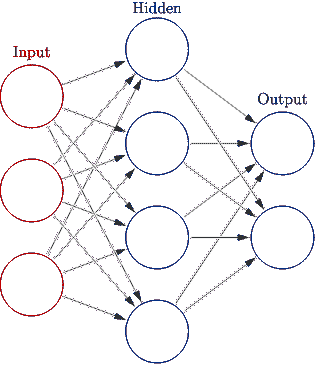

# 神经形态计算:综述

> 原文：<https://dev.to/wikunia/neuromorphic-computing-an-overview-4d64>

这是一篇不同于我平常的博文。很可能没有代码(好吧，没有代码...)并因此在这个上没有存储库。我目前正在为这个话题准备一个研讨会，我觉得这个话题很有趣，但也相对复杂。这篇文章试图给你一个什么是神经形态计算的概念。为什么会存在？它会改变计算世界吗？在这个帖子里会有一些参考文献，如果你喜欢这样的非编码帖子，并且希望我喜欢写它，:D，那么我会考虑写更多这样的帖子。(写的挺好听的；) )

好的，我们开始吧。什么是神经形态计算？这个想法基本上是制造一个大脑模型来更好地理解人脑。我们希望拥有人工智能，然后我们想，好吧，我们知道这个世界上有一种智能生物(不管智能的真正含义是什么)，那就是我们人类，但这个想法没有实现，主要是因为有人发现了一种不同的方法来创建类似的东西，这种方法被称为深度神经网络。使用反向传播很容易训练它们，但它们与我们的大脑如何工作没有任何关系。与鸟类相比，这类似于飞机。他们工作得很好，但他们并没有真正的生物灵感。我们不仅对创造人工智能感兴趣，我们还对更好地了解我们自己的身体，尤其是大脑感兴趣。这意味着回到神经形态计算并再试一次还是很有趣的。

### 大脑 vs 深度神经网络

我在博客上写了一点关于神经网络的内容。总的想法是，我们有一些层和一些神经元，它们都连接到下一层(全连接网络)。第一层连接到第一个隐藏层，最后一个隐藏层连接到输出层。这些连接具有一些权重，为了获得输出，我们从输入层到输出层进行一些矩阵乘法。总的来说，我们的神经网络模型非常简单和有组织，一切都是单向流动的。  来源:[维基百科:人工神经网络](https://en.wikipedia.org/wiki/Artificial_neural_network)

相比之下，大脑:我们有一堆“漂浮”在周围的神经元。它们以更随机的方式相互连接，没有方向(这仍然是一个有向图，但是它们没有分层)。此外，人工神经网络使用浮点数工作，即如果输入为 0.3，权重为 0.2，我们得到 0.06 作为下一个神经元的输入，将其与所有其他输入相加，然后将其发送到下一层。大脑有不同的技术。神经元或多或少有两种状态:要么激活，要么冷却。那是二进制的，我们的计算机模型使用那些复杂的浮点数。为什么？？？好问题！关键是我们的大脑利用时间工作，...

点击阅读全文

别担心，这是免费的；)