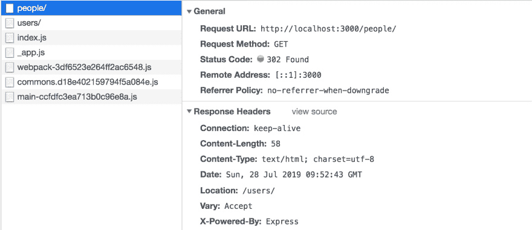

# 将 next.js 与 react-router 一起使用

> 原文：<https://dev.to/toomuchdesign/next-js-react-router-2kl8>

本报告记录了在以下设置中使用 [Next.js](https://github.com/zeit/next.js/) (保留原生 SSR 功能)的尝试:

*   单一入口点(比如[创建 React 应用](https://github.com/facebook/create-react-app)和[跳转](https://github.com/xing/hops))。没有基于文件系统的路由
*   [react-路由器](https://github.com/ReactTraining/react-router)作为唯一的路由系统

本文档有以下版本:

*   [GitHub 库](https://github.com/toomuchdesign/next-react-router)
*   [开发人员发布](https://dev.to/toomuchdesign/next-js-react-router-2kl8)

* * *

## 免责声明

*   Next.js 团队强烈反对这种方法。
*   这个实验是在 Next.js v9.3 的时代进行的:从那以后框架发生了很大的变化。

* * *

## 第一部分，基本设置

### 1 -安装 Next.js

相关[回购承诺](https://github.com/toomuchdesign/next-react-router/tree/1-initial-setup)。

[照常安装 NextJS](https://nextjs.org/docs#setup) ，在`pages/index.js`创建**单入口点**文件。

### 2 -将所有请求重定向到单个入口点

相关[回购承诺](https://github.com/toomuchdesign/next-react-router/tree/2-redirect-to-entrypoint)。

为了跳过基于文件系统的路由，我们将配置一个[自定义 Next.js 服务器](https://nextjs.org/docs#custom-server-and-routing)来将所有请求转发到我们的单个入口点。

我们将使用 Next.js [`Server.render`方法](https://github.com/zeit/next.js/blob/2b1a5c3eb4f67a30e1a9000d7d21e14bbe536687/packages/next-server/server/next-server.ts#L405)来呈现和服务入口点。

```
// server.js
const express = require('express');
const nextJS = require('next');

async function start() {
  const dev = process.env.NODE_ENV !== 'production';
  const app = nextJS({dev});
  const server = express();
  await app.prepare();

  // Redirect all requests to main entrypoint pages/index.js
  server.get('/*', async (req, res, next) => {
    try {
      app.render(req, res, '/');
    } catch (e) {
      next(e);
    }
  });

  server.listen(3000, err => {
    if (err) throw err;
    console.log(`> Ready on http://localhost:3000`);
  });
}

start(); 
```

Enter fullscreen mode Exit fullscreen mode

运行 dev 服务器，位于`pages/index.js`的入口点页面应该作为任何请求的 url 的响应。👊

### 3 -介绍 react-路由器

相关[回购承诺](https://github.com/toomuchdesign/next-react-router/tree/3-introduce-react-router)。

为了根据请求的 url 得到不同的响应，我们需要一个路由系统。

我们将使用`react-router`(参见关于 SSR 的[文档)并基于环境应用程序环境(服务器或浏览器)用`StaticRouter`或`BrowserRouter`包装应用程序。](https://reacttraining.com/react-router/web/guides/server-rendering)

安装`react-router`和`react-router-dom` :

```
npm i react-router react-router-dom -S 
```

Enter fullscreen mode Exit fullscreen mode

...并更新`pages/index.js`入口点以使用来自`react-router-dom`的一些`Link`和`Route`组件(参见 repo)。

现在让我们声明一个`withReactRouter` HOC 来用合适的路由器:
包装应用程序

```
// next/with-react-router.js
import React from 'react';
import {BrowserRouter} from 'react-router-dom';
const isServer = typeof window === 'undefined';

export default App => {
  return class AppWithReactRouter extends React.Component {
    render() {
      if (isServer) {
        const {StaticRouter} = require('react-router');
        return (
          <StaticRouter
            location={this.props.router.asPath}
          >
            <App {...this.props} />
          </StaticRouter>
        );
      }
      return (
        <BrowserRouter>
          <App {...this.props} />
        </BrowserRouter>
      );
    }
  };
}; 
```

Enter fullscreen mode Exit fullscreen mode

...并用`withReactRouter` HOC:
包装应用程序

```
// pages/_app.js
import App, {Container} from 'next/app';
import React from 'react';
import withReactRouter from '../next/with-react-router';

class MyApp extends App {
  render() {
    const {Component, pageProps} = this.props;
    return (
      <Container>
        <Component {...pageProps} />
      </Container>
    );
  }
}

export default withReactRouter(MyApp); 
```

Enter fullscreen mode Exit fullscreen mode

运行 dev 服务器，您应该能够看到您的实时路线和服务器端渲染。

## 第二部分，上下文信息

我最喜欢的`react-router`特性之一包括在渲染阶段[添加上下文信息](https://reacttraining.com/react-router/web/guides/server-rendering/adding-app-specific-context-information)和**基于收集到 **`context`对象**中的信息返回服务器端响应**的可能性。

这使得客户端代码能够控制节点服务器返回的响应，如**返回 HTTP 404** 而不是“未找到的页面”,或者返回**真实的 HTTP 302 重定向**而不是客户端重定向。

为了实现这种行为，我们必须配置 Next.js 来执行以下操作:

1.  呈现所请求的页面，向应用路由器提供上下文对象
2.  检查在渲染过程中上下文对象是否发生了变化
3.  根据上下文对象决定是返回呈现的页面还是做其他事情

### 4 -向路由器提供上下文对象

相关[回购承诺](https://github.com/toomuchdesign/next-react-router/tree/4-provide-context)。

我们将在 Express' `req.local`对象中注入一个空的`context`对象，并通过 [React 上下文](https://reactjs.org/docs/context.html)使其对路由器应用程序可用。

让我们将`context`对象注入到 Express' `req.local`对象:

```
// server.js
server.get('/*', async (req, res, next) => {
  try {
+   req.locals = {};
+   req.locals.context = {};
    app.render(req, res, '/'); 
```

Enter fullscreen mode Exit fullscreen mode

Next.js 提供了一个`req`和`res`对象作为 [`getInitialProps`静态方法](https://nextjs.org/docs#fetching-data-and-component-lifecycle)的道具。我们将获取`req.originalUrl`和`req.locals.context`，并将其交给静态路由器。

```
// next/with-react-router.js
  return class AppWithReactRouter extends React.Component {
+   static async getInitialProps(appContext) {
+     const {
+       ctx: {
+         req: {
+           originalUrl,
+           locals = {},
+         },
+       },
+     } = appContext;
+     return {
+       originalUrl,
+       context: locals.context || {},
+     };
+   } 
  // Code omitted
          <StaticRouter
-           location={this.props.router.asPath} +           location={this.props.originalUrl}
+           context={this.props.context}
          > 
```

Enter fullscreen mode Exit fullscreen mode

### 5 -单独渲染和响应

相关[回购承诺](https://github.com/toomuchdesign/next-react-router/)。

由于我们希望基于 SSR 和服务器响应之间的`req.locals.context`提供额外的服务器行为，Next.js `Server.render`缺乏灵活性。

我们将使用 Next.js `Server.renderToHTML`和`Server.sendHTML`方法重新实现`server.js`中的`Server.render`。

请注意，有些代码被省略了。有关完整的实现，请参考源代码。

```
// server.js
  server.get('/*', async (req, res, next) => {
    try {
+     // Code omitted 
      req.locals = {};
      req.locals.context = {};
-     app.render(req, res, '/'); +     const html = await app.renderToHTML(req, res, '/', {});
+
+     // Handle client redirects
+     const context = req.locals.context;
+     if (context.url) {
+       return res.redirect(context.url)
+     }
+
+     // Handle client response statuses
+     if (context.status) {
+       return res.status(context.status).send();
+     }
+
+     // Code omitted
+     app.sendHTML(req, res, html);
    } catch (e) { 
```

Enter fullscreen mode Exit fullscreen mode

在将带有呈现的 HTML 的响应发送给客户机之前，我们现在检查`context`对象，并在必要时重定向或返回一个定制的 HTTP 代码。

为了进行试验，将`pages/index.js`入口点更新为[，利用`<Redirect>`和`<Status>`组件](https://github.com/toomuchdesign/next-react-router/blob/master/pages/index.js)，并启动开发服务器。

## 总结

我们展示了如何设置 Next.js 来充分利用`react-router` 的**优势，启用**单一入口点**方法并完全**保留 SSR** 。**

为此，我们:

1.  将所有服务器请求重定向到一个单一入口点
2.  **用合适的 **`react-router`路由器**包装**应用程序(使用 HOC)
3.  用一个 **`locals.context`对象**注入`req`服务器对象
4.  为**特设包装**提供`req.locals.context`和`req.originalUrl`
5.  **扩展了 next.js `Server.render`** 来考虑发送 HTML 前的`req.locals.context`

userland 代码中的`Server.render`的重新实现是最令人不安的部分，但是通过扩展 Next.js 中的 bit `Server.render` API，这可能是不必要的。

### 结果

#### `react-router`呈现服务器端

react-router 的`<Route>`组件根据收到的 [`req.originalUrl`](https://expressjs.com/en/api.html#req.originalUrl) url 在服务器上静态呈现**。**

 **[](https://res.cloudinary.com/practicaldev/image/fetch/s--E4JjQfJf--/c_limit%2Cf_auto%2Cfl_progressive%2Cq_auto%2Cw_880/https://raw.githubusercontent.com/toomuchdesign/next-react-router/master/docs/ssr.png)

#### 客户端代码触发的 HTTP 302 重定向

当服务器渲染过程遇到`<Redirect from="/people/" to="/users/" />`组件时，服务器响应将返回一个 **HTTP 302 响应**，带有预期的 **`Location`头**。

[](https://res.cloudinary.com/practicaldev/image/fetch/s--JzL7S2zQ--/c_limit%2Cf_auto%2Cfl_progressive%2Cq_auto%2Cw_880/https://raw.githubusercontent.com/toomuchdesign/next-react-router/master/docs/302.png)

#### HTTP 404 由客户端代码触发

当服务器渲染过程遇到`<Status code={404}/>`组件时，**服务器**响应返回一个 **HTTP 响应**，带有**预期状态码**。

[](https://res.cloudinary.com/practicaldev/image/fetch/s--_t3DcCiH--/c_limit%2Cf_auto%2Cfl_progressive%2Cq_auto%2Cw_880/https://raw.githubusercontent.com/toomuchdesign/next-react-router/master/docs/404.png)

### 进一步考虑

我敢肯定，这种设置是远远不是最佳的。我很乐意考虑任何建议、反馈、改进和想法。

### 问题

*   静态页面未被导出
*   开发模式无法按需构建请求的路线
*   `getInitialProps`未实施**