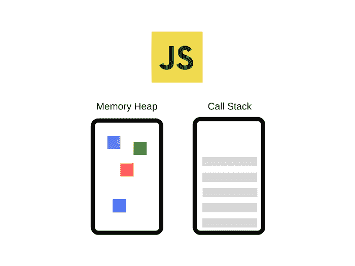
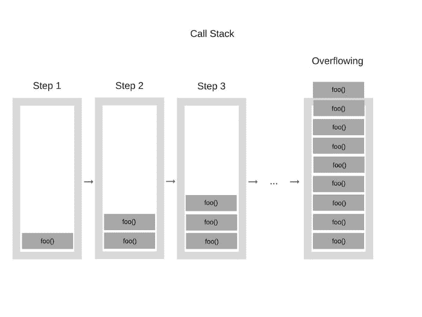

# Node.js 幕后# 2——理解 JavaScript

> 原文：<https://dev.to/_staticvoid/node-js-under-the-hood-2-understanding-javascript-48cn>

在我们的[过去的文章](https://dev.to/khaosdoctor/node-js-under-the-hood-1-getting-to-know-our-tools-1465)中，我们讨论了一些关于 C++的事情，什么是 Node.js，什么是 JavaScript，它们的故事，它们是如何出现的，以及它们现在是怎样的。我们还谈了一点文件系统功能是如何在 Node.js 中实际实现的，以及 Node.js 是如何实际划分成组件的。

现在，让我们进入本系列的第二篇文章，在这篇文章中，我们将探索 JavaScript 的一些方面。

## 罩下的 JavaScript

让我们把事情安排好。因此，我们看到了在 Node.js 中编写的所有乱码下运行的实际 C++代码的外观，因为 JavaScript 是 Node.js 的最高级别组件，让我们从询问我们的代码如何运行开始，JavaScript 是如何工作的？

大多数人实际上知道一些说过的话，并不断重复它们:

*   JavaScript 是单线程的
*   V8 为 Chrome JavaScript 引擎提供动力
*   JavaScript 使用回调队列
*   存在某种事件循环

但是他们有没有深入挖掘这些问题呢？

*   单线程是什么意思？
*   JS 引擎到底是什么？事实上，V8 是什么？
*   这些回调队列是如何工作的？只有一个队列吗？
*   什么是事件循环？它是如何工作的？谁提供的？是 JS 的一部分吗？

如果你能回答其中的两个以上，那就认为你在平均水平之上，因为大多数 JavaScript 开发人员甚至不知道这种语言背后有什么东西...但是，不要害怕，我们是来帮助你的，所以让我们更深入地了解 JavaScript 的概念，它是如何工作的，最重要的是，为什么其他人欺负它。

### JavaScript 引擎

如今，最流行的 JavaScript 引擎是 V8(继 Git 之后，人类编写的最好的软件之一)。这是因为最常用的浏览器是 Chrome，或者基于 Chrome——这是 Chrome 的开源浏览引擎——如 Opera、Brave 等...然而，它不是唯一的。我们有微软为 Edge 浏览器编写的 Chakra，我们有 Netscape 编写的 spider monkey——它现在为 Firefox 提供支持——以及许多其他软件，如 Rhino、KJS、Nashorn 等。

然而，由于 Chrome 和 Node.js 都使用 V8，我们坚持使用它。这是一个非常简单的视图:

[](https://res.cloudinary.com/practicaldev/image/fetch/s--M1-XdaOR--/c_limit%2Cf_auto%2Cfl_progressive%2Cq_auto%2Cw_880/https://github.com/khaosdoctor/my-notes/raw/master/node/assets/v8-simplified.png)

该发动机主要由两个部件组成:

*   **内存堆**:所有内存分配发生的地方
*   **调用栈**:我们的代码在这里被构造和堆叠以执行

> 稍后我们会有一篇 V8 的个人文章

### JavaScript 运行时

开发人员使用的大多数 API 都是由引擎本身提供的，就像我们在前几章写`readFile`代码时看到的那样。然而，我们使用的一些 API 不是由引擎提供的，比如`setTimeout`，任何类型的 DOM 操作，比如`document`，甚至 AJAX(即`XMLHttpRequest`对象)。这些是从哪里来的？让我们把之前的形象带到我们生活的严酷现实中来:

[](https://res.cloudinary.com/practicaldev/image/fetch/s--eVmWSWwq--/c_limit%2Cf_auto%2Cfl_progressive%2Cq_auto%2Cw_880/https://github.com/khaosdoctor/my-notes/raw/master/node/assets/v8-real.png)

引擎只是 JavaScript 的一小部分...Java Script 语言...有一些浏览器提供的 API，我们称之为**Web API**——或者还有**外部 API**——这些 API(如`DOM`、`AJAX`和`setTimeout`)由浏览器供应商提供——在这种情况下，对于 Chrome，是 Google——或者由运行时本身提供，如 Node(具有不同的 API)。这也是大多数人讨厌(现在仍然讨厌)JavaScript 的主要原因。当我们看今天的 JavaScript 时，我们看到一个充满了包和其他东西的领域，但几乎在所有方面都是同质的。良好的...并不总是这样。

过去，在 ES6 和 waaay 之前，Node.js 甚至还没有作为一个想法存在，对于如何在浏览器端实现这些 API 还没有达成共识，所以每个供应商都有自己的实现，或者没有...这意味着我们必须不断地检查和编写只能在特定浏览器上运行的代码(你还记得 IE 吗？)，所以一个特定的浏览器可以实现与其他浏览器稍有不同的`XMLHttpRequest`，或者在某些实现中可以将`setTimeout`函数命名为`sleep`；在最坏的情况下，API 甚至根本不存在。这种情况一直在逐渐改变，所以现在，谢天谢地，我们对哪些 API 应该存在以及应该如何实现有了一些共识和一致，至少是最常用和最基本的 API。

除此之外，我们还有臭名昭著的事件循环和回调队列。这一点我们稍后会讲到。

### 调用堆栈

大多数人听说过 JS 是一种单线程语言，他们只是接受它作为宇宙中的最终真理，而从来没有真正知道为什么。单线程意味着我们只有一个调用栈，换句话说，我们一次只能执行一件事。

[](https://res.cloudinary.com/practicaldev/image/fetch/s--nTa40azM--/c_limit%2Cf_auto%2Cfl_progressive%2Cq_auto%2Cw_880/https://github.com/khaosdoctor/my-notes/raw/master/node/assets/call-stack.jpg)

> 调用栈不是 Javascript 本身的一部分，它是引擎的一部分，在我们的例子中是 V8。但是我会把它放在这里，这样我们就可以对流程中的工作有个大概的了解

#### 讲述书库

[栈](https://en.wikipedia.org/wiki/Stack_(abstract_data_type))是一种抽象数据类型，作为元素的集合。“堆栈”这个名称来自于一组堆叠在一起的盒子的比喻，虽然从堆栈顶部取出一个盒子很容易，但取出一个更深的盒子可能需要我们先取出几个其他物品。

堆栈有两个主要方法:

*   **push** :向集合中添加另一个元素
*   **弹出**:移除最近添加的尚未从堆栈中移除的元素，**返回其值**

关于堆栈需要注意的一点是，元素推入和弹出的顺序非常重要。在堆栈中，元素从堆栈中出来的顺序被称为 **LIFO** ，这是**L***ast***I***n***F***first***O***ut*的首字母缩写，非常简单明了。

> 此外，我们可以有另一个名为`peek`的方法，它读取最近添加的项(栈顶)，而不删除它。

关于堆栈，我们需要了解的是以下主题:

*   它们是一种数据结构，栈中的每一项都包含一个值，在我们的例子中，是一个指令或调用
*   新项目(调用)被添加到堆栈的顶部
*   移除的项目也会从堆栈的顶部移除

#### 堆栈和 JavaScript

基本上，在 JS 中，堆栈记录了我们当前在程序中执行的位置。如果我们进入一个函数，调用它，我们把调用放在栈顶。从一个函数返回后，我们弹出栈顶。这些调用中的每一个都被称为**堆栈帧**。

让我们举第一个例子，一个简单的程序，不同于我们之前的:

```
function multiply (x, y) {
    return x * y
}

function printSquare (x) {
    const s = multiply(x, x)
    console.log(s)
}

printSquare(5) 
```

Enter fullscreen mode Exit fullscreen mode

> 当我们把所有的部分粘在一起后，我们将运行我们的`readFile`代码

当引擎运行代码时，首先，调用堆栈将是空的。在每一步之后，它将被以下内容填充:

[](https://res.cloudinary.com/practicaldev/image/fetch/s--9mCdpDuB--/c_limit%2Cf_auto%2Cfl_progressive%2Cq_auto%2Cw_880/https://github.com/khaosdoctor/my-notes/raw/master/node/assets/simple-callstack.png)

让我们一点一点地进去:

*   步骤 0(未显示)是空堆栈，这意味着我们程序的开始
*   在第一步中，我们添加第一个函数调用。对`printSquare(5)`的调用，因为所有其他行都只是声明。
*   第二步我们进入`printSquare`函数定义
    *   看看我们是如何调用`const s = multiply(x, x)`的，所以让我们将`multiply(x, x)`添加到堆栈的顶部
    *   后来，我们进入`multiply`，没有函数调用，没有任何东西被添加到堆栈中。我们只对`x * y`求值并返回。
    *   返回意味着函数已经运行完毕，所以我们可以将它弹出堆栈
*   在步骤 3 中，我们不再有引用`multiply(x, x)`的堆栈帧。现在让我们继续我们评估的最后一行之后的那一行，这是`console.log`行。
    *   `console.log`是一个函数调用，让我们添加到栈顶
    *   在`console.log(s)`运行之后，我们可以将它弹出堆栈
*   在步骤 4 中，我们现在只有一个堆栈框架:`printSquare(5)`，这是我们添加的第一个框架
    *   由于这是第一次函数调用，并且在它之后没有其他代码，这意味着该函数已经完成。从堆栈中弹出它
*   步骤 5 等于步骤 0，一个空栈

抛出异常时，堆栈正是如何构造堆栈跟踪的。堆栈跟踪基本上是异常发生时调用堆栈的输出状态:

```
function foo () {
    throw new Error('Exception');
}

function bar () {
    foo()
}

function start () {
    bar()
}

start() 
```

Enter fullscreen mode Exit fullscreen mode

这应该会显示如下内容:

```
Uncaught Error: Exception foo.js:2
    at foo (foo.js:2)
    at bar (foo.js:6)
    at start (foo.js:10)
    at foo.js:13 
```

Enter fullscreen mode Exit fullscreen mode

`at`短语只是我们的调用堆栈状态。

#### 堆栈溢出

不，栈不是以站点命名的，抱歉让你失望了。实际上，该站点是以自计算开始以来在编程中发现的最常见错误之一命名的:堆栈溢出。

当我们达到最大调用堆栈大小时，就会发生堆栈溢出错误。堆栈是数据结构，这意味着它们是在内存中分配的，而内存不是无限的，所以这很容易发生，特别是在非净化的递归函数上，就像这样:

```
function f () {
  return f()
}

f() 
```

Enter fullscreen mode Exit fullscreen mode

在每次调用`f`时，我们将在堆栈中堆积`f`,但是，正如我们所看到的，在项目执行结束之前，换句话说，当代码到达没有函数被调用的点时，我们永远不能从堆栈中移除项目。因为我们没有终止条件，所以我们的堆栈会被破坏:

[](https://res.cloudinary.com/practicaldev/image/fetch/s--_tydwAZx--/c_limit%2Cf_auto%2Cfl_progressive%2Cq_auto%2Cw_880/https://github.com/khaosdoctor/my-notes/raw/master/node/assets/stack-overflow.png)

幸运的是，引擎正在监视我们，并意识到函数将永远不会停止调用自己，从而导致堆栈溢出，这是一个非常严重的错误，因为它会使整个应用程序崩溃。如果不停止，可能会在整个运行时导致堆栈内存崩溃或损坏。

### 单线程利弊

在单线程环境中运行非常自由，因为这比在多线程环境中运行要简单得多，在多线程环境中，我们必须考虑竞争条件和死锁。在这个世界上，这样的事情是不存在的，毕竟我们只是在同时做一件事。

然而，单线程也有很大的局限性。因为我们只有一个堆栈，如果这个堆栈被一些运行缓慢的代码阻塞了会发生什么？

这是我们将在下一篇文章中发现的...