# Setup Ubuntu for Python development

> 原文：[https://dev.to/victorosilva/setup-ubuntu-for-python-development-34k2](https://dev.to/victorosilva/setup-ubuntu-for-python-development-34k2)

In this tutorial I'll show you how I prepare my machine for Python development after installing Ubuntu or one of its derivatives. There are many ways to do this, with different tools and techniques. Here I am sharing the way that works best for me.

These are the two goals of this process:

*   **not** to mess with the operating system's Python interpreter;
*   be able to work on projects that use different Python versions and different Python libraries.

As a practical example, we will create three Python projects:

1.  A [Django](https://www.djangoproject.com/) project with Python 3.7;
2.  A [Mezzanine](http://mezzanine.jupo.org/) project with Python 3.7 too;
3.  A [Flask](http://flask.pocoo.org/) project with Python 2.7.

We will begin with a fresh installation of Ubuntu 19.04.

[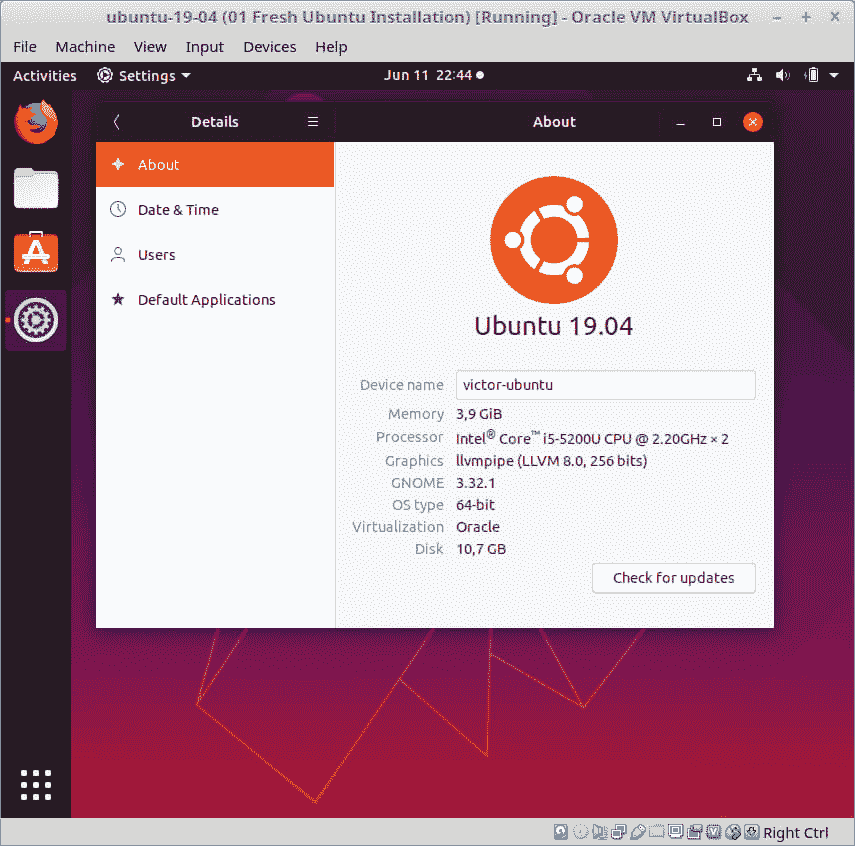](https://res.cloudinary.com/practicaldev/image/fetch/s--zt9d3uYK--/c_limit%2Cf_auto%2Cfl_progressive%2Cq_auto%2Cw_880/https://thepracticaldev.s3.amazonaws.com/i/jnpg8li3xb6mmpkgv0wx.png)

## System dependencies

We will build some Python versions, and for that we will need to install some system dependencies. We'll follow the recommendation of the subsection **"Ubuntu/Debian/Mint"** of pyenv's [wiki's "Suggested build environment" section](https://github.com/pyenv/pyenv/wiki#suggested-build-environment). As of 2019-06-11, they are:

```
$ sudo apt-get update; sudo apt-get install --no-install-recommends make build-essential libssl-dev zlib1g-dev libbz2-dev libreadline-dev libsqlite3-dev wget curl llvm libncurses5-dev xz-utils tk-dev libxml2-dev libxmlsec1-dev libffi-dev liblzma-dev 
```

So we open a Terminal (`Ctrl + Alt + T`) and install the dependencies:

[](https://res.cloudinary.com/practicaldev/image/fetch/s--76cFL064--/c_limit%2Cf_auto%2Cfl_progressive%2Cq_auto%2Cw_880/https://thepracticaldev.s3.amazonaws.com/i/jwj338nhxvvdhgag3h2a.png)

We'll also need [Git](https://git-scm.com/):

```
$ sudo apt-get install git 
```

[](https://res.cloudinary.com/practicaldev/image/fetch/s--uEW90Q8f--/c_limit%2Cf_auto%2Cfl_progressive%2Cq_auto%2Cw_880/https://thepracticaldev.s3.amazonaws.com/i/qtjb8dp4g3digsrxgah6.png)

## Python version management

After the system dependencies we'll install [pyenv](https://github.com/pyenv/pyenv). Among other things, pyenv lets us install different Python versions in our system.

Below, we're following the ["installation" section](https://github.com/pyenv/pyenv#installation) of pyenv's GitHub page. Be sure to check that page for updated instructions.

### Clone pyenv into `$HOME/.pyenv`

```
$ git clone https://github.com/pyenv/pyenv.git ~/.pyenv 
```

[](https://res.cloudinary.com/practicaldev/image/fetch/s--r4U_4yJN--/c_limit%2Cf_auto%2Cfl_progressive%2Cq_auto%2Cw_880/https://thepracticaldev.s3.amazonaws.com/i/grs84u899w32r596d7zl.png)

### Update `$HOME/.bashrc` with the lines below, and restart the shell

```
export PYENV_ROOT="$HOME/.pyenv"
export PATH="$PYENV_ROOT/bin:$PATH"
if command -v pyenv 1>/dev/null 2>&1; then
  eval "$(pyenv init -)"
fi 
```

[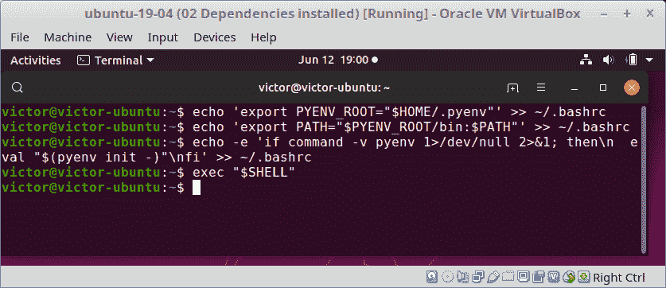](https://res.cloudinary.com/practicaldev/image/fetch/s--djFUAm9W--/c_limit%2Cf_auto%2Cfl_progressive%2Cq_auto%2Cw_880/https://thepracticaldev.s3.amazonaws.com/i/kjg0z0x5xewl2sakgs6g.png)

### Install Python 2.7 and Python 3.7

Note: these may take a long time to complete, for pyenv will download and build CPython from source for each version.

```
$ pyenv install 2.7.16
$ pyenv install 3.7.3 
```

[](https://res.cloudinary.com/practicaldev/image/fetch/s--GdveD4nK--/c_limit%2Cf_auto%2Cfl_progressive%2Cq_auto%2Cw_880/https://thepracticaldev.s3.amazonaws.com/i/ljn7o43p6i3uj3iwxz1i.png)

As we can see in the screenshot, the Python versions have been installed in `$HOME/.pyenv/versions`. We can run both interpreters directly to verify that they are working properly:

[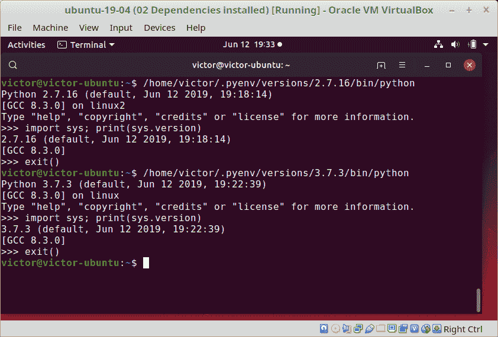](https://res.cloudinary.com/practicaldev/image/fetch/s--5yp5sao5--/c_limit%2Cf_auto%2Cfl_progressive%2Cq_auto%2Cw_880/https://thepracticaldev.s3.amazonaws.com/i/cwhi2l2h0i5zocm6zu57.png)

However, we will not be installing libraries in these Python interpreters. They will be the *base* interpreters for our projects. Actually, each project will have its own isolated Python environment, with its own Python interpreter and its own libraries.

## Python isolated environments

[virtualenv](https://virtualenv.pypa.io/en/latest/) is a great tool for creating these isolated environments. Installing it on Ubuntu is straightforward:

```
$ sudo apt-get install virtualenv 
```

[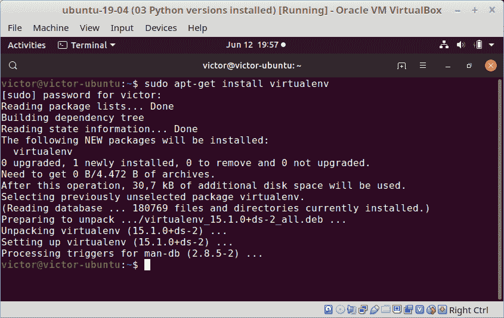](https://res.cloudinary.com/practicaldev/image/fetch/s--tVcvpxPH--/c_limit%2Cf_auto%2Cfl_progressive%2Cq_auto%2Cw_880/https://thepracticaldev.s3.amazonaws.com/i/4wbfwku3n08k2olswzgt.png)

The creation of the environments is easy too. We'll create them on the next sessions.

## Create the Django project

Let's create a directory `$HOME/projects/django_project` and then create an isolated Python environment for this project in `$HOME/projects/django_project/.venv_django` using the Python 3.7.3 that we installed earlier.

```
$ mkdir ~/projects
$ mkdir ~/projects/django_project
$ cd ~/projects/django_project
$ virtualenv .venv_django --python=$HOME/.pyenv/versions/3.7.3/bin/python 
```

[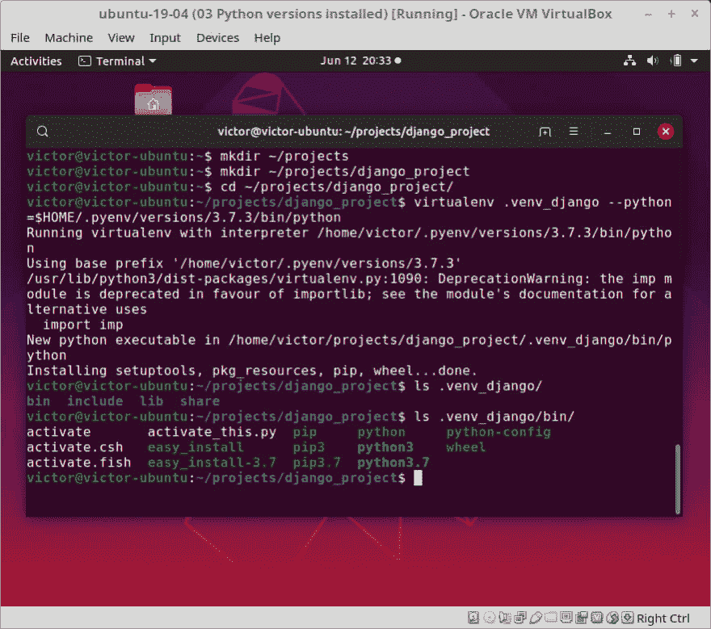](https://res.cloudinary.com/practicaldev/image/fetch/s--_kgZeHh1--/c_limit%2Cf_auto%2Cfl_progressive%2Cq_auto%2Cw_880/https://thepracticaldev.s3.amazonaws.com/i/852mose5grqi4irpt7o6.png)

In the screenshot, we can see that an environment was created in the new `.venv_django` directory, and it contains its own Python interpreter, along with some other tools.

### Activate the environment for the Django project

We need to **activate** this environment so we can use its Python interpreter and install libraries on it. After the activation, executing `python` (the Python interpreter) or `pip` (the Python package manager) will use the versions of these tools that are inside the environment.

The activation is essential. If we skip it, we will end up messing with the operating system's Python interpreter, and that's exactly what we **don't** want to do.

To perform the environment activation, we need to `source` the script `bin/activate` located inside the environment directory.

```
$ source .venv_django/bin/activate 
```

[](https://res.cloudinary.com/practicaldev/image/fetch/s--ESudi0dR--/c_limit%2Cf_auto%2Cfl_progressive%2Cq_auto%2Cw_880/https://thepracticaldev.s3.amazonaws.com/i/bhughks5nj6e7plm5cc5.png)

Notice that, when the environment is activated, the prompt is prefixed with the name of the environment's directory.

### Install Django and create and run the project in the environment

Now, with the environment properly activated, we can install Django with [`pip`](https://github.com/pypa/pip), create the Django project and run it.

```
$ pip install Django
$ django-admin.py startproject django_project .
$ python manage.py runserver 
```

[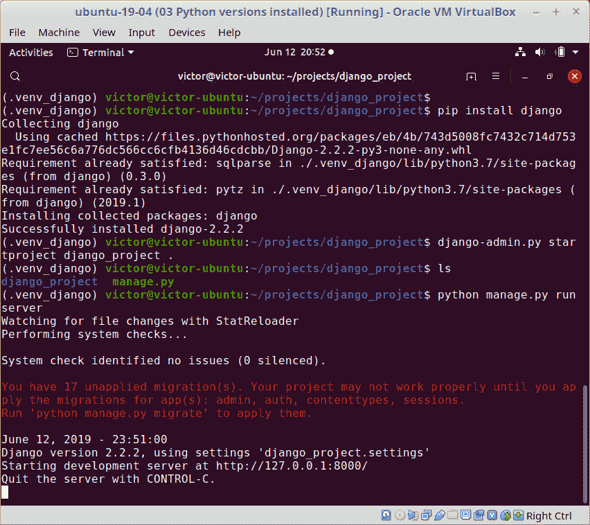](https://res.cloudinary.com/practicaldev/image/fetch/s--GCELt6iD--/c_limit%2Cf_auto%2Cfl_progressive%2Cq_auto%2Cw_880/https://thepracticaldev.s3.amazonaws.com/i/mkvf3348ivq44qybegl6.png)

[](https://res.cloudinary.com/practicaldev/image/fetch/s--Sd7xZzps--/c_limit%2Cf_auto%2Cfl_progressive%2Cq_auto%2Cw_880/https://thepracticaldev.s3.amazonaws.com/i/3l4qzqi0yo9jgru5ccfu.png)

To quit the Django development server, just hit `Ctrl + C`.

Now we will create a Python environment for a Mezzanine project, so we must deactivate the currently activated environment (the Django one) and leave the Django project directory:

```
$ deactivate
$ cd .. 
```

[](https://res.cloudinary.com/practicaldev/image/fetch/s--ZYHb2vzp--/c_limit%2Cf_auto%2Cfl_progressive%2Cq_auto%2Cw_880/https://thepracticaldev.s3.amazonaws.com/i/rbrgjh1idt5pr1gytnk6.png)

## Create the Mezzanine project

In a similar fashion, now we will

*   create the environment for the Mezzanine project (based on Python 3.7.3 again);
*   activate the environment;
*   install the libraries that we need;
*   create and run the project.

```
$ mkdir mezzanine_project
$ cd mezzanine_project
$ virtualenv .venv_mezzanine --python=$HOME/.pyenv/versions/3.7.3/bin/python
$ source .venv_mezzanine/bin/activate
$ pip install mezzanine
$ mezzanine-project myproject .
$ python manage.py createdb
$ python manage.py runserver 
```

[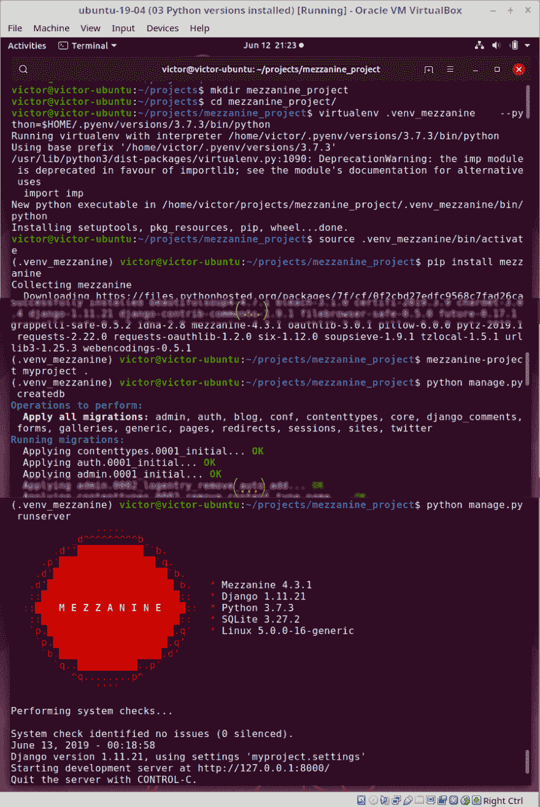](https://res.cloudinary.com/practicaldev/image/fetch/s--GDN9rt6y--/c_limit%2Cf_auto%2Cfl_progressive%2Cq_auto%2Cw_880/https://thepracticaldev.s3.amazonaws.com/i/1cs4ikar9tkvbpxk6n3k.png)

[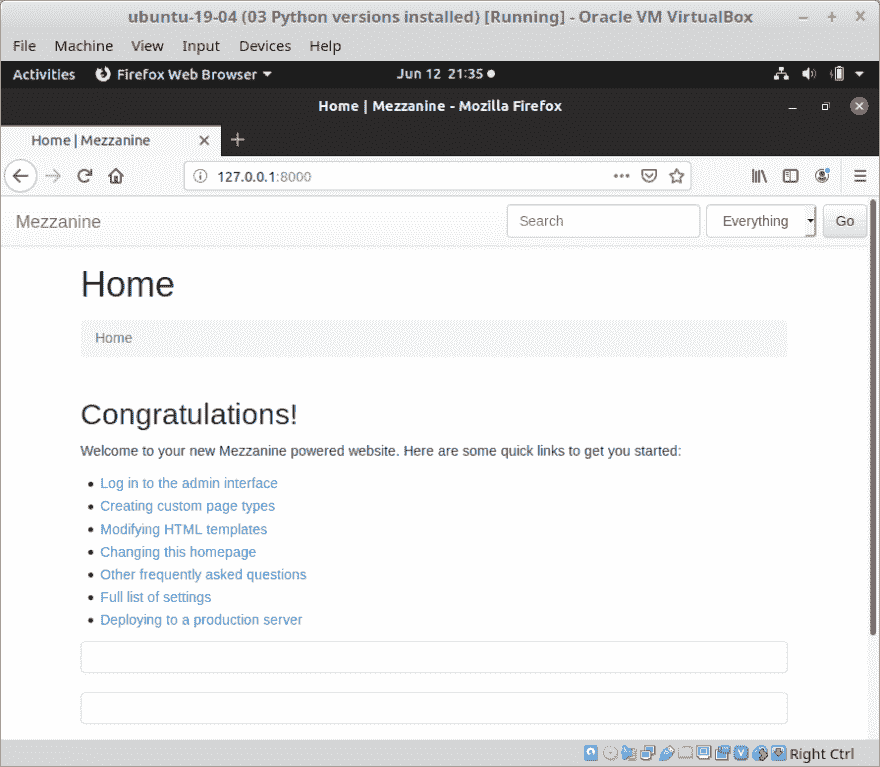](https://res.cloudinary.com/practicaldev/image/fetch/s--rSlfXRX2--/c_limit%2Cf_auto%2Cfl_progressive%2Cq_auto%2Cw_880/https://thepracticaldev.s3.amazonaws.com/i/0w71ye28uqkak549y5no.png)

To quit the Django development server (Mezzanine is built on top of Django), just hit `Ctrl + C` again.

Before moving to the last project (the Flask one), let's deactivate the Mezzanine environment and leave the project directory:

```
$ deactivate
$ cd .. 
```

[](https://res.cloudinary.com/practicaldev/image/fetch/s--eGIrGK8z--/c_limit%2Cf_auto%2Cfl_progressive%2Cq_auto%2Cw_880/https://thepracticaldev.s3.amazonaws.com/i/ip72im343j33tai18nfm.png)

## Create the Flask project

For the Flask project, the process will be similar, but the environment will be based on Python 2.7.16 instead. Flask doesn't have an autogenerator of basic projects like Django and Mezzanine do, therefore we'll need to write a little bit of code in order to have a minimal Flask application.

```
$ mkdir flask_project
$ cd flask_project
$ virtualenv .venv_flask --python=$HOME/.pyenv/versions/2.7.16/bin/python
$ source .venv_flask/bin/activate
$ pip install flask
$ touch app.py 
```

[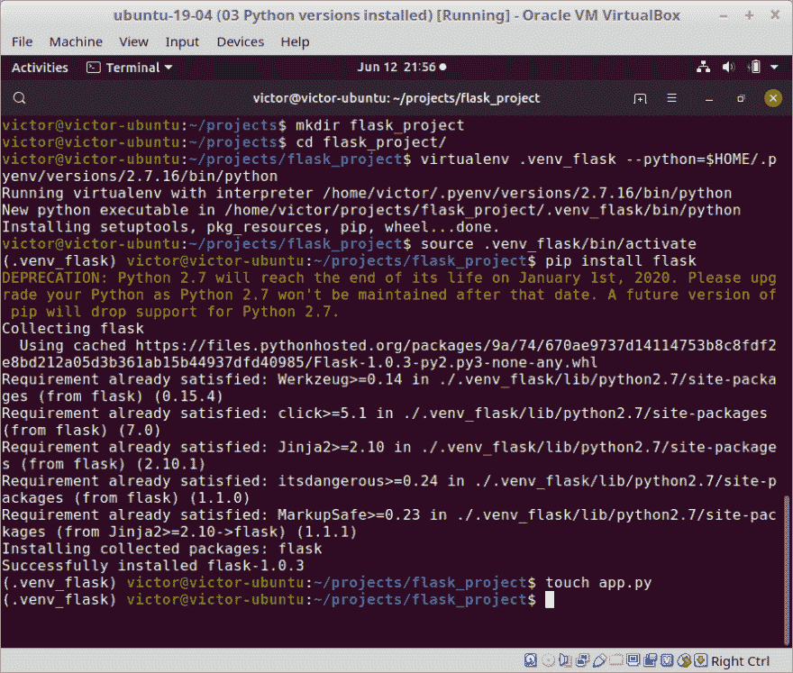](https://res.cloudinary.com/practicaldev/image/fetch/s--ZRw2OxFq--/c_limit%2Cf_auto%2Cfl_progressive%2Cq_auto%2Cw_880/https://thepracticaldev.s3.amazonaws.com/i/sdubmowwj2tvx1mrkifd.png)

Let's enter the following code in the file `$HOME/projects/flask_project/app.py`:

```
from flask import Flask
app = Flask(__name__)

@app.route('/')
def hello_world():
    return 'Hello, World' 
```

[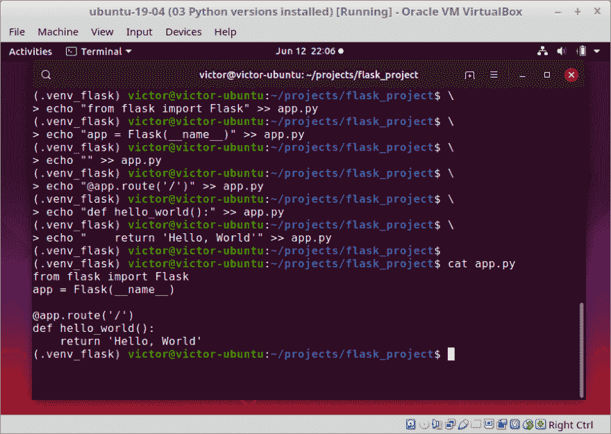](https://res.cloudinary.com/practicaldev/image/fetch/s--WEbjrQDr--/c_limit%2Cf_auto%2Cfl_progressive%2Cq_auto%2Cw_880/https://thepracticaldev.s3.amazonaws.com/i/4bssg2ykc7xdag0l0ymm.png)

Now we can run the Flask app to make sure that it works as expected.

```
$ flask run 
```

[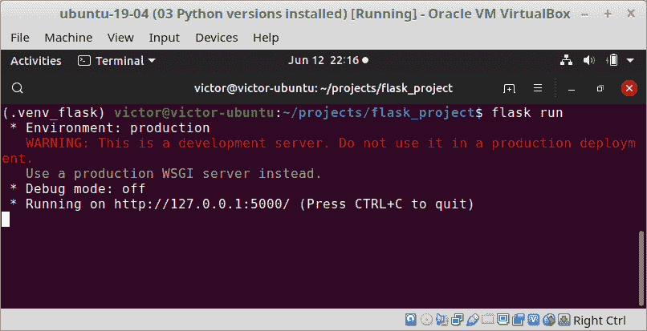](https://res.cloudinary.com/practicaldev/image/fetch/s--U2suXoFb--/c_limit%2Cf_auto%2Cfl_progressive%2Cq_auto%2Cw_880/https://thepracticaldev.s3.amazonaws.com/i/zl8g77o48wrgcj8h81f5.png)

[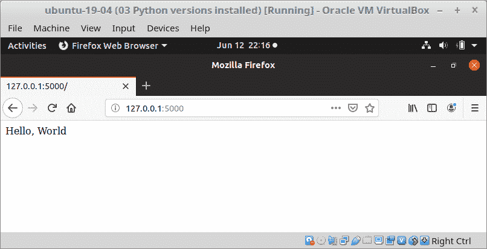](https://res.cloudinary.com/practicaldev/image/fetch/s--6DqNbha2--/c_limit%2Cf_auto%2Cfl_progressive%2Cq_auto%2Cw_880/https://thepracticaldev.s3.amazonaws.com/i/ouximkx2qgmpf0x4x6qp.png)

To quit the Flask development server, just hit `Ctrl + C`. Then, let's deactivate the environment that we created for the Flask project and leave its directory.

```
$ deactivate
$ cd .. 
```

[](https://res.cloudinary.com/practicaldev/image/fetch/s--mNoPbs_0--/c_limit%2Cf_auto%2Cfl_progressive%2Cq_auto%2Cw_880/https://thepracticaldev.s3.amazonaws.com/i/q3q1n9xho7ghgv771bv0.png)

## Wrapping it up

*   We use **Pyenv** to install different Python interpreters
*   We use **virtualenv** to create isolated environments for different Python projects
*   We **activate** each environment before installing the libraries they need
*   When an environment is activated, the prompt is prefixed with the name of the environment's directory
*   We **deactivate** an environment when we don't need to use it
*   We never touch the operating system's Python interpreter
*   Each environment has its own isolated set of installed libraries, as shown below:

[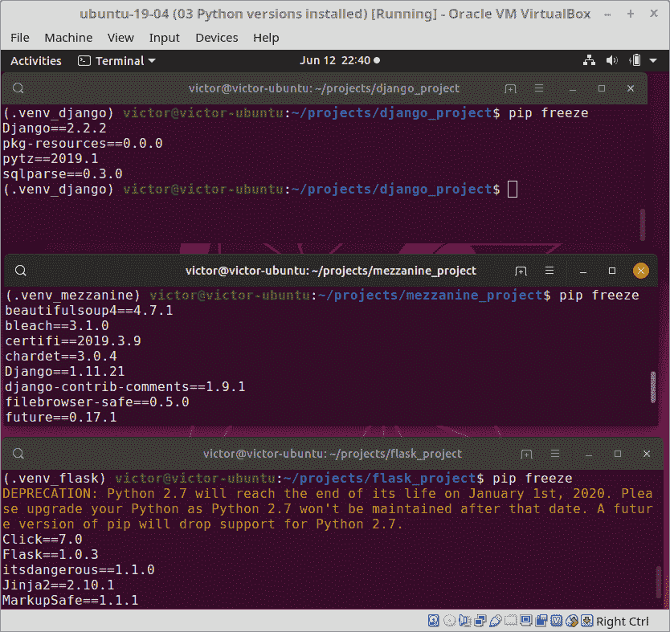](https://res.cloudinary.com/practicaldev/image/fetch/s--Fdj8JeCa--/c_limit%2Cf_auto%2Cfl_progressive%2Cq_auto%2Cw_880/https://thepracticaldev.s3.amazonaws.com/i/lqvprsh8c8d2kf9pfzwt.png)

That's it! Do you have a different approach which works best for you?