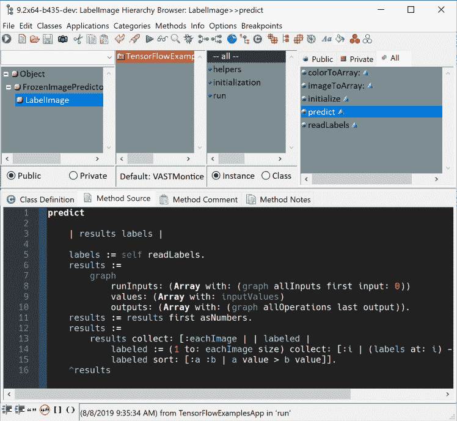
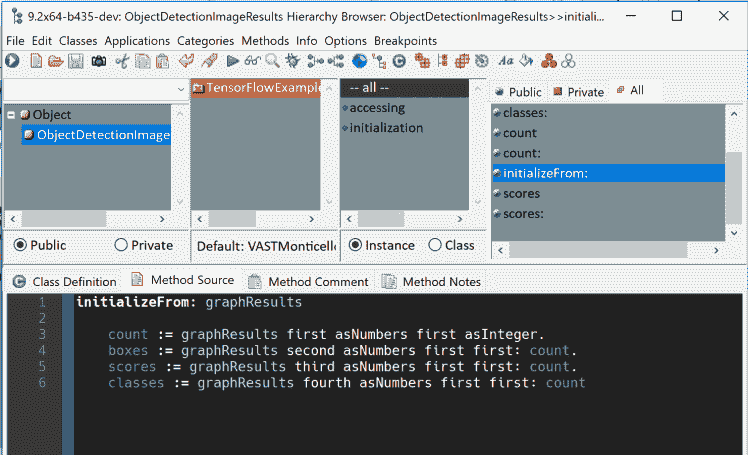
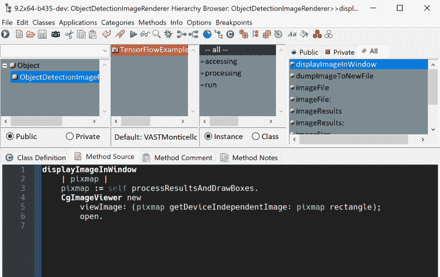

# 基于张量流和 Smalltalk 的目标检测

> 原文：<https://dev.to/martinezpeck/object-detection-with-tensorflow-and-smalltalk-15p7>

在[之前的帖子](https://dev.to/martinezpeck/recognizing-objects-in-images-with-tensorflow-and-smalltalk-1nep)中，我们看到了使用 Smalltalk 的 [TensorFlow 库](https://www.tensorflow.org)在图像中进行基本的物体识别。这篇文章将带你一步一步地使用一个预先训练好的模型来检测图像中的物体。

你可能还会注意到，我们是从 [VASmalltalk](https://twitter.com/instantiations) 而不是 Python 来做这件事的。查看[之前的帖子](https://marianopeck.blog/2019/08/07/recognizing-objects-in-images-with-tensorflow-and-smalltalk/)，看看为什么我认为 Smalltalk 可能是进行机器学习的一个很好的选择。

液体错误:内部

### 张量流检测模型动物园

在本帖中，我们将再次使用[预先训练好的模型](https://github.com/tensorflow/models/blob/master/research/object_detection/g3doc/detection_model_zoo.md):

> 我们提供了一组在 [COCO 数据集](http://mscoco.org/)、 [Kitti 数据集](http://www.cvlibs.net/datasets/kitti/)、 [Open Images 数据集](https://github.com/openimages/dataset)、 [AVA v2.1 数据集](https://research.google.com/ava/)和[自然物种检测数据集](https://github.com/visipedia/inat_comp/blob/master/2017/README.md#bounding-boxes)上预先训练的检测模型。如果您对那些数据集中已经存在的类别感兴趣，这些模型对于开箱即用的推断可能很有用。在新数据集上进行训练时，它们对于初始化模型也很有用。

使用这些模型的最初想法写在这篇[伟大的帖子](https://www.kdnuggets.com/2018/03/google-tensorflow-object-detection-api-the-easiest-way-implement-image-recognition.html)中。我们的作品还受到了用于演示的[这款](https://github.com/tensorflow/models/blob/477ed41e7e4e8a8443bc633846eb01e2182dc68a/object_detection/object_detection_tutorial.ipynb)和[这款](https://github.com/priya-dwivedi/Deep-Learning/blob/master/Object_Detection_Tensorflow_API.ipynb) Juypiter 笔记本的启发。

### 使用 Smalltalk 面向对象的方法设计演示

在[之前的帖子](https://dev.to/martinezpeck/recognizing-objects-in-images-with-tensorflow-and-smalltalk-1nep)中，你可以看到所有的演示都是在`LabelImage`类中开发的。在开始实现这一新的演示时，我们在运行预训练的冻结预测模型时发现了许多常见行为。所以…我们首先创建了一个名为`FrozenImagePredictor`的超类，并将`LabelImage`改为它的子类，只覆盖了协议的一小部分。

[](https://res.cloudinary.com/practicaldev/image/fetch/s--WSkDoJMC--/c_limit%2Cf_auto%2Cfl_progressive%2Cq_auto%2Cw_880/https://i2.wp.com/marianopeck.blog/wp-content/uploads/2019/08/Screen-Shot-2019-08-18-at-11.32.54-AM.png%3Ffit%3D748%252C581%26ssl%3D1)

[](https://res.cloudinary.com/practicaldev/image/fetch/s--cdOEFZaT--/c_limit%2Cf_auto%2Cfl_progressive%2Cq_auto%2Cw_880/https://i2.wp.com/marianopeck.blog/wp-content/uploads/2019/08/Screen-Shot-2019-08-18-at-11.33.06-AM.png%3Ffit%3D748%252C688%26ssl%3D1)

在我们完成重构之后，添加一个新的子类`ObjectDetectionZoo`非常容易。我们只需要在那个类上实现 7 个方法(在`LabelImage`中只有 5 个方法)。所以…如你所见，现在很容易添加越来越多的冻结图像预测器。

在[之前的例子](https://dev.to/martinezpeck/recognizing-objects-in-images-with-tensorflow-and-smalltalk-1nep)(和`LabelImage`)中，我们处理了“原始”结果，就像 TensorFlow 会回答它一样。然而，使用`ObjectDetectionZoo`的结果有点复杂，此外我们需要提高信息的可读性，例如，渲染“边界框”。所以我们在`ObjectDetectionImageResults`中具体化了张量流结果。

[](https://res.cloudinary.com/practicaldev/image/fetch/s--qMVjfGcC--/c_limit%2Cf_auto%2Cfl_progressive%2Cq_auto%2Cw_880/https://i1.wp.com/marianopeck.blog/wp-content/uploads/2019/08/Screen-Shot-2019-08-18-at-11.42.24-AM.png%3Ffit%3D748%252C455%26ssl%3D1)

这些预先训练的模型可以回答“边界框”的数据。我们感兴趣的是看看我们是否可以直接从 Smalltalk 渲染图像，并绘制方框和标签。同样，是时候在`ObjectDetectionImageRenderer`中具体化了。

[](https://res.cloudinary.com/practicaldev/image/fetch/s--xmtuVWqV--/c_limit%2Cf_auto%2Cfl_progressive%2Cq_auto%2Cw_880/https://i0.wp.com/marianopeck.blog/wp-content/uploads/2019/08/Screen-Shot-2019-08-18-at-11.43.37-AM.png%3Ffit%3D748%252C472%26ssl%3D1)

最后，我们让`ObjectDetectionZoo`运行模型并回答`ObjectDetectionImageResults`，然后委托`ObjectDetectionImageRenderer`显示并绘制结果。

### 运行实例！

要运行这些示例，您必须首先查看[之前的帖子](https://dev.to/martinezpeck/recognizing-objects-in-images-with-tensorflow-and-smalltalk-1nep)，看看如何安装 VASmalltalk 和 TensorFlow。之后可以在`ObjectDetectionZoo`的课堂评论里自己查例子。

这个例子运行了基本的`mobilenet_v1`网络，它很快但不是很精确:

```
ObjectDetectionZoo new
    imageFiles: OrderedCollection new;
    addImageFile: 'examples\objectDetectionZoo\images\000000562059.jpg';
    graphFile: 'examples\objectDetectionZoo\ssd_mobilenet_v1_coco_2018_01_28\frozen_inference_graph.pb';
    prepareImageInput;
    prepareSession;
    predict;
    openPictureWithBoundingBoxesAndLabel 
```

Enter fullscreen mode Exit fullscreen mode

然后，您可以简单地更改指定使用`rcnn_inception_resnet_v2`的那一行，您会看到结果会好得多:

在 [tensorflow-vast 知识库](https://github.com/vasmalltalk/tensorflow-vast)中，我们只提供了一些冻结的预训练图，因为它们真的很大。然而，你可以很容易地[下载额外的](https://github.com/tensorflow/models/blob/master/research/object_detection/g3doc/detection_model_zoo.md#coco-trained-models)并使用它们。你必须做的唯一一件事就是解压缩`.tar.gz`,并简单地将指定图形的那一行(`graphFile:`)改为使用`rcnn_inception_resnet_v2`,你会看到结果好得多:

[](https://res.cloudinary.com/practicaldev/image/fetch/s--M61XIhMO--/c_limit%2Cf_auto%2Cfl_progressive%2Cq_auto%2Cw_880/https://i2.wp.com/marianopeck.blog/wp-content/uploads/2019/08/Screen-Shot-2019-08-18-at-12.14.33-PM.png%3Ffit%3D748%252C587%26ssl%3D1)

你可以看到用`mobilenet_v1`勺子被检测为人，左边的苹果和碗没有被检测到，蛋糕被解释为三明治。用`rcnn_inception_resnet_v2`看起来一切正常:

TensorFlow 非常酷的一点是，您可以在一次调用中并行运行多个图像。这里还有一个例子:

```
ObjectDetectionZoo new
    imageFiles: OrderedCollection new;
    graphFile: 'z:\Instantiations\TensorFlow\faster_rcnn_inception_resnet_v2_atrous_coco_2018_01_28\frozen_inference_graph.pb';
    addImageFile: 'examples\objectDetectionZoo\images\000000463849.jpg';
    addImageFile: 'examples\objectDetectionZoo\images\000000102331.jpg';
    addImageFile: 'examples\objectDetectionZoo\images\000000079651.jpg';
    addImageFile: 'examples\objectDetectionZoo\images\000000045472.jpg';
    prepareImageInput;
    prepareSession;
    predict;
    openPictureWithBoundingBoxesAndLabel 
```

Enter fullscreen mode Exit fullscreen mode

这带来了这些结果:

[](https://res.cloudinary.com/practicaldev/image/fetch/s--h-77G42M--/c_limit%2Cf_auto%2Cfl_progressive%2Cq_auto%2Cw_880/https://i1.wp.com/marianopeck.blog/wp-content/uploads/2019/08/Screen-Shot-2019-08-18-at-12.34.23-PM.png%3Ffit%3D748%252C505%26ssl%3D1)

正如你在这里看到的有许多不同的预训练模型，所以你可以使用和试验其中的任何一个。在这篇文章中，我们只取了其中的两个(`mobilenet_v1`和`rcnn_inception_resnet_v2`)，但是你可以和任何人一起尝试。你需要做的就是下载那个模型的`.tar.gz`，解压，用`graphFile:`指定图形文件。

最后，你也可以尝试不同的图片。你可以用你自己的任何图像来尝试，或者用用来训练这些模型的数据库中提供的图像来尝试(COCO，Kitti 等。).

### 结论与未来工作

我们一直在努力展示 Smalltalk 中的张量流示例。将来，我们真的希望在 Smalltalk 中试验训练模型。特别是，我们希望试验使用 GPU 的物联网板(如 Nvidia Jetson 或类似产品)。

除了图片之外，尝试检测视频中的物体也很有趣。

最后，感谢 Gera Richarte 对这项工作的帮助，感谢 Maxi Tabacman 对这篇文章的评论。