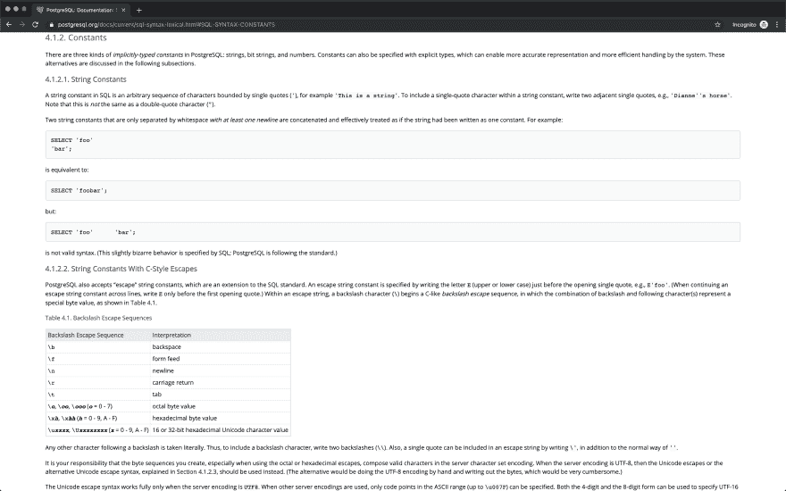
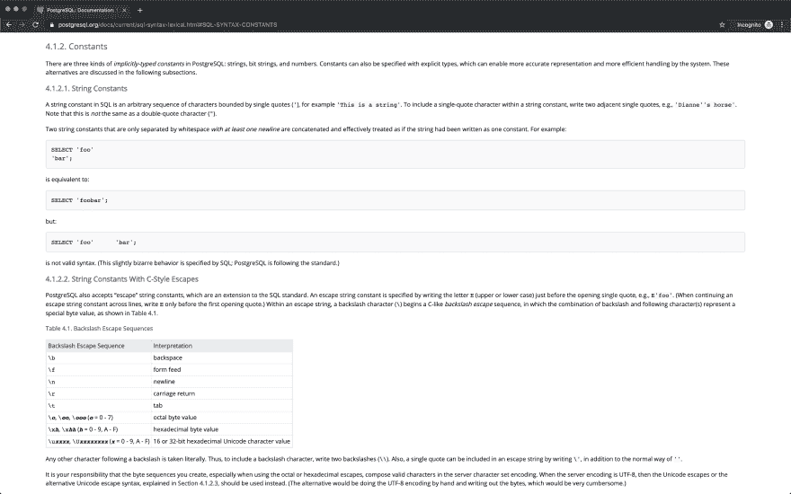

# 偏移命名锚点和滚动视图位置。

> 原文：<https://dev.to/gajus/offsetting-named-anchor-and-scrollintoview-position-7jm>

命名锚链接用于引用 HTML 页面的一部分。通过给出元素`id`(例如`<div id='foo' />`)来识别目标元素，并且通过在目标元素 ID 前面加上锚，例如`<a href='#foo' />`，来构建到该元素的链接。它们非常适合链接到页面上的特定内容，比如评论、产品等等。以下是一些例子:

*   [https://dev . to/gajus/dynamically-generating-SQL-queries-using-node-js-2c1g # binding-a-list-of-values](https://dev.to/gajus/dynamically-generating-sql-queries-using-node-js-2c1g#binding-a-list-of-values)
*   [https://github.com/gajus/slonik#contents](https://github.com/gajus/slonik#contents)
*   [https://www . PostgreSQL . org/docs/current/SQL-SYNTAX-lexical . html # SQL-SYNTAX-CONSTANTS](https://www.postgresql.org/docs/current/sql-syntax-lexical.html#SQL-SYNTAX-CONSTANTS)

注意到所有这些链接有什么问题吗？

[](https://res.cloudinary.com/practicaldev/image/fetch/s--TBxj5Nww--/c_limit%2Cf_auto%2Cfl_progressive%2Cq_auto%2Cw_880/https://thepracticaldev.s3.amazonaws.com/i/js0f0uds9g2s2aix95uv.png)

滚动在链接内容的顶部右切。将其与以下内容进行比较:

[](https://res.cloudinary.com/practicaldev/image/fetch/s--IRMvgu7D--/c_limit%2Cf_auto%2Cfl_progressive%2Cq_auto%2Cw_880/https://thepracticaldev.s3.amazonaws.com/i/nz5nsxhynuhh4yqek0qq.png)

有小偏移时不是更好吗？

([叹气]这个帖子就是大家意识到我有强迫症的时候)。

其行为方式的原因是因为 ID 直接附加到 heading 元素上。这不是必需的。

这是一件小事，但它能让我的齿轮啮合，因为修理很容易:

当您想要创建命名锚点时，创建具有相对位置的辅助元素，并添加具有偏移绝对位置的锚点链接。像这样:

```
<div style='position: relative;'>
  <a name='foo' style='position: absolute; top: -20px;'>  
</div> 
```

Enter fullscreen mode Exit fullscreen mode

这个简单的标记更改允许您创建一个不受填充/边距或内容的其他属性支配的任意偏移锚。