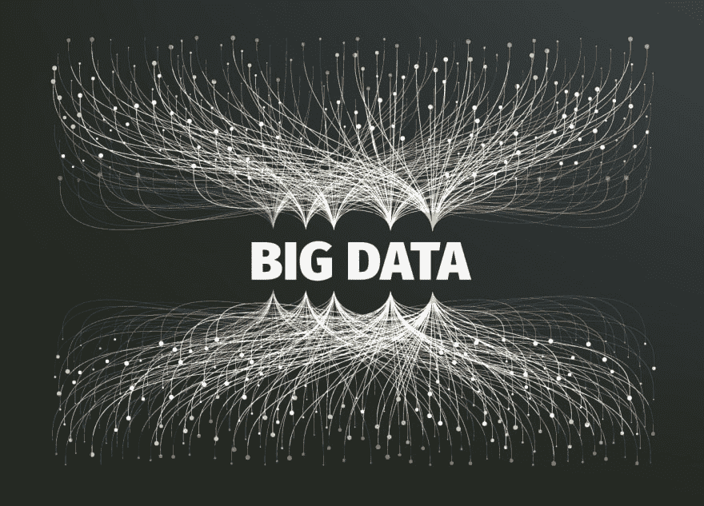

# 论数据工程的发展

> 原文：<https://dev.to/julienkervizic/on-the-evolution-of-data-engineering-51hk>

几年前，作为一名数据工程师意味着管理数据库内外的数据，在 SQL 或过程 SQL 中创建管道，并执行某种形式的 ETL 以将数据加载到数据仓库中，创建数据结构以非实时方式统一、标准化和(反)规范化数据集以用于分析目的。一些公司在此基础上增加了更面向前端的业务组件，包括为业务用户构建分析立方体和仪表板。

在 2018 年及以后，数据工程师的角色和范围发生了巨大变化。数据产品的出现创造了一个需要填补的空白，这需要传统上不包含在典型开发团队中的技能组合，更加面向软件开发的数据工程师和更加面向数据的后端工程师在填补这个空白中起着主要作用。

越来越多的技术促进了这种发展，这些技术有助于弥合数据工程和后端工程背景之间的差距。

 
**大数据**:大数据及其相关技术的出现彻底改变了数据格局。2006 年，随着 Hadoop 开源，存储大量数据变得更容易、更便宜，Hadoop 不像传统的 RDBMS 数据库那样需要大量的结构化工作来处理数据。在 Hadoop 上开发的复杂性最初相当高，需要用 Java 开发 Map Reduce 作业。处理大数据的挑战迫使从事分析数据工作流的后端工程师出现。直到 Hive 在 2010 年开源，更传统的数据工程师才能够在这个大数据时代获得一座简单的桥梁。

 
**数据编排引擎**:随着大数据的发展，大型互联网公司面临着在没有任何工具(如 SSIS)的情况下操作复杂数据流的挑战，这些工具用于在此生态系统中工作的更传统的 RDBMS。Spotify 于 2012 年开放了 sourced Luigi，并于 2015 年开放了 Airbnb Airflow(受 facebook 类似系统的启发)。这些编排引擎来自重型工程驱动的背景，本质上是作为代码的数据流。

Python 是大多数编排引擎所基于的语言，这有助于他们获得优势，这得益于 PyData 生态系统中的牵引力以及生产工程师对 python 的使用增加。进入这个生态系统的传统数据工程师需要适应并提高软件工程方面的技能。

 
**机器学习**:现在可以从互联网上收集数据，机器学习很快获得了牵引力。在 Hadoop 出现之前，机器学习模型通常在单台机器上训练，并且通常以非常特别的方式应用。对于大型互联网公司来说，在 Hadoop 的早期，利用机器学习模型需要一些高级软件开发知识，以便通过使用诸如 Mahout 利用 MapReduce 之类的框架来训练模型并将其应用到生产中。

一些后端工程师开始专攻这一领域，成为机器学习工程师，非常专注于生产的数据科学家。然而，对于许多初创公司来说，这种开发有些矫枉过正。对 2007 年开始的 python 项目 SKLearn 的改进，编排引擎的普及使得从数据科学家的概念验证到数据工程师针对中等规模数据集的生产就绪工作流变得相当容易。

 
**Spark &实时**:正是 2014 年 Spark 针对 python 的 MLlib 的发布，使得大数据上的机器学习计算民主化。API 与科学家们习惯的 PyData 生态系统中的数据非常相似，Spark 的进一步开发进一步帮助弥合了这一差距。Spark 进一步为数据工程师提供了一种轻松处理流数据的方式，为实时处理提供了一个窗口。Spark 增加了数据工程师对数据产品的贡献。

 
**云开发&无服务器** : AWS 于 2006 年正式推出，其存储层 S3 建立在 Hadoop 这个传统的大数据平台之上。Elastic Map Reduce 于 2009 年推出，使动态加速和扩展 Hadoop 集群以实现处理目的变得更加容易。

向云的迁移对数据工程师有多方面的影响。云抽象了物理限制，对于大多数用户来说，这意味着存储和计算本质上是无限的，只要有人能够支付得起。以前为保持业务运行而进行的优化(等待安装或升级新服务器)不再需要进行。由于资源限制，以前所做的任务调度以跨时间分配负载的工作也是如此。云通过允许扩大和缩小资源规模，使得处理数据工程中典型的高峰批处理作业变得更加容易。然而，这是以必须通过代码管理基础设施和扩展过程为代价的。

2014 年末 AWS 上 Lambda 功能的推出拉开了无服务器运动的序幕。从数据的角度来看，无需管理基础架构就可以轻松获取数据。2016 年末发布的 Athena 进一步推动了这一发展，允许直接在 s3 上进行查询，而无需设置集群。这将数据工程师从根据请求管理基础架构扩展中解放出来，使他们能够将更多时间用于开发。

* * *

数据工程师的角色不再只是为分析目的提供支持，而是数据流的所有者，能够为生产和分析目的提供数据。

为此，数据工程已经更多地着眼于软件工程的角度。Maxime Beauchemin 关于函数式数据工程的帖子提倡借用函数式编程的模式，并将其应用于数据工程。新兴的数据操作运动及其宣言反过来借鉴了软件工程中的 DevOps 运动。