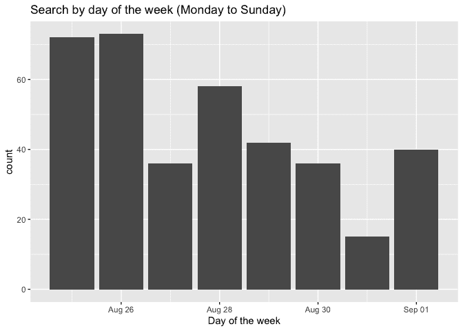

# 作为一个闪亮的开发者一周，通过谷歌搜索看到

> 原文：<https://dev.to/colinfay/one-week-as-a-shiny-dev-seen-through-google-search-1309>

几天前，我在 dev.to 上读到了一篇文章，标题是“作为一名软件工程师谷歌搜索”，链接到了索菲·库宁的博客[。然后，我想…嘿，我也应该那样做！](https://localghost.dev/2019/09/everything-i-googled-in-a-week-as-a-professional-software-engineer/)

## 获取数据

你可以在 takeout.google.com/下载你的浏览器数据。几分钟之内，我就有了一个漂亮的 JSON，可以带回 R.

```
res  <-  jsonlite::read_json("~/Downloads/Takeout/Chrome/BrowserHistory.json")  library(data.table)  library(magrittr)  df  <-  rbindlist(res[[1]],  fill  =  TRUE)  setDT(df)  str(df)  ## Classes 'data.table' and 'data.frame': 175321 obs. of 6 variables:  ## $ favicon_url : chr "https://www.google.com/favicon.ico" "https://www.google.com/favicon.ico" "https://www.google.com/favicon.ico" "https://www.google.com/favicon.ico" ...  ## $ page_transition: chr "LINK" "LINK" "LINK" "LINK" ...  ## $ title : chr "Télécharger vos données" "Gérer les archives" "Télécharger vos données" "Télécharger vos données" ...  ## $ url : chr "https://takeout.google.com/settings/takeout" "https://takeout.google.com/settings/takeout/downloads" "https://takeout.google.com/settings/takeout" "https://takeout.google.com/?pli=1" ...  ## $ client_id : chr "slOska0n/CmNUGlceIGQVQ==" "slOska0n/CmNUGlceIGQVQ==" "slOska0n/CmNUGlceIGQVQ==" "slOska0n/CmNUGlceIGQVQ==" ...  ## $ time_usec : num 1.57e+15 1.57e+15 1.57e+15 1.57e+15 1.57e+15 ...  ## - attr(*, ".internal.selfref")=<externalptr> 
```

首先，获取上周的数据。

这个诡异的时间柱呢？

```
df[,  .(time_usec  =  as.character(time_usec))]  %>%  head()  ## time_usec  ## 1: 1567623891808102  ## 2: 1567623890295210  ## 3: 1567623886825938  ## 4: 1567623866374017  ## 5: 1567623864604245  ## 6: 1567623851481596 
```

当看到这些数字时，人们会想到 [Unixt imestamp](https://en.wikipedia.org/wiki/Unix_time) ，也就是*“自 1970 年 1 月 1 日星期四 00:00:00 以来经过的秒数”*。那么……

```
df[,  .(time_usec  =  as.POSIXct(time_usec,  origin="1970-01-01"))]  %>%  head()  ## time_usec  ## 1: 49677993-08-02 03:48:22  ## 2: 49677993-07-15 15:33:30  ## 3: 49677993-06-05 11:52:18  ## 4: 49677992-10-11 18:46:57  ## 5: 49677992-09-21 07:10:45  ## 6: 49677992-04-22 09:59:56 
```

嗯，除非我被困在一个奇怪的时间机器里，或者《权力的游戏》的那一集非常非常长，否则我不记得我在那一年

我不知道为什么这些数字那么长:如果我们看今天的日期，我们得到的 UNIX 时间戳是

```
as.numeric(Sys.time())  ## [1] 1567969643  # versus  df[,  as.character(time_usec)]  %>%  head(1)  ## [1] "1567623891808102" 
```

今天的 UNIX 日期是一个 10 位数长的数字，其步长为一秒。该数据集中的时间戳是 16 位数长。但是我们也可以注意到，两者的前 10 位数字比较接近:`156780`和`156762`。

到目前为止，我的猜测是数据以微秒为单位，因为一微秒代表`1e-6`秒。让我们试一试:

```
df[,  time_usec  :=  as.POSIXct(time_usec  /  1e6,  origin="1970-01-01")][,  time_usec]  %>%  head()  ## [1] "2019-09-04 21:04:51 CEST" "2019-09-04 21:04:50 CEST"  ## [3] "2019-09-04 21:04:46 CEST" "2019-09-04 21:04:26 CEST"  ## [5] "2019-09-04 21:04:24 CEST" "2019-09-04 21:04:11 CEST" 
```

啊！这样看起来更好！我们过滤一下，把标题变成小写。

```
library(anytime)  week  <-  df[  time_usec  >  anytime("2019-08-25")  &  time_usec  <  anytime("2019-09-02")  ][,  tite  :=  tolower(title)  ] 
```

现在让我们只过滤谷歌搜索:

```
search  <-  week[  grep("www.google.com/search",  url),  ] 
```

并按天统计搜索次数:

```
library(ggplot2)  ggplot(search,  aes(as.Date(time_usec)))  +  geom_bar()  +  labs(  title  =  "Search by day of the week (Monday to Sunday)",  x  =  "Day of the week"  ) 
```

[](https://res.cloudinary.com/practicaldev/image/fetch/s--tuMwQMVx--/c_limit%2Cf_auto%2Cfl_progressive%2Cq_auto%2Cw_880/https://colinfay.me/assets/img/searchweek-1.png)

## 一些提取物

现在让我们来看看一些搜索词:

### 闪亮

```
search[
    grep("shiny", title), gsub(" - Recherche Google", "", title)
    ] %>% unique()

## [1] "suspend an observe event in shiny"         
## [2] "create a new shiny app from command line"  
## [3] "shiny flush react"                         
## [4] "shiny delete input binding"                
## [5] "shiny delete an input binding from ui side"
## [6] "shiny dashboard link to a specific tab"    
## [7] "remove input value shiny r"                
## [8] "remove input value shiny"                  
## [9] "log everything shiny does"                 
## [10] "shiny .graphDependsOnId"                   
## [11] "date picker widget shiny"                  
## [12] "jquery datepicker shiny"                   
## [13] "shiny daterangeinput end before finish"    
## [14] "shiny date range input"                    
## [15] "shinyapps io"                              
## [16] "dreal shiny apps"                          
## [17] "shinyexample"                              
## [18] "daterangeinput shiny end superior to start"
## [19] "shiny date range"                          
## [20] "shiny date picker"                         
## [21] "shiny DT disablee row name"                
## [22] "shiny jqui"                                
## [23] "shiny jsqui"                               
## [24] "option shiny browser viwer" 
```

您可以注意到:

*   我从来不记得如何设置 Shiny 使用哪个浏览器
*   我发现闪亮的日期范围输入不能在开始之前结束，并尝试寻找其他的选择。
*   还有这个奇怪的例子，我将一些 reactiveValue 保存到 MongoDB 存储中，当我试图重用它们时，出现了一个关于`.graphDependsOnId`函数未找到的错误。原来这是一个[老闪亮的函数](https://rdrr.io/github/ymd526442121/Rproject_shiny/src/R/graph.R)，它可能已经保存在 RDS 中保存在 mongo DB 中(嗯，这是我的猜测)。我的解决方案是从源代码中取出这段代码，放回我的应用程序中。
*   我在重启应用程序和`removeUI`功能的行为上遇到了一些麻烦，事实上[并没有删除输入值](https://github.com/rstudio/shiny/issues/2374)。此外，有趣的是，当用 Firefox 重新启动应用程序时，一些输入没有完全恢复，所以我想寻找一种方法(真的)从 JS 端删除输入(迄今为止没有成功)。
*   我还想知道是否有一种`shiny::createApp()`，它创建一个文件，里面有 app 的框架。当您使用 RStudio 界面创建应用程序时，您就有了一个应用程序框架。那一定在某个地方。

### R

```
search[  grep(" r ",  title),  gsub(" - Recherche Google",  "",  title)  ]  %>%  unique()  ## [1] "remove input value shiny r"  ## [2] "whereami r package"  ## [3] "wherami r package"  ## [4] "fs r package"  ## [5] "docopt r"  ## [6] "insert page break in pagedown r pacakge"  ## [7] "new page in pagedown r pacakge" 
```

Nop，还是想不起来如何在`{pagedown}`中插入分页符。

还有，还是不能把“包”写对。

### JavaScript

是的，作为一名优秀的开发人员意味着你要做大量的 JavaScript / jQuery。

```
search[  grep("javascript|jquery",  title),  gsub(" - Recherche Google",  "",  title)  ]  %>%  unique()  ## [1] "change variable evaluation environment in javascript"  ## [2] "environment in javascript"  ## [3] "comafy javascript"  ## [4] "jquery parent"  ## [5] "find element with data attribute jquery"  ## [6] "javascript function"  ## [7] "confirmation pop up in javascript"  ## [8] "function in javascript"  ## [9] "javascript void"  ## [10] "non standard evaluation in javascript"  ## [11] "list all variables javascript"  ## [12] "javascript reload page and launch a function"  ## [13] "javascript fin anywhere in object"  ## [14] "get class of javascript object"  ## [15] "get class of element jquery"  ## [16] "add onclick event jquery"  ## [17] "jquery datepicker shiny"  ## [18] "jquery launch function on div change"  ## [19] "jquery extract id of all children"  ## [20] "javascript for loop"  ## [21] "jquery drag and drop"  ## [22] "reorder list javascript" 
```

让我们承认:

*   我从来不记得 JavaScript 中 for 循环的正确语法。从来没有。我总是尝试。那是`;`，科林，也许写在那里会让我想起:)
*   “在对象中查找任意位置”和 JavaScript 启动和重新加载仍然链接到我在 Shiny issue 中的刷新输入。
*   显然，这比我想象的用 JavaScript 处理符号和环境要复杂得多