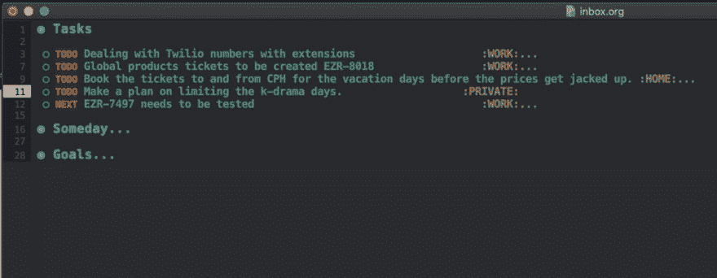
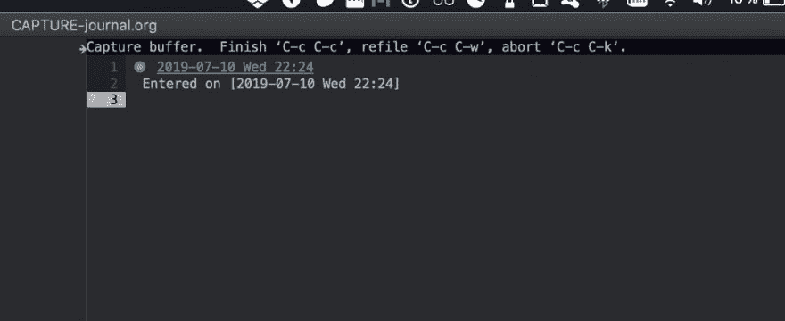

# 组织模式和 GTD

> 原文：<https://dev.to/gayanhewa/org-mode-and-gtd-4dmf>

我第一次接触 Org-mode 是在我开始尝试 emacs 的时候。我当时也没真的懂。这是 6 个多月前的事了。我无法理解社区里对它的大肆宣传。最重要的是，切换到 emacs 有一些瓶颈，因为出于某种原因，我不能正确地配置它来与 PHP 一起工作。虽然这种体验对于我使用过的其他语言来说很好，比如 Go 和 Python。

最近，当我看到 GTD(把事情做好)时，我受到了触动。为什么会有这种事？当我深入调查时，我在网上发现了一些非常好的资源，包括戴夫·艾伦的演讲和采访。作为一个懒惰的人，我去看了这个视频，它用几分钟总结了戴夫的书。

到现在为止，我已经把自己迷上了这个，我想知道更多，所以我去 youtube 上搜索。我看到了这个视频。

基本上，它解释了如何在 emacs 中使用 GTD。我发现的吸引人的一点是 Org-mode 中的所有东西都是文本文件。所以它不是花哨的工具，应用程序，它只是简单的列表。我用 Dropbox 来同步它们。纯粹是因为我需要时不时地从手机上查看它们。

在这之后，我开始创造适合我的心流。我到处借东西。尤其是 Rainer knig([他在 youtube 上有一个优秀的免费组织模式系列](https://www.youtube.com/playlist?list=PLVtKhBrRV_ZkPnBtt_TD1Cs9PJlU0IIdE)

我的工作流程现在看起来是这样的(它正在发展):

1.  daily-plan.org
2.  inbox.org
3.  work.org
4.  home.org
5.  private.org
6.  projects.org
7.  journal.org
8.  gcal.org
9.  gcal-work.org

基本上是每日计划。引用了现有的待办事项，我使用 Rainer 的捕获模板。

我还使用 Rainer 的代码片段，它允许我从其他 org 文件中复制链接。理想情况下，每日计划是每天制定的，包含了我当天计划要完成的任务。

然后是 inbox.org，这或多或少像是我遇到的任何事情的垃圾场。基本上，如果一天中有什么事情发生，或者如果我突然想起了什么，我会把它塞到这里。我有一个快速捕捉模板，这样做的热键组合。

我会每天查看收件箱。理想情况下，我制定每日计划的第一件事，也是在一天结束前的某个时候。在此期间，我会将项目重新归档到适当的组织文件中，然后添加任何所需的时间表/截止日期和注释。我也有总有一天和目标两个部分。我只是暂时把它们放在这里，因为它们中的大部分并不是每天都会发生的。我还在为他们寻找最好的去处。

顾名思义，work.org 和 home.org 基本上是我了解工作或家庭中发生的所有事情的地方。从工作项目、会议记录、购物清单，到家庭度假计划。当该列表中的物品准备好被提取时，它们将具有下一个状态。这基本上可以让我有一个不优先的后续任务列表。当我制定每日计划时，我会优先考虑。这纯粹是我可以采取行动的事情的清单。

private.org 是我写个人任务和笔记的地方。我必须做的事情来提高自己，比如我必须参加的课程，或者我分配的时间来做代码形，以及选择哪个代码形，等等。我在这个文件中也有一个转储部分。只是因为我有时会有这些随机的想法，关于我需要做些什么来改善我自己或我的生活状况。

如你所见，有一部分是为了将来某一天，这是因为我在试验是否应该把将来某一天和目标移到这里。

下一个文件是 project.org，这是我所有的业余项目和个人软件项目的地方。这基本上是我个人的特雷罗板。

journal.org 充当日记的日常笔记。这就抓住了一切。从夸夸其谈到自我记录等等，我使用一个带有日期和时间戳的快速捕获模板

接下来的两个文件 gcal.org 和 gcal-work.org 是将我的个人和工作日历同步到 Orgmode 的文件。我使用这个是因为当我进入我的议程视图(C-c a)时，我可以很容易地看到任何直接添加到 Google Cal 中的会议/事件。为此，我使用 GitHub 的第三方 fork 来处理 [org-gcal](https://github.com/kidd/org-gcal.el) 。

总之，这是我目前的设置。这不一定是永久的，因为我仍然在寻找更好的方法来提高。例如，现在我正在查看[抽屉](https://orgmode.org/manual/Drawers.html)。

如果您从组织模式开始，那么这是很好的资源:

1.  Rainer 的组织模式系列
2.  [https://emacscast.org](https://emacscast.org/)
3.  https://sachachua.com/blog 是任何电子邮件的首选。
4.  Rainer king[博客](https://koenig-haunstetten.de/tag/orgmode/)