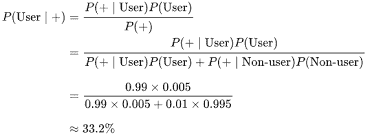
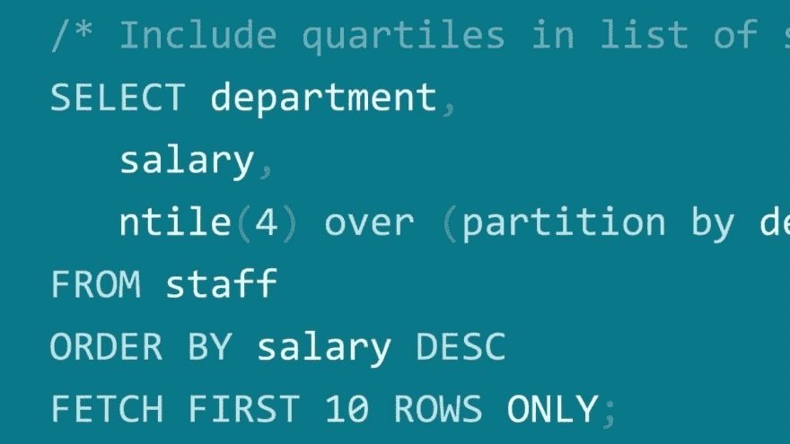
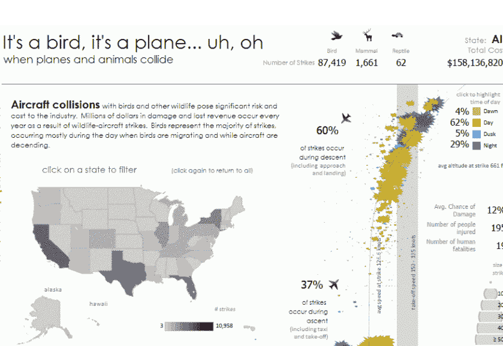

# Coursera 上我们最喜欢的免费机器学习课程

> 原文：<https://dev.to/seattledataguy/our-favorite-machine-learning-courses-on-coursera-for-free-25p6>

感觉不可能跟上数据科学和机器学习的每一个新概念和新技术。你有多种语言、库和设计原则。

我们撰写了关于不同资源的文章，可以帮助数据专业人员跟上各种技术的发展。然而，这些课程中有许多是要花钱的。

但是 coursera 提供了一个从实际的大学和教育机构免费学习在线课程的机会。这可以让你对机器学习、深度学习、统计学等概念有更深入的理解。

一个问题是 coursera 有数百门机器学习课程，因此很难筛选出哪些课程值得学习。所以我们列出了我们个人的最爱！

小贴士:Coursera 可以让你觉得购买课程是唯一的选择。但是他们确实在最下面有一个审计按钮。现在，如果你欣赏 Coursera，无论如何，你应该购买他们的专业化，我仍然不确定我对它的感觉。但是，我喜欢上 Coursera 的课程。

选择“审计课程”选项，不支付课程费用。

## 1。概率与数据导论

本课程向您介绍数据采样和探索，以及基本的概率论和贝叶斯法则。你将检视各种类型的取样方法，并讨论这些方法如何影响推论的范围。将涵盖各种探索性的数据分析技术，包括数字汇总统计和基本的数据可视化。您将被指导安装和使用 R 和 RStudio(免费统计软件)，并将使用该软件进行实验室练习和期末项目。本课程中的概念和技术将作为专业中推理和建模课程的基础。

[参加课程](https://www.coursera.org/learn/probability-intro?ranMID=40328&ranEAID=GjbDpcHcs4w&ranSiteID=GjbDpcHcs4w-IhPm.rSTz2uiKSydh8ky6A&siteID=GjbDpcHcs4w-IhPm.rSTz2uiKSydh8ky6A&utm_content=10&utm_medium=partners&utm_source=linkshare&utm_campaign=GjbDpcHcs4w)

## 2。完整的统计课程

在本专业中，您将学习分析和可视化 R 中的数据并创建可再现的数据分析报告，展示对统计推断统一性质的概念性理解，执行 frequentist 和 Bayesian 统计推断和建模以理解自然现象并做出基于数据的决策，正确、有效地在不依赖统计术语的情况下交流统计结果，评论基于数据的声明和评估基于数据的决策，以及使用 R 包争论和可视化数据以进行数据分析。

[参加课程](https://www.coursera.org/specializations/statistics?ranMID=40328&ranEAID=GjbDpcHcs4w&ranSiteID=GjbDpcHcs4w-itbq0N_X3FwcjaT51abnaA&siteID=GjbDpcHcs4w-itbq0N_X3FwcjaT51abnaA&utm_content=10&utm_medium=partners&utm_source=linkshare&utm_campaign=GjbDpcHcs4w)

## 3。数据科学家的工具箱

在本课程中，你将学习如何用 R 编程，以及如何使用 R 进行有效的数据分析。您将学习如何安装和配置统计编程环境所需的软件，并描述用高级统计语言实现的通用编程语言概念。本课程涵盖了统计计算中的实际问题，包括用 R 编程、将数据读入 R、访问 R 包、编写 R 函数、调试、分析 R 代码以及组织和注释 R 代码。统计数据分析的主题将提供工作实例。

[参加课程](https://www.coursera.org/learn/data-scientists-tools?specialization=jhu-data-science&ranMID=40328&ranEAID=GjbDpcHcs4w&ranSiteID=GjbDpcHcs4w-VLUj5mi6tS1DcurIjU1T7A&siteID=GjbDpcHcs4w-VLUj5mi6tS1DcurIjU1T7A&utm_content=10&utm_medium=partners&utm_source=linkshare&utm_campaign=GjbDpcHcs4w)

## 4。用于数据科学的 Sql

数据科学家不仅仅依靠 python 和 R 来完成他们工作。作为一名数据科学家，您经常需要从 Hadoop 和 MySQL 等数据存储系统中获取数据。为了与这些系统接口，您可以使用像 Presto 这样的 SQL 引擎来访问数据，并以一种更容易处理的方式格式化数据。

这意味着你需要了解 SQL。多半

[参加课程](https://www.coursera.org/learn/analytics-mysql?ranMID=40328&ranEAID=GjbDpcHcs4w&ranSiteID=GjbDpcHcs4w-lpiYlFss189MoJb0rWvg6w&siteID=GjbDpcHcs4w-lpiYlFss189MoJb0rWvg6w&utm_content=10&utm_medium=partners&utm_source=linkshare&utm_campaign=GjbDpcHcs4w)

## 5。用 Tableau 实现数据可视化

我们最近的一个项目是帮助一家咨询公司开发一个仪表板，为他们的客户提供进一步的价值。仪表板和图表等数据可视化有助于更好地用数据传达重要信息。它们有助于将复杂的数据集简化为最终用户更容易理解的简明图像和图表。
这就是为什么我们建议每个数据科学家都具备一些数据可视化技能。

在这里，我们将推荐两个不同的 Coursera 课程。首先，我们推荐加州大学戴维斯分校提供的数据可视化专业。同样，你不需要付钱就能拿到证书，你可以随时旁听课程。

如果你是 tableau 的新手，我们建议你参加所有的课程。这种专业化将带您了解构建漂亮仪表板的基础知识。

[参加课程](https://www.coursera.org/specializations/data-visualization?ranMID=40328&ranEAID=GjbDpcHcs4w&ranSiteID=GjbDpcHcs4w-wXwT1hkJc1OxaD1yowljSw&siteID=GjbDpcHcs4w-wXwT1hkJc1OxaD1yowljSw&utm_content=10&utm_medium=partners&utm_source=linkshare&utm_campaign=GjbDpcHcs4w)

## 6。用 Python 实现数据可视化

Tableau 不是唯一的数据可视化工具，也不是所有的数据科学家都喜欢使用它。有些人只是想用 python 把简单的图形放在一起。幸运的是，python 在数据可视化库方面有很多很好的选择。例如 Matplotlib、Seaborn 和 leav。作为使用这些库的入门课程，这门 IBM 课程做得非常好。

它将向你介绍所有的基本图表，并教你如何使用地理空间数据。这个课程也很短。因此，对于那些试图对这些库有一个基本了解的人来说，这是非常好的。

[参加课程](https://www.coursera.org/learn/python-for-data-visualization?ranMID=40328&ranEAID=GjbDpcHcs4w&ranSiteID=GjbDpcHcs4w-WvkVW3tGZl7JxMZkfmIRjg&siteID=GjbDpcHcs4w-WvkVW3tGZl7JxMZkfmIRjg&utm_content=10&utm_medium=partners&utm_source=linkshare&utm_campaign=GjbDpcHcs4w)

## 7。用 Python 进行机器学习

本课程使用一种平易近人且广为人知的编程语言 Python 深入研究机器学习的基础知识。在本课程中，他们将回顾两个主要部分:
首先，您将了解机器学习的目的以及它在现实世界中的应用。

第二，你将对机器学习的主题有一个总体的了解，比如监督与非监督学习、模型评估和机器学习算法。

在本课程中，您将使用机器学习的真实例子进行实践，并了解它如何以您可能猜不到的方式影响社会！

[参加课程](https://www.coursera.org/learn/machine-learning-with-python?ranMID=40328&ranEAID=GjbDpcHcs4w&ranSiteID=GjbDpcHcs4w-cZf9tieNHJ.EWo7FG4zHtg&siteID=GjbDpcHcs4w-cZf9tieNHJ.EWo7FG4zHtg&utm_content=10&utm_medium=partners&utm_source=linkshare&utm_campaign=GjbDpcHcs4w)

## 8。IBM 的专业机器学习认证

数据科学仍然是“最性感的工作”之一，即使在最初发表这一观点的文章发表五年后。
事实上，我们专注于帮助人们面试数据科学职位的文章是我们读者最多的文章之一！

由于没有很多数据科学本科学位，大多数人需要学习一些数据科学的基础知识，以便更好地为工作做准备。IBM 特别推出了 9 门课程和一个专业，您可以免费试用！我这么说是因为也许你正在考虑是否要花 14k 在训练营上。好吧，解决这个问题的一个好方法是花一些时间做一个免费的数据科学课程。

coursera 的这个专业特别出色，从“什么是数据科学”开始，以一个顶点结束。他们在提供数据科学家所做的工作类型的广泛和深入的观察方面做得很好。此外，没有支付的风险。有些人付费是为了在他们的 Linkedin 上获得证书，这对一些人有帮助，但我们只是想了解课程是如何设置的。

[参加课程](https://www.coursera.org/professional-certificates/ibm-data-science?ranMID=40328&ranEAID=GjbDpcHcs4w&ranSiteID=GjbDpcHcs4w-YrMrD2zUhXuy02i__apa9Q&siteID=GjbDpcHcs4w-YrMrD2zUhXuy02i__apa9Q&utm_content=10&utm_medium=partners&utm_source=linkshare&utm_campaign=GjbDpcHcs4w)

## 9。为经理建立数据科学团队

我们最近发现，Coursera 不仅为试图提高技术水平的个人贡献者提供数据科学课程。他们最近还开始为希望组建数据科学团队的经理和高管推出课程。

一些经理从未与大多数数据科学团队拥有的各种数据专家合作过。这可能很困难，因为数据科学仍然有些新，知道如何最大化您的数据科学团队可能需要快速复习。

本课程涵盖以下概念:

*   不同数据科学家的预期资格是什么
*   如何面试适合数据科学的人才
*   上车
*   等等。

所有这些可能看起来微不足道，但确保你有正确的团队，他们有成功的过程是非常重要的。如果你是一名高管，或者希望有一天能管理一个数据科学团队，那么可以考虑参加这个课程。

[参加课程](https://www.coursera.org/professional-certificates/ibm-data-science?ranMID=40328&ranEAID=GjbDpcHcs4w&ranSiteID=GjbDpcHcs4w-5yFfWFzFRoiF.hzFOZrg7Q&siteID=GjbDpcHcs4w-5yFfWFzFRoiF.hzFOZrg7Q&utm_content=10&utm_medium=partners&utm_source=linkshare&utm_campaign=GjbDpcHcs4w)

## 10。现实生活中的数据科学

管理任何类型的团队的一部分就是知道团队的成功是什么样子的。

为了知道成功是什么样子…你必须亲眼目睹。这意味着，如果你是管理数据科学团队的新手，并且可能并不总是在对成功有明确预期的公司工作，你可能需要一个速成班。

这是约翰·霍普斯金再次突袭的地方。他们开设了一门课程来帮助解释现实生活中的数据科学。本课程将讨论实验设计、偏倚、数据质量等。他们很好地展示了数据科学在现实生活中的作用。拥有好的数据科学的例子和框架将有助于推动你的团队取得成功。

[参加课程](https://www.coursera.org/learn/real-life-data-science?specialization=executive-data-science&ranMID=40328&ranEAID=GjbDpcHcs4w&ranSiteID=GjbDpcHcs4w-XjCm5DvlxIH1nyx3pgvTaA&siteID=GjbDpcHcs4w-XjCm5DvlxIH1nyx3pgvTaA&utm_content=10&utm_medium=partners&utm_source=linkshare&utm_campaign=GjbDpcHcs4w)

## 11。用 R 进行软件开发

许多人纯粹出于分析目的使用 R，老实说，这是我们认为 R 最适用的地方。然而，我们相信你可以使用软件开发原则来更好地开发你的 R 脚本。

不需要一两个主脚本来运行所有的东西，在 R 中构建可重用的函数和实用程序是可能的，这可以在未来的项目中节省大量时间。

这就是本课程将涵盖的内容。特别是，它将涵盖高级编程，对于那些没有编程背景的数据科学家来说，这将填补很多空白。

[参加课程](https://www.coursera.org/learn/advanced-r?specialization=r&ranMID=40328&ranEAID=GjbDpcHcs4w&ranSiteID=GjbDpcHcs4w-jlF7rvS_7vcRd4Ff_Pyy3g&siteID=GjbDpcHcs4w-jlF7rvS_7vcRd4Ff_Pyy3g&utm_content=10&utm_medium=partners&utm_source=linkshare&utm_campaign=GjbDpcHcs4w)

## 12。谷歌云平台大数据和机器学习基础

好的，当然谷歌云在 Coursera 上开发了他们自己的机器学习课程……嗯……谷歌云。

但让我们越过谷歌试图创造的明显商业价值。你可能会使用谷歌云来进行机器学习，这是有原因的，没有人比创建它的人更适合学习它。

我们真正喜欢这门课程的是它涵盖了如此多的不同技术。

它涵盖了云 QL、Spark、带 ML 的 Biq 查询、Vision API 和 Cloud AutoML。你可以看出他们真的在努力销售这些产品；).他们试图推销产品并没有错。太棒了！在你投入太多之前，他们会让你看看他们的产品。

现在，我们要补充的是，将它与 AWS 和其他类似的云技术进行比较非常重要。但是，花点时间看看你在谷歌云技术中发现了什么有用的东西。

[参加课程](https://www.coursera.org/learn/gcp-big-data-ml-fundamentals?ranMID=40328&ranEAID=GjbDpcHcs4w&ranSiteID=GjbDpcHcs4w-axDAAzePmjBSu2IQ6WgHwQ&siteID=GjbDpcHcs4w-axDAAzePmjBSu2IQ6WgHwQ&utm_content=10&utm_medium=partners&utm_source=linkshare&utm_campaign=GjbDpcHcs4w)

## 13。构建机器学习项目

这门课在 Coursera 提供的数百门机器学习课程中非常隐蔽。它专注于建立一个成功的机器学习项目。如果你渴望成为人工智能领域的技术领导者，并知道如何为你的团队工作设定方向，本课程将向你展示如何去做。时间不长，所以没有真正的理由付钱。相反，只需参加 4 个小时的课程

在这 4 个小时中，您将了解如何诊断机器学习系统中的错误，并能够优先考虑最有希望减少错误的方向。此外，您将了解复杂的 ML 设置，例如不匹配的训练/测试集，以及与人类水平的性能进行比较和/或超越

对于任何学习机器的人来说，这都是一门很棒的速成课程。

[参加课程](https://www.coursera.org/learn/machine-learning-projects?ranMID=40328&ranEAID=GjbDpcHcs4w&ranSiteID=GjbDpcHcs4w-UqqHB03tjhGNf4CcgguoNw&siteID=GjbDpcHcs4w-UqqHB03tjhGNf4CcgguoNw&utm_content=10&utm_medium=partners&utm_source=linkshare&utm_campaign=GjbDpcHcs4w)

## 14。改进深度神经网络:超参数调整、正则化和优化

神经网络不应该是黑匣子，你只是把数据扔进去，然后把一些数据拿出来。

这个课程会教你让深度学习很好工作的“魔法”。深度学习过程不是一个黑盒，你将理解什么驱动性能，并能够更系统地获得良好的结果。你也将学习张量流。

您将学习如何有效地使用常见的神经网络“技巧”，包括初始化、L2 和漏失正则化、批量归一化、梯度检查等，最重要的是，您将能够在 TensorFlow 中实现神经网络。

这个课程会教你让深度学习很好工作的“魔法”。而不是深度学习过程…

[参加课程](https://www.coursera.org/learn/deep-neural-network?ranMID=40328&ranEAID=GjbDpcHcs4w&ranSiteID=GjbDpcHcs4w-ik86U_qTGOA7pJmvbpvnpg&siteID=GjbDpcHcs4w-ik86U_qTGOA7pJmvbpvnpg&utm_content=10&utm_medium=partners&utm_source=linkshare&utm_campaign=GjbDpcHcs4w)

## 15。机器学习(经典)

没有吴恩达的经典机器学习课程，机器学习课程列表是不完整的。

本课程提供了机器学习、数据挖掘和统计模式识别的广泛介绍。它分解了像监督学习，支持向量机，内核，神经网络，无监督学习等主题。它还讨论了机器学习的最佳实践，如偏差/方差理论；机器学习和人工智能中的创新过程。Andrew 使用了大量优秀的案例研究和示例，帮助用户将主题与现实世界联系起来。

[参加课程](https://www.coursera.org/learn/machine-learning?ranMID=40328&ranEAID=GjbDpcHcs4w&ranSiteID=GjbDpcHcs4w-xQ0e4DJThcH9fVYhdKOxLA&siteID=GjbDpcHcs4w-xQ0e4DJThcH9fVYhdKOxLA&utm_content=10&utm_medium=partners&utm_source=linkshare&utm_campaign=GjbDpcHcs4w)

数据科学是一个很难跟上的领域。但是希望这些课程有助于提供一个学习更多相关知识的机会！

#### 如果你喜欢那个帖子，那么考虑看看下面的一些帖子吧！

[学习数据科学:我们排名前 25 的数据科学课程](https://www.coriers.com/25-of-the-best-data-science-courses-online/)
[数据科学面试指南](https://www.coriers.com/the-data-science-interview-study-guide/)
[软件工程师面试学习指南](https://www.coriers.com/the-interview-study-guide-for-software-engineers/)
[关于数据科学和编程的 10 篇好文章](https://hackernoon.com/10-great-articles-on-data-science-and-programming-eec816941896)
[将 CSV 数据动态批量插入 SQL 服务器](https://www.youtube.com/watch?v=2bBsYmQjzSE&t=4s)
[4 数据科学家必须具备的技能](https://www.theseattledataguy.com/4-skills-data-scientist-must-have/)