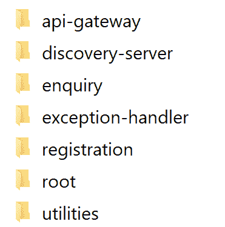

# 第 1 部分:Spring & Gradle -多模块项目

> 原文：<https://dev.to/pandiyan90/part-1-spring-gradle-multi-module-project-1j8a>

概述:

在本文中，我们将实现一个 spring boot 多模块应用程序。我们将使用 gradle 构建系统。这里的目标是创建一个微服务应用程序，这将在接下来的文章中讨论。

布局:

这里我们将使用平面布局来保持应用程序目录作为根项目目录(图 1)的兄弟。平面布局的优点是我们可以为每个应用程序创建不同的 git 存储库。在根项目的 settings.gradle 文件中，我们需要对子项目使用 includeFlat。

[](https://res.cloudinary.com/practicaldev/image/fetch/s--RdqEyGjZ--/c_limit%2Cf_auto%2Cfl_progressive%2Cq_auto%2Cw_880/https://thepracticaldev.s3.amazonaws.com/i/0bw7f9rk9tox61s848cd.png) 
Pic-1。目录结构

项目:根

此项目只有项目配置文件，如 build.gradle 和 settings.gradle。

settings.gradle:

```
rootProject.name = 'root'

includeFlat 'utilities', 'exception-handler’, 'discovery-server'
includeFlat 'enquiry', 'api-gateway', 'registration' 
```

build.gradle:

```
buildscript {

 ext {
  springBootVersion = '2.1.6.RELEASE' 
 }

repositories {
 mavenCentral()
}

dependencies {
 classpath("org.springframework.boot:spring-boot-gradle- plugin:${springBootVersion}")
 }
}

subprojects {

 apply plugin: 'java'
 apply plugin: 'org.springframework.boot'
 apply plugin: 'io.spring.dependency-management'

 group = 'com.apandiyan'
 version = '0.0.1'
 sourceCompatibility = '1.8'
 repositories {
  mavenCentral()
 }

 ext {
  set('springCloudVersion', "Greenwich.SR1")
 }

 dependencies {
  implementation 'org.springframework.boot:spring-boot-starter-web'
  testImplementation 'org.springframework.boot:spring-boot-starter-test'
 }

 dependencyManagement {
  imports {
   mavenBom "org.springframework.cloud:spring-cloud- dependencies:${springCloudVersion}"
  }
 }
} 
```

来源:[https://github . com/pandi Yan 90/microservice-blog/tree/master/root](https://github.com/pandiyan90/microservice-blog/tree/master/root)