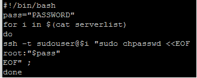

# 密码更改通过 sudo 用户验证。

> 原文：<https://dev.to/pauljany/password-change-authenticate-with-sudo-user-107>

Bash 脚本是 Linux 管理员常用的脚本之一。我遇到过这样的情况，我不得不改变大量服务器的根密码。禁用直接 root 登录，身份验证通过 sudo 用户进行。我写了一个非常简单的“for”循环，它完成了任务。我想与你分享这一点，并希望对热衷于 shell 脚本的新手有所帮助。

serverlist 包含要更改密码的 IP 列表。密码已更改为复杂密码，而不仅仅是密码。注意不要放引号""，可以随意放通配符。要替换为 sudo 帐户的 sudouser。

对于 SSH，需要根据以下要求提供多个选项。它可以传递 sudo 密码(使用 sshpass/expect 实用程序)或自定义 ssh 端口，或者禁用主机密钥检查..等等取决于你的基础设施有多安全。这里，我提供了 ssh 命令行选项"-t "，因为 requiretty(命令执行需要终端)是所有 serverlist 上的强制选项。

但是上面的命令不是完全自动化的。它提示输入 sudo 密码“sudo 用户的[sudo]密码”，并且必须一直手动提供 sudo 密码。如果配置了无密码 sudo，事情会变得很简单，但大多数时候情况并非如此。我打破了我的头通过 sudo 密码与多个选项，并最终徒劳无功。刚刚提供了“sudo -S”，但不幸的是没有工作。

这个脚本不起作用..

任何热情的 shell 脚本编写人员，如果有任何能使脚本完全自动化的工作，我将不胜感激...