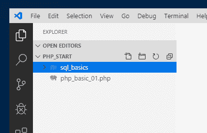
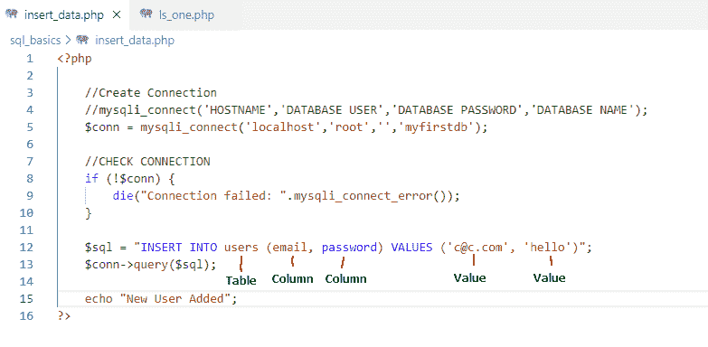
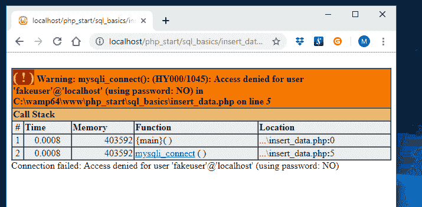

# PHP 和 SQL:连接到数据库

> 原文：<https://dev.to/th3n00bc0d3r/php-and-sql-connect-to-database-48a5>

## SQL 到底是个什么鬼？

SQL 代表结构化查询语言。它只是为选择、更新、删除和插入数据到关系数据库系统(如 MySQL、MariaDB)而创建的语法。

现在让我们进入游戏。在我们的 PHP 项目中创建一个名为 sql_basics 的文件夹，然后在文件夹中创建一个名为 insert_data.php 的文件。

[](https://res.cloudinary.com/practicaldev/image/fetch/s--TZU6zkw1--/c_limit%2Cf_auto%2Cfl_progressive%2Cq_auto%2Cw_880/https://thepracticaldev.s3.amazonaws.com/i/20y741er5y164nth98ck.png)

现在让我们看看文件中的这段代码。

[](https://res.cloudinary.com/practicaldev/image/fetch/s--EYTDBJIN--/c_limit%2Cf_auto%2Cfl_progressive%2Cq_auto%2Cw_880/https://thepracticaldev.s3.amazonaws.com/i/oyr7db50g2bb2228jbja.png)T3】

```
$conn = mysqli_connect('localhost','root','','myfirstdb'); 
```

Enter fullscreen mode Exit fullscreen mode

我们创建了一个名为$conn 的变量，并调用了 PHP 自带的内置函数 mysqli_connect。这个函数为我们完成了建立连接的所有工作。该函数有 4 个值。

*   数据库主机
*   数据库用户
*   数据库密码
*   数据库名称

现在，一旦您运行它，它将尝试创建到数据库的连接。

```
if (!$conn) {
   die("Connection failed: ".mysqli_connect_error());
} 
```

Enter fullscreen mode Exit fullscreen mode

接下来，我们将检查是否建立了连接。因此，我们创建了一个 if 函数，如果它没有返回 true，那就意味着有问题。我们将终止连接并抛出错误。现在，如果没有错误产生，代码将向前运行。

**记住，在 PHP 中，代码是自上而下执行的，这意味着首先执行文件开头的部分，然后随着文件的执行，其他部分也执行**

**一些趣事**
我现在将运行下面的代码；

```
$conn = mysqli_connect('localhost','fakeuser','','myfirstdb'); 
```

Enter fullscreen mode Exit fullscreen mode

[](https://res.cloudinary.com/practicaldev/image/fetch/s--TQuYwc-3--/c_limit%2Cf_auto%2Cfl_progressive%2Cq_auto%2Cw_880/https://thepracticaldev.s3.amazonaws.com/i/yiig6d9ek39gmqhwt6ob.png)

看看，像冠军一样拿走了！，这就是错误的样子，如果你读了，就会明白。

**在数据库中插入一个条目**

```
$sql = "INSERT INTO users (email, password) VALUES ('c@c.com', 'hello')"; 
```

Enter fullscreen mode Exit fullscreen mode

我们刚刚创建了一个名为$sql 的变量，并在其中创建了一个名为 sql 的 s 字符串。SQL 有一个 build in 命令，INSERT INTO，然后我们指定要添加条目的表名。现在，第一个括号将包含我们要输入数据的列，然后是 VALUES 标记，在第二个括号中，我们将输入值。第一个值[c@c.com](mailto:c@c.com)正在被输入到电子邮件中。第二个值 hello 将进入密码列。

**永远记住单引号对于查询成功运行非常重要**

```
$conn->query($sql); 
```

Enter fullscreen mode Exit fullscreen mode

现在，这个简单的语句要求 PHP 将 SQL 传递给 SQL 语言，并在数据库上运行查询。

**删除**

```
$sql = "DELETE FROM users WHERE id = '1'"; 
```

Enter fullscreen mode Exit fullscreen mode

删除相对简单，因为它是基于条件的，所以您将基于条件进行删除。

**更新**

```
$sql = "UPDATE users SET password = 'hello', name = 'Mr. Yes' WHERE id = '3'"; 
```

Enter fullscreen mode Exit fullscreen mode

更新也是可以理解的，不像你更新值那样，基于一个条件。

**选择**

```
$sql = "SELECT * FROM users WHERE id = '3'";
$result = $conn->query($sql);
$user =  $result->fetch_array();
print_r($user); 

//OUTTPUT
Array ( 
  [id] => 3, 
  [date] => 2019-08-08 14:44:58, 
  [email] => test@test1.com, 
  [password] => hello, 
  [name] => Mr. Yes 
) 
```

Enter fullscreen mode Exit fullscreen mode

现在我们已经选择了一个 ID 为 3 的用户，因此我们需要将来自$conn 的响应存储在一个$result 变量中，然后将其作为一个数组取出。现在当我们打印数组时，我们会得到这样的输出。

**选择多个**

```
$sql = "SELECT * FROM users";
$result = $conn->query($sql);

while ($row = $result->fetch_array()) {
   print_r($row);
} 
```

Enter fullscreen mode Exit fullscreen mode

现在，为了获得多个结果，我们需要将它放入一个 while 循环中，这个循环会一直运行，直到用完所有结果。

### 现在万事俱备

```
//Create Connection
$conn = mysqli_connect('localhost','root','','noob_cms');

//CHECK CONNECTION
if (!$conn) {
    die("Connection failed: ".mysqli_connect_error());
}

//Insert
$sql = "INSERT INTO users (email, password, name) VALUES ('test@test.com', 'test', 'Mr. Test')";

//DELETE
$sql = "DELETE FROM users WHERE id = '1'";

//UPDATE
$sql = "UPDATE users SET password = 'hello', name = 'Mr. Yes' WHERE id = '3'";

//SELECT for Multiple
$sql = "SELECT * FROM users";
$result = $conn->query($sql);
while ($row = $result->fetch_array()) {
   var_dump($row);
}

//SELECT FOR single
$sql = "SELECT * FROM users WHERE id = '3'";
$result = $conn->query($sql);
$user =  $result->fetch_array();
var_dump($user);
echo $user['name']; //Prints Name 
```

Enter fullscreen mode Exit fullscreen mode

请随意问任何问题。

[Noob 指数](https://dev.to/th3n00bc0d3r/noob-guides-index-4mne)