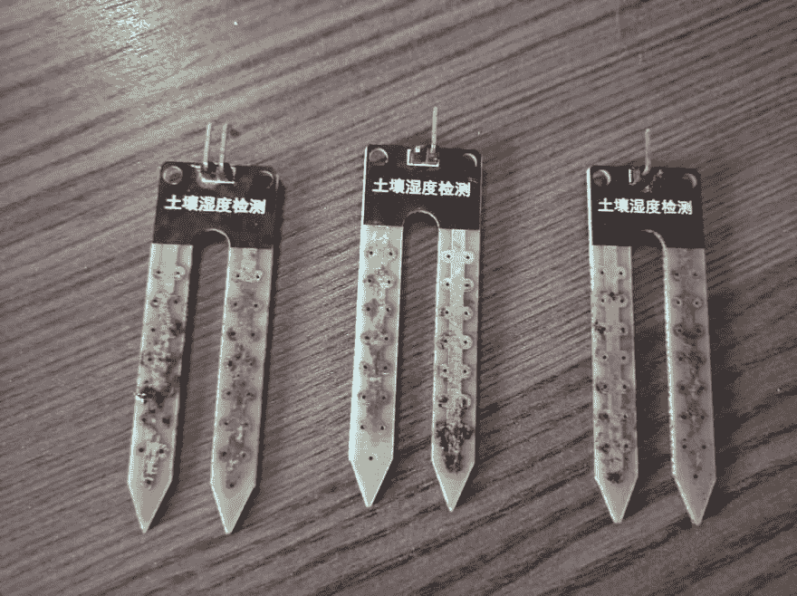
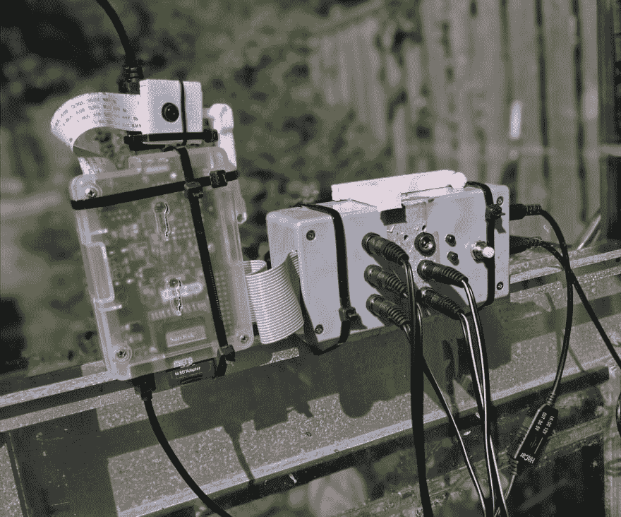

# Pirrigator，第 7 部分:出现问题

> 原文：<https://dev.to/neilgall/pirrigator-part-7-problems-emerge-15la>

在基本层面上，一切都已经工作了几个星期了，植物都长得很好，看起来很健康。但是，两个主要的、可能相关的问题已经出现。

首先，电池电量低了几次，导致充电控制器切断树莓 Pi 的电源，以防止电池过度消耗。我们已经经历了几个星期相当沉闷的天气和相当多的雨水，所以可能电池板还不能提供足够的能量。但我怀疑另一个问题。

湿度传感器腐蚀得非常快，在足够多的金属影响读数之前，会持续大约两周。我认为这里的根本问题，也许在这两种情况下，是我没有在电路中建立任何开关。所有的传感器都是持续供电的，尽管我只是很少读取它们。有恒定的电流流过这些湿度电极，为土壤中的水提供持续的化学反应。类似地，BME280 天气电路持续供电，尽管我每 5 分钟才读取一次。读取最多需要几毫秒，所以即使它的能量需求不大，也有 99.99%被浪费了。

这将是混乱的，但我计划添加一些额外的电路使用 NPN 晶体管来切换传感器的电源，并从 Raspberry PI GPIO 引脚控制这些-我还剩下一些。稍微调整一下代码就可以打开电源，等待适当的时间让一切稳定下来，读取传感器，然后再次关闭电源。

我还尝试了几次代码重构，遇到了借用 Rust 的问题。我猜这是正常的 Rust 学习曲线，但有时它已经开始感觉像艰苦的工作。我一直碰到的一个特殊问题是迭代数据结构的一部分，访问循环中的另一部分——迭代器借用了整个部分，所以我不能在循环体中得到第二次借用。我敢肯定，有一个锈习语来处理这一点，但我的搜索到目前为止一无所获。显然我需要多读一些别人的 Rust 代码。

我将再次更新改良电子产品的性能。在我们出发去度假几个星期之前，时间已经不多了，我需要一些可以依赖的东西。