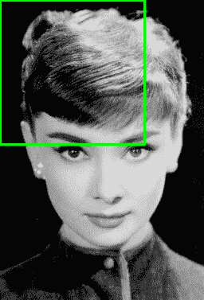

# 将 C 语言编写的人脸检测器移植到 WebAssembly 中

> 原文：<https://dev.to/unqlite_db/porting-a-face-detector-written-in-c-to-webassembly-27p6>

在本文中，我们将分享我们用来将纯 C 编写的[实时人脸检测](https://github.com/symisc/sod)运行时移植到 WebAssembly 的方法。最终结果包括 **WASM 二进制**、**人脸模型**和导出的 Javascript 接口可供下载，并准备好**集成到现有项目**中，以便在浏览器中进行实时人脸检测。

#### 浏览器内演示

最终的工作演示显示在[SOD . pixlab . io/articles/real time-face-detection-web assembly . html](https://sod.pixlab.io/articles/realtime-face-detection-webassembly.html)。

让我们开始吧:

*   [WebAssemby](#webasm)
*   [人脸检测](#facedetect)
*   [RealNet 人脸检测器](#realnet)
*   [SOD 计算机视觉库](#sodcv)
*   [C/c++ API](#capi)
*   [WebAssembly 工具链](#wasm)
*   [Javascript 集成& API](#jsapi)
*   [模型部署](#model_deploy)
*   [结论](#conc)

#### 网络大会

WebAssembly 是一种可以在现代 web 浏览器中运行的新型代码，它是一种低级的类似汇编的语言，具有紧凑的二进制格式，以接近本机的性能运行，并为 C/C++和 Rust 等语言提供编译目标，以便它们可以在 web 上运行。它还被设计成与 JavaScript 并行运行，允许两者协同工作。*来源-[MDN](https://developer.mozilla.org/en-US/docs/WebAssembly)T3。*

WebAssembly 旨在补充 JavaScript 并与其一起运行，使用 WebAssembly JavaScript APIs，您可以将 WebAssembly 模块加载到 JavaScript 应用程序中，并在两者之间共享功能。这使您可以在相同的应用程序中利用 WebAssembly 的性能和功能以及 JavaScript 的表现力和灵活性，即使您不知道如何编写 WebAssembly 代码。*来源-[MDN](https://developer.mozilla.org/en-US/docs/WebAssembly)T3。*

#### 人脸检测

自 21 世纪初以来，人脸检测一直是一个解决的问题，但现在实际上面临一些挑战，包括在低端移动/物联网设备的廉价 CPU 上实时找到微小的非正面人脸。

[](https://res.cloudinary.com/practicaldev/image/fetch/s--GG-yEeNJ--/c_limit%2Cf_auto%2Cfl_progressive%2Cq_66%2Cw_880/https://www.pyimagesearch.com/wp-content/uploads/2014/10/sliding_window_example.gif)

最广泛使用的技术是方向梯度直方图(简称为 [HOG](https://en.wikipedia.org/wiki/Histogram_of_oriented_gradients) )和支持向量机( [SVM](https://en.wikipedia.org/wiki/Support_vector_machine) )的组合，其实现了**一般到相对较好的检测率**，给出了高质量的图像。算法是这样工作的:

*   给定一个输入图像或视频帧，计算它的[金字塔表示](https://en.wikipedia.org/wiki/Pyramid_(image_processing))，它是原始图像的多尺度(可能是[高斯](https://sod.pixlab.io/c_api/sod_gaussian_noise_reduce.html))下降版本的堆叠。对于金字塔上的每个条目，使用滑动窗口方法。滑动窗口的概念非常简单。通过以恒定的步长在图像上循环，以不同的比例提取通常大小为 64×128 像素的小图像碎片。对于每个小块，算法会决定它是否包含人脸。为当前窗口计算 HOG，并将其传递给 SVM 分类器(线性或非线性),以进行决策(即，是否人脸)。完成金字塔后，通常会进行一个[非最大抑制](https://www.southampton.ac.uk/~msn/book/new_demo/nonmax/)(简称 NMS)操作，以丢弃堆叠的矩形。
*   在我们的 WebAseembly 端口中，我们将使用 [SOD 计算机视觉库](https://sod.pixlab.io)附带的人脸检测器。该检测器基于一种名为 RealNets 的架构，该架构使用一组组织为分类级联的决策树，在廉价 Android 设备的 CPU 上实时工作，并轻松胜过霍格/SVM 组合。让我们在下一节讨论这个架构。

#### RealNet 人脸检测器

[](https://res.cloudinary.com/practicaldev/image/fetch/s--5S-yoURn--/c_limit%2Cf_auto%2Cfl_progressive%2Cq_auto%2Cw_880/https://s3.amazonaws.com/pixlab.xyz/cnn_face.png)

[RealNet 人脸检测器](https://sod.pixlab.io/c_api/sod_realnet_detect.html)算法背后的基本思想如下:

1.  用二进制分类器的**级联在所有合理的位置和尺度**扫描输入图像/帧。
2.  如果目标图像/帧的区域成功通过级联的所有成员，则该区域被**分类为感兴趣的对象。每个二进制分类器由决策树的集合组成，在它们的内部节点中像素强度比较作为二进制测试。这使得探测器能够以非常高的速度处理图像区域。**
3.  这种实现基于优秀的论文:[对象检测，像素强度比较组织在决策树](https://arxiv.org/abs/1305.4537)中，独立的代码库集成在 [SOD 嵌入式计算机视觉库](https://sod.pixlab.io/c_api/sod_realnet_detect.html)中并可免费使用，我们将很快讨论该库。

#### SOD 嵌入式计算机视觉库

如前所述，我们移植的 [RealNet 人脸检测器](https://sod.pixlab.io/c_api/sod_realnet_detect.html)是基于 **SOD 计算机视觉库**实现的。对于那些不熟悉这个库的人，SOD 是一个嵌入式、现代跨平台计算机视觉和机器学习软件库，它公开了一组用于深度学习、高级媒体分析&处理的 API，包括在计算资源有限的嵌入式系统和物联网设备上进行实时、多类对象检测和模型训练。它的功能集包括:

##  [ symisc ](https://github.com/symisc) / [ sod](https://github.com/symisc/sod)

### 嵌入式计算机视觉和机器学习库(CPU 优化和支持物联网)

<article class="markdown-body entry-content container-lg" itemprop="text">

# SOD

一个嵌入式计算机视觉&机器学习库
[sod.pixlab.io](https://sod.pixlab.io)

[](https://travis-ci.org/symisc/sod)[](https://sod.pixlab.io/api.html)[](https://pixlab.io/downloads)[](https://sod.pixlab.io/intro.html)[](https://pixlab.io/downloads)[](https://groups.google.com/d/forum/sod-embedded)[](https://gitter.im/sodcv/Lobby)

[](https://camo.githubusercontent.com/82f6ab120e5d661f7054dbf4806857c01ec97666/68747470733a2f2f692e696d6775722e636f6d2f594962623877722e6a7067)

*   [简介](https://raw.githubusercontent.com/symisc/sod/master/#sod-embedded)。
*   [特点](https://raw.githubusercontent.com/symisc/sod/master/#notable-sod-features)。
*   [用 SOD](https://raw.githubusercontent.com/symisc/sod/master/#programming-interfaces) 编程。
*   [有用链接](https://raw.githubusercontent.com/symisc/sod/master/#other-useful-links)。

## 嵌入草皮

[版本 1.1.8](https://pixlab.io/downloads)

SOD 是一个嵌入式、现代化的跨平台计算机视觉和机器学习软件库，它公开了一组用于深度学习、高级媒体分析和处理的 API，包括在计算资源有限的嵌入式系统和物联网设备上进行实时、多类对象检测和模型训练。

SOD 的建立是为了给计算机视觉应用提供一个通用的基础设施，并加速机器感知在开源和商业产品中的使用。

专为计算效率而设计，非常注重实时应用。SOD 包括一套全面的经典和最先进的深度神经网络及其[预训练模型](https://pixlab.io/downloads)。用草皮建造:

*   [卷积神经网络【CNN】](https://sod.pixlab.io/intro.html#cnn)用于多类(20 和 80)物体检测&分类。
*   [递归神经网络(RNN)](https://sod.pixlab.io/api.html#cnn) 用于文本生成(即莎翁…

</article>

[View on GitHub](https://github.com/symisc/sod)

*   为真实世界和实时应用而构建。
*   最先进的 CPU 优化深度神经网络，包括全新的独家 [RealNets 架构](https://sod.pixlab.io/intro.html#realnets)(本文中的*我们的端口*)。
*   无专利，先进的计算机视觉[算法](https://sod.pixlab.io/samples.html) ( [伊尔迪奇细化](https://sod.pixlab.io/c_api/sod_hilditch_thin_image.html)，[霍夫线检测](https://sod.pixlab.io/c_api/sod_hough_lines_detect.html)， [Canny 边缘检测](https://sod.pixlab.io/c_api/sod_canny_edge_image.html)，[细节点特征提取](https://sod.pixlab.io/c_api/sod_minutiae.html)等。).
*   支持主要的[图像格式](https://sod.pixlab.io/api.html#imgproc)。
*   简单、干净且易于使用的 [API](https://sod.pixlab.io/api.html) 。
*   为有限的计算资源、嵌入式系统和物联网设备带来深度学习。
*   使用 [OpenCV](https://sod.pixlab.io/api.html#cvinter) 或任何其他专有 API 很容易插入。
*   [预训练模型](https://pixlab.io/downloads)适用于大多数架构。
*   CPU 能力， [RealNets 模型训练](https://sod.pixlab.io/c_api/sod_realnet_train_start.html)。
*   生产就绪，跨平台源代码( **Android** 、 **iOS** 、 **Windows** 和 **UNIXs** )。
*   SOD 是不依赖的，用 C 语言编写，几乎可以在任何平台和架构上编译和运行。
*   [开源](https://github.com/symisc/sod)，积极开发&维护的产品。
*   开发者友好的[支持渠道。](https://sod.pixlab.io/support.html)

如果您想将该库集成到您现有的项目中，位于 [sod.pixlab.io](https://sod.pixlab.io) 的 SOD 主页是一个起点。您可能会发现[代码示例](https://sod.pixlab.io/samples.html)页面也很有用，该页面提供了一组真实世界的代码示例，或者[入门指南](https://sod.pixlab.io/intro.html)提供了 5 分钟的库介绍。

#### C/c++ API

使用 SOD RealNets 很简单，只需要很少的 API 调用。关于如何从给定的静态图像中检测人脸的 C 代码示例显示在[https://gist . github . com/symisc/529 C7 fc 21 da 227 ad 4 AC 5807 EC 6 C 85208](https://gist.github.com/symisc/529c7fc21da227ad4ac5807ec6c85208)。

[](https://res.cloudinary.com/practicaldev/image/fetch/s--bc0GE4OI--/c_limit%2Cf_auto%2Cfl_progressive%2Cq_auto%2Cw_880/https://sod.pixlab.img/face_realnet.jpg)

1.  第 41 行的 [sod_realnet_create()](https://sod.pixlab.io/c_api/sod_realnet_create.html) 调用实例化了一个 [sod_realnet](https://sod.pixlab.io/api.html#sod_realnet) 句柄。这个例程通常是应用程序进行的第一个 API 调用，并且是使用 RealNets 的先决条件。你可以在这里找到更多关于 sod_realnet 句柄[的信息。](https://sod.pixlab.io/api.html#sod_realnet)
2.  接下来，通过调用第 48 行上的[SOD _ RealNet _ load _ model _ from _ disk()](https://sod.pixlab.io/c_api/sod_realnet_load_model_from_disk.html)来注册预训练的 RealNet 模型。在我们的案例中，该模型是一个专门从事高清视频跟踪的正面人脸检测器，可以从 pixlab.io/downloads 的[下载。您还可以通过 RealNets](https://pixlab.io/downloads) [训练接口](https://sod.pixlab.io/api.html#realnet_train)在您的 CPU 上训练您自己的模型，只需提供所需的数据集(即正负样本)。请注意，由于灵活的 RealNets 架构，您可以堆叠任意多的模型，并对多个对象执行检测，从而以少量开销模拟 CNN 行为。
3.  通过第 51 行上的[SOD _ img _ load _ gray()](https://sod.pixlab.io/c_api/sod_img_load_grayscale.html)从磁盘的灰度色彩空间中加载图像。在检测之前，我们需要作为无符号字符流的原始灰度像素。这是通过 [sod_image_to_blob()](https://sod.pixlab.io/c_api/sod_image_to_blob.html) 在第 63 行完成的。
4.  通过仅传递原始灰度像素，经由 [sod_realnet_detect()](https://sod.pixlab.io/c_api/sod_realnet_detect.html) 在线 72 上进行实时检测。输出是一个由**包围盒**组成的数组，包含每个报告对象的**坐标**、**分数&类(名称)**。这个数组的每个条目都由一个 [sod_box](https://sod.pixlab.io/api.html#sod_box) 结构的实例来表示。
5.  我们通过报告在第 75 行检测到多少个对象来消耗 RealNet 输出，我们**遍历第 80 行的边界框数组**，打印每个对象名称(即*脸*，坐标和置信度阈值，最后我们通过[SOD _ image _ draw _ bbox _ width()](https://sod.pixlab.io/c_api/sod_image_draw_bbox_width.html)在每个条目上绘制一个玫瑰矩形。
6.  最后，分别通过第 88、90 和 91 行上的 [sod_free_image()](https://sod.pixlab.io/c_api/sod_free_image.html) 、 [sod_image_free_blob()](https://sod.pixlab.io/c_api/sod_image_free_blob.html) 和 [sod_realnet_destroy()](https://sod.pixlab.io/c_api/sod_realnet_destroy.html) 进行清理。

请记住，RealNets 旨在从视频流而不是静态图像中分析和提取有用的信息，这是因为它们的处理速度快(在 1920*1080 高清流上不到 10 毫秒)，内存占用少，适合在移动设备上使用。我们鼓励您将 RealNets APIs 与 [OpenCV 视频采集接口](https://sod.pixlab.io/c_api/sod_img_load_from_cv_stream.html)或任何专有的视频采集 API 连接起来，以查看它们的运行情况。

#### 网络组装工具链

像往常一样，我们将依靠这个杰作来完成这类任务。 [Emscripten](https://emscripten.org/) 是一个面向 WebAssembly 的 C/C++编译器工具链，它让你可以编译用 C/C++编写的现有项目，并在所有现代浏览器上运行它们。在幕后，Emscripten 所依赖的将 C 代码翻译成 WebAssembly 字节码的编译器是 LLVM。 [LLVM](https://llvm.org/) 本身从来不会将一种语言直接编译成机器码。相反，它有一个前端编译器，将您的代码编译成中间表示(IR)。LLVM 可以提供完整编译器系统的中间层，从编译器中获取中间表示(IR)代码，并发出优化的 IR。然后，这个新的 IR 可以被转换并链接成用于目标平台的机器相关汇编语言代码。LLVM 还可以在编译时或链接时生成可重定位的机器码，甚至在运行时生成二进制机器码。*来源- [维基百科](https://en.wikipedia.org/wiki/LLVM)* 。

一旦 [Emscripten 在您的系统上安装了](https://github.com/emscripten-core/emsdk)，我们就可以开始移植过程了。基本思想是将负责人脸检测过程的 C/C++函数暴露给 JavaScript，并从那里调用每个函数。Emscripten C 编译器将在这方面帮助我们。以下是导出函数的列表:

*   _ realnet _ alloc _ gray _ image _ buffer()负责缓冲区分配。
*   _ realnet _ alloc _ face _ result _ array()，它分配一个足够大的数组来保存每次人脸检测的坐标。
*   _realnet_face_max_detection()，该函数返回单次通过时要报告的最大面数。
*   _realnet_face_detect()执行人脸检测。

Javascript 集成过程将在下一节中详细描述。要生成 WASM 二进制文件，我们只需调用 *emcc* 编译器，如下所示:

```
emcc realnet.c -o facemodel.js -Ofast -s EXPORTED_FUNCTIONS="['_realnet_alloc_gray_image_buffer', '_realnet_alloc_face_result_array', '_realnet_face_max_detection', '_realnet_face_detect']" -s WASM=1
```

这将生成 *facemodel.js* ，其中包含用于加载 WASM 二进制文件的样板代码。请注意，如果您的浏览器不支持 WebAssembly，它将通过 *asm.js* 自动回退到数组缓冲区实例化。我们现在详细描述集成过程。

#### Javascript 集成& API

将人脸检测器集成到现有的 web 应用程序中非常简单，如下所示: