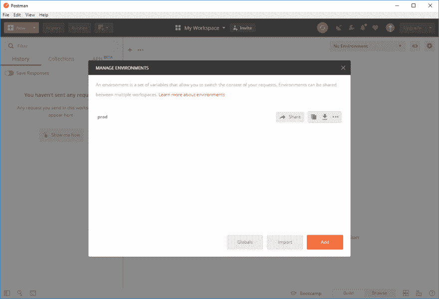
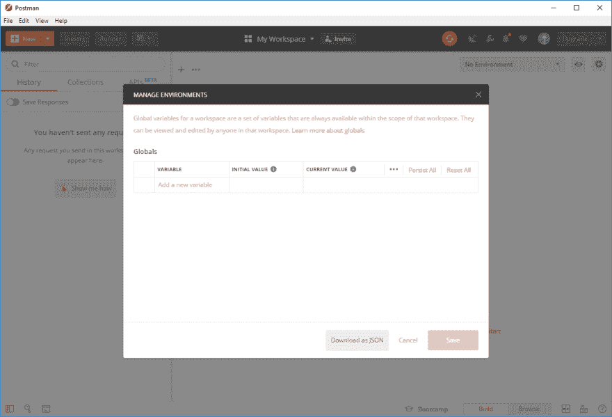
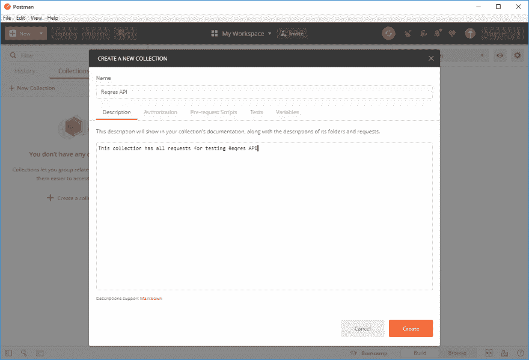
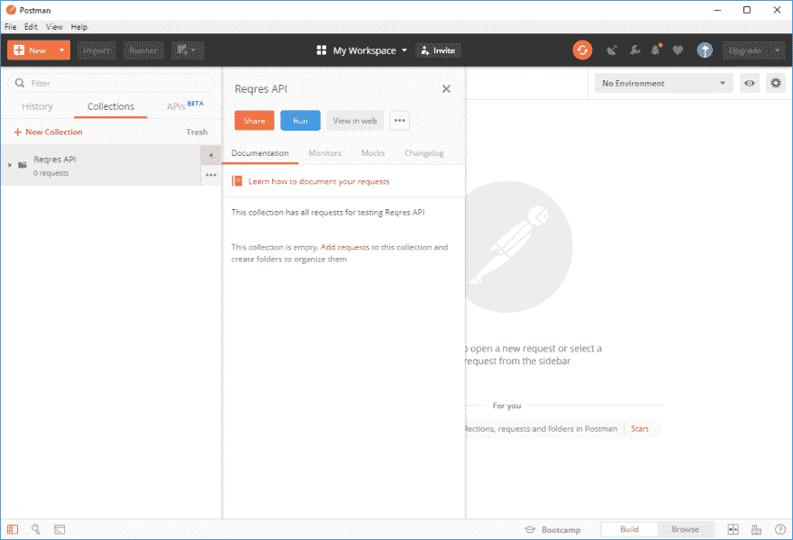
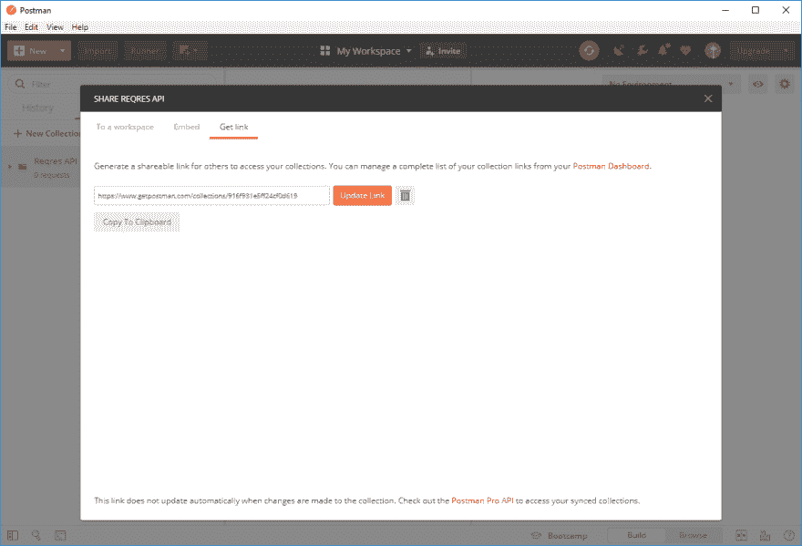
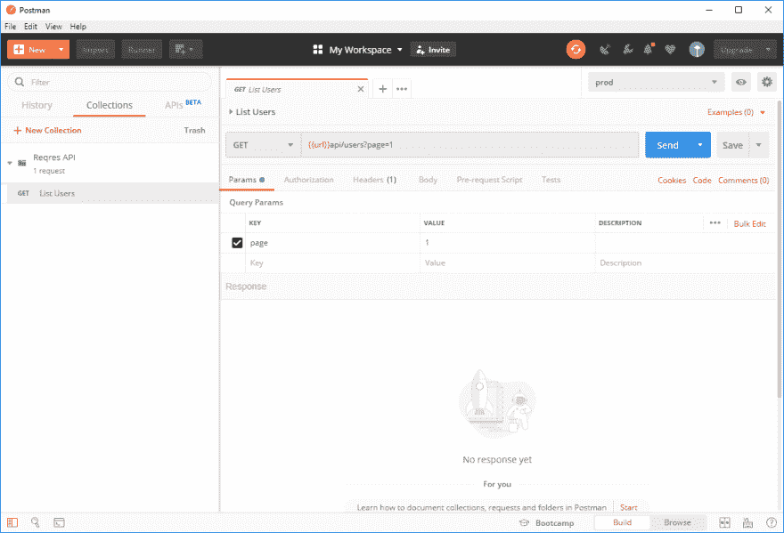
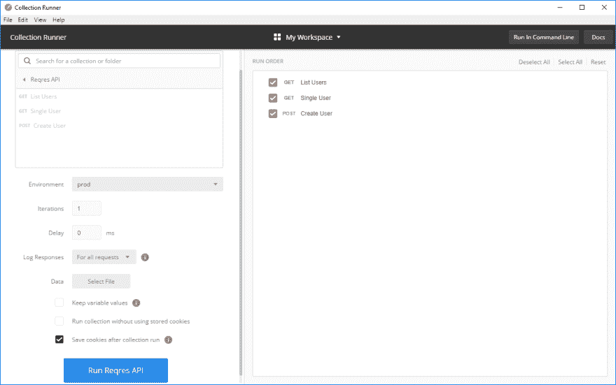
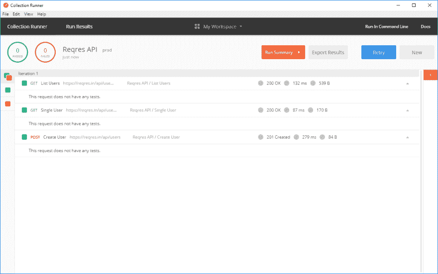
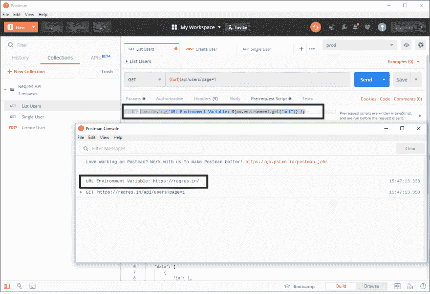
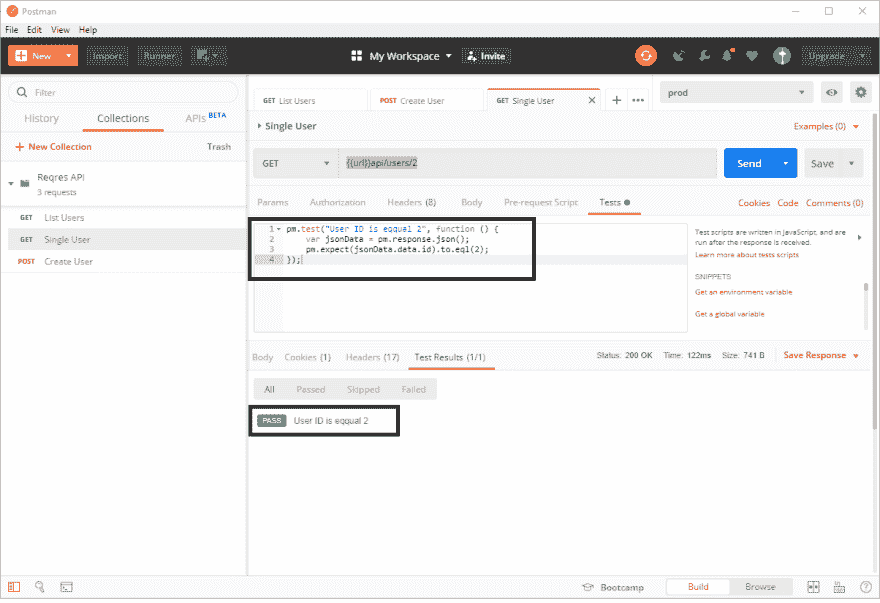

# 忙碌的开发人员的邮递员

> 原文：<https://dev.to/thisdotmedia/postman-for-busy-developers-37l>

记录、测试和调试 API 是开发 REST APIs 最令人沮丧的方面之一。邮递员能够做到这一点，节省时间，确保准确性，并且没有麻烦。

Postman 是一个跨平台的工具，你可以将其作为一个独立的桌面应用程序安装在你的 Windows、Linux 或 MacOS 电脑上。

除了它提供的额外功能，你可以把 Postman 想象成一个“打了类固醇的浏览器”。在发送 HTTP 请求和接收 HTTP 响应时，它的表现就像一个浏览器。例如，在 Postman 中，您可以在向后端发送请求之前编辑 HTTP 请求头。您还可以对从后端接收到的 HTTP 响应进行测试。

此外，Postman 专注于通过引入以下概念来组织您的工作:

*   工作空间

*   环境

*   收藏品

*   文件夹

*   变量

*   请求

*   反应

这不是邮递员能做的一切。此外，您可以通过使用 Postman 来生成 API 文档。

在本文中，我将更详细地讨论上面列出的每个主题。此外，我将使用免费的在线托管 REST-API 服务来接受测试请求。

开始吧！

## 安装邮递员

几年来，我一直将 Postman 作为 Chrome 浏览器的扩展来使用。然而，最近这个版本的 Postman 已经退役，取而代之的是，我使用 Postman 独立桌面应用程序。

确保从[邮差官网](https://www.getpostman.com/downloads/)安装 app。

第一次打开 Postman 时，它看起来像这样:

[](https://res.cloudinary.com/practicaldev/image/fetch/s--2YHEeA4j--/c_limit%2Cf_auto%2Cfl_progressive%2Cq_auto%2Cw_880/https://thepracticaldev.s3.amazonaws.com/i/jgttegokzwfvdar36e1x.PNG)

这是一个快速访问菜单，用于选择创建新请求、集合等操作。

## 邮递员工作区

默认情况下，当您第一次安装并打开 Postman 时，该工具会为您创建一个默认的 **My Workspace** 。

您可以通过向系统添加更多来管理工作区。

借助工作区，您可以管理、分组和组织您的收藏和环境。稍后会有更多内容。

Postman 提供两种类型的工作空间:

*   个人的

*   组

**个人**工作区，顾名思义，是您在机器上使用的本地工作区。而**团队**工作区则用于与其他人协作。

对于本文，我将原样使用默认的**我的工作区**。

[](https://res.cloudinary.com/practicaldev/image/fetch/s--QyTSZESj--/c_limit%2Cf_auto%2Cfl_progressive%2Cq_auto%2Cw_880/https://thepracticaldev.s3.amazonaws.com/i/rauecjgz0hzsr481jfc7.PNG)

您可以列出您的工作区，如果需要，甚至可以创建新的工作区。

> 可以在[工作区](https://learning.getpostman.com/docs/postman/workspaces/intro_to_workspaces/)查阅邮差官方文档。

## 邮递员环境

Postman 中的环境类似于我们在开发应用程序时处理的环境。

例如，当开发一个应用程序时，通常你至少要建立三个不同的环境。一个**开发**或本地环境、**试运行**环境和一个**生产**环境。

对于每个环境，您将管理一组局限于单个环境的环境变量。您可以将数据库连接字符串存储在环境变量中。这样，当您将应用程序移动到不同的环境时，您就不需要更改代码。

我们举个例子。我正在本地开发我的 Node.js 应用程序，并将我的所有环境变量存储在一个`.env`文件中。现在，我将我的应用程序部署到 Heroku，例如，在 staging 环境下。我只需要在这个新环境下定义我在`.env`文件中使用的相同的环境变量。当我转移到生产环境时，情况也是如此。我只需要定义一组新的环境变量。

您的应用程序在任何环境下都保持整洁和可用。

在 Postman 中，环境被定义为:

*   控制特定环境的一组键值对

*   Postman 中的集合在特定环境下运行

您可以将 API 端点基本 Url 存储为环境变量，例如和许多其他内容。

要在 Postman 中查看所有环境:

[](https://res.cloudinary.com/practicaldev/image/fetch/s--MCzU7Zj8--/c_limit%2Cf_auto%2Cfl_progressive%2Cq_auto%2Cw_880/https://thepracticaldev.s3.amazonaws.com/i/kw6cnh5ds9b747vtappm.png)

目前我没有一个环境。让我们通过找到并点击**添加**链接来创建一个新的。

[](https://res.cloudinary.com/practicaldev/image/fetch/s--V4g5qA28--/c_limit%2Cf_auto%2Cfl_progressive%2Cq_auto%2Cw_880/https://thepracticaldev.s3.amazonaws.com/i/4qw2v6p2yu8l0esiah5b.png)

命名环境的名字是 **prod** 。同样，我定义了一个环境变量 **url** ，初始值为`https://reqres.in/`。这个变量被用作测试中的 REST API 的基本 url。

完成后，定位并点击 **Add** 来创建一个包含变量的新环境。

[](https://res.cloudinary.com/practicaldev/image/fetch/s--1HQgQnRZ--/c_limit%2Cf_auto%2Cfl_progressive%2Cq_auto%2Cw_880/https://thepracticaldev.s3.amazonaws.com/i/imhs4wma5m0l6t7nq8e1.PNG)

现在，您可以管理这个环境，也可以创建其他环境。

当运行一组请求甚至是一个请求时，需要选择一个 Postman 环境。很快您就会看到，我将在一个请求 url 中嵌入 **url** 环境变量。根据选择的环境， **url** 的值将被替换。

例如，在 **prod** 环境下， **url** 将被替换为`https://reqres.in/`。如果在另一个环境下运行相同的请求， **url** 的值将是该环境中定义的值。

使用环境和变量保持你的代码干净，可配置和维护良好。

让我们继续讨论《邮差》中的变量。

## 邮递员变量

Postman 中的变量类似于编程语言中的变量概念。它是一个内存占位符，用于存储信息并在以后需要时检索。

如您所见，我们在环境级别定义了 **url** 变量。Postman 允许您定义不同级别的变量，如下所示:

*   全球的

*   环境

*   收藏品

*   文件夹

在全局级别定义的变量适用于所有请求，与所选的环境、集合或文件夹无关。当然，您可以在下面的级别中覆盖一个全局变量。

在环境级别定义的变量适用于集合和文件夹中的所有请求。

在 and 集合级别定义的变量适用于特定集合及其所有文件夹中的所有请求。

最后，在文件夹级别定义的变量适用于特定文件夹内的所有请求。

找到**环境快速查看**图标并点击它:

[](https://res.cloudinary.com/practicaldev/image/fetch/s--MCzU7Zj8--/c_limit%2Cf_auto%2Cfl_progressive%2Cq_auto%2Cw_880/https://thepracticaldev.s3.amazonaws.com/i/kw6cnh5ds9b747vtappm.png)

找到并点击**全局**部分下的**编辑**链接:

[](https://res.cloudinary.com/practicaldev/image/fetch/s--A9EZnfph--/c_limit%2Cf_auto%2Cfl_progressive%2Cq_auto%2Cw_880/https://thepracticaldev.s3.amazonaws.com/i/ahxptdohyqcf8smnl07g.PNG)

在这个屏幕上，您可以定义您的全局变量，类似于我们在环境级别所做的。

> 你可以参考关于[环境和全局](https://learning.getpostman.com/docs/postman/environments_and_globals/intro_to_environments_and_globals)的 Postman 官方文档。

## 邮差收藏

Postman 中的集合是一组逻辑相关的 API 请求。在收藏中，您可以按文件夹进一步分组。

例如，我会为一个新的应用程序创建一个新的集合。对于每个控制器或 API 端点，我会创建一个文件夹，将该端点的所有请求分组到一个文件夹中。您的集合将是应用程序中每个控制器或端点的文件夹集合。

[](https://res.cloudinary.com/practicaldev/image/fetch/s--JJH3mOk8--/c_limit%2Cf_auto%2Cfl_progressive%2Cq_auto%2Cw_880/https://thepracticaldev.s3.amazonaws.com/i/a9nduvq6nsfl0uh0sz54.PNG)

找到**收藏**标签并点击它。然后你可以点击**创建一个集合**链接来打开`Create a new collection`表单。

[](https://res.cloudinary.com/practicaldev/image/fetch/s--AVTJIWm4--/c_limit%2Cf_auto%2Cfl_progressive%2Cq_auto%2Cw_880/https://thepracticaldev.s3.amazonaws.com/i/53tf140jf8kg82kaz9ac.PNG)

首先给新的集合一个`name`和`description`。

> `Description`字段支持[降价](https://go.pstmn.io/markdown)。

**授权**选项卡用于定义授权方法，添加到该集合下所有请求的请求头中:

[](https://res.cloudinary.com/practicaldev/image/fetch/s--6tn4nq-4--/c_limit%2Cf_auto%2Cfl_progressive%2Cq_auto%2Cw_880/https://thepracticaldev.s3.amazonaws.com/i/m1uvou95akgulsvc2fzy.PNG)

在这个场景中，我选择了**不记名令牌**，并粘贴了令牌值本身。现在，对于在这个集合下执行的每个请求，在执行之前都会在请求头上附加一个`Authorization`头。

> 对于本文，我将选择`No Auth`。

**预请求脚本**和**测试**选项卡用于编写 JavaScript 代码。我们稍后将回到这些选项卡。

最后，您可以通过转到 **Variables** 选项卡来定义集合级别的变量。

完成后，点击 **Create** 按钮创建这个新的空收藏。

[](https://res.cloudinary.com/practicaldev/image/fetch/s--U3-Sbxvv--/c_limit%2Cf_auto%2Cfl_progressive%2Cq_auto%2Cw_880/https://thepracticaldev.s3.amazonaws.com/i/un8kmpctxsfg7yp68cyh.PNG)

### 分享收藏

现在收藏已创建，您可以通过点击**共享**按钮与其他人共享此收藏。

[](https://res.cloudinary.com/practicaldev/image/fetch/s--E7R69WZK--/c_limit%2Cf_auto%2Cfl_progressive%2Cq_auto%2Cw_880/https://thepracticaldev.s3.amazonaws.com/i/n2n87n2b8obhnu25ggtj.PNG)

转到**获取链接**并点击它:

[](https://res.cloudinary.com/practicaldev/image/fetch/s--cZgMl9AL--/c_limit%2Cf_auto%2Cfl_progressive%2Cq_auto%2Cw_880/https://thepracticaldev.s3.amazonaws.com/i/j8gs5jpeo5xzt1w1b636.PNG)

复制显示的 Url，并从任何其他计算机，您可以通过此 URL 运行收集。

为此，您需要通过运行以下命令来安装**纽曼** NPM 包:

`npm install -g newman`

包裹是邮递员的好伙伴。你可以在纽曼 npm 页面上了解更多信息

要运行集合 Url，请键入以下命令:

`newman run https://www.getpostman.com/collections/916f931e5ff24cf0d619`

该命令运行该集合下的所有请求，并提供所有请求的统计信息。

### 添加请求

让我们在运行之前向这个集合添加一些请求。右键单击集合名称，并从上下文菜单中选择**添加请求**。

[](https://res.cloudinary.com/practicaldev/image/fetch/s--6s2xKCD5--/c_limit%2Cf_auto%2Cfl_progressive%2Cq_auto%2Cw_880/https://thepracticaldev.s3.amazonaws.com/i/1eaipklshfndgzghq5yo.PNG)

在这个请求中，我将获取存储在数据库中的所有用户。点击 **Save to Reqres API** 按钮，将请求实际保存在集合中。

[](https://res.cloudinary.com/practicaldev/image/fetch/s--_E1ztZBz--/c_limit%2Cf_auto%2Cfl_progressive%2Cq_auto%2Cw_880/https://thepracticaldev.s3.amazonaws.com/i/97ia99nayf08mt2967dr.PNG)

点击`Reqres API`集合下的`List Users`请求，如上图所示填写详细信息。

*   **环境**:我选择了`prod`环境

*   **方式**:我选择了`GET`方式

*   **Url** :我已经嵌入了一个环境变量`{{ url }}`，用一对左右花括号将变量名括起来。此外，我请求**用户**端点向其传递值为 1 的查询字符串**页面**。

我选择的端点包含一个查询字符串。如您所见，Postman 检测到 Url 中的查询字符串，它自动在**查询参数**表下添加了一条新记录。

其余选项卡的用法如下:

**授权**

“授权”选项卡用于在此请求上添加授权方法。如果您已经在集合级别选择了一个，那么您可以在这里简单地继承它，甚至使用另一个。

[](https://res.cloudinary.com/practicaldev/image/fetch/s--KBxupGpO--/c_limit%2Cf_auto%2Cfl_progressive%2Cq_auto%2Cw_880/https://thepracticaldev.s3.amazonaws.com/i/8ar10rotfuoxyhgt7639.PNG)

**标题**

您可以将其他请求标头附加到此请求。

[](https://res.cloudinary.com/practicaldev/image/fetch/s--dT-HdVjN--/c_limit%2Cf_auto%2Cfl_progressive%2Cq_auto%2Cw_880/https://thepracticaldev.s3.amazonaws.com/i/k7o7gx4gy6owgj7lmaex.PNG)

例如，我添加了`Content-Type`头，并赋予它一个值`application/json`。

**正文**

您可以使用 Body 选项卡来定义请求有效负载。稍后我将向您展示如何在使用 POST 请求时传递请求负载。注意，你有多种选择，从`none`到`form-data`到`raw`等等？

最后，`Pre-request Script`和`Tests`选项卡用于编写 JavaScript 代码。

让我们先点击**保存**按钮，然后点击**发送**来执行请求。

[](https://res.cloudinary.com/practicaldev/image/fetch/s--VLIFZh5T--/c_limit%2Cf_auto%2Cfl_progressive%2Cq_auto%2Cw_880/https://thepracticaldev.s3.amazonaws.com/i/z024eifr4tjtmhsh98qb.PNG)

请求被执行，响应显示在请求详细信息下的一个新部分中。

响应的正文有多个视图:

*   漂亮的

*   生的

*   试映

*   数据(JSON，XML 等。)

您在上面看到的响应是使用带有`JSON`的`Pretty`模式来显示数据。

您还可以查看响应的`Cookies`、`Headers`和`Test Results`。此外，您可以查看这个响应的`Status`、接收响应所用的`Time`,以及最终响应有效负载的`Size`。

最后，您可以保存响应。

> `Test Results`与上面提到的`Tests`选项卡直接相关。您将很快了解更多关于测试的内容。

您看到创建一个新请求有多简单了吧？

我将离线添加另一个 GET 请求来获取单个用户。

另外，我将添加一个新的 POST 请求，通过在 POST 请求的主体中传递一个用户对象来创建一个新用户:

[](https://res.cloudinary.com/practicaldev/image/fetch/s--jqCYkwQ0--/c_limit%2Cf_auto%2Cfl_progressive%2Cq_auto%2Cw_880/https://thepracticaldev.s3.amazonaws.com/i/iiifot40ezzve6jj6aj1.PNG)

### 运行集合

现在我们总共有三个请求，让我们运行收集。

找到并点击`Reqres API`收藏，点击右上角的箭头图标，打开收藏动作。

找到并点击**运行**按钮，执行所有请求

[](https://res.cloudinary.com/practicaldev/image/fetch/s--ppg0OakW--/c_limit%2Cf_auto%2Cfl_progressive%2Cq_auto%2Cw_880/https://thepracticaldev.s3.amazonaws.com/i/z64dqek4tkt4kbete07a.PNG)

在左侧面板上，您可以看到:

*   集合下的所有请求。

*   要使用的环境，在本例中选择了`prod`环境。

*   运行请求的迭代次数。默认值为 1。

*   以毫秒为单位的延迟，用于模拟从后端 API 接收响应时的特定延迟。

*   数据字段允许您从存储在机器上的文件中加载变量数据。我们现在不使用这种技术。

在右侧面板上，您可以重新排列请求，以更改它们的执行顺序。

最后，让我们点击 **Run Reqres API** 来执行请求:

[](https://res.cloudinary.com/practicaldev/image/fetch/s--qEOquWkM--/c_limit%2Cf_auto%2Cfl_progressive%2Cq_auto%2Cw_880/https://thepracticaldev.s3.amazonaws.com/i/l32c3tq0hajttzfmtqmk.PNG)

所有请求都已成功执行。对于每个请求，您可以看到`Status`、`Size`和`Time`。

然后，您可以导出结果以供以后查看。

集合真的很有用，在 API 回归测试中扮演着重要的角色。现在，在任何时候，您都可以引入对后端 API 的更改，然后运行整个集合来验证结果。

与 Postman 中的环境相结合，您不仅可以针对您的本地开发运行您的测试，还可以针对您的生产或登台环境运行您的测试。

您可以看到并欣赏在测试所有这些环境时使用 Postman 可以节省的时间。

> 关于[收藏](https://learning.getpostman.com/docs/postman/collection_runs/intro_to_collection_runs)可以咨询邮差官方文档。

## 邮递员脚本

我在本文开头提到了 Postman 脚本，现在是时候深入研究它们了。

Postman 提供两种类型的脚本:

*   请求前脚本

*   试验

### 预请求脚本

此脚本可应用于:

*   收藏品

*   文件夹

*   请求

如果在所有级别上都定义了脚本，它们将以相同的顺序运行。

`Pre-request Script`是在执行请求之前运行的 JavaScript 代码。可以把它想象成一个在发出请求之前运行的`Interceptor`。您使用它来调试请求中的变量，以确保变量具有正确的值。此外，您可以使用该脚本向当前正在执行的请求添加自定义请求头。

让我们打开 Postman 中现有请求的`Pre-request Script`选项卡:

[](https://res.cloudinary.com/practicaldev/image/fetch/s--8QpP6Atv--/c_limit%2Cf_auto%2Cfl_progressive%2Cq_auto%2Cw_880/https://thepracticaldev.s3.amazonaws.com/i/iso0lbcjguqkoyklji36.PNG)

请注意，在右侧面板上有一个链接列表，您可以单击它并在`Pre-request Script`选项卡中注入一些脚本。

要检索环境变量:

`pm.environment.get("variable_key");`

要检索全局变量:

`pm.globals.get("variable_key");`

要检索集合或文件夹中定义的变量:

`pm.variables.get("variable_key");`

这些脚本使用的是封装了 Postman SDK API 上所有 API 调用的`pm`对象。你可以阅读更多关于 [pm 对象](https://learning.getpostman.com/docs/postman/scripts/postman_sandbox_api_reference/)的信息。

要将变量打印到控制台，只需使用著名的`console.log(pm.environment.get("variable_key"));`。

让我们在执行请求之前打印`url`环境变量，将这一行代码放在`Pre-request Script`中:

`console.log(` URL 环境变量:$ { pm . Environment . get(" URL ")}`);`

在**视图**菜单中找到**邮递员控制台**打开。然后，执行请求:

[](https://res.cloudinary.com/practicaldev/image/fetch/s--uHWaJuwO--/c_limit%2Cf_auto%2Cfl_progressive%2Cq_auto%2Cw_880/https://thepracticaldev.s3.amazonaws.com/i/cn6gt5e9fgnj6bj8tzqf.PNG)

注意 Postman 控制台应用程序上的脚本和结果。

您可以使用 Postman 控制台来调试请求和响应。

### 测试

Tests 选项卡允许您编写 JavaScript 代码，以便在请求执行完毕并收到响应后执行。

此脚本可应用于:

*   收藏品

*   文件夹

*   请求

如果在所有级别上都定义了脚本，它们将以相同的顺序运行。

可以将`Tests`脚本想象成在收到响应后运行的`Interceptor`。您可以使用它对收到的响应进行测试。例如，您可以测试响应的状态代码、响应中收到的数据、响应中收到的标头、响应时间大于或小于某个值以及许多其他场景。

让我们添加一个测试脚本来验证通过`/api/users/2`请求的用户对象具有值为 2 的用户 ID。

[](https://res.cloudinary.com/practicaldev/image/fetch/s--bZlRD6nK--/c_limit%2Cf_auto%2Cfl_progressive%2Cq_auto%2Cw_880/https://thepracticaldev.s3.amazonaws.com/i/c9atl7avp85pzj2ed0x6.png)

此请求中使用的脚本:

```
 pm.test("User ID is eqqual 2", function() {

    var jsonData = pm.response.json();

    pm.expect(jsonData.data.id).to.eql(2);

}); 
```

Enter fullscreen mode Exit fullscreen mode

该脚本访问响应体，然后断言以确保`User ID`等于 2。

*   `jsonData`是 JSON 格式的实际响应。

*   `data`是后端 API 返回的响应的根属性

在`Test Results`选项卡下的 response 部分，Postman 通知您测试的状态。在这种情况下，我们的测试成功运行，并验证了收到的`User ID`的值为 2。

如果测试失败，您将看到另一条带有`FAIL`的消息。

您不仅可以针对 REST API 执行请求，还可以编写测试来验证结果。

从现在开始你可以完全依靠 Postman 来测试你的 REST APIs 了！

> 关于[测试](https://learning.getpostman.com/docs/postman/scripts/test_examples)可以参考邮差官方文档。

## 结论

今天我们触及了邮递员冰山的一角！还有更多的细节和高级特性要介绍，但肯定不是一篇文章可以涵盖的。

[生成文档](https://learning.getpostman.com/docs/postman/api_documentation/intro_to_api_documentation)

[监视器](https://learning.getpostman.com/docs/postman/monitors/intro_monitors)

[模拟服务器](https://learning.getpostman.com/docs/postman/mock_servers/intro_to_mock_servers)

然而，您今天所看到的涵盖了 Postman 调试、记录和测试 REST APIs 所需的 90%。

可以随时回头参考[邮差官方文档网站](https://learning.getpostman.com/docs/postman/launching_postman/installation_and_updates)。他们提供最新的文件，并涵盖了邮递员的每一个细节。

这篇文章是由[的导师](https://thisdot.co/)[比拉尔·海达尔](https://www.bhaidar.dev/)写的。

你可以在推特上关注他，地址是 [@bhaidar](https://twitter.com/bhaidar) 。

需要 JavaScript 咨询、指导或培训帮助吗？在 [This Dot Labs](https://thisdot.co) 查看我们的服务列表。