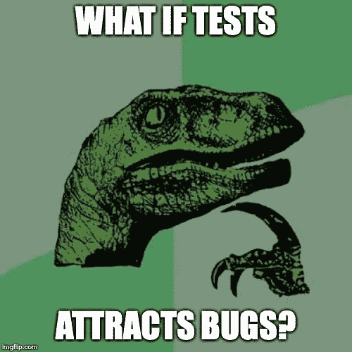

# 更喜欢集成测试？重新考虑

> 原文：<https://dev.to/thekashey/prefer-integration-tests-think-twice-1l6d>

> Philosoraptor meme 解释说...只要想想(两次😅)关于它。

我为什么写这篇文章？因为 twitter 可能不是解释问题的最佳场所，但却是提及问题的常见场所。
什么问题？好吧，这个问题在 Twitter 上被很好地定义了，正如对`Dan Abramov`帖子的回复。

> 丹阿布拉莫夫(休假)[@丹阿布拉莫夫](https://dev.to/dan_abramov)写很多测试所以人们会害怕删除你的代码13:10PM-2019 年 7 月 18 日

在下面的帖子中，许多人试图同意，不同意，解释和扩展这个提议。

我们跳吧！

> 蒂姆[@ timneutkens](https://dev.to/timneutkens)[@ Dan _ abra mov](https://twitter.com/dan_abramov)在 Next.js 代码库中，几乎所有的东西都是集成测试，这意味着我们可以完全替换掉链接实现，并确信它仍然像以前一样工作。更重要的是，我们也测试了 HMR 和生产模式。22:44PM-2019 年 7 月 18 日

比如，🙀集成测试太棒了——你应该马上扔掉所有的单元测试！他们一点信心都没有。每个人可能会立刻想到另一条推文:

> 吉列尔莫·劳赫@劳赫编写测试。不太多。主要是整合。2016 年 12 月 10 日下午 16:43

*   关于那篇著名的文章，我被要求读了那么多次——[写测试。不太多。肯特·c·多兹的《大部分整合》](https://kentcdodds.com/blog/write-tests)。

那么，我为什么写这篇文章？因为人们通常不会正确阅读文章，只会点击诱饵标题。我要求三思。因此...

### 1。丹在说什么？

> 丹阿布拉莫夫[@丹 _ 阿布拉莫夫](https://dev.to/dan_abramov)更严重的注意了。不要仅仅编写测试来让你确信一个单元能够工作。编写测试，让你自信地删除那个单元。2019 年 7 月 18 日下午 13:14

我估计——关于“内聚”，同样的东西我们喜欢用`components`来表示，在用`CSS-in-JS`和其他东西中间——*容易一起构建，容易一起改变，容易一起删除*。

并且只有当员工的测试是“单元”的，并且不测试除了他们的员工之外的任何东西时，才能实现该员工的`stuff`和`tests`之间的*内聚*。这就像是单元测试的定义。

很明显——如果你孤立地测试你的东西，那会很棒...唯一棘手的时刻——**是什么玩意儿**。

就像“React”对于我们许多人来说只是“React”，而不是较小文件和较小功能的组合。当有人在测试“反应”时，我们认为这是在测试“反应”。

你还记得 React 15->16 升级的时候，React 完全**里面**变了，而外面**没变。**

最好想想 React 应该测试什么...React 应该测试 React，以便让您的代码在之后继续工作，而不管 React 内部发生了什么变化。作为 React 的消费者，这是你真正需要的唯一测试。

> 🙀随着今天 React 16 的发布，我们完全重写了 React 的内部，同时保持公共 API 基本不变。🙀

嗯嗯...

### 2。肯特在说什么？

关于孤立地测试事物的危险性。让我引用原文中的一个恰当的时刻- *你正在测试“伞打开”，一把“伞”，嗯，会“打开”*。所有测试都是**绿色**，所有部件都是**工作**理想状态！！！伙计，你有什么问题？？

> <video loop="" controls=""><source src="https://video.twimg.com/ext_tw_video/1148986932740988929/pu/pl/d9-rSQ46PpjMEN0H.m3u8?tag=10" type="application/x-mpegURL"></video>埃琳🦁[@ erinfranmc](https://dev.to/erinfranmc)期待(umbrellaOpens)。toBe(true)
> 
> 测试:1 个通过，1 个总计
> 
> * *所有测试通过* *2019 年 7 月 10 日下午 16:06

那绝对是真的。应该是这样的。如果你忘记了你的东西的主要思想-保护某人免受雨淋，那是雨伞存在的主要的，也是唯一的理由。剩下的都是实现细节。

这里应该使用“集成测试”吗？嗯——这可能会有帮助，只要有这么多“正常工作”的雨伞，它们并不能“正常地”保护你免受雨淋(我确实有一把)😓).

### 那又怎样？

首先，集成测试不是一件简单的事情。集成测试正在做两种不同的工作。

*   首先，集成测试是检查你做的事情是否正确。比如按照正确的顺序，用正确的方式调用其他的东西。
*   其次——他们正在检查是否用提供的参数调用了`things`,以及它们是否如预期的那样运行。检查*事情*正在做他们期望做的事情。

那么，**更喜欢集成测试**是个好主意吗？单元测试应该怎么做？

让我稍微解释一下。

## 有点不同

大约 30 年前，我开始编写代码。老实说，测试并不是我一直在做的事情。有人甚至说*测试在“前敏捷”时代不是一件事*——只有手工测试、记录和监控。我来自那个时代——那个我们不“需要”考试的时代。

> 我们如何在生产前测试产品？嗯——我们在使用我们制造的东西，我们在消费结果。吃了我们自己的狗粮。

在我看来，我的代码没有任何错误(它实际上仍然在生产中工作)，直到我开始编写测试。真的吗——**就在我创建第一个测试之后——我漂亮的代码出现了问题**。
巧合？不确定😅。

我做了这么多不同的东西——我只是有时间做。我已经尝试了这么多-我只是有时间。然而，我没有足够的时间进行测试，也没有写过很多测试——嗯，有三个原因。

*   原因 1 -一切正常。测试只会浪费我的时间。
*   原因 2 -我不知道测试什么和为什么测试。所以写测试会浪费更多的时间。
*   原因 3——我想自由地改变任何我想改变的东西，无论何时。所以，我不想浪费时间:)，当然，我想非常非常**有创意**。和测试，以及打字限制了你的创造力(一个小镇的传说)

听起来很熟悉？是啊。所以-然后呢？

*   (仅供参考)我曾经有过，现在仍然有一些产品，没有被一个测试覆盖。它像时钟一样工作了很多年。
*   （🤷‍♂️)我每天都在犯最愚蠢的错误。
*   （😎)但是一切都在运转。

我的经验告诉我一件简单的事情:

*   你需要 E2E 测试来理解“东西”如何为客户工作，它将通过*人机界面*(鼠标)与你的应用程序进行通信。你的应用程序是否在做正确的事情——这是主要的，其他的都是实现细节。
*   您需要集成测试来理解“事物”是如何一起工作的(连接)。分子和块是如何连接的。一些孤立域的行为方式。
*   你需要单元测试来理解“事物”如何在内部工作。你的代码是如何工作的。有时候这是一个简单的任务，但是犯一个错误或者编写一些你不打算做的事情真的很难。但是有时候——哦，亲爱的🤦‍♂️.

如果你更仔细地阅读这三个命题，你会发现它们形成了一个金字塔。不是“测试金字塔”,只是一个金字塔——每一层测试它下面一层，但不是其他。而且所有等级都一样。

> 安东·科尔祖诺夫[@ the kashey](https://dev.to/thekashey)有一个函数——它有输入和输出——你可以断言你的需求得到了满足，而无需拆开内部构件。然后向前一步，用同样的方法测试这些内部构件。每次一步。从上到下，再往后:
> 
> [dev.to/thekashey/pref…](https://t.co/i51AiFIs71)2019 年 8 月 11 日上午 06:41

## 如此

因此，一旦你通过 E2E 测试获得了正确的应用程序行为，你就可以放心地往下做一层，检查它实际上是如何工作的。

> 即使是你刚刚写的几行代码，而且你“绝对有信心”——也可能不像你想的那样工作。

*   E2E 测试先于集成——它们定义了你的应用程序的“流程”,这是主要的。比如**应该做什么**。
*   集成先于单元测试，只要它们可能影响设计需求，从而影响较低层次的架构决策。像 **YAGNY** ，但是对于应用构建块。**我们要做什么**。
*   单元测试是**我们如何做**，也可能先于其他事情(归纳法！)，但是呢？

> 每一个上层都在下层之前。等级>等级+ 1

当我们从上到下构建东西时，这个“测试金字塔”工作得很好，但更多时候是当我们首先开始构建较低级别的块，或者用另一个替换一个较低级别的块——这里来自上层的现有`restrictions`将是对你的*指导*。如果上层存在的话。

> 简而言之——在代码之前写 README。或者规格。但不是测试！

你必须事先有*限制*或*要求*。不是测试！

## 不是测试！

这篇文章的想法很简单- **没有像集成测试或单元测试这样的东西**。

有**测试**，有**要求**。这是唯一的区别。
测试正在为当前层工作，需求负责下一层的*事情——它们为下一步提供**期望**。*

您可能会更改实际的代码实现，并且代码*需求*应该仍然是可以的，如果它们被满足的话。

> 💡随着今天 React 16 的发布，我们完全重写了 React 的内部，同时保持公共 API 基本不变。🥳

如果真实的东西在现实中被改变了，改变代码总是会破坏测试。编写、重写和删除测试是可以的——它们是一次性的。

> 所以真正的问题是“你需要测试吗”，或者“你需要需求吗”。而集成/单元分离没有任何意义。

你知道- **需求**是从业务的角度来看，你和你的代码应该满足的一切。从客户的角度来看也是如此。

PS:TDD(测试驱动开发)是真正的 RDD(需求驱动开发)——首先你应该定义“需求”,然后“满足”它们。

你必须在头脑中把这两个概念分开——“你在测试什么”，而不是“如何”测试。

> 大卫 k🎹[@ davidkpiano](https://dev.to/davidkpiano)冷门意见:你先写 e2e/集成测试*吧，总。
> 
> 它们应该与业务逻辑(用户)需求直接相关。只有当 even 集成测试失败时，你才应该考虑编写单元测试。
> 
> 并且愿意删除那些单元测试。2019 年 10 月 05 日下午 14:56

实际上“基于需求的测试”是一件事，还有另一篇关于它的开发文章

> 基于需求的测试是一种从需求中获取测试用例、条件和数据的测试方法。它包括功能测试和非功能属性，如性能、可靠性或可用性。

 [## 测试和要求

### 维克多·奥斯里奥 7 月 24 日 19 时 30 分阅读

#java #tdd #bugs #requirement](/vepo/thoughts-on-tdd-tests-and-requirements-e02)

每次你使用`react-testing-library`，它*鼓励良好的测试实践*，并帮助你*不测试内部*——你是在做“基于需求”的测试，而不仅仅是“集成”，区分顶层需求和底层需求仍然很重要，这**是**实现细节。

有更多的抽象需求，更具体的需求和细微差别——它们一起形成了**真正的测试金字塔**。

就像我说的-三思而后行。

> Integationraptor meme 解释？