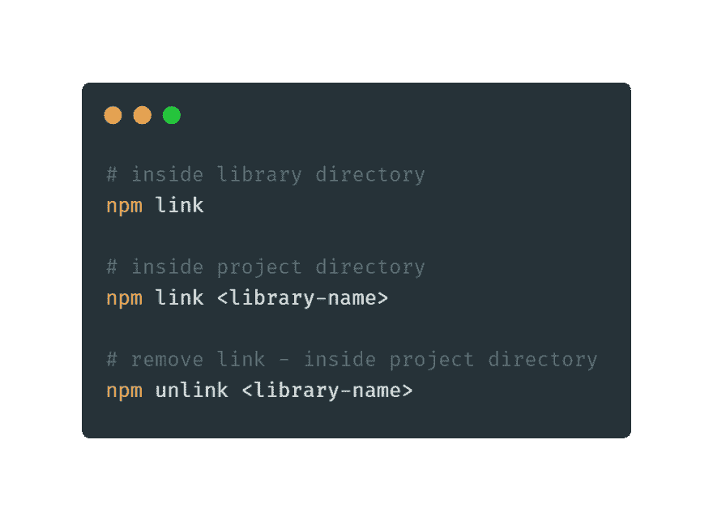
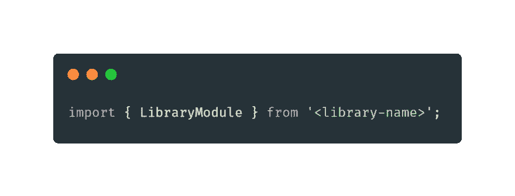

# [专业提示] `npm 链接`解释🎉

> 原文：<https://dev.to/angular/pro-tip-npm-link-explained-57be>

又到了**角识丸**的时候了！
只需几秒钟就能学会新东西🔥
比如早上服用维生素😃

如果您正在处理一个想要将导入到您的应用程序中的**库，您不必将它发布到任何 npm 存储库中！可以本地链接。假设您开发了一个 Angular 库，或者您在一个单独的 npm 包中有 CSS 主题，您想将它导入到您的本地应用程序中。你可以像下面这样使用 **npm link** 命令。😎**

> **npm 链接**创建一个从你的`<global node_modules>`目录到本地图书馆目录的符号链接(symlink)。
> 
> **npm 链接< library-name >** 创建一个从项目本地节点模块目录`./node_modules/<library_name>`到`<global_node_modules>/<library_name>`的符号链接。

要定位您的`<global node_modules>`目录，请在命令行中键入`npm root -g`。

现在，您可以像下面这样直接在应用程序中导入您的库。但是，有一个条件！😱

问题是您需要在您的`angular.json`文件中再做一次修改！您需要添加一个属性`preserveSymlinks`，如下所示。就是这样！您可以使用本地依赖项运行您的应用程序！🔥

* * *

如果你想把这种知识药丸直接发到你的邮箱，请在[angular-academy.com/blog/](https://angular-academy.com/blog)订阅。我将定期发送它们！记住，学习新东西只需要 10 秒钟！😃