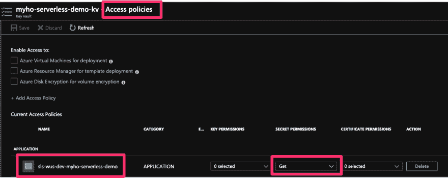

# 使用 Azure KeyVault 保护您的功能应用

> 原文：<https://dev.to/mydiemho/protect-your-function-app-with-azure-keyvault-2hkp>

> 本文是 [#ServerlessSeptember](https://dev.to/azure/serverless-september-content-collection-2fhb) 的一部分。在这个无服务器的内容集合中，您可以找到其他有用的文章、详细的教程和视频。9 月份，每天都有来自社区成员和云倡导者的新文章发布，没错，每天都有。
> 
> 在[https://docs.microsoft.com/azure/azure-functions/](https://docs.microsoft.com/azure/azure-functions/?WT.mc_id=servsept_devto-blog-cxa)了解更多关于微软 Azure 如何实现你的无服务器功能。

你不应该在代码中存储秘密。但是如果你的函数需要访问一个秘密，比如。存储 blob 的连接字符串？您可以将这些秘密存储在 [Azure KeyVault](https://azure.microsoft.com/en-us/services/key-vault/) 中，并在您的功能应用程序中安全地引用这些秘密。

本文的其余部分将向您展示如何在不使用 Azure Portal 的情况下进行设置。

> 如果你想了解更多关于如何更好地保护你的函数应用，看看函数 PM Matthew 的这篇文章
> 
> [](/mattchenderson) [## 如果你没有服务器，他们就不能黑你的服务器，对吗？
> 
> ### 马修·亨德森 9 月 23 日 197 分钟阅读
> 
> #serverless #security #azure](/mattchenderson/they-can-t-hack-your-servers-if-you-don-t-have-any-servers-right-246a)

# 先决条件

## Azure CLI

[安装指南](https://docs.microsoft.com/en-us/cli/azure/install-azure-cli?view=azure-cli-latest)

## jq

一个轻量级且灵活的命令行 JSON 处理器，我保证你会反复使用它

## 已部署的功能 app

这可以通过以下方式实现

1.  [azure-cli](https://docs.microsoft.com/en-us/azure/azure-functions/functions-create-first-azure-function-azure-cli)

2.  无服务器框架——推荐使用，因为本文是建立在昨天的示例应用程序的基础上的

[](/mydiemho) [## 使用无服务器创建和部署 Azure 功能

### 我的 9 月 24 日 196 分钟阅读

#serverless #webdev #tutorial #node](/mydiemho/create-and-deploy-azure-functions-with-serverless-20ai)

# 走查

我下面提到的所有脚本都可以在这个附带的回购中找到

## [mydiemho](https://github.com/mydiemho)/[myho-无服务器-演示](https://github.com/mydiemho/myho-serverless-demo)

### 使用无服务器框架连接 Azure KeyVault 的应用程序演示

> 您可以随意将脚本中选择的资源名称更改为其他名称，但是要注意不同的资源有不同的命名限制。
> 
> 如果你在使用
> 你想要的值时有困难，请参考 [Azure 资源命名约定指南](https://docs.microsoft.com/en-us/azure/architecture/best-practices/naming-conventions#general)。

* * *

## 登录

```
az account show # list all subscriptions you have access to 
az account set --subscription <SUB_ID> # id of the sub you want to use
az login 
```

* * *

## 克隆回购

```
git clone git@github.com:mydiemho/myho-serverless-demo.git
cd myho-serverless-demo 
```

* * *

## 设置密钥库

```
./scripts/create-keyvault.sh 
```

该脚本将创建一个资源组和一个密钥库。

* * *

## 添加秘密

```
./scripts/add-secrets.sh AwesomeSecret AwesomeSecretValue 
```

> 该脚本有两个输入:密钥和秘密值。如果没有传入任何输入，将使用默认的键和值。

注意输出中的`secret url`,您将在后面的步骤中用到它

## 授予功能 app 读取权限

为了让应用程序引用 keyVault 机密，您必须将应用程序添加到 keyVault 的访问策略中。

### 幕后

这样做的步骤是:

1.  为功能 app <sup>[1](https://docs.microsoft.com/en-us/azure/app-service/overview-managed-identity)</sup> 添加系统分配的身份

2.  将此身份作为访问策略添加到 keyVault

### 操作指南

您必须首先部署一个功能应用程序，然后您可以使用以下脚本来授予对应用程序的访问权限

```
./scripts/grant-app-access.sh <APP_RESOURCE_GROUP> <APP_NAME> 
```

脚本完成后，您可以检查门户，看到新的访问策略已经添加到功能应用程序中

[](https://res.cloudinary.com/practicaldev/image/fetch/s--xo58dMs2--/c_limit%2Cf_auto%2Cfl_progressive%2Cq_auto%2Cw_880/https://thepracticaldev.s3.amazonaws.com/i/72gw3roswpm4olw54l12.png)

* * *

## 添加新应用设置

我们将添加 keyvault 秘密参考作为应用程序设置 <sup>[*](https://docs.microsoft.com/en-us/azure/azure-functions/functions-how-to-use-azure-function-app-settings)</sup> 。应用程序设置可作为环境变量提供给函数处理程序。

使用无服务器，`environment`部分下的任何内容都将被创建为应用程序设置。

> 确保用在[添加秘密](#add-secrets)
> 中生成的网址替换该网址

```
 # see https://github.com/mydiemho/myho-serverless-demo/blob/master/serverless.yml#L29

  environment: # these will be created as application settings
    SUPER_SECRET: "@Microsoft.KeyVault(SecretUri=https://myho-serverless-demo-kv.vault.azure.net/secrets/MySuperSecretName/88df087331004326994047248b0b6b67)" 
```

* * *

## 添加新功能

您可以更新其中一个函数的处理程序代码，也可以创建一个新函数。对于这个例子，我选择创建一个名为`secrets`的新函数。

### 更新 serverless.yml

将以下部分添加到 yaml 中现有函数的下面

```
 # see https://github.com/mydiemho/myho-serverless-demo/blob/master/serverless.yml#L93

  secrets:
    handler: src/handlers/secrets.printSecrets
    events:
      - http: true
        x-azure-settings:
          methods:
            - GET
          authLevel: anonymous 
```

### 添加处理程序代码

添加新文件`src/handlers/secrets.js`

```
 # https://github.com/mydiemho/myho-serverless-demo/blob/master/src/handlers/secrets.js

"use strict";

const superSecret = process.env["SUPER_SECRET"];

module.exports.printSecrets = async function(context, req) {
  context.log(
    "JavaScript HTTP trigger function processed a request to display the secret in keyvault."
  );

  context.res = {
    // status: 200, /* Defaults to 200 */
    // FOR DEMO PURPOSE: DO NOT LOG SECRETS IN PRODUCTION
    body: `Shhhhh.. it's a secret: ${superSecret}`
  };
}; 
```

* * *

## 部署新的变更

一旦你完成了所有的设置，你现在就可以测试你的新功能应用了，它引用了 KeyVault

```
sls deploy 
```

> 如果您在部署时遇到问题，请参考本文以确保您已经完成了所有的先决条件
> 
> [](/mydiemho) [## 使用无服务器创建和部署 Azure 功能
> 
> ### 我的 9 月 24 日 196 分钟阅读
> 
> #serverless #webdev #tutorial #node](/mydiemho/create-and-deploy-azure-functions-with-serverless-20ai)

### 验证修改

部署之后，您可以点击函数 url、apim url，或者使用`invoke`命令来测试您的更改。

```
➜ sls invoke -f secrets                                                                             
Serverless: Logging into Azure

...

Serverless: Invoking function secrets with GET request
Serverless: "Shhhhh.. it's a secret: ItIsASecret" 
```