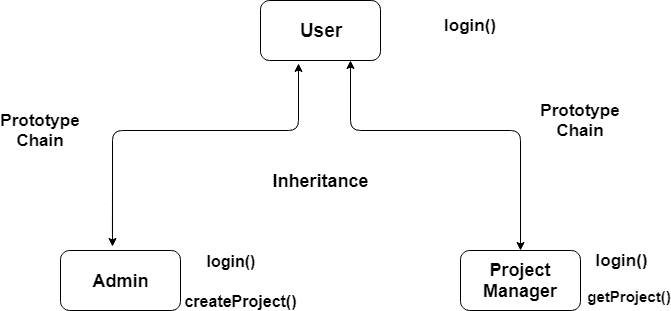
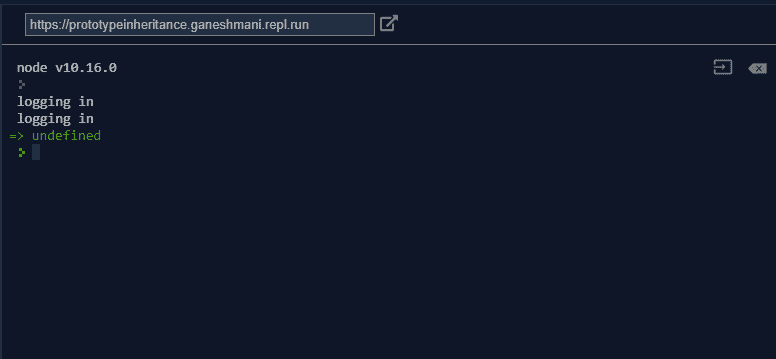

# 原型继承- Javascript 周刊

> 原文：<https://dev.to/ganeshmani/prototypal-inheritance-javascript-weekly-2gf9>

在这篇文章中，我们将看到什么是 javascript 中的原型继承。原型继承- Javascript 周刊

[Javascript-Javascript 周刊](https://cloudnweb.dev/2019/07/currying-in-javascript-javascript-weekly/)

[Javascript-Javascript 周刊中的闭包](https://cloudnweb.dev/2019/07/understanding-closures-in-javascript-javascript-weekly/)

[理解 Javascript 中的生成器](https://cloudnweb.dev/2019/07/understanding-closures-in-javascript-javascript-weekly/)

在面向对象编程中，有一个叫做继承的概念，子对象继承父对象的所有属性。

在像 Javascript 这样的函数式编程中，我们使用与[原型继承](https://javascript.info/prototype-inheritance)和原型链相同的概念。

### 什么是原型继承？

首先，面向对象继承和 Javascript 原型继承之间有一个主要的区别。

与 OOPS 中的对象不同，Javascript 对象没有可继承的类型或类。但是，javascript 有一个叫做原型的概念。这是主要的区别

我们将通过一个真实的例子看到原型继承的实现。

### 真实世界的例子

#### 方案

假设您正在构建一个应用程序，其中的用户是基于角色授权的。

例如，**管理员**只能创建一个项目。**项目经理**能够访问项目。但是，所有的用户都有一些共同点。例如，登录等

在这个场景中，我们可以使用原型继承和原型链。

[](https://res.cloudinary.com/practicaldev/image/fetch/s--8NMdHW2V--/c_limit%2Cf_auto%2Cfl_progressive%2Cq_auto%2Cw_880/https://cloudnweb.dev/wp-content/uploads/2019/07/prototypal_inheritance.png)

首先，就像一个普通的函数。我们创建了一个名为 **User** 的函数，它是一个构造函数(注意:在 Javascript 中，构造函数就是一个普通的函数)

```
 function User(name,age) {
   this.name = name;
   this.age = age;
}
```

之后，在构造函数中创建一个名为 **login** 的方法。使用**原型**创建它的方法。

```
User.prototype.login = function() {
  console.log('logging in');
}
```

之后，创建一个名为**管理员**和**项目经理**的**用户**的实例

```
let admin = new User('admin',40);

let projectManager = new User('pm',35);
```

我们正在用一个**新**关键字创建一个**用户**的实例。

如果我们在 admin 和项目管理器中调用函数 **login** ,我们会看到类似这样的内容

[](https://res.cloudinary.com/practicaldev/image/fetch/s--EToAOPK6--/c_limit%2Cf_auto%2Cfl_progressive%2Cq_auto%2Cw_880/https://cloudnweb.dev/wp-content/uploads/2019/07/Capture-2.png)

原因是，**管理员**和**项目经理**从**用户**那里继承了一个原型。

为了证明这一点，检查**管理员**和**项目经理**是否有**登录**属性。

```
console.log(admin.hasOwnProperty('login'));
```

它将返回 false，原因是 login 是从父节点继承的。

完整代码:

```
function User(name,age) {
   this.name = name;
   this.age = age;
}

User.prototype.login = function() {

  console.log('logging in');
}

let admin = new User('admin',40);

admin.createProject = function() {
  console.log('project is created');
}

console.log(admin.hasOwnProperty('login'));
admin.login();

admin.createProject();

let projectManager = new User('pm',35);

projectManager.login();
```

[https://repl.it/@ganeshmani/prototypeinheritance?lite=true](https://repl.it/@ganeshmani/prototypeinheritance?lite=true)

### 结论

也就是说，原型继承和原型链是 javascript 中的强大特性之一。

本文就到这里，我们将在接下来的文章中看到更多 Javascript 的核心概念。

在那之前，快乐编码:-)