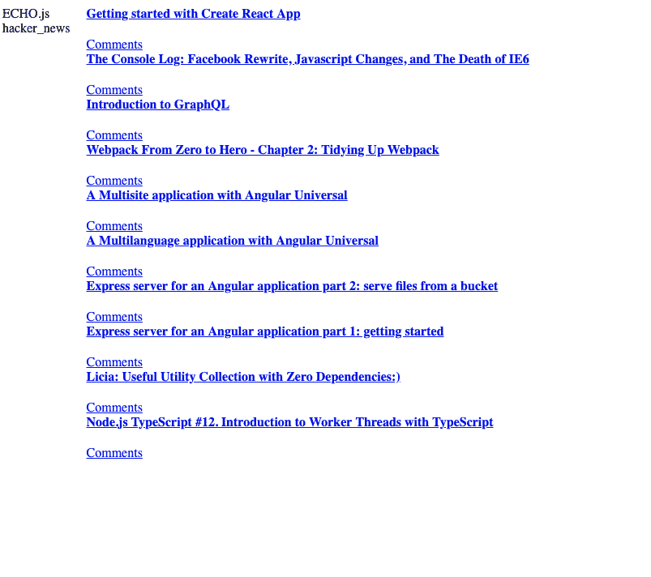

# Web 组件原型:构建一个 RSS 阅读器

> 原文：<https://dev.to/giteden/prototyping-with-web-components-build-an-rss-reader-4e1h>

如何使用 web 组件、ES6 模块和朋友构建应用原型。

我们即将踏上探索之旅，沿着使用 web 组件、es6 模块、事件目标、 [Bit.dev](https://bit.dev) 等等构建应用原型的道路前进。

这篇文章是一系列文章中的第一篇，我计划以联合发现的方式向您介绍这个充满活力的 web 标准，叫做 Web 组件。

我们将一起学习如何使用 web 组件，并探索一些额外的好东西。无论如何，我希望看到来自社区的关于这项工作如何能够和应该改进的意见。

在这篇文章中，我们将使用 Web 组件和朋友构建一个 RSS 阅读器的原型。我们的最终结果将如下所示:

[](https://res.cloudinary.com/practicaldev/image/fetch/s--8eEP0mVA--/c_limit%2Cf_auto%2Cfl_progressive%2Cq_auto%2Cw_880/https://cdn-images-1.medium.com/max/2000/1%2AB5tXOnFy9AthuzvpR6WLug.png)

这里是 GitHub 中的代码。

## 为什么是 Web 组件？？

本系列的主要焦点是 web 组件，在我们开始之前，我想停下来谈谈为什么您会选择 web 组件作为您的 UI 策略。有几个原因:

1.  面向未来 —他们过去称之为 JavaScript 疲劳，但这个词已经失宠了。现在，我听到人们谈论面向未来。Web 组件是一个标准，并且受浏览器支持。在网络的短暂历史中，选择标准被证明是有用的。

2.  **框架不可知**——当你有几个团队，用一些像 Vue 和 React 这样的库开发一个大的应用程序时，你会怎么做？有时候，您希望所有这些库都具有相同的功能，但这很难实现。有时，您有多个团队在不同版本的 React 上需要相同的组件。**标准化**！

3.  可重用的设计系统——框架不可知组件的另一个视角是当你需要为你的团队创建一个 T2 设计系统的时候。 Web 组件似乎是实现这一目标的最佳方式。

4.  **捆绑包大小-** 我为什么要运送浏览器能做的东西。VDOM 渲染是一个令人兴奋的概念，但这可以实现更多。现在不要误解我的意思，React 在 API 使用和支持库方面更成熟，但有时大小真的很重要。

## **什么是 web 组件？**

Web 组件允许您开发一个从文档的其余部分封装的组件。一种普通的做事方式。[有](https://dev.to/thepassle/web-components-from-zero-to-hero-4n4m#-a-components-lifecycle) [有](https://www.smashingmagazine.com/2014/03/introduction-to-custom-elements/) [许多](https://hackernoon.com/how-to-think-about-web-components-9875d599d0ec)这方面的大向导。这是 web 组件的主要产品:

1.  **自定义元素** — Javascript API，允许您定义一种新的 html 标签，特定于您的组件集合。

2.  **HTML 模板** —引入了`<template>`和`<slot>`标签，允许您指定模板的布局。

3.  影子 DOM(Shadow DOM)——或者我称之为特定于您的组件的“迷你 DOM”。组件 DOM 的某种隔离环境，与文档的其余部分分离。

这三个 API 一起允许你封装一个组件的功能，并轻松地将它与应用程序的其他部分隔离开来。它允许您使用额外的标记来扩展您的 DOM api。

## **通明是怎么工作的？**

Lit 是 vanilla api 之上的一个抽象，它提供了两个主要功能:

[Lit-html](https://github.com/Polymer/lit-html)—html 模板库。这个库提供了一个创建 html 模板的简单方法。它基本上允许您在 javascript 上下文中创建可重用的 html 模板。

该库使用了一个很棒的特性，叫做[标记模板](https://developer.mozilla.org/en-US/docs/Web/JavaScript/Reference/Template_literals#Tagged_templates)，与 es6 一起提供，如下所示:

```
tag `some ${boilerPlate} in my string` 
```

这个特性允许我们用自定义函数解析字符串。这是 lit-html 的核心，它直接在浏览器中结合了 javascript 中的模板。在 lit 的情况下，lit 元素组件内的渲染函数可以包含如下表达式: