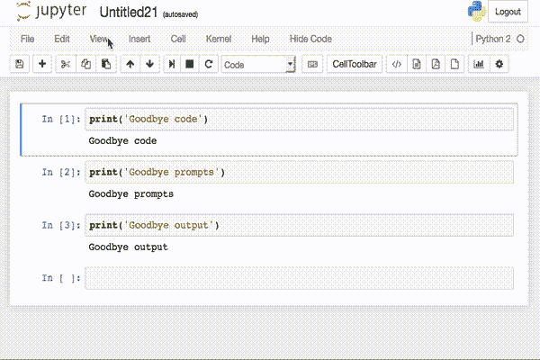

# 出版就绪 Jupyter 笔记本

> 原文：<https://dev.to/alephthoughts/publication-ready-jupyter-notebooks-47ca>

记录您的工作是您开发过程中不可或缺的一部分，但是如果您像我一样，您必须与不同的技术和非技术受众分享您的工作，您可能会额外创建相同结果的不同版本，一个版本为您的同行编写代码，另一个版本为业务利益相关者编写代码，至少可以说，他们可能会觉得代码很吓人或令人分心。Jupyter 笔记本让我的数据分析相关工作变得更加轻松。虽然 jupyter notebook 支持多种编程语言，如用于实时代码和可视化的 [Julia](https://julialang.org/) 、 [Python](python.org) 和 [R](https://www.r-project.org/) ，以及用于叙述性文本的 [Markdown](https://en.wikipedia.org/wiki/Markdown) 、 [HTML](https://en.wikipedia.org/wiki/HTML) 和其他语言，但在本文中，我们将看到一个 Python 代码的示例。

### 安装需要的包

假设您的系统上已经安装了 jupyter 和 python，您需要另外安装以下软件包:

#### [nbconvert](https://github.com/jupyter/nbconvert)

nbconvert 工具利用 [Jinja](http://jinja.pocoo.org/) 模板将您的 jupyter 笔记本转换为各种文档格式，如 HTML、LaTeX、PDF、Reveal JS、Markdown、重组文本(rst)和可执行脚本。
根据您的 python 包管理器，您可以使用任一命令安装 nbconvert:

`pip install nbconvert`

T1】

要将笔记本转换为所需的输出格式，请使用以下命令结构:

`$ jupyter nbconvert --to <output format> <input notebook>`

#### [隐藏 _ 代码](https://github.com/kirbs-/hide_code)

Hide_Code 是你的 jupyter 笔记本的一个扩展，它允许你有选择地隐藏 jupyter 笔记本中的代码、提示和输出。它还可以将这些笔记本导出为 HTML、LaTeX 和 PDF 格式。一旦 hide_code 安装在您的系统上，您可以通过单击 jupyter 笔记本菜单上的“查看”->“单元格工具栏”->“隐藏代码”来启用它。
[T3】](https://res.cloudinary.com/practicaldev/image/fetch/s--1cBMLKV3--/c_limit%2Cf_auto%2Cfl_progressive%2Cq_66%2Cw_880/https://thepracticaldev.s3.amazonaws.com/i/merjlhy2nzq3i26wc2bd.gif)

您可以使用以下命令安装 hide_code:

`pip install hide_code`
`jupyter nbextension install --py hide_code`
`jupyter nbextension enable --py hide_code`

您可以使用以下命令将笔记本导出为所需格式:
到 HTML

`jupyter nbconvert --to hide_code_html notebook_to_convert.ipynb`

到 PDF

`jupyter nbconvert --to hide_code_pdf notebook_to_convert.ipynb`

到 LaTex

`jupyter nbconvert --to hide_code_latexpdf notebook_to_convert.ipynb`

#### [制表](https://bitbucket.org/astanin/python-tabulate/src/master/)

制表是一个 python 包，用于漂亮地打印 python 中的表格数据。
您可以使用以下命令安装制表软件:
`pip install tabulate`
`conda install -c conda-forge tabulate`

### 创建笔记本

我在 github 上创建了一个[演示笔记本](https://github.com/alephthoughts/JupyterPublishDemo),你可以分支或者下载或者使用你自己的例子。

#### 写记叙文

为了在 Markdown 或 HTML 中编写叙述性文本，单击 jupyter 菜单上的“单元格->单元格类型-> Markdown”或按键盘上的“Esc + m”。这篇教程很好地介绍了降价。

#### 启用隐藏 _ 代码

启用 Hide_Code，它会在笔记本的每个单元格的右上角提供“隐藏提示”、“隐藏代码”和“隐藏单元格”选项。使用以下命令将您的笔记本转换为 LaTeX 格式。
`jupyter nbconvert --to hide_code_latex notebook_to_convert.ipynb`

#### 给你的 LaTeX 文件添加颜色

默认情况下，导出是黑白的。您可以使用以下命令为 latex 元素添加颜色:

`{\color{<color name>}<element text>}`

您可以使用以下全局定义为整个切片着色:

`\usepackage{sectsty}`
`\chapterfont{\color{brown}}`
`\sectionfont{\color{brown}}`
`\subsectionfont{\color{brown}}`
`\subsubsectionfont{\color{teal}}`
`\date{\color{brown}June 10, 2019}`

如果你想完全定制它，你可以深入研究一下 [LaTeX](https://www.latex-tutorial.com/tutorials/?ref=hackr.io) 。

本帖到此结束。希望你会觉得有用！
本帖最初发表于 [Alephthoughts](http://alephthoughts.com/2019-06-15-jupyterNB/) 。