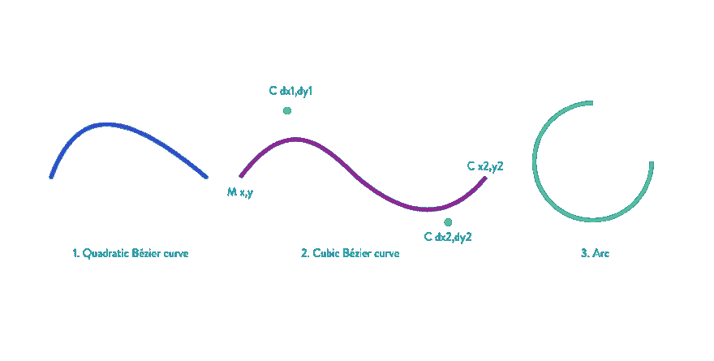
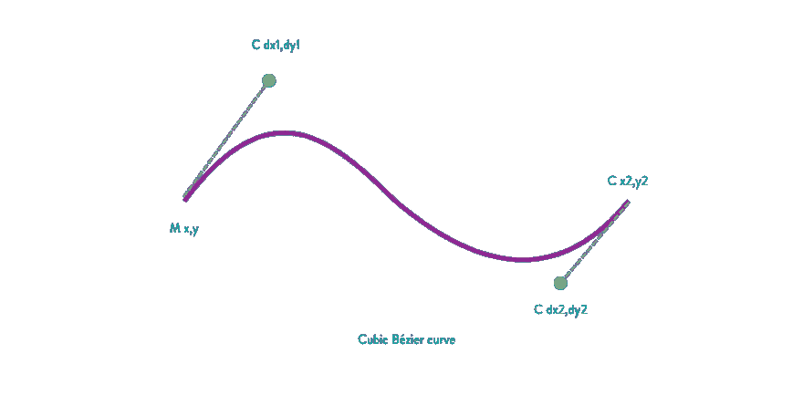

# 纯 HTML 动画-用制作 SVG 动画

> 原文：<https://dev.to/theliquidcharcoal/pure-html-animation-animate-svg-with-animate-2a5m>

## 在这个动画标记中，没有使用 CSS 或者 JS 来实现动画的目的。

长期以来，每个人都在谈论 CSS 和 JS 动画或动画库。我想知道为什么没有人谈论 HTML `<animate>`标签。

我希望周围的一些名人能够推动 SVG 的这个`animate`元素，以促进更多的开发。无论如何，开始一些好的事情永远不会太晚。我正在着手在前端社区传播关于 SVG 的`animate`元素的意识。

简而言之先来了解一下 SVG。

首先要做的事情- [*W3schools 总是一个很好的开始。*T3】](https://www.w3schools.com/graphics/svg_intro.asp)

### 什么是 SVG？

*   SVG 代表可缩放矢量图形
*   SVG 用于为 Web 定义基于矢量的图形
*   SVG 以 XML 格式定义图形
*   SVG 文件中的每个元素和每个属性都可以被动画化
*   SVG 是 W3C 的推荐标准
*   SVG 集成了其他 W3C 标准，如 DOM 和 XSL

### 为什么是 SVG？我告诉你。

*   这是一个矢量。
*   作为向量，它是可扩展的。
*   较小的文件大小。(平均 5X 比 png 文件小。)
*   使用 CSS 和 JS 很容易修改。
*   容易动画:)在更少的时间。此外，不需要任何动画软件或图像处理器。

*注意:*
如果你是第一次接触 SVG，请从 [Sara Soueidan 关于理解 SVG 坐标系和变换的博客](https://www.sarasoueidan.com/blog/svg-coordinate-systems/)中获取一些关于 SVG 及其相关的有用信息。

好了，说够了，让我们开始行动吧。打开您最喜欢的代码编辑器并启动您的浏览器。这个教程我用了谷歌 的 [*崇高文字 3*](https://www.sublimetext.com/) 和 [*chrome 浏览器。*](https://www.google.com/chrome/)

我们会一步一步来。

### 步骤一:准备 html 结构。

如果你熟悉[埃米特](https://emmet.io/)。只需在启用 emmet 的编辑器中键入`html:5`并执行*，因为崇高文本执行键是 *Tab 键** 。

-或者-

**从下面复制代码。【T2** 

```
<!DOCTYPE html>
<html lang="en">
<head>
  <meta charset="UTF-8">
  SVG wave animation
  <link rel="stylesheet" href="style.css">
</head>
<body>
  <!-- Wave SVG Animation -->
  <div class="waves"></div>

</body>
</html> 
```

### 第二步:画出波浪形。

我不擅长绘画，但我可以告诉你，三次贝塞尔曲线是一种波。因此，我们将绘制一条三次贝塞尔曲线。

```
<div class="waves">
    
        <path
            fill="#454599"
            d="
                M 0 67 
                C 273,183
                  822,-40
                  1920,106 

                V 359 
                H 0 
                V 67 
                Z"> 
        </path>
    
</div> 
```

*结果应该是这样:*

[](https://res.cloudinary.com/practicaldev/image/fetch/s--chSFwWFH--/c_limit%2Cf_auto%2Cfl_progressive%2Cq_auto%2Cw_880/https://thepracticaldev.s3.amazonaws.com/i/izwiuokylo3m0g4utn88.png)

在这里，我使用 CSS 设置了背景样式并定位了 div。可以从底部这个项目的 [codepen](https://codepen.io/liquidcharcoal/pen/rEeYrw) 链接获取 CSS。
让我先给你解释一下这些数字和字母是怎么回事。

欢迎来到黑客帝国！你需要从矩阵中知道那些绿色降雨的数字。(忽略)

好了，这里有三个属性与``联系在一起，它们很好地解释了自己。

同样，在``元素中有一个元素`<path>`，并附加了两个属性`fill`和`d`。你仍然可以理解，我们开始用`<path>`元素绘制一条路径，并用带有`fill`属性的颜色填充它。但是，嘿！那个`d ="1230948713294"`是什么？这就是你的问题对吗？这是我最想让你理解的，因为这是我们在本教程中要做的事情。

## 曲线 Hannhh

使用 SVG 可以绘制三种不同的平滑曲线。

1.  二次贝塞尔曲线
2.  三次贝塞尔曲线
3.  弧

[](https://res.cloudinary.com/practicaldev/image/fetch/s--HqV9Lgrg--/c_limit%2Cf_auto%2Cfl_progressive%2Cq_auto%2Cw_880/https://thepracticaldev.s3.amazonaws.com/i/bzil99msa778liyc971i.png)

我们将在本教程中使用 **三次贝塞尔** 曲线。那么，让我们来了解一下它是如何工作的。

如果你有使用 Illustrator 或素描软件的经验，或者像钢笔工具这样的东西，你会很容易理解。但是，如果你没有任何使用钢笔工具的经验，也没什么好担心的。我将解释如何贝塞尔曲线在我最好的时候工作。

贝塞尔曲线有两个主要点，我们称之为起点和终点，每个主要点都有它们的控制点，我们称之为控制点。

下面用图来了解一下。
[T3】](https://res.cloudinary.com/practicaldev/image/fetch/s--nGp1mKRv--/c_limit%2Cf_auto%2Cfl_progressive%2Cq_auto%2Cw_880/https://thepracticaldev.s3.amazonaws.com/i/nw8h1iyobhwz5l0pzcww.png)

在上图中:

*M *x，*y*是*起点*
*C *dx1，dy1** 是*控制点*为*起点*

*C *x2，*y2，*为*终点*
*C *dx2，*dy2*为*控制点*为*终点*

这意味着，

```
M 0 67                   M x,y
C 273,183                C dX1,dy1
  822,-40      -->         dx2,dy2
  1920,106                 x2,y2 
```

*重要提示:在本例中，我们通过使用`C 273 ...`来使用绝对贝塞尔曲线。如果你想使用相对贝塞尔曲线，你可以将* *大写* * `C 273 ...`改为**小写** `c 273...`，但是在定义点时需要修改。*

*Mozilla 开发者社区有一个很棒的绝对和相对曲线解释指南，请访问 [Mozilla 关于三次贝塞尔曲线的文档](https://developer.mozilla.org/en-US/docs/Web/SVG/Attribute/d#Cubic_B%C3%A9zier_Curve)*

### 第三步:开始挥手。

#### 在我们开始制作 wave 动画之前，让我们快速回顾一下我们将如何做。

我们将使用 SVG 的`<animate>`元素来实现。此外，我们将使用`<animate>`元素的一些属性。首先，因为我们想让波继续自己波动，我们将使用`repeatCount="indefinite"`。其次，我们将通过添加`fill="#454599"`属性来填充我们的波形。之后，我们将使用`attributeName="d"`将``元素中的`d`属性作为目标，并通过添加`dur="12s"`属性来定义动画的持续时间。接下来，我们将讨论`values=""`属性。

```
<animate 
          repeatCount="indefinite" 
          fill="#454599" 
          attributeName="d" 
          dur="12s" 
          values=""
></animate> 
```

根据使用的上下文，属性可以用几种方式编写。另一方面，如果解释器找到了列表`values`的规格，解释器将忽略属性`to`、`from`和`by`的值。 *[更多详情推荐文章。](https://developer.mozilla.org/en-US/docs/Web/SVG/Attribute/values)*

在我们的例子中，我们的目标是``元素的`d`属性来修改曲线。我们还定义了 12 秒的持续时间，这意味着我们可以将迭代分成 4 个阶段，每个阶段 3 秒。让我们现在开始吧...

```
values="
        M0 77 
        C 473,283
          822,-40
          1920,116 

        V 359 
        H 0 
        V 67 
        Z;

        *second and third iteration will go here*       

        M0 77 
        C 473,283
          822,-40
          1920,116 

        V 359 
        H 0 
        V 67 
        Z;

" 
```

你可能想知道为什么我两次使用同一个值？这是因为我们将在动画周期的第四次迭代结束时回到我们开始的地方，我们将在第二次和第三次迭代中对形状进行一些移动。

现在让我们进行第二次和第三次动画迭代。

*第二次迭代*

```
M0 77 
C 473,-40
  1222,283
  1920,136 

V 359 
H 0 
V 67 
Z; 
```

*第三次迭代*

```
M0 77 
C 973,260
  1722,-53
  1920,120 

V 359 
H 0 
V 67 
Z; 
```

基本上，我们在迭代之间修改点和句柄的值，`<animate>`元素将根据用`dur="..."`属性定义的动画持续时间平滑点的变换。

所以，最终的代码应该是这样的:

```
 <!DOCTYPE html>
<html lang="en">
<head>
  <meta charset="UTF-8">
  SVG wave animation
  <link rel="stylesheet" href="style.css">
</head>
<body>
  <!-- Wave SVG Animation -->
  <div class="waves">
    
      <path 
        fill="#454599" 
        d="
          M0 67
          C 273,183
            822,-40
            1920.00,106 

          V 359 
          H 0 
          V 67
          Z">
        <animate 
          repeatCount="indefinite" 
          fill="#454599" 
          attributeName="d" 
          dur="15s" 
          values="
            M0 77 
            C 473,283
              822,-40
              1920,116 

            V 359 
            H 0 
            V 67 
            Z; 

            M0 77 
            C 473,-40
              1222,283
              1920,136 

            V 359 
            H 0 
            V 67 
            Z; 

            M0 77 
            C 973,260
              1722,-53
              1920,120 

            V 359 
            H 0 
            V 67 
            Z; 

            M0 77 
            C 473,283
              822,-40
              1920,116 

            V 359 
            H 0 
            V 67 
            Z
            ">
        </animate>
      </path>
    
  </div>

</body>
</html> 
```

哦，等等...因为这是我的第一篇文章。我有奖金给你。

让我告诉你如何给波浪添加渐变。

为了添加渐变，我们将在`<path>`元素之前添加`<linearGradient>`元素。此外，我们将为`<linearGradient>`提供一些属性，如`id`和渐变开始和结束的位置，类似于`<linearGradient id="grad1" x1="0%" y1="0%" x2="100%" y2="0%">`。

在`<linearGradient>`元素中，我们将定义我们想要在渐变中使用的颜色的`stop`点。关于在 SVG 中使用渐变的更多细节，请阅读 Mozilla 开发者网络上的这篇文章:[SVG 中的渐变](https://developer.mozilla.org/en-US/docs/Web/SVG/Tutorial/Gradients#SVGLinearGradient)。

`linearGradient`的`id`可以用在`<path>`元素的`fill=""`属性中。

检查下面的代码。

```


  <linearGradient id="grad1" x1="0%" y1="0%" x2="100%" y2="0%">
    <stop offset="0%" stop-color="#00B4DB" />
    <stop offset="50%" stop-color="#224488" />
    <stop offset="100%" stop-color="#0083B0" />
  </linearGradient>

  <path
    fill="url(#grad1)"
    d="
       M0 67 
       C 273,183
         822,-40
         1920.00,106 

         V 359 
         H 0 
         V 67 
         Z">
  </path>

... 
```

最终输出:[检查笔](https://codepen.io/liquidcharcoal/pen/rEeYrw)

[https://codepen.io/liquidcharcoal/embed/rEeYrw?height=600&default-tab=result&embed-version=2](https://codepen.io/liquidcharcoal/embed/rEeYrw?height=600&default-tab=result&embed-version=2)