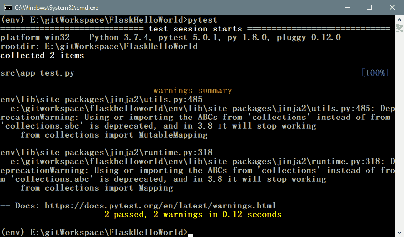
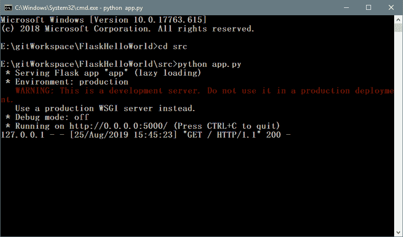
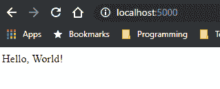

# 带有 Heroku 和 TravisCI 的蟒蛇皮烧瓶

> 原文：<https://dev.to/kritner/python-flask-with-heroku-and-travisci-4fl5>

试图加入非营利组织 [MAGIC](https://magicinc.org/) 。他们使用了大量的 Python，所以下面是我如何开始的！

我最近会见了一些来自非营利组织 [MAGIC](https://magicinc.org/) 的人，我希望我能以某种方式提供帮助。他们全年都会举办一些大型活动，还会在当地图书馆举办一个网络俱乐部。他们的大部分工作都是用 Python 完成的，所以我想我最好熟悉一下。

我已经有一段时间没有机会写博客了。我们最近又有了一个宝宝，我一直超级忙！在新宝宝、旧宝宝和工作之间，我没有太多的时间或灵感去做除了生存以外的任何事情。

MAGIC 目前为他们的一个活动提供了一个 python API(尽管据我所知还没有使用过)。我认为这将是一个很好的机会来弄清楚如何使用相同的框架——flask 来构建和托管 python 应用程序。

[烧瓶](https://palletsprojects.com/p/flask/)描述为:

> Flask 是一个轻量级的 WSGI web 应用程序框架。它旨在快速轻松地开始使用，并能够扩展到复杂的应用程序。它最初是一个围绕 Werkzeug 和 Jinja 的简单包装器，现在已经成为最流行的 Python web 应用程序框架之一。

我看了一下 Flask 的一些代码，它似乎解决了 MVC 和/或 Web API 从。网络世界。我想看看如何让一个最小的 flask 应用程序在互联网上运行和托管！

# 烧瓶应用

我将只使用带有 Flask 的 hello world 类型的应用程序。在未来，我希望有机会进一步探索 flask，以及 python。根据 flask 网站上的教程，我将使用以下内容制作一个“app . py”:

```
import os
from flask import Flask

app = Flask(__name__)

@app.route('/')
def hello_world():
    return 'Hello, World!'

if __name__ == '__main__':
    # Bind to PORT if defined, otherwise default to 5000.
    port = int(os.environ.get('PORT', 5000))
    app.run(host='0.0.0.0', port=port) 
```

Enter fullscreen mode Exit fullscreen mode

Flask 在这里没有解析，那是因为我还没有安装它。之前短暂地使用 python，我回忆起使用虚拟环境来存放我的项目的依赖项；希望这仍然是标准。

从[https://packaging . python . org/guides/installing-using-pip-and-virtual-environments/](https://packaging.python.org/guides/installing-using-pip-and-virtual-environments/)，我跑了:

`py -m pip install --user virtualenv`、`py -m venv env`，然后是`.\env\Scripts\activate`。

接下来，我定义了一个名为“requirements.txt”的文件，并添加了:

```
Flaskpytest 
```

Enter fullscreen mode Exit fullscreen mode

现在将需求安装到虚拟环境中:

```
pip install -r requirements.txt 
```

Enter fullscreen mode Exit fullscreen mode

这将把 Flask、pytest 及其所有依赖项安装到之前创建的虚拟环境中。现在“flask”导入从创建的“app.py”中解析出来。

## python 测试

我们现在真的没有太多要测试的，但为什么不扔几个存根在那里，这样我们就可以在到达 travis build 时运行一些东西了。

app_test.py

```
from . import app

def func(x):
    return x + 1

def test_answer():
    assert func(3) == 4

def test_hello_world():
    result = app.hello_world()
    expected_result = 'Hello, World!'

    assert expected_result == result 
```

Enter fullscreen mode Exit fullscreen mode

函数“func(x)”是我在 googling 关于 pytest 时发现的一个“hello world”类型测试，第二个测试“test_hello_world”测试 app.py 中定义的端点返回预期的字符串。

接下来，我们将从命令行运行`pytest`，并检查我们的测试是否通过:

[](https://res.cloudinary.com/practicaldev/image/fetch/s--nC8Qfhp2--/c_limit%2Cf_auto%2Cfl_progressive%2Cq_auto%2Cw_880/https://blog.kritner.com/2019/08/25/Python-Flask-with-Heroku/pytest.png)

## 运行应用程序

我们可以用一个`python app.py`来运行应用程序:

[](https://res.cloudinary.com/practicaldev/image/fetch/s--oXF0zMhL--/c_limit%2Cf_auto%2Cfl_progressive%2Cq_auto%2Cw_880/https://blog.kritner.com/2019/08/25/Python-Flask-with-Heroku/run.png) 

[](https://res.cloudinary.com/practicaldev/image/fetch/s--2F0zYBwA--/c_limit%2Cf_auto%2Cfl_progressive%2Cq_auto%2Cw_880/https://blog.kritner.com/2019/08/25/Python-Flask-with-Heroku/run2.png)

# 特拉维斯词

正如文章开头所述，我希望将这个应用程序托管在互联网的某个地方，我将使用 Heroku，因为他们有一个免费的托管层。然而，在开始托管之前，我想设置 Travis 来测试我的应用程序，即使它的功能和测试极其有限。

我以前利用过特拉维斯。net 项目，所以设置 python 不会那么困难，python 甚至都没有编译过！:D

因此，要让 travis 在我们的存储库上运行，我们只需转到[https://travis-ci.org](https://travis-ci.org)，如果我们没有帐户，就建立一个帐户，并“启用”我们想要用 travis 测试的存储库的功能。在我的情况下，我希望它运行所有的 PRs 和提交。接下来，我们需要一个包含以下内容的. travis.yml 文件:

```
dist: xenial
language: python
python:
  - "3.7"
install:
  - pip install -r requirements.txt
script: pytest 
```

Enter fullscreen mode Exit fullscreen mode

以上应该是不言自明的，尽管“dist: xenial”显然是 python 最新版本所必需的。我们正在安装我们的需求(flask 和 pytest)，然后运行 pytest。

现在，在 commit 和 PR 上，travis 将运行构建，并根据我们的测试进行测试——这将更好地保证传入的 commit/PR 没有“破坏”构建。该版本目前如下所示:

[](https://res.cloudinary.com/practicaldev/image/fetch/s--I5U6BZZ0--/c_limit%2Cf_auto%2Cfl_progressive%2Cq_auto%2Cw_880/https://blog.kritner.com/2019/08/25/Python-Flask-with-Heroku/travis.PNG)

# Heroku

现在我们的项目正在构建和测试中，我们可以建立 Heroku 来服务我们的网站，而且是免费的！建立一个 heroku 帐号非常简单，而且有很多教程。您只需要将 heroku 指向您的 github repo，然后告诉它自动将 push 部署到 master(注意，如果测试没有通过，travis CI 理想情况下会将 builds 失败到 master，因此我们得到了某种程度的保证，我们没有推送“坏代码”)。

我做的**而不是**从我找到的教程中看到的一件事，是关于 heroku 如何给你的应用程序分配一个随机端口，以及如何从你的 flask 应用程序使用那个端口的信息。经过数周(尽管这主要是被动时间)的反复试验，我发现它只是使用 Procfile 将`$PORT$`转发到我的 flask 应用程序，如下所示:

过程文件:

```
web: gunicorn src.app:app -b 0.0.0.0:$PORT 
```

Enter fullscreen mode Exit fullscreen mode

这将在 app.py 行中使用:

```
port = int(os.environ.get('PORT', 5000))
app.run(host='0.0.0.0', port=port) 
```

Enter fullscreen mode Exit fullscreen mode

其中“端口”(当 heroku 定义并传入时)将被插入，否则使用端口 5000。gunicorn(至少)是一种推荐的服务 python 应用程序的方式，所以这是添加到我的需求中的额外依赖。txt。

在应用程序的下一次构建中，它成功地部署到了[https://kritnerflaskhelloworld.herokuapp.com/](https://kritnerflaskhelloworld.herokuapp.com/)。注意，使用 heroku 的免费层，应用程序会在一段时间不活动后“关闭”,因此在点击 URL 后的最初几秒钟，应用程序会重新启动。

我想就这样吧！这个职位的代码可以在:[https://github.com/Kritner-Blogs/FlaskHelloWorld](https://github.com/Kritner-Blogs/FlaskHelloWorld)找到