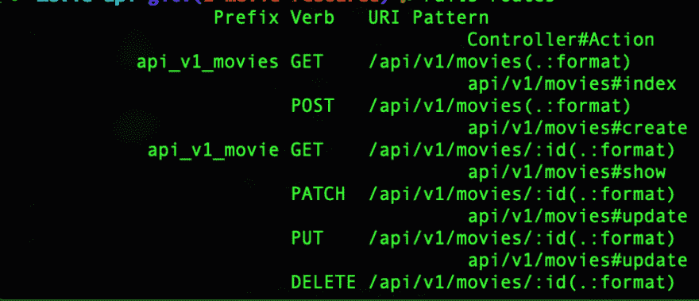
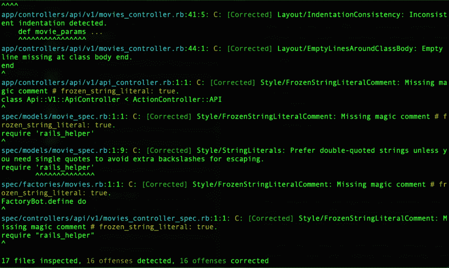

# React 内置前端的 Rails API，第三部分。

> 原文：<https://dev.to/jean182/rails-api-with-a-frontend-built-in-react-part-iii-23b6>

在本帖中，我们将在 API 中添加一个电影资源。让我们修改 config/routes.rb 中的 routes 文件

```
Rails.application.routes.draw do
  namespace :api do
    namespace :v1 do
      resources :movies
    end
  end
end 
```

Enter fullscreen mode Exit fullscreen mode

如果我们运行铁路路线，我们应该能够看到这样的东西

[](https://res.cloudinary.com/practicaldev/image/fetch/s--_TSk5oVv--/c_limit%2Cf_auto%2Cfl_progressive%2Cq_auto%2Cw_880/https://thepracticaldev.s3.amazonaws.com/i/tq34wa68xoi1163lwoc3.png)

让我们创建一个新的控制器来完成我们的 API 工作。

```
$ mkdir app/controllers/api
$ mkdir app/controllers/api/v1
$ touch app/controllers/api/v1/api_controller.rb 
```

Enter fullscreen mode Exit fullscreen mode

首先，我们创建了两个新的目录来命名我们的 API，如果我们计划对 API 进行版本化，以及如果我们计划将来的发布，那么这样做是很重要的。我们创建了一个名为 ApiController 的新控制器，我们将继承它，就像这样。命名空间是非常重要的，这样才能工作。

```
class Api::V1::ApiController < ActionController::API
end 
```

Enter fullscreen mode Exit fullscreen mode

### 电影模型。

现在我们要创建我们的第一个模型，电影模型，我们的电影将有一个标题，一个情节和一个发布日期，至少现在是这样。

```
$ rails generate model Movie title plot:string release_date:date 
```

Enter fullscreen mode Exit fullscreen mode

它应该生成四个新文件，一个包含迁移，两个用于我们的测试，一个用于模型。

[](https://res.cloudinary.com/practicaldev/image/fetch/s--xsxIbvVJ--/c_limit%2Cf_auto%2Cfl_progressive%2Cq_auto%2Cw_880/https://thepracticaldev.s3.amazonaws.com/i/n5xzod2572owh669ypbw.png)

现在让我们创建数据库，然后应用新的迁移。

```
$ rails db:create
$ rails db:migrate 
```

Enter fullscreen mode Exit fullscreen mode

之后，我们需要添加一些验证，标题和日期必须是必填字段。

```
class Movie < ApplicationRecord

  validates :title, :release_date, presence: true

end 
```

Enter fullscreen mode Exit fullscreen mode

### 用 shoulda matchers 测试模型。

为了测试我们刚刚做的验证，我们将使用 shoulda matchers，它是上一篇教程(一个 rails 测试的 liners)中添加的一个插件，通过修改我们新生成的文件*spec/models/movie _ spec . Rb*

```
RSpec.describe Movie, type: :model do
  describe "validations" do
    it { is_expected.to validate_presence_of(:title) }
    it { is_expected.to validate_presence_of(:release_date) }
  end
end 
```

Enter fullscreen mode Exit fullscreen mode

请注意，在 it 语句中，我们添加了一个包含两行代码的 describe 块来验证我们的字段是否存在，这就是 shoulda matchers 的工作方式，它让您编写一行简单易读的代码来测试您的 rails 应用程序的功能。

### 创建我们的第一家工厂。

现在，我们需要修改另一个测试文件，它是我们在运行 rails generate 模型时生成的，这是一个工厂文件，我们将对它进行一些修改。这就是 faker 派上用场的时候，因为它让我们用虚拟数据填充工厂，以便在测试中使用，这样我们可以使用不同的数据值创建测试，尽管小心很重要，因为 faker 没有无限的数据值，所以有可能创建重复的值，如果我们的一个模型验证了某个字段的唯一性，测试可能会中断，因为已经有一个同名的资源；不管怎样，这就是文件应该看起来的样子(在 faker gem 中没有电影名称，所以我使用图书名称代替)。

```
FactoryBot.define do
  factory :movie do
    title { Faker::Book.title }
    plot { Faker::Lorem.paragraph }
    release_date { Faker::Date.birthday(18, 65) }
  end
end 
```

Enter fullscreen mode Exit fullscreen mode

### 播种数据库。

既然你看到 faker 可以生成假数据，那么让我们在 *db/seeds.rb*
中为我们的电影创建一些种子

```
10.times do
  Movie.create(
    title: Faker::Book.title,
    plot: Faker::Lorem.paragraph,
    release_date: Faker::Date.birthday(18, 65),
  )
end 
```

Enter fullscreen mode Exit fullscreen mode

最后运行这个命令来添加假电影

```
$ rails db:seed 
```

Enter fullscreen mode Exit fullscreen mode

### 创建电影控制器。

很好，现在是为我们的电影模型创建控制器的时候了，我们将在 api 名称空间中添加一个名为 movies_controller.rb 的新文件。

```
$ touch app/controllers/api/v1/movies_controller.rb 
```

Enter fullscreen mode Exit fullscreen mode

这个控制器将负责显示，编辑，添加和删除电影资源，出于教程的目的，我不会解释一个普通的控制器是如何工作的，我只是给你看实际的代码。

```
class Api::V1::MoviesController < Api::V1::ApiController
  before_action :set_movie, only: %i[show update destroy]

  def index
    @movies = Movie.all

    render json: @movies
  end

  def show
    render json: @movie
  end

  def create
    @movie = Movie.new(movie_params)

    if @movie.save
      render json: @movie, status: :created
    else
      render json: @movie.errors, status: :unprocessable_entity
    end
  end

  def update
    if @movie.update(movie_params)
      render json: @movie
    else
      render json: @movie.errors, status: :unprocessable_entity
    end
  end

  def destroy
    @movie.destroy
  end

  private
    def set_movie
      @movie = Movie.find(params[:id])
    end

    def movie_params
      params.require(:movie).permit(:title, :plot, :release_date)
    end
end 
```

Enter fullscreen mode Exit fullscreen mode

如果你熟悉这个框架，这段代码应该不会让你感到惊讶，这是你的第一个 rails API 吗？你可以看到我们呈现的是 JSON 而不是常规的 html 视图，剩下的只是常规的控制器逻辑流程。

### 串行化器

为了展示这一点，我们将使用一个名为***active _ model _ serializer***的 gem，它允许我们修改应该在 JSON 响应中显示哪些内容。

```
# Rest of the gems
gem "active_model_serializers", "~> 0.10.0" 
```

Enter fullscreen mode Exit fullscreen mode

在捆绑了这个新的 gem 之后，我们将为我们的电影资源创建一个新的序列化器，但是首先让我们看看一个常规的响应现在是什么样子的，我们可以使用 postman、curl 或任何你想要的东西来检查，只要启动你的 rails 服务器。并尝试向这个 URL 发出 get 请求:[http://localhost:3000/API/v1/movies/1](http://localhost:3000/api/v1/movies/1)您的输出应该类似于下面的内容:

```
{  "id":  1,  "title":  "In Death Ground",  "plot":  "Maxime nulla architecto. Sit et et. Et vero reiciendis.",  "release_date":  "1979-03-29",  "created_at":  "2019-06-07T04:22:30.850Z",  "updated_at":  "2019-06-07T04:22:30.850Z"  } 
```

Enter fullscreen mode Exit fullscreen mode

请注意，我们在响应中显示所有内容，这不是一个好主意，因为在某些情况下，我们希望在响应中隐藏某些信息。因为我们正在使用序列化程序，值得一提的是，有时人们更喜欢使用 Jbuilder，它基本上是在创建而不是在视图文件夹下使用扩展名为 **json.jbuilder** 的 **html.erb** 文件。虽然这种方法也不错，但我更喜欢使用序列化程序，因为我不喜欢在 views 文件夹中创建文件的想法。如果我们正在做一个 API，听起来有点傻，即使这是一个完全有效的方法，对我来说，在一个只有 API 的应用程序中使用 views 文件夹是没有意义的。

让我们创建我们的序列化文件。

```
$ mkdir app/serializers
$ touch app/serializers/movie_serializer.rb 
```

Enter fullscreen mode Exit fullscreen mode

现在让我们编辑新创建的文件

```
class MovieSerializer < ActiveModel::Serializer

  attributes :id, :title, :plot, :release_date

end 
```

Enter fullscreen mode Exit fullscreen mode

现在，如果我们尝试执行相同的 get 请求，我们应该得到类似这样的结果:

```
{  "id":  1,  "title":  "In Death Ground",  "plot":  "Maxime nulla architecto. Sit et et. Et vero reiciendis.",  "release_date":  "1979-03-29"  } 
```

Enter fullscreen mode Exit fullscreen mode

请注意，在我们的新响应中，我们省略了 created_at 和 updated_at 字段，因为我们没有在序列化程序中指定它们。

### RSpec 控制器测试

如果您想体验控制器操作的功能，请随意，我将跳过这一部分，向您展示如何在应用程序中开始测试控制器。让我们创建测试文件。

```
$ mkdir spec/controllers
$ mkdir spec/controllers/api
$ mkdir spec/controllers/api/v1
$ touch spec/controllers/api/v1/movies_controller_spec.rb 
```

Enter fullscreen mode Exit fullscreen mode

现在，基本的测试控制器结构是这样的(注意控制器中的命名空间)

```
require "rails_helper"

RSpec.describe Api::V1::MoviesController, type: :controller do
  # Your tests
end 
```

Enter fullscreen mode Exit fullscreen mode

这是基本的结构，通常当你测试控制器时，你需要确保所有的动作都被测试，让我们开始为我们的对象定义属性，这将允许我们在执行 POST 或 PUT 动作时进行测试。

```
RSpec.describe Api::V1::MoviesController, type: :controller do
  let(:valid_attributes) do
    {
      title: "American Pie",
      plot: "Teen Comedy",
      release_date: "09-06-1999",
    }
  end

  let(:invalid_attributes) do
    { release_date: nil }
  end
end 
```

Enter fullscreen mode Exit fullscreen mode

在这里，我们实例化了两个变量，可以在我们的操作的描述块中使用，它们是这个文件的全局变量。

现在让我们开始写一些动作，首先我们要添加索引和显示动作。

```
RSpec.describe Api::V1::MoviesController, type: :controller do
  # Rest of the code
  describe "GET #index" do
    it "returns a success response" do
      get :index, params: {}
      expect(response).to be_successful
    end
  end

  describe "GET #show" do
    it "returns a success response" do
      movie = create(:movie)
      get :show, params: { id: movie.to_param }
      expect(response).to be_successful
    end
  end
  # Rest of the code
end 
```

Enter fullscreen mode Exit fullscreen mode

在这两个描述块中，我们对我们的索引和显示动作执行 get 请求，索引不需要任何参数来工作，所以我们不发送任何东西，对应的显示动作需要一个参数，在 rails 中默认为 *:id* 。我们使用 factory bot 创建一个新电影，并使用该电影的新 id 将它传递给我们的参数。

对于我们的创建操作，代码应该如下所示。

```
RSpec.describe Api::V1::MoviesController, type: :controller do
  # Rest of the code
  describe "POST #create" do
    context "with valid params" do
      it "creates a new Movie" do
        expect do
          post :create, params: { movie: valid_attributes }
        end.to change(Movie, :count).by(1)
      end

      it "returns a 201 status code" do

        post :create, params: { movie: valid_attributes }
        expect(response).to have_http_status(:created)
      end
    end

    context "with invalid params" do
      it "does not create a new Movie" do
        expect do
          post :create, params: { movie: invalid_attributes }
        end.to change(Movie, :count).by(0)
      end

      it "returns a 422 status code" do

        post :create, params: { movie: invalid_attributes }
        expect(response).to have_http_status(:unprocessable_entity)
      end
    end
  end
  # Rest of the code
end 
```

Enter fullscreen mode Exit fullscreen mode

请注意，在我们的描述中，我们使用了两个上下文，一个具有有效属性，另一个具有无效属性。这两个上下文基本上测试相同的有效属性，我们期待两件事，一是在我们的数据库中保存一部新电影，这样会将我们的电影计数改变 1，我们还期待来自服务器的 201 created 响应，因为创建了一部新电影。另一个上下文正在做相反的事情，它希望无效的属性不会改变我们的电影计数，并返回一个不可处理的实体响应来告诉用户电影无法创建。

为了继续这个测试，我们将添加更新操作。

```
RSpec.describe Api::V1::MoviesController, type: :controller do
  # Rest of the code
  describe "PUT #update" do
    context "with valid params" do
      let(:new_attributes) do
        {
          title: "American Pie 2",
          release_date: "06-08-2001",
        }
      end

      it "updates the requested movie" do
        movie = create(:movie)
        put :update, params: { id: movie.to_param, movie: new_attributes }
        movie.reload
        expect(movie.attributes).to include("title" => "American Pie 2")
      end

      it "returns a 200 status code" do
        movie = create(:movie)

        put :update, params: { id: movie.to_param, movie: valid_attributes }
        expect(response).to have_http_status(:ok)
      end
    end

    context "with invalid params" do
      it "returns a 422 status code" do
        movie = create(:movie)

        put :update, params: { id: movie.to_param, movie: invalid_attributes }
        expect(response).to have_http_status(:unprocessable_entity)
      end
    end
  end
  # Rest of the code
end 
```

Enter fullscreen mode Exit fullscreen mode

更新操作是不同的，因为我们正在更改属性的外观，所以这里我们需要实例化一个 let 变量来传递新的属性，然后我们创建两个上下文，就像在我们的创建操作中一样，来验证两个可能的场景，如果电影正确更新，我们应该期待更新的属性与 new_attributes 变量相等，我们还应该期待来自服务器的 200 ok 响应，以告诉用户更改成功。在我们的失败上下文中，我们测试如果我们向我们的一个必需字段发送一个空值，更新将会失败，因为我们定义了 release_date 不能为空。

我们测试的最后一个动作叫做销毁

```
RSpec.describe Api::V1::MoviesController, type: :controller do
  # Rest of the code
  describe "DELETE #destroy" do
    it "destroys the requested movie" do
      movie = create(:movie)
      expect do
        delete :destroy, params: { id: movie.to_param }
      end.to change(Movie, :count).by(-1)
    end
  end
end 
```

Enter fullscreen mode Exit fullscreen mode

describe 的作用与 create 相反，因为我们希望电影计数为负一，因为一部电影被删除了。注意工厂是如何帮助避免代码重复的。

## 跨产地资源共享。

既然一切都已测试完毕，我们已经完成了电影资源，现在是时候让我们的 API 接收来自外部源的请求了，例如我们的本地前端，运行在另一个端口上。我们需要安装 gem 文件中注释的 gem。

```
gem "rack-cors" 
```

Enter fullscreen mode Exit fullscreen mode

运行捆绑包安装后，让我们修改 cors 文件:

```
# config/initializers/cors.rb
Rails.application.config.middleware.insert_before 0, Rack::Cors do
  allow do
    origins "*"

    resource "*",
             headers: :any,
             methods: %i[get post put patch delete options head]
  end
end 
```

Enter fullscreen mode Exit fullscreen mode

这应该进行相应的配置，我这里的例子不应该用在真正的 API 中，因为基本上我们允许任何来源访问和执行对我们 API 的任何请求。

为了结束本教程，在对远程 repo 进行任何推送之前，我们应该检查 rspec 和 rubocop 是否通过，让我们试试看。

```
$ rubocop -a 
```

Enter fullscreen mode Exit fullscreen mode

应该会产生这样的结果:

[](https://res.cloudinary.com/practicaldev/image/fetch/s--wmi5ixZB--/c_limit%2Cf_auto%2Cfl_progressive%2Cq_auto%2Cw_880/https://thepracticaldev.s3.amazonaws.com/i/70b59yv1ytwmyty44f6j.png)

现在让我们运行 RSpec，看看我们的测试是否通过

```
$ rspec 
```

Enter fullscreen mode Exit fullscreen mode

你应该看到一切都在流逝。

[](https://res.cloudinary.com/practicaldev/image/fetch/s--HNgRL_pH--/c_limit%2Cf_auto%2Cfl_progressive%2Cq_auto%2Cw_880/https://thepracticaldev.s3.amazonaws.com/i/dq0w3drkl9zrd5kar9hr.png)

是的，这应该是这篇文章的全部内容，如果有什么不清楚的地方，请随时纠正我或提问，并关注下一篇文章，它将把这些内容集成到 react 项目中。