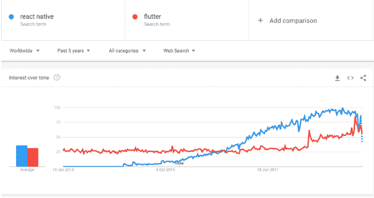

# React native vs Flutter 2019 对比

> 原文：<https://dev.to/kris/react-native-vs-flutter-2019-comparison-3ldc>

这项技术正在飞速发展。web 发展迅速，移动应用程序开发也是如此。对移动应用的需求已经大大增加。公司希望他们的产品有移动应用。这些应用程序要么是为了推广他们的产品，更好的客户服务，要么是为了销售。全球广泛使用的流行平台有两个，IOS 和 Android。如果一家公司决定开发一款移动应用，他们需要为 IOS 设备和 Android 设备开发不同的应用，尽管工作原理是一样的。这就是开发人员需要学习不同的语言和过程来构建两个最终行为相似的应用程序的地方。因此，为了解决这个问题，跨平台框架应运而生，这些框架用于构建可以在 IOS 和 Android 平台上运行的移动应用程序。最受欢迎的两个 hot cross 平台是 React Native 和 Flutter。

### 历史

谷歌和脸书已经在网络社区展开竞争。Google 的 AngularJS 是用于构建 web 应用程序的最广泛使用的 Javascript 框架之一。React 由脸书创建，是一个 javascript 库，在 web 应用程序开发中被大量使用。AngularJS 和 ReactJS 通常被认为是 web 社区中的热门竞争对手。但是不久前，当对跨平台移动应用的需求开始增加时，脸书推出了用于构建跨平台移动应用的 React 原生平台。不久，谷歌也推出了自己的产品，与脸书的 React Native 展开竞争。

**React Native:** React Native 于 2015 年 3 月由脸书发行。

**Flutter:** 谷歌在 2019 年 5 月推出了 Flutter。

扑**出来的比较晚**。在市场上出现 flutter 之前，React Native 已经在移动应用程序开发社区中声名鹊起。

### 建筑

无论何时决定一个框架，考虑其架构的基础都是至关重要的。【React Native 和 Flutter 都有完全不同的架构。

React Native :基于**在脸书上使用的 Flux 架构**。它依赖于 JS 运行时环境的概念，被称为**JavaScript 桥**。该桥用于与本机线程通信。代码用 Javascript 编写，然后在运行时编译成本机代码。

**Flutter** : Flutter 使用**的 Dart 框架**，而 Dart 框架又使用**的 Skia C++引擎**。与 React Native 的 Flux 不同，dart 框架不需要任何桥梁来进行通信，因为它已经内置了大部分的**组件**。它的尺寸更大。Skia C++引擎附带了所有必要的协议、通道和组合。

与 Flutter 相比，React Native 架构的性能很差，因为前者使用了 javascript 桥。Flutter 拥有其架构本身所需的一切。

### 编程语言

对于开发人员来说，任何应用程序的开发都取决于所使用的编程语言。目前存在许多编程语言，大多数开发人员都了解多种编程语言。我们来对比一下 React Native 和 Flutter 使用的语言。

**React Native**:React Native 使用的编程语言是 **Javascript** 。Javascript 是世界上最流行的语言之一，也是万维网的三大核心技术之一**。**

**Flutter** :另一方面，Flutter 使用的**飞镖**既不流行也不广泛使用。它是谷歌在 2011 年推出的。它非常简单易学，因为它支持大多数面向对象的概念**。**

任何有一点 web 开发经验的人都知道 Javascript。它是最受欢迎的语言之一。大部分 web 框架如 Angular、React、Vue 也是用 javascript 构建的。但是 Flutter 用的 dart 相当**年轻**。它在编程社区中不太为人所知。

### 安装

决定之后，第一步总是安装。很多时候是很头疼的，尤其是新手。反应本地和颤振有不同的安装方式。

**React Native** : **节点包管理器**或者俗称 **NPM** 用于在 windows 和 Linux 中安装 React Native。具有 javascript 背景的开发人员已经熟悉了 NPM，因为它被大量使用。NPM 安装在本地或全球，这取决于用户的选择。对于 macOS，除了 NPM，还需要**自制**包管理器。

**Flutter** : Flutter 不需要任何包管理器进行安装。针对特定平台直接从 **GitHub** 下载。对于 macOS，我们需要设置路径。

使用 NPM 非常容易和简单。对于没有 javascript 背景的开发人员来说，学习 NPM 相当容易，因为它只不过是在命令行中编写三到五个命令。此外，NPM 在 web 开发世界中几乎无处不在。所以学习 NPM 总是一个加分点。另一方面，Flutter 首先从 GitHub 下载，然后安装。它的安装有几个步骤可能会令人头疼。为了更好的安装过程，Flutter 还需要某种包管理器。

### 用户界面组件和 API

使用一个平台来开发跨平台的应用依赖于平台对本地组件的支持。本机组件是本机应用程序的关键。API 扮演了另一个重要的角色。一个具有合适的 **API** 来访问本地模块的框架非常重要。

**React Native** :和 React 一样，React Native 也提供了 **UI 渲染**和设备 API。它严重依赖**第三方模块**获得原生组件。毫无疑问，React Native 的 UI 渲染部分非常优秀，但是过于依赖第三方库。

**Flutter** :另一方面，Flutter 充满了**丰富的组件**如 UI 渲染组件、测试、设备 API 访问、导航、状态管理，以及许多其他库。它几乎不需要任何第三方库。此外，Flutter 还带有用于材料设计的**小部件**。flutter 还提供了一个 IOS 风格的小工具，用于创建应用程序以实现更好的渲染。

当涉及到丰富的组件和 API 访问时，React Native 在很大程度上依赖于第三方库。它同时是好的和坏的。开发人员可以自由选择自己喜欢的库，但同时，这也可能是一件痛苦的事情。但是 Flutter 附带了开发人员创建跨平台移动应用程序所需的所有丰富组件。使用 Flutter 时不需要寻找任何第三方库。

### 社区支持

社区在任何技术的发展中都扮演着重要的角色。在现代，开发人员组成社区，分享他们所从事的技术知识。开发和错误解决的经验有很大的影响。

**React Native** :自 2015 年上线以来，React Native 的人气大增。React Native 在 GitHub 上的社区相当大，每年都有很多在线和离线的会议。

**Flutter** : Flutter 是 2017 年推出的，相当年轻。这个社区现在还没那么大，但正在快速增长。谷歌每年都在推广它的平台，开各种会议。

React Native 是一个流行且广泛使用的跨平台。它的社区已经建立了。另一方面，Flutter 是新事物，并不那么受欢迎。它的社区正在快速建立，谷歌正在尽可能以最好的方式推广它。

### 测试

测试是任何开发的一个重要部分。每一项严肃的技术都有测试支持。当涉及到跨平台移动应用程序开发时，诸如单元、集成和 UI 级别之类的测试非常重要。

React Native : React Native 没有很多测试选项。是的，它支持初始级别的单元测试，但当涉及到集成和 UI 级别的测试时，React Native 再次依赖于第三方库。Appium 和 Detox 是 React 本地应用程序的两个流行测试工具。

**Flutter** :谈到在 Flutter 中的测试，它为单元和集成测试提供了一套丰富的工具。它也有测试应用程序的小部件和 UI 的工具。此外，颤振应用的试验文件得到了适当的保存。

同样，React Native 依赖第三方库进行测试，而 Flutter 附带了许多漂亮的测试工具。开发人员在测试 Flutter 应用程序时不需要寻找第三方库。

### CI/CD 支持

对于任何应用程序，无论是 web 还是移动，对持续集成和持续交付的支持都是必不可少的。它有助于接收持续的反馈和避免错误。但是当没有适当的文档和资源时，使用持续集成和持续交付是相当令人头痛的。

React Native : React Native 的文档总是很差，当谈到持续集成和持续交付时，没有官方文档。对于开发人员来说，如果没有适当的文档，使用 CI/CD 将变得非常困难。然而，有一些资源总是可以在互联网上找到。

**Flutter** :如前所述，Flutter 几乎对所有东西都有很好的文档。有一个适当的部分解释了持续集成和持续交付的设置。

设置 CI/CD 取决于文档和资源。虽然 React Native 没有任何官方文档，但 Flutter 只有一个单独的 CI/CD 部分。这不仅有助于新手，也有助于有经验的人。

### 人气

知名度是影响开发商选择的一个主要因素。毫无疑问，React Native 和 Flutter 都是最流行的跨平台移动应用开发框架之一。但是我们来比较一下，谁更受欢迎。

**React Native** :在 GitHub 上，React Native 拥有超过八万颗星星。Github 上的问题不到 600 个。React Native 是 2019 年相当热门的技术。在过去的几年里，它的受欢迎程度大大提高了。

与 React Native 不同，Flutter 是一项年轻的技术，但它仍然在 GitHub 上拥有超过 72，000 颗星星，仅比 React Native 少 8，000 颗。毫无疑问，Flutter 的受欢迎程度正在迅速增加，但当涉及到问题时，它在 GitHub 上的受欢迎程度超过了 5000。这远远超过了土著人的反应。

React Native 在跨平台移动开发社区中非常受欢迎，而 Flutter 的受欢迎程度也在增加。但是作为一种新技术，使用一种新的不受欢迎的编程语言，Flutter 有点吃力。

### 结论

React Native 和 Flutter 都是跨平台移动应用程序开发的佼佼者。两者各有利弊。尽管 React Native 使用 Javascript 并与 ReactJS 有许多相似之处，但许多开发人员选择它而不是 Flutter。Flutter 非常年轻，使用一种新的编程语言。但是 Flutter 自带了很多 React Native 没有提供的内置特性。React Native 在很大程度上依赖于第三方库，这既有好处也有坏处。它为开发者提供了自由。

毫无疑问，他们俩将来都会成为大人物。

点击[此处](https://facebook.github.io/react-native/docs/getting-started.html)获取 React 原生文档

点击[此处](https://flutter.dev/docs)查看颤振文件

*原载于 2019 年 8 月 20 日*[*https://kriss . io*](https://kriss.io/react-native-vs-flutter-2019-comparison/)*。*

* * *