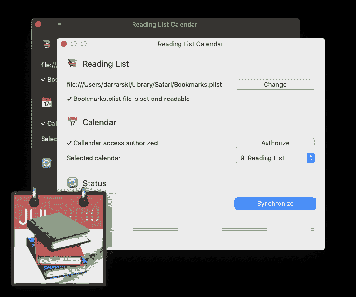

# 阅读列表日历- macOS 应用程序

> 原文：<https://dev.to/elpassion/reading-list-calendar-macos-app-3fmh>

如果你和我们一样，爱看网文。无论你对函数式编程还是烹饪食谱感兴趣，网络上有大量的资源可供学习。如果你是一个苹果迷，你可能对 Safari 阅读列表很熟悉——这是一个存放你的网络文章的地方，储存起来供以后查看和阅读。

不久前，我们受到马尔钦·krzyżanowski 的启发，他向我们展示了另一种存储网络书签的非标准方式...在他的日历中:

我们想要探索这种数据可视化的方式，所以没有再等一分钟，阅读列表日历应用程序就诞生了。这是一个简单的 macOS 应用程序项目，可以将 Safari 阅读列表与你的 T2 日历同步。这是一个用 Swift 编写的原生 Cocoa 应用程序，不需要任何第三方服务就可以工作。

我们试图让它尽可能简单，但也纳入了 macOS 沙箱和安全功能。用户必须选择书签位置并授权访问应用程序中的日历，否则它将无法读取和写入被认为是私人的数据(您的阅读列表和日历事件)。

基于一条推特上的想法，实现这个简单的项目非常有趣。该应用程序是用 Xcode 构建的，使用了原生的 Apple 框架，如 AppKit。我们对实现的大部分使用了测试驱动开发。

技术堆栈:

*   [Swift 5.0](https://swift.org)
*   [【xswift+rhococa】](https://github.com/ReactiveX/RxSwift)
*   [敏捷](https://github.com/Quick/Quick)和[敏捷](https://github.com/Quick/Nimble)

我们喜欢与你分享。它是开源的，在 GitHub 上有[。](https://github.com/elpassion/ReadingListCalendarApp)

## 来源

*   [Tweet 对马尔西的交叉引用](https://twitter.com/krzyzanowskim/status/1099679842860257280)
*   [由 Dariusz Rybicki 实施](https://github.com/elpassion/ReadingListCalendarApp)

## 执照

版权所有 2019 [EL Passion](https://www.elpassion.com)