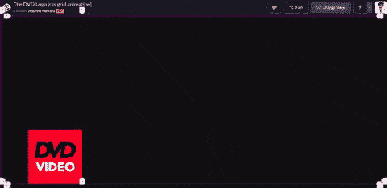
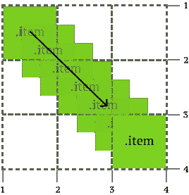
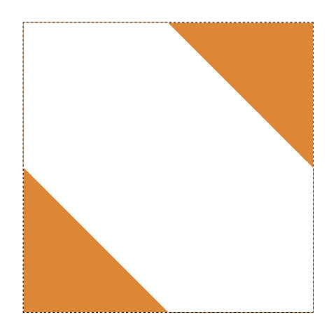
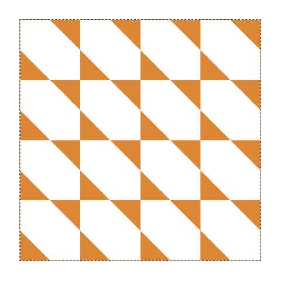
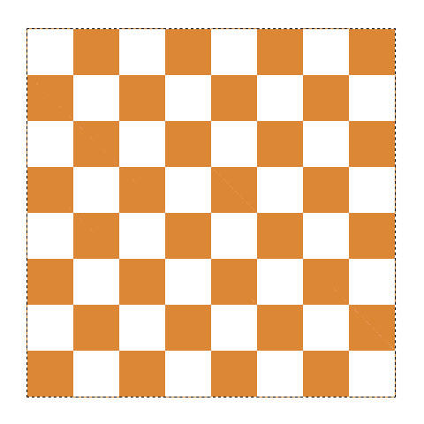

# 用 CSS 网格重现傻瓜的配偶棋步

> 原文：<https://dev.to/huijing/recreating-the-fool-s-mate-chess-move-with-css-grid-3omh>

当 Firefox 66 发布时，让我和其他几个布局爱好者真正兴奋的功能之一是在使用 CSS Grid 时动画显示网格行和列(以及网格间隙)的能力。它一直被写在规范中，但是浏览器需要一些时间来实现它。

我早些时候在 Bits 博客上写了一篇[介绍性文章，但仍有更多内容有待探索。那篇文章链接了我能找到的尽可能多的动画演示，但我一直在想的是安德鲁·哈佛的 DVD 标志。](https://blog.bitsrc.io/animating-css-grid-rows-and-columns-4b3b0997d06a)

[https://codepen.io/aharvard/embed/roPvmG?height=600&default-tab=result&embed-version=2](https://codepen.io/aharvard/embed/roPvmG?height=600&default-tab=result&embed-version=2)

我更喜欢用 Firefox DevTools 来观察演示是如何工作的。这让我大吃一惊。去吧，你自己试试，我等着。只要你使用的是 Firefox 66 或更高版本，徽标就应该在嵌入的地方跳动。

好吧，对于那些出于任何原因选择不亲自尝试的人，这里有一个 gif，虽然质量不是很好。

[](https://res.cloudinary.com/practicaldev/image/fetch/s--njUzkj8v--/c_limit%2Cf_auto%2Cfl_progressive%2Cq_66%2Cw_880/https://thepracticaldev.s3.amazonaws.com/i/5ci1gjtxiasddagmrhws.gif)

我不是 DevTools 的工程师，但我认为确保 Grid inspector 完全支持网格行和列的动画是需要付出努力的，这意味着当行号被切换时，它们也会被动画化。

## DVD 标志教会了我什么

对于我来说，当我第一次看到动画而没有检查时，我的第一个想法是网格项正在跨网格进行动画制作。但那是**而不是**正在发生的事情。至少，不是直接的。在某种意义上，网格项正在被动画化，但不是以我想象的方式。

<figcaption>我以为是这样的(剧透:其实不是)</figcaption>

[](https://res.cloudinary.com/practicaldev/image/fetch/s--561oAZga--/c_limit%2Cf_auto%2Cfl_progressive%2Cq_auto%2Cw_880/https://www.chenhuijing.com/asseimg/posts/fools-mate/animate-item.png)

正在被动画化的是网格*行*或*列*。这就是为什么我们用 DevTools 得到了很酷的效果(对我来说很酷，我不知道你怎么想…)，但这也意味着你必须扭曲你的网格来制作动画。

<figcaption>这就是实际可以得到的动画</figcaption>

[](https://res.cloudinary.com/practicaldev/image/fetch/s--KtMjCnBw--/c_limit%2Cf_auto%2Cfl_progressive%2Cq_auto%2Cw_880/https://www.chenhuijing.com/asseimg/posts/fools-mate/animate-rc.png)

当谈论 CSS 网格如何改变网页布局时，我最喜欢使用的一个类比是比较网格项目的位置，就像在棋盘上放置棋子一样。所以我的下一个想法是创建一个棋盘，棋盘上的棋子可以被动画化。

但是当我弄清楚网格项目的动画是如何真正工作的时候，我意识到了这个挑战。我无法在保持棋盘规则的同时移动棋子。

## 所以你需要移动一些东西

如果你期待一些真正聪明的方法来解决这个问题，很抱歉让你失望了，但我的方法是最不聪明的。每一个需要移动的棋子都在它自己的格子里，所有的格子都通过定位堆叠在一起。

这都是骗局，我的朋友们。

但这是可行的，所以。

所以在国际象棋中，愚人的配偶也被称为两步将死。据[维基百科](https://en.wikipedia.org/wiki/Fool%27s_mate):

> “傻瓜的伴侣”之所以得名，是因为这种情况只有在白棋犯了非常严重的错误时才会发生。

白棋的开局是 f3，然后黑棋用 g4 回应，然后白棋走 g4，黑棋走 Qh4，一切都结束了。有各种各样的版本，但我用的是维基百科上的默认版本。我选择了《傻瓜的伴侣》作为开始，因为它总共只包含了 4 步动画。\_(ツ)_/

### 创建棋盘

让我们来谈谈棋盘，因为我还是有点喜欢它的结局。我选择了黑色在上，白色在下的棋盘配置。我猜大多数人首先会想到为棋盘上的每个方格创建 64 个网格项目。

但是我想少加价。因此，我没有这样做，而是创建了 28 个网格项作为我的静态棋子，并在网格容器上应用了一个`linear-gradient`来生成必要的棋盘模式。

还有，每个棋子都有表情符号支持。我要表情国际象棋，谢谢。

```
<div class="grid board">
  <div class="grid__item piece">♜</div>
  <div class="grid__item piece">♞</div>
  <div class="grid__item piece">♝</div>
  <div class="grid__item piece">♚</div>
  <div class="grid__item piece">♝</div>
  <div class="grid__item piece">♞</div>
  <div class="grid__item piece">♜</div>
  <div class="grid__item piece">♟</div>
  <div class="grid__item piece">♟</div>
  <div class="grid__item piece">♟</div>
  <div class="grid__item piece">♟</div>
  <div class="grid__item piece">♟</div>
  <div class="grid__item piece">♟</div>
  <div class="grid__item piece">♟</div>
  <div class="grid__item piece row7">♙</div>
  <div class="grid__item piece row7">♙</div>
  <div class="grid__item piece row7">♙</div>
  <div class="grid__item piece row7">♙</div>
  <div class="grid__item piece row7">♙</div>
  <div class="grid__item piece row7">♙</div>
  <div class="grid__item piece row8">♖</div>
  <div class="grid__item piece row8">♘</div>
  <div class="grid__item piece row8">♗</div>
  <div class="grid__item piece row8">♕</div>
  <div class="grid__item piece row8">♔</div>
  <div class="grid__item piece row8">♗</div>
  <div class="grid__item piece row8">♘</div>
  <div class="grid__item piece row8">♖</div>
</div> 
```

Enter fullscreen mode Exit fullscreen mode

至于实际的棋盘，下面是它是如何产生的。工作得很好，但唯一的事情是根据视窗的大小，你可能会看到一个非常微弱的白色对角线差距一些较暗的颜色方块。我认为应该是与亚像素舍入值相关的东西。

```
.board {
  background-color: #eee;
  background-image: linear-gradient(45deg, #d18b47 25%, transparent 25%, transparent 75%, #d18b47 75%, #d18b47),
  linear-gradient(45deg, #d18b47 25%, transparent 25%, transparent 75%, #d18b47 75%, #d18b47);
  background-size: 24vmin 24vmin;
  background-position: 0 0, 12vmin 12vmin;
  width: 96vmin;
  height: 96vmin;
  margin: auto;
} 
```

Enter fullscreen mode Exit fullscreen mode

让我们分解这个 CSS 块，好吗？在一个正方形`<div>`上应用线性渐变会得到这样的效果。因为我们在 45 度角应用了急停。我也声明了两个完全相同的线性梯度，但这是有原因的。你会明白的。

[](https://res.cloudinary.com/practicaldev/image/fetch/s--lyZnpSdw--/c_limit%2Cf_auto%2Cfl_progressive%2Cq_auto%2Cw_880/https://www.chenhuijing.com/asseimg/posts/fools-mate/bg1.png)

接下来，我们有了`background-size`属性。背景属性我觉得很有趣，因为它们通常有许多不同的语法。在这种情况下，您可以使用关键字、一个 1 值语法、一个 2 值语法、多个背景(使用逗号)和全局值。好玩吧。

需要记住的一点是**如果你没有明确声明，浏览器支持的所有 CSS 属性都会有一个默认值。`background-repeat`的默认值是`repeat`。**

无论如何，通过设置背景尺寸为主要`<div>`宽度和高度的四分之一，我最终得到一个 4 x 4 的重复图案。将值设置为`25% 25%`会得到相同的效果。

[](https://res.cloudinary.com/practicaldev/image/fetch/s--WFwjSv1r--/c_limit%2Cf_auto%2Cfl_progressive%2Cq_auto%2Cw_880/https://www.chenhuijing.com/asseimg/posts/fools-mate/bg2.png)

也许你们中的一些人可以看到这是怎么回事，但下一步是以一种它们组合成正方形的方式来放置三角形。`background-position`也做 1 值或 2 值语法的事情。这是第二个线性梯度出现的地方。

`background-position`可以应用于多种背景，用逗号将它们匹配起来。因此，第一组值`0, 0`用于第一线性梯度，第二组值`12vmin 12vmin`用于第二线性梯度。

[](https://res.cloudinary.com/practicaldev/image/fetch/s--lFC-T6Cj--/c_limit%2Cf_auto%2Cfl_progressive%2Cq_auto%2Cw_880/https://www.chenhuijing.com/asseimg/posts/fools-mate/bg3.png)

所以我们正在做的是将第二个线性梯度向下向右推，这样三角形就会相遇并形成正方形。在我的例子中，我使用了`12vmin`的长度值，但是你也可以通过使用`50%`得到相同的效果。

### 放置棋子

你可能想知道我为棋子选择的 CSS 类。我之前做过一个实验，涉及到很多网格项目，它们之间有间隙，我了解到你不必明确地放置每个网格项目。

这里我想要的是让网格匹配我的网格容器的背景，这就是为什么我选择使用视口单位而不是百分比。所以我的网格行和列看起来像这样，其中的值匹配背景大小:

```
.board {
  display: grid;
  grid-template-columns: repeat(8, 12vmin);
  grid-template-rows: repeat(8, 12vmin);
} 
```

Enter fullscreen mode Exit fullscreen mode

在 32 个棋子中，有 28 个是静止的。但是我必须考虑到需要制作动画的部分的间隙。

```
.board .piece:nth-child(4) { grid-column: 5 }
.board .piece:nth-child(12) { grid-column: 6 }
.board .piece:nth-child(20) { grid-column: 8 }
.row7 { grid-row: 7 }
.row8 { grid-row: 8 } 
```

Enter fullscreen mode Exit fullscreen mode

由于自动放置，我可以通过显式地将国王(第 4 个孩子)放在第 5 列，将 f7(第 12 个孩子)上的兵放在第 6 列，将 h2(第 20 个孩子)上的兵放在第 8 列来向前“推送”网格项目。

但是所有的白色都在网格的底部，所以我们用`.row7`类将所有的白色棋子推到第 7 行，用`.row8`类将白色的非棋子推到第 8 行。

### 制作 4 个动作的动画

<figcaption>[图片来源](https://www.thesprucecrafts.com/fools-mate-the-fastest-checkmate-611599)</figcaption>

[](https://res.cloudinary.com/practicaldev/image/fetch/s--87Uc9QBS--/c_limit%2Cf_auto%2Cfl_progressive%2Cq_auto%2Cw_880/https://www.chenhuijing.com/asseimg/posts/fools-mate/fools-mate.png)

黑棋的移动棋子是第一行的皇后和第二行的 e7 的棋子。对于白色，棋子在我的棋盘网格的第 7 行和第 8 行。移动的棋子是在 f2 和 g2 的棋子。

还记得 DVD 演示吗？所以每一步都是它自己格子里的一个单独的棋子。例如，这是黑色女王乐团的代码。

```
.move1 {
  grid-template-columns: 72vmin 1fr;
  grid-template-rows: 84vmin 1fr;
  transition: grid-template-rows 0.5s linear;
}

.move1.active {
  grid-template-rows: 72vmin 1fr;
} 
```

Enter fullscreen mode Exit fullscreen mode

我用过渡而不是关键帧，因为我的作品只是在移动。DVD 徽标使用关键帧，因为它是一个连续的动画。合适的工具适合合适的工作，不是吗？

这里涉及到 Javascript，因为我想让它有点互动，人们可以点击一个按钮来移动下一个部分。

只有 4 步，所以我想应该不会太难。需要一个计数器来跟踪移动的开始和结束，但是除此之外，它还要添加和删除 CSS 类。

```
const prevBtn = document.getElementById('prev')
const nextBtn = document.getElementById('next')

let moves = 0

prevBtn.addEventListener('click', prevHandler, false)
nextBtn.addEventListener('click', nextHandler, false)

function nextHandler() {
  if (moves < 4) {
    countUp()
    addActive(moves)
    console.log(moves)
  } else {
    console.log('Already checkmate')
  }
}

function prevHandler() {
  if (moves > 0) {
    removeActive(moves)
    countDown()
    console.log(moves)
  } else {
    console.log('Back to the start')
  }
}

function addActive(moves) {
  const activeMove = document.querySelector('.move' + moves)
  activeMove.classList.add('active')
}

function removeActive(moves) {
  const activeMove = document.querySelector('.move' + moves)
  activeMove.classList.remove('active')
}

function countUp() {
  return moves++
}

function countDown() {
  return moves--
} 
```

Enter fullscreen mode Exit fullscreen mode

## 包装完毕

如果你想知道所有东西是如何组合在一起的，这里是 CodePen 上的全部内容。

[https://codepen.io/huijing/embed/LoPEYV/?height=600&default-tab=result&embed-version=2](https://codepen.io/huijing/embed/LoPEYV/?height=600&default-tab=result&embed-version=2)

如果你觉得这很有趣，或许也可以试一试？我真的很好奇，想看看用这种行为还能设计和制造出什么东西，所以请随意告诉我你的创造。我还想为创造了[一个 HTML 页面挑战](https://metroxe.github.io/one-html-page-challenge/)的 [Christopher Powroznik](https://metroxe.github.io/) 大声欢呼。

我已经把这个傻瓜伴侣的演示放在那里了，但是在一个页面上还可以做更多的事情。改变一下，构建没有外部依赖的东西是很有趣的。