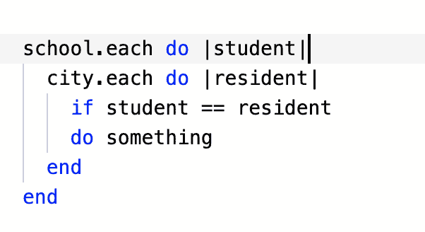
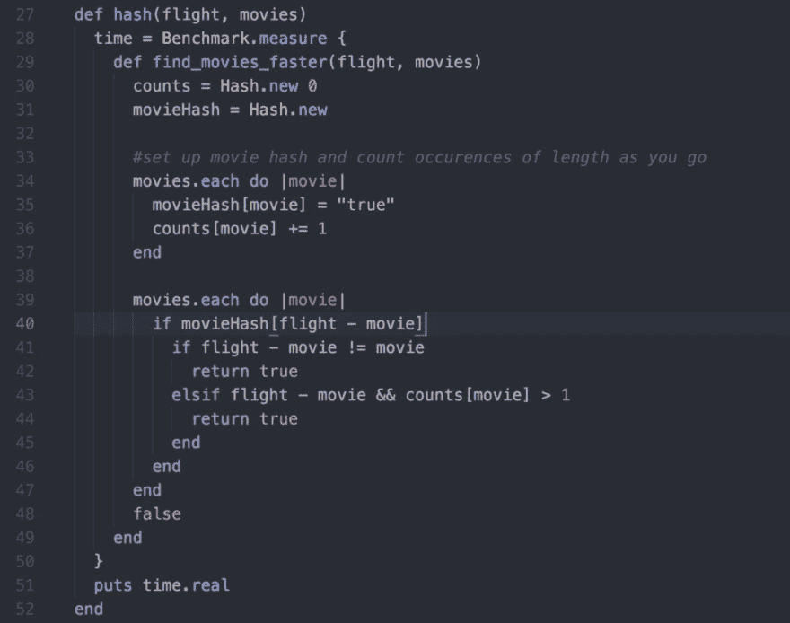
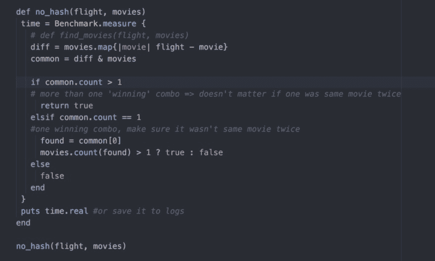
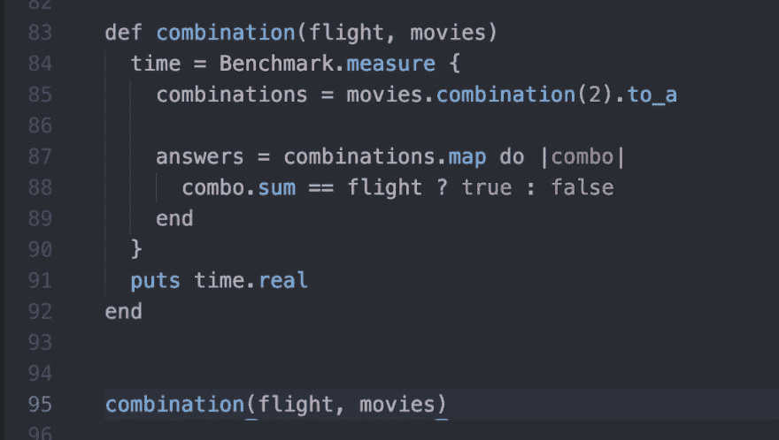

# Ruby 代码挑战:飞机电影

> 原文：<https://dev.to/joanrig/ruby-code-challenge-airplane-movies-4f61>

我对数据大 O 的介绍

假设你要做一次长途飞行。你有一份飞机上电影的清单，以及它们有多长。您决定要观看两部电影，并且您想知道列表中的任何两部电影的总运行时间是否正好等于您的飞行时间。(当然，我们假设飞行时间是固定的，哈哈)。

如果你在看一个五部甚至十部电影的列表，这很容易。但是如果你不知道你的列表里有多少部电影呢？你可能已经访问了一个巨大电影数据库。你的清单可以包括 10，000 部电影！

挑战:编写一个 Ruby 方法，如果任意两部电影的飞行时间相加，则返回 true，否则返回 false。

但是——有两个额外的条件。

第一，你不想看两遍同一部电影。因此，如果您的飞行时间是 100 分钟，而您的电影列表只有一部 50 分钟长的电影，您希望您的方法返回 false。但是如果你的列表中有两部电影，并且都是 50 分钟长，你希望你的方法返回 true。

第二，这是最难的部分，你需要注意运行时间。比如你希望你的方法的大 O 符号为 O(n)或者更好。…

### 有什么大 O？

大 O 符号是一种计算数据大小如何影响代码运行速度或使用多少 RAM 的方法。一句话:在散列中查找东西比在数组中快得多，因为你可以通过键调用它们，而不是按顺序遍历每个元素；而嵌套循环是邪恶的！

[ruby ist 的大 O 符号指南](https://www.honeybadger.io/blog/a-rubyist-s-guide-to-big-o-notation/)易于阅读，包括这张有用的笑脸图:

那么为什么嵌套循环是邪恶的呢？假设您有这样的代码:

<figure> 

<figcaption>邪恶嵌套循环</figcaption>

</figure>

如果你的学校有 10 名学生，你的城市有 10 名居民，你必须进行 10×10 次比较来运行这个代码，或者 10 次比较。这还不错，但是如果你的学校和你的城镇都有 1000 名居民呢？现在你可以进行 1000 次比较。

如果你像我一样认为…好吧，我们可以通过先过滤掉某些值来缩短运算时间，这样至少我们比较的是更小的数组…那也不行。大 O 符号是概念性的，假设最坏的情况。任何大小的数组都有 *n* 个元素；如果你通过数组做两个嵌套循环，你总是在做 n 个操作。n 是不是*其实无关紧要*只是 1。重要的是 n 的值如何随着数据集的大小而变化。

那么，我们如何摆脱这种困境呢？

### 哈希来救援了！

哈希表的搜索速度更快，因为你通过键调用值，而不是遍历整个数组来查找值(幕后发生了什么？不看一个以上的键，posts 真的会神奇地返回值吗？[这里有一个深入细节的帖子](https://www.bigocheatsheet.com/)。

我很好奇这对于我的特殊挑战来说是如何实现的。

我的第一次尝试涉及到可怕的嵌套循环:

我对不同数据集的运行时间很好奇。我发现了这个关于如何使用基准测试的很好的解释。

在我的代码编辑器中，我添加了几行代码，包括一个随机生成 10，000 部电影的数组的代码，以及一个不可能的飞行时间(因此该方法将被迫在完成之前查看每一个电影元素)。

<figure> 

<figcaption>内线文件:test.rb</figcaption>

</figure>

然后我输入“ruby test.rb”来运行代码，得到了这样的运行时间:大约 4.3 秒，或者 4327.660001673 毫秒。

### 同哈希

接下来，我尝试了一个使用哈希的解决方案:

<figure> 

<figcaption>2 * O(n)，每个循环一个</figcaption>

</figure>

运行时间:3.5880000796169 毫秒——快了 1200 倍！！！

### 无哈希，无嵌套循环

接下来，一个没有哈希的解决方案，一个循环和一个从两个循环中提取公共元素的操作:

有趣的是——*这个方法实际上比散列值为*的方法要快:0.78899995423853 毫秒。

最后我尝试了一个同学的超级优雅的解决方案。这个利用了 [Ruby 内置的组合方法](https://ruby-doc.org/core-2.4.1/Array.html)。

它是短暂的，甜蜜的，并赢得代码高尔夫。但是它在引擎盖下显然不是很有效。当我用一个包含 100，000 个元素的数组运行这个方法时，我的计算机死机了。下面是一万个元素的时间:运行时间:11.73972999989428 秒。这比散列法长 3200 倍，比比较法长 15000 倍。呀！

下面是图表:(空格表示该方法运行时间太长，以至于我不得不在几分钟不活动后中止)。

在大型阵列(10，000 多个元素)中处理数据的赢家:

*   **第一名:** Ruby 的& &比较数组的方法。
*   **第二名:**哈希
*   **第三名:**嵌套循环
*   **第四名:** Ruby 的内置组合方式。

这个故事的寓意:如果你想让你的代码运行得更快，避免嵌套循环！