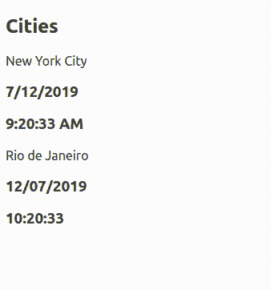
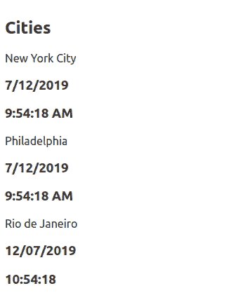

# 第一季第二集

> 原文：<https://dev.to/tiagobnobrega/s4srd-s01e02-hooked-evolved-contextful-hooks-in-svelte-4pip>

这是一个关于在苗条身材中应用一些常见的反应概念和模式的系列。这一季是关于钩子的。上一集我们已经设定了探索钩子的目标，以及如何用 svelte 实现它的一些特性(如果你还没有的话，请查看一下)。在这一集里，我将展示我们如何在“细长的钩子”里利用上下文。准备好您的爆米花，欢迎来到:

<center>

## 🙃

</center>

<center>

## 顽固的反应开发者的苗条

</center>

### 摘要

我们将钩子定义为:

一个**函数**到**提取行为**，允许你**对生命周期**做出反应**访问状态和上下文**。

这次我们将重点关注**“访问状态和上下文”**。主要是在上下文部分，因为州的部分是苗条的并不是一个大问题(我会回来)。使用 context 获得的所有功能都可以通过使用 stores 来实现(React Context 和 Redux/Mobx Store 也是如此)。对我来说，语境是来解决*【道具演练】*问题的。您需要将信息传递给嵌套很深的子对象。

### TL；速度三角形定位法(dead reckoning)

Sveltejs 导出了两个函数: *getContext* 和 *setContext* 。 *getContext* 函数检索属于**最近的父**组件的上下文值。由于 *setContext* 和 *getContext* 只是函数，因此它们可以简单地导入到*细长钩子*中并像这样使用。导入钩子的组件定义了**最近的父组件**。

### 关于国家的一个说明

由于 svelte 将你的 *svelte 代码*编译成 javascript，组件状态只是变量。当你考虑状态时，你不必太担心生命周期。每当代码的某个部分改变了作用域变量引用，它就会“失效”，当失效时，代码的其他部分*会对这种改变做出*反应。在 React 功能组件中，你必须使用 *useState* 钩子等等，因为 React 运行时可能会在很多情况下“重新计算”你的组件。当这种情况发生时，该组件范围内的所有内容都将被重新计算。

### 我们将建造什么

当你听到“语境”时，你脑海中首先闪现的是“主题”，对吗？这是一个非常常见的用例，但我想尝试一些不同的东西。当你需要在几个组件之间传递一些东西时，尤其是当你的应用有一个深度嵌套的结构时，上下文是非常有用的。该应用程序将有一个简单的结构(为了简单起见)，但想象它有一个真正嵌套的组件树。

我们将构建一个非常简单的应用程序来显示不同时区的时钟。我们的应用程序结构看起来会像这样:

```
<APP>
    <City> <!-- ⭠ SET Context A -->
        <Name></Name>
        <Date></Date> <!-- ⭠ USE Context B -->
        <Clock></Clock> <!-- ⭠ USE Context A -->
    </City>
    <City> <!-- ⭠ SET Context B -->
        <Name></Name>
        <Date></Date> <!-- ⭠ USE Context B -->
        <Clock></Clock> <!-- ⭠ USE Context B -->
    </City>
</APP> 
```

正如您在我上面的详细图表中看到的，城市组件将设置它的子时钟组件将使用的一些上下文。

#### 组件基本结构

让我们从创建我们的基本组件的结构开始，然后我们逐渐改变它们来实现我们想要的。

```
<!-- Clock.svelte -->
<script>
    let time = null;
</script>
<div>
    <h3>{time}</h3>
</div>
<!-- Date.svelte -->
<script>
    let date = null;
</script>
<div>
    <h3>{date}</h3>
</div>
<!-- City.svelte -->
<script>
    import Clock from './Clock.svelte'
    import Date from './Date.svelte'
    export let name;
    export let timezone; //⭠ will be used in a minute
    export let format; //⭠ will be used in 2 minutes
</script>
<div>
    <div>{name}</div>
    <Date></Date>
    <Clock></Clock>
</div>
<!-- App.svelte -->
<script>
    import City from './components/City.svelte';
</script>
<h2>Cities</h2>
<City name="New York City" timezone="America/New_York"></City>
<City name="Rio de Janeiro" timezone="America/Sao_Paulo"></City> 
```

因此...这里的想法是, *App.svelte* 有两个城市(纽约和里约热内卢),每个城市都有自己的时区(和格式，但现在忽略这一点)。在*city . svelete*上将设置一些上下文值，然后这个值将被*date . svelete*和*clock . svelete*使用。

现在，这可以直接在三个组件上完成，但由于一个基本原因，这并不太好:

它使组件紧密耦合。这种上下文逻辑将分散在这 3 个组件中，如果您出于某种原因必须更改它，您将不得不到处更改(在较大的应用程序中，这将无法很好地扩展)。

我们可以做得更好。如果我们在上一集中已经学会了一种方法来**提取行为**，允许你**对生命周期**做出反应**访问状态和上下文**。

等一下...没错。一个钩子！

#### 实现钩子

Soooo...我们知道我们的钩子必须能够访问父组件中定义的上下文值。好在 svelte 有恰到好处的工具: *getContext* 和 *setContext* ，只是函数，可以导入并在任何文件中使用(比如我们的 hook 文件)。这里的问题是你需要在组件初始化期间调用它们，所以**不要在 *onMount、onDestroy、clickEvents 等中调用它们***。

*setContext(key，value)* 为指定的键定义一个上下文值。而 *getContext(key)* 返回最近的父组件的键值。我们的钩子将被父组件和子组件使用，所以它需要导出一种方法来设置上下文和访问上下文。考虑到这一点，我们开始了:

```
//useTimezone.js
// SET context
export function setTimezone({timezone, format}) {
  if (timezone) setContext('contextTimeZone', timezone);
  if (format) setContext('contextTimeFormat', format);
} 
```

导出的函数 *setTimezone* 简单地设置了两个上下文变量(如果传递的话): *contextTimeZone 和 contextTimeFormat* 。第一个将保存所需的时区，第二个保存所需的日期格式。它们将被*时钟*和*日期*间接使用。

太好了！现在我们需要一种方法让这两个函数访问这些上下文变量并对其进行处理。我们的钩子的*重*逻辑(或共享行为)。

```
//useTimezone.js
// SET context
export function setTimezone({timezone, format}) {
  if (timezone) setContext('contextTimeZone', timezone);
  if (format) setContext('contextTimeFormat', format);
}
//helper function
function getFormattedDate(format, options) {
  return new Intl.DateTimeFormat(format, options).format(new Date())
}

// ACCESS context and so something useful
export function getTime({onSecond, onDate}) {
  let interval;
  const timezone = getContext('contextTimeZone') || 'UTC';
  const format = getContext('contextTimeFormat') || 'default';
  if (onDate) onDate(getFormattedDate(format, timezone, {
    year: 'numeric',
    month: 'numeric',
    day: 'numeric',
    timeZone: timezone
  }));
  onMount(() => {
    if (onSecond) {
      interval = setInterval(() => {
        console.log('onsecond::'+format);
        onSecond(
            getFormattedDate(format, {
              hour: 'numeric',
              minute: 'numeric',
              second: 'numeric',
              timeZone: timezone
            })
        )
      }, 200);
    }
    return () => interval && clearInterval(interval);
  })
} 
```

让我们像开膛手杰克一样分析一下这里发生了什么。

函数 *getFormattedDate* 只是一个助手..良好的...格式化日期。蹩脚！

函数 *getTime* 有趣多了。功能基本结构可以这样表示:

```
export function getTime({onSecond, onDate}) {
    //get context value (this is outside onMount)
    const timezone = getContext('contextTimeZone') || 'UTC';
....
    //call onDate callback passing the formated Date
    if (onDate) onDate(getFormattedDate(format, timezone, {
....   
    //register on components onMount a interval calling onSecond callback
    onMount(() => {
    if (onSecond) {
      interval = setInterval(() => {
....
    //register onDestroy event to clear interval (check last episode for details) 
    return () => interval && clearInterval(interval);
} 
```

现在需要注意一些事情:

*   getContext 调用发生在 onMount 事件之外
*   onSecond 和 onDate 回调可以从上下文中检索，但是为了便于学习，最好不要过于复杂。

重要的部分是 *getContext* 将寻找相对于它导入的组件最近的父上下文。不错，但是我们如何使用它呢？

#### 钩住组件

我们的第一个任务是在*city . svelite*组件中设置上下文，为此我们将接收作为道具的值:

```
<!-- City.svelte -->
<script>
    import Clock from './Clock.svelte'
    import Date from './Date.svelte'
    import {setTimezone} from './useTimezone';
    export let name;
    export let timezone;
    export let format;
    setTimezone({timezone, format}); // ⭠ set context values
</script>
<div>
    <div>{name}</div>
    <Date></Date> <!-- ⭠ No props passed to the compoent -->
    <Clock></Clock> <!-- ⭠ No props passed to the compoent -->
</div> 
```

并且我们需要在 *App.svelte*
中传递作为道具的值

```
<!-- App.svelte -->
<script>
    import City from './components/City.svelte';
</script>
<h2>Cities</h2>
<City name="New York City" timezone="America/New_York" format="en-US"></City>
<City name="Rio de Janeiro" timezone="America/Sao_Paulo" format="pt-BR"></City> 
```

<small>*以 Intl 理解的格式传递的时区值([https://developer . Mozilla . org/pt-BR/docs/Web/JavaScript/Reference/Global _ Objects/datetime format)](https://developer.mozilla.org/pt-BR/docs/Web/JavaScript/Reference/Global_Objects/DateTimeFormat))T3】</small>

现在一个时区和格式被传递给每个 *City* 实例，它将它们设置为上下文变量。这个数值现在需要被*date . svelite*和*clock . svelite*T6】消耗掉

```
<!-- Date.svelte -->
<script>
    import {getTime} from './useTimezone'
    let date = null;
    getTime({onDate: (newTime)=> date=newTime})
</script>
<div>
    <h3>{date}</h3>
</div> 
```

```
<!-- City.svelte -->
<script>
    import {getTime} from './useTimezone'
    let time = null;
    getTime({onSecond: (newTime)=> time=newTime})
</script>
<div>
    <h3>{time}</h3>
</div> 
```

这两个组件都设置了一个变量(*日期*和*时间*，向我们的钩子函数传递一个回调来更新它的值。

一切就绪后，我们的代码是这样的:

```
<!-- App.svelte -->
<script>
    import City from './City.svelte';
</script>
<h2>Cities</h2>
<City name="New York City" timezone="America/New_York" format="en-US"></City>
<City name="Rio de Janeiro" timezone="America/Sao_Paulo" format="pt-BR"></City>

<!-- City.svelte -->
<script>
    import Clock from './Clock.svelte'
    import Date from './Date.svelte'
    import {setTimezone} from './useTimezone';
    export let name;
    export let timezone;
    export let format;
    setTimezone({timezone, format});
</script>
<div>
    <div>{name}</div>
    <Date></Date>
    <Clock></Clock>
</div>

<!-- Date.svelte -->
<script>
    import {getTime} from './useTimezone'
    let date = null;
    getTime({onDate: (newTime)=> date=newTime})
</script>
<div>
    <h3>{date}</h3>
</div>

<!-- Clock.svelte -->
<script>
    import {getTime} from './useTimezone'
    let time = null;
    getTime({onSecond: (newTime)=> time=newTime})
</script>
<div>
    <h3>{time}</h3>
</div> 
```

最后的结果是:

[](https://res.cloudinary.com/practicaldev/image/fetch/s--U396MlY1--/c_limit%2Cf_auto%2Cfl_progressive%2Cq_66%2Cw_880/https://thepracticaldev.s3.amazonaws.com/i/rrts4zjjlj3zwg0q0opg.gif)

纽约市的日期采用“年/月/日”格式，就像里约热内卢采用“年/月/日”格式一样，而且时间也是本地化的。

#### 爷爷的背景

在上面的例子中，*clock . svelete*和*date . svelete*从*city . svelete*组件获取上下文。但是上下文是从最近的父节点开始计算的，这意味着我们也可以在 *App.svelte* 上定义上下文。创建类似默认值的东西。来看看:

```
<!-- App.svelte -->
<script>
    import City from './City.svelte';
    import {setTimezone} from './useTimezone';
    setTimezone({format:'en-US'}); // ⭠ set value in App context
</script>
<h2>Cities</h2>
<!-- USES App context format value -->
<City name="New York City" timezone="America/New_York"></City>
<City name="Philadelphia" timezone="America/New_York"></City>
<!-- OVERRIDES App context format value -->
<City name="Rio de Janeiro" timezone="America/Sao_Paulo" format="pt-BR"></City> 
```

这样，我们在 *App.svelte* 上下文中定义了一些值，所以 *New York* 和 *Philadelphia* 使用它，而 *Rio de Janeiro* 覆盖它，因为在 *City.svelte* 内部定义了一个新的上下文(更接近组件),来自传递的“格式”属性。

在我们的详细图表中，我们有这样的东西:

```
<APP><!-- ⭠ SET APP context -->
    <City New York> <!-- ⭠ DO NOT set context -->
        <Name></Name>
        <Date></Date> <!-- ⭠ USE APP context -->
        <Clock></Clock> <!-- ⭠ USE APP context -->
    </City>
    <City Philadelphia> <!-- ⭠ DO NOT set context -->
        <Name></Name>
        <Date></Date> <!-- ⭠ USE APP context -->
        <Clock></Clock> <!-- ⭠ USE APP context -->
    </City>
    <City Rio de Janeiro> <!-- ⭠ SET Rio de Janeiro context -->
        <Name></Name>
        <Date></Date> <!-- ⭠ USE Rio de Janeiro context -->
        <Clock></Clock> <!-- ⭠ USE Rio de Janeiro context -->
    </City>
</APP> 
```

给你！

[](https://res.cloudinary.com/practicaldev/image/fetch/s--VLw0CswA--/c_limit%2Cf_auto%2Cfl_progressive%2Cq_66%2Cw_880/https://thepracticaldev.s3.amazonaws.com/i/5s0jzdo7atuai12hf01c.gif) 
太棒了！现在我们已经掌握了上下文挂钩。还有一个细节。记得我说过:

> 这里的问题是，你需要在组件初始化期间调用它们，所以**不要在 *onMount、onDestroy、clickEvents 等中调用它们***。

那么，我们如何更新上下文值呢？

下集见。