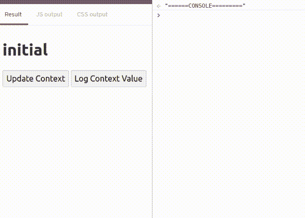
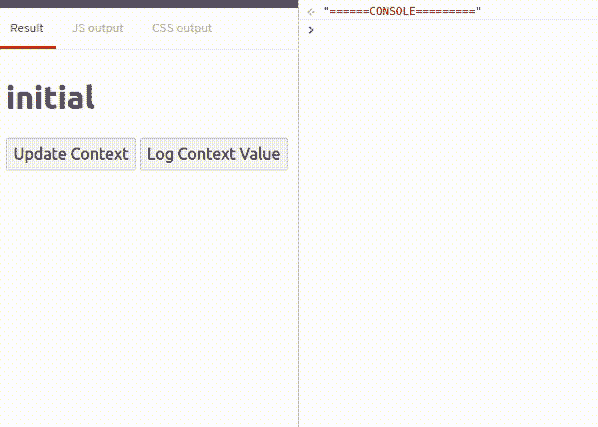

# [S4SRD]第一季第三集-进化的上下文(可更新的 Svelte 上下文)

> 原文：<https://dev.to/tiagobnobrega/s4srd-s01e03-context-evolved-updatable-context-in-svelte-2ah7>

这是一个关于在苗条身材中应用一些常见的反应概念和模式的系列。这一季是关于钩子的。上一集我们已经设定了探索钩子的目标，以及如何用 svelte 实现它的一些特性(如果你还没有的话，请查看一下)。在这一集中，我将展示如何在简单的上下文中更新一个值。准备好您的爆米花，欢迎来到:

<center>

## 🙃

</center>

<center>

## 顽固的反应开发者的苗条

</center>

### 摘要

上一集我们创建了一个钩子来访问上下文。现在我们正在研究如何使用上下文来更新它的值。

问题出现在关于 *getContext* 和 *setContext* 函数的声明中:

> 这里的问题是，你需要在组件初始化期间调用它们，所以**不要在 *onMount、onDestroy、clickEvents 等中调用它们***。

我在 stack overflow 中问了一个类似的问题， **@Rich_Harris** 很友好地给我指出了正确的方向。我没有只是列出答案，而是决定通过这个概念来总结这个想法。这样我们可以更好地理解*为什么*，而不是仅仅关注*如何*。当然，如果你不想走这条路，就去读 TL；速度三角形定位法(dead reckoning)😉。

### TL；速度三角形定位法(dead reckoning)

因为对上下文值的引用不能被更新。我们需要一种方法在上下文中访问可更新的值。苗条的商店非常适合这一点，因为它们可以更新和观察。所以基本上，只要使用一个商店作为它的值的上下文。

### 无法更新引用，现在怎么办？！？

先说我们的目标。我们希望能够**定义一个上下文值**，然后**更新这个值**，最后**对此做出反应并使用新值**。但是...组件初始化后，我们无法更新上下文值引用。

把我们的上下文值想象成一个常量。在 javascript 中我们不能更新*常量*引用，对吗？

```
(()=>{
    const a = {value:'initial'};
    a = {value: 'updated'} // ⭠ TypeError: Assignment to constant variable.
    console.log(a);
})() 
```

但是，如果我们有一个*对象*分配给一个*常量*，我们可以更新它里面的任何值(变异):

```
(()=>{
    const a = {value:'initial'};
    a.value = 'updated'
    console.log(a); // outputs: {value: "updated"}
})() 
```

### 这一集不是讲苗条的吗？？

好的...我们如何在 svelte 的上下文中应用这个概念(我的意思是🤔...纤细的上下文语境😕...你猜对了！).试着跟随这个*非实用*例子中的注释:

```
<!-- App.svelte -->
<script>
    import ContextValue from './ContextValue.svelte';
    import {setContext, getContext} from 'svelte';
    setContext('value',{value:'inital'}); // ⭠ Create context
</script>
<ContextValue /> <!-- Import component that use the context -->

<!-- ContextValue.svelte -->
<script>
    import {getContext} from 'svelte';
    const contextValue = getContext('value'); // ⭠ Get context.

    function logContextValue(){ //⭠ Function to log current context value
        console.log(contextValue)
    }

    function updateContext(){ // ⭠ Function to "update" context
        myContext.value = 'updated'
    }
</script>
<button on:click={updateContext} >Update Context</button> <!-- ⭠ "Updates" context -->
<button on:click={logContextValue}>Log Context Value</button> <!-- ⭠ Log context --> 
```

预期的想法是:
1 -点击“记录上下文值”按钮⮕输出初始值

2 -单击“更新上下文”按钮；

3 -点击“记录上下文值”按钮⮕输出更新值

和...有用！

[](https://res.cloudinary.com/practicaldev/image/fetch/s--dqNunnxn--/c_limit%2Cf_auto%2Cfl_progressive%2Cq_66%2Cw_880/https://thepracticaldev.s3.amazonaws.com/i/jm8bufpy4rnnfvki6w5e.gif)

### 依旧凌乱

是...还不太好。逻辑无处不在，我们甚至没有为此创建一个可重用的函数(想象一下在许多组件中使用它)。我们需要几个函数来使它工作。很乱。这个怎么样？

```
//smartContext.js
import {setContext, getContext} from 'svelte';

export function setSmartContext(contextObject){
    setContext('value',contextObject);
}

export function getSmartContext(){
    const ctx = getContext('value');
    return {
        get:()=>ctx,
        update: newValue => ctx.value = newValue
    }
} 
```

较好的...它被隔离在一个模块里。我们可以这样使用它:

```
<!-- App.svelte -->
<script>
    import ContextValue from './ContextValue.svelte';
    import {setSmartContext} from './smartContext.js'
    setSmartContext({value:'inital'}); //⭠ Set a smartContext
</script>
<ContextValue />

<!-- ContextValue.svelte -->
<script>
    import {getSmartContext} from './smartContext.js';
        const smartContext = getSmartContext('value'); //⭠ get a smartContext
        function updateContext(){
            smartContext.update('updated') //⭠ updates smartContext
        }
        function logContextValue(){
            console.log(smartContext.get()) //⭠ Set smartContext value
        }
</script>
<button on:click={updateContext} >Update Context</button>
<button on:click={logContextValue}>Log Context Value</button> 
```

仍然...它只对单个值有效。如果我们想要两个不同的上下文值，我们需要复制我们的 *smartContext.js* (不太聪明...).

### 使其更加可重复使用

实际上，如果你有足够的创造力，你会意识到 *smartContext* 只是一个**对象，它更新其作用域** *(或上下文)*中的一个变量。为此，如果有一个**内部上下文** *(或范围)*，它甚至不需要一个*外部上下文*。原来 javascript 中有一个很好的特性:函数！！！！看:

```
//smartContext.js
export default (defaultValue)=>{
        let value = defaultValue; //⭠ scope value
        return {
            set: newValue=>{
                value=newValue //⭠ update scope value
            },
            get: ()=>value,//⭠ get scope value
        };
    }; 
```

有趣的...但是，这并没有带来一个苗条的背景必须提供的所有功能。因此，让我们将它们结合起来，创建 2 个 smartContexts。

```
<!-- App.svelte -->
<script>
    import ContextValue from './ContextValue.svelte';
    import {setContext} from 'svelte' //⭠ import default svelte context
    import smartContext from './smartContext.js' // ⭠ import smartContext "builder"

    //⮦Set a context value to a smartContext
    setContext('value', smartContext('initial')) 
    //⮦Set another context value to a smartContext
    setContext('unused', smartContext('unused'))
</script>
<ContextValue />

<!-- ContextValue.svelte -->
<script>
      import {getContext} from 'svelte';
      const smartContext = getContext('value'); //⭠ get a smartContext
      const getUnusedContext = getContext('unused');//⭠ get a smartContext
      function updateContext(){
        smartContext.update('updated')//⭠ update the smartContext
      }
      function logContextValue(){
        console.log(smartContext.get())//⭠ get the smartContext value
      }
</script>
<button on:click={updateContext} >Update Context</button>
<button on:click={logContextValue}>Log Context Value</button> 
```

### 增加反应性

现在好多了！我知道到达同一个地方似乎是一次伟大的往返旅行，但是理解和划分概念是很重要的。请容忍我一会儿。我们完事了吗？不完全是。我们需要:

> 能够**定义一个上下文值**，然后**更新这个值**，最后**对此做出反应并使用新值**

我们已经**定义了一个上下文值**并且**更新了这个值**，但是我们没有**对这个更新**做出反应。到目前为止，获取更新值的唯一方法是执行一个命令性动作(因此，“单击按钮”)。如果我们让这个值显示在 *ContextValue.svelte* 上，它不会自动更新。让我们试试:

```
<!-- ContextValue.svelte -->
<script>
      import {getContext} from 'svelte';
      const smartContext = getContext('value'); //⭠ get a smartContext
      const getUnusedContext = getContext('unused');//⭠ get a smartContext
      function updateContext(){
        smartContext.update('updated')//⭠ update the smartContext
      }
      function logContextValue(){
        console.log(smartContext.get())//⭠ get the smartContext value
      }
</script>
<button on:click={updateContext} >Update Context</button>
<button on:click={logContextValue}>Log Context Value</button> 
```

结果是:

[](https://res.cloudinary.com/practicaldev/image/fetch/s--AxiTfzPi--/c_limit%2Cf_auto%2Cfl_progressive%2Cq_66%2Cw_880/https://thepracticaldev.s3.amazonaws.com/i/xwvw8cfqhdn7e05fjd1y.gif)

### 更好的智能上下文

该值不会自动更新。有道理，为什么会呢？我们需要一种方法来**对应**或者**订阅**这个值更新。在着手解决这个问题之前，让我们先整合一下我们需要的东西:

一个途径**存储**，**更新**，一个**订阅**一个**作用域值**。

正如我们所见，范围是由细长的上下文使用 *getContext* 和 *setContext* 来处理的。我们的 *smartContext* 已经**存储**并且**更新**该值，但是**不是可观察的**。苗条商店有一个方便的功能来帮助我们:**苗条商店**。

svelte 中的商店正是这样做的，所以我们可以用它完全取代*智能上下文*。第一*app . svelte*T4】

```
<!-- App.svelte -->
<script>
    import ContextValue from './ContextValue.svelte';
    import {setContext} from 'svelte'; //⭠ import svelt context
    import { writable } from 'svelte/store'; //⭠ import svelt writable store

    let smartContext = writable('initial');//⭠ initialize store
    setContext('value',smartContext);//⭠ set context value as the store
</script>
<ContextValue /> 
```

此时，我们将观察存储更新，并通过更新组件变量对其做出反应。这与之前访问存储值的方法略有不同。当存储值改变时，我们的变量值也会改变。

```
<!-- ContextValue.svelte -->
<script>
      import {getContext,onMount} from 'svelte';
        //⮦ get svelt store(replaced our smartContext)
        let smartContext = getContext('value'); 
        let contextValue;//⭠ this variable will hold the store value (context value)
        //⮦ update our variable whenever the store value get updated
        onMount(()=>smartContext.subscribe(v=>contextValue = v))

        //⮦ Function to update store value
        function updateContext(){
            smartContext.update(()=>'updated')
        }
       //⮦ We don't need to access store value, just access our "synced" variable
        function logContextValue(){ 
            console.log(contextValue)
        }
</script>
<h1>{contextValue}</h1> <!-- print out our variable value -->
<button on:click={updateContext} >Update Context</button>
<button on:click={logContextValue}>Log Context Value</button> 
```

结果是:

[](https://res.cloudinary.com/practicaldev/image/fetch/s--Dup1WyVg--/c_limit%2Cf_auto%2Cfl_progressive%2Cq_66%2Cw_880/https://thepracticaldev.s3.amazonaws.com/i/w3jkesa1vu0ld1kikwye.gif)

给你。现在我们正在谈话！！

### 变得更好...给我一些糖！

有用！最后。但还是太冗长了，你不觉得吗？商店，作为 svelte 的一个内置功能，带有一个我们可以使用的*语法糖*:*自动订阅*。它的工作原理是在你的存储变量名前加一个美元符号($)。就这么简单！我们只需要改变我们的 *ContextValue.svelte* 组件。来看看:

```
<!-- ContextValue.svelte -->
<script>
      import {getContext,onMount} from 'svelte';
        let smartContext = getContext('value');
        function updateContext(){
            smartContext.update(()=>'updated')
        }
        function logContextValue(){ 
            console.log($smartContext) //⭠ auto-subscribed value
        }
</script>
<h1>{$smartContext}</h1> <!-- //⭠ auto-subscribed value -->
<button on:click={updateContext} >Update Context</button>
<button on:click={logContextValue}>Log Context Value</button> 
```

现在更小更简洁了。当组件被破坏时，我们还能得到额外的好处，让苗条的人从商店退订。我忽略了前一版本代码的一个小问题。

事情开始变得有趣了。我建议看一看商店示例([https://svelte.dev/examples#writable-stores](https://svelte.dev/examples#writable-stores))和来自苗条官方文件的文档([https://svelte.dev/docs#writable](https://svelte.dev/docs#writable))。使用起来极其简单。

我可能会在这个问题上加一两集。谁知道呢？如果你觉得我有趣，请告诉我！！

❕⚠️⚠️⚠️剧透提醒⚠️⚠️⚠️❕
我保证我会去 HOC。先做几件事！

扰流板警报