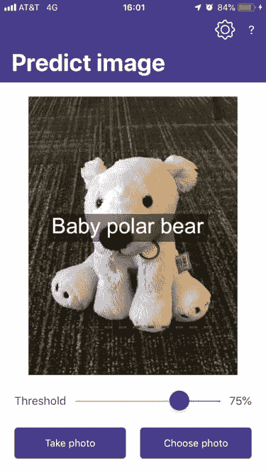
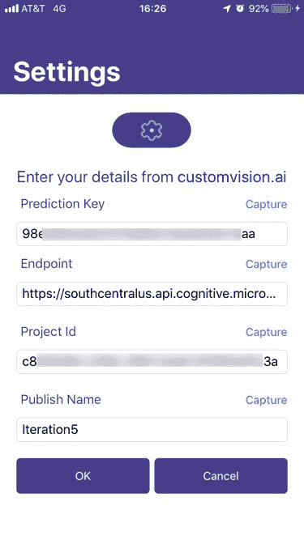

# 让你的用户不用用人工智能打字🤖

> 原文：<https://dev.to/azure/save-your-users-from-typing-with-ai-33la>

我一直在玩 Azure 定制视觉服务，这是一个很棒的服务，只需几幅图像就可以构建图像分类和对象检测模型。为了更容易地测试我的模型，我想建立一个连接到自定义视觉项目的移动应用程序，并使用它来分类或检测使用相机捕获的图像中的对象。

[](https://res.cloudinary.com/practicaldev/image/fetch/s--AvXB1mtM--/c_limit%2Cf_auto%2Cfl_progressive%2Cq_auto%2Cw_880/https://thepracticaldev.s3.amazonaws.com/i/wh3ldfnwzzdiqhah2ihq.PNG)

这个应用非常简单，它是一个使用相机插件和定制视觉 SDK 的 [Xamarin](https://dotnet.microsoft.com/apps/xamarin/?WT.mc_id=devto-blog-jabenn) 应用。它有一个问题...配置。

要使用模型，您需要四条信息:

*   预测键——一个独特的 API 键，用于分类或检测对象
*   端点——这些服务可以在不同的 Azure 区域运行，所以你需要端点来显示它在哪个区域
*   项目 Id——您可以有多个项目，每个项目都由一个 GUID 标识
*   发布名称——每一个模型都有多个迭代，您可以发布那些您想要使用名称的迭代

要使用我的模型，我需要用所有这些信息配置我的应用程序。我不想硬编码它们——我不想每次更改项目或迭代时都必须重新构建我的应用程序。理想情况下，我应该能够在运行时设置它们，并在会话之间存储它们。

我从一个简单的设置屏幕开始输入这 4 个值。我在做这个的时候犯了很多错误，因为这些值又长又复杂。我需要让我的应用程序更有用，并找到避免错误的方法...

[](https://res.cloudinary.com/practicaldev/image/fetch/s--ER1o8hlf--/c_limit%2Cf_auto%2Cfl_progressive%2Cq_auto%2Cw_880/https://thepracticaldev.s3.amazonaws.com/i/ccpeh66cpfmzwsdga8fc.jpeg)

解决方案是使用 OCR -光学字符识别，使用人工智能将图像中的文本转换为字符串值。

微软有一个文本识别服务，作为 Azure 认知服务的一部分。该服务获取图像，然后检测其中的文本并返回该文本。

## 入门

若要开始，您需要一个 Azure 帐户。如果你还没有帐户，你可以在这里免费注册。

> 从[这里](https://azure.microsoft.com/services/cognitive-services/computer-vision/?WT.mc_id=devto-blog-jabenn)开始，您无需注册即可免费使用 7 天的访客账户。

一旦你注册了，就去 Azure 门户网站创建一个计算机视觉资源。

当你创建这个资源时，你选择你想要的价格等级——有一个很好的免费等级，允许每分钟多达 20 个请求，这对我的应用程序来说是完美的。一旦创建完成，您将需要从门户的*总览*选项卡中抓取*端点*，并从*键*选项卡中抓取一个键。

## 使用服务代码

Azure 有一整套可用的 SDK，涵盖了最流行的语言和技术，以及针对 SDK 不可用的语言的 REST API。我的应用程序是 Xamarin 应用程序，所以我使用了。NET SDKs 在 [NuGet](https://www.nuget.org/packages/Microsoft.Azure.CognitiveServices.Vision.ComputerVision/?WT.mc_id=devto-blog-jabenn) 上可用。

```
Install-Package Microsoft.Azure.CognitiveServices.Vision.ComputerVision -Version 5.0.0 
```

Enter fullscreen mode Exit fullscreen mode

一旦添加了包，我只需要拍一张照片，然后发送处理。由于有了[媒体插件](https://github.com/jamesmontemagno/MediaPlugin)，用 Xamarin 应用程序拍照并不复杂，我用它来拍摄图像并给我一个流。

一旦我有了图像，我就把它发送给[读取 API](https://docs.microsoft.com/azure/cognitive-services/computer-vision/concept-recognizing-text#read-api?WT.mc_id=devto-blog-jabenn) 。这个 API 获取一个图像，并在离线处理图像时立即返回一个令牌。然后调用另一个 API 来检查状态，一旦状态返回为已处理，就可以获取文本。

### 创建计算机视觉客户端

在处理图像之前，您需要一个`ComputerVisionClient`的实例。

```
var creds = new ApiKeyServiceClientCredentials(<Your Key>);
var computerVision = new ComputerVisionClient(creds)
{
   Endpoint = <Your Endpoint>
}; 
```

Enter fullscreen mode Exit fullscreen mode

在上面的代码中，`<Your Key>`将被替换为计算机视觉服务的 API 密钥，`<Your Endpoint>`将被替换为服务端点。

### 启动读请求

要开始使用 Read API，您需要发送图像来调用一个`BatchRead`函数。根据您是要处理文件还是流，有几种方法。在我的例子中，我使用的是流。

```
var results = await computerVision.BatchReadFileInStreamAsync(photo.GetStream());
var loc = results.OperationLocation;
var operationId = loc.Substring(loc.Length - 36); 
```

Enter fullscreen mode Exit fullscreen mode

对`BatchReadFileInStreamAsync`的调用返回一个中间结果，这个中间结果有一个`OperationLocation`——一个读操作的令牌。这是一个很长的 URL，末尾有标记，所以我们需要提取最后 36 个字符来获得标记。

> 结果是一个中间结果，您需要等待处理完成

### 等待请求完成

请求将需要一些时间来运行，几毫秒而不是几分钟。批处理调用的结果包含状态，如果该状态未完成，则可以连续检索它，直到它完成，在重试之间等待。

```
while (result.Status == TextOperationStatusCodes.Running ||
       result.Status == TextOperationStatusCodes.NotStarted)
{
    await Task.Delay(100);
    result = await computerVision.GetReadOperationResultAsync(operationId);
} 
```

Enter fullscreen mode Exit fullscreen mode

当状态为`NotStarted`或`Running`时，该代码循环，暂停 100ms，然后请求新的状态。理想情况下，您还应该限制重试次数，并检查一个`Failed`状态。

### 获取文本

一旦状态为`Succeeded`，结果将可用。结果作为一个列表返回，每个列表引用图像中的一个文本区域。每个`TextRecognitionResult`在`Lines`属性中包含一行或多行文本，每一行文本都附有额外的细节，如文本的边界框。这些行是从上到下的，所以最上面的一行文本是`Lines`属性中的第一个条目，下一行是下一个条目，依此类推。

出于我的目的，custom vision 服务上的设置页面在一个垂直列表中有我需要的数据，字段的标题在值的上方，例如下面显示的**项目 Id** 。

[](https://res.cloudinary.com/practicaldev/image/fetch/s--sZeSemRe--/c_limit%2Cf_auto%2Cfl_progressive%2Cq_auto%2Cw_880/https://thepracticaldev.s3.amazonaws.com/i/wx1tjw69c5eezydj26ji.png)

在这种情况下，如果我拍摄这些值并检测到文本，我将有一行包含文本`"Project Id"`，下一行是项目 ID 的 GUID。

[](https://res.cloudinary.com/practicaldev/image/fetch/s--Ogvq5PE4--/c_limit%2Cf_auto%2Cfl_progressive%2Cq_auto%2Cw_880/https://thepracticaldev.s3.amazonaws.com/i/6hfexvkik0sv9xvi7lhf.png)

我现在可以提取这个值，并在我的应用程序中使用它。

### 搞定

使用 Azure Cognitive Services 的文本识别服务意味着你再也不用要求你的用户输入复杂的数据了！

* * *

你可以在 GitHub 上找到我的应用的代码:[github.com/jimbobbennett/ObjectDetector](https://github.com/jimbobbennett/ObjectDetector)。所有使用认知服务的代码都在`SettingsViewModel`中。