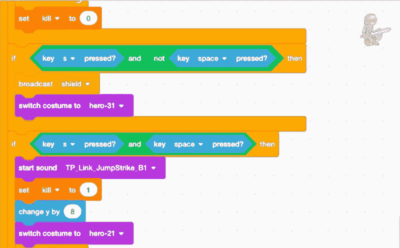

# 挠痒痒

> 原文：<https://dev.to/denmch/scratch-that-itch-1i0j>

我从来不想强迫我的孩子去做事情，尤其是不要用我的方式去做。我一直在画画，但我不想给我的孩子辅导如何以“正确的方式”或以我的风格画画。

我希望他们玩得开心，想办法解决问题，如果他们想做什么，就有机地学习。我认为，如果他们以这种方式发展技能，他们会对自己的手艺有更深、更有意义的联系，并且会有一种“为什么”的感觉，如果我对他们施加任何“如何”的话，他们可能会缺乏这种感觉。

* * *

## 极限和创造力

最近，我八岁的儿子在一项关于把他读过的书变成早餐麦片的作业中，没有你想象的那么有趣。这是关于创造力的，对吗？好好享受吧！但是如果没有一个小的框架，很难有创造力。可能性太多，没有挂钩挂帽子。我崩溃了，做了一件很久以前就该做的事，我们一起坐在画桌前。

为了有创造性，你需要有做出创造性选择的自由。同样的，我们都被从支付账单到为家人计划膳食的所有事情弄得不知所措，你可以开始创造一些东西，然后永远被无休止的考虑所冻结，比如媒介、主题等等。

这就是为什么人们经常依靠提示，甚至为什么我在工作中做我的白板画时经常依靠讽刺和自嘲。任何东西都可以成为一个框架，限制足够多的外部关注，在这个小而集中的区域内，想法流动并成形。

* * *

## 信任算法

我向儿子展示了一些有趣的麦片盒子，打破了屡试不爽的三分法，以及一些常见的裁剪技巧(例如，不要展示整个碗:让它大部分位于框架之外，并放大以显示细节)。我们谈到了这个或那个设计如何基于简单的原则，本质上是普通的设计算法，让你快速地组合出令人愉快和熟悉的布局，并专注于细节，从而产生运动感或兴奋感。

很快，他把我推到一边，说他有一个主意。一个令人沮丧和乏味的努力变成了一个有趣的设计。

当然，算法不是通用的或硬性的规则。你不必使用三分法，但令人惊讶的是，应用这样一个简单的工具可以打开事物，让你开始做出创造性的选择。

* * *

## 代码的艺术

这感觉像是一个巨大的胜利，我决定采取这种策略，因为最近发生了一些事情，当时他正在努力解决一个关于 [Scratch 的问题，这是麻省理工学院针对儿童的一个很棒的编程社区](https://scratch.mit.edu/)。

对我来说，Scratch 最有趣的一点是，他在做我年轻时做过的事情，无论是在 80 年代作为一个试图理解 B.A.S.I.C .的孩子，还是后来作为一个年轻的成年人，在 90 年代查看源代码并学习网络如何工作。他对一个项目进行混音，比如说一个别人制作的游戏——来自一个更老、更有经验、更精明的程序员的东西——他在这个基础上学习。

在这种情况下，它比他习惯的要复杂一点，一个 NPC 是由某个动作产生的，然后在另一个动作中被移除。当这个敌人被击败时，你如何增加一个新的敌人？

细节没有原则重要。当他回到代码中进行调整，却没有看到预期的结果时，他变得越来越沮丧。这也很熟悉。我们都经历过，玩着修修补补直到成功的游戏。但这是一个危险的游戏，很少真正奏效。

所以现在，他需要的不是在现有的基础上进行构建，而是找出如何根据需要复制功能，以及如何调试出了什么问题。

起初，他添加的代码没有效果，在询问他触发各种结果的具体操作以及某些事情发生的条件后，他能够思考并定位控制 NPC 及其外观的代码。

嗯，不完全是它的外表。但是我们很亲密。看，NPC 肯定在那里，只是我们看不到它。我们可以听到它的剑，我们的角色受到了伤害，但我们只是看不到它。它是隐形的。

回到代码，回到更多的关于这种或那种情况下发生的问题，帮助我的儿子看到哪里的服装被改变或精灵的不透明度被设置。

不久后，在思考程序逻辑而不是直接修改代码的指导下，他能够将一个敌人演示变成一个有 14 个敌人战斗人员的游戏。(一开始我可能会选 3，但他定为 14，我不打算争辩。)

* * *

我没有给他写任何代码，只是用一些非常基础的调试知识介入，减轻他的负担，让他去找答案。这对我们两个来说都是令人难以置信的回报，而且它从来没有接近“如何编码”的死记硬背的课程这只是朝着正确的方向推了一把，一些界限让他自由地逃离焦虑，找到自己的路，回到创造事物的乐趣中。

我认为一个重要的教训是，当你周围有资深人士可以清除障碍，将事情放在背景中，并在正确的方向上推动你时，你有更大的自由来发挥创造力和学习。对孩子是这样，对初级开发者也是这样。没有人需要重新发明轮子或者默默忍受。但是请记住，人们并不总是知道该问哪些问题，或者什么阻碍了他们。

这取决于你保持警惕，并伸出援手。