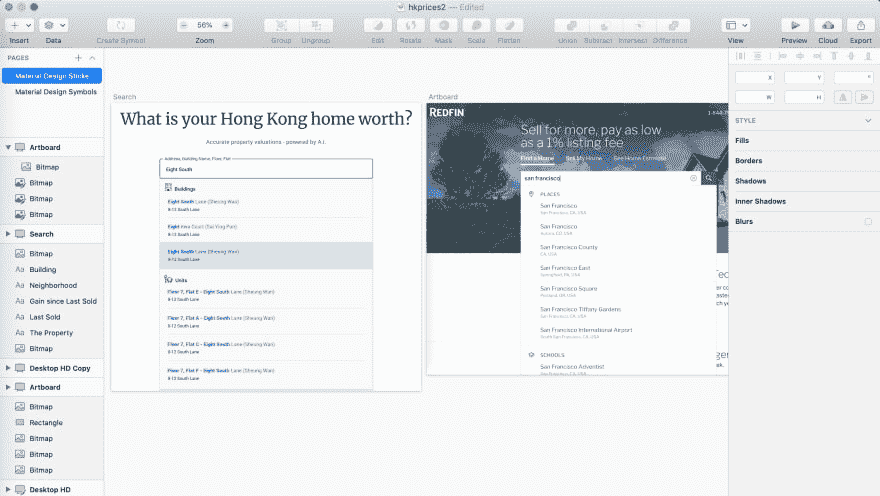
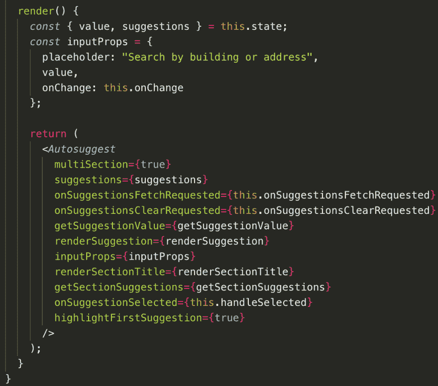

# 使用 React & AWS CloudSearch 自动完成 200 万条记录的搜索

> 原文：<https://dev.to/jlei523/search-autocomplete-for-2-million-records-with-react-aws-cloudsearch-3bld>

True Home 是一个自举式的网络应用程序，为香港的每一处房产提供房屋价值评估——这意味着超过 200 万套房屋。

让用户尽可能高效地查看自己的家成了一个挑战。

为了让用户更容易找到他们的家，我们使用以下堆栈构建了一个搜索自动完成服务:

*   AWS 云搜索
*   反应
*   react-自动建议和自动建议-突出显示模块
*   Express.js 服务器

## 香港房地产上的几个花絮:

*   大多数人住在有数百个单元的高层公寓里。
*   香港的每座建筑都有一个独特的名字，比如“贝尔彻斯的肯尼迪”。
*   香港人一般不会用诸如“主街 123 号”这样的地址来称呼他们的居住地。相反，他们使用自己的建筑名称和地区，如“铜锣湾宝翠园 A 座”。

[](https://res.cloudinary.com/practicaldev/image/fetch/s--QFpbKzD_--/c_limit%2Cf_auto%2Cfl_progressive%2Cq_auto%2Cw_880/https://miro.medium.com/max/1288/1%2Ao_RsSmbu786B3ZraDlw1nA.png)

香港人就是这样生活的。中间那栋楼也正好是我现在的家！

## 我们的搜索自动完成要求:

*   不能使用谷歌位置 API，因为没有办法将结果连接到我们的数据库记录。
*   我不能使用 Algolia，因为它对我们的自举应用程序来说太贵了(200 万张唱片每月 700 美元)。
*   用户应该能够通过建筑物的名称进行搜索。
*   用户应该能够通过建筑物名称和单元号来搜索他们的确切单元。

## 在我们建造之前，我们设计！

为了设计我们搜索功能的外观和感觉，我使用了 Sketch 应用程序，并从我曾经工作过的地方 Redfin 汲取灵感。

尽早敲定设计很重要，因为它帮助我弄清楚我需要使用什么工具，需要什么数据。

[](https://res.cloudinary.com/practicaldev/image/fetch/s--oHnmAxx8--/c_limit%2Cf_auto%2Cfl_progressive%2Cq_auto%2Cw_880/https://miro.medium.com/max/5568/1%2AJVrUB_GxTaN5WVHYnIRlJA.png)

## 现在让我们为 AWS CloudSearch 准备数据

您可以准备 JSON、CSV、xml 或 txt 格式的数据。我们选择 JSON 是因为批量上传只支持 JSON 和 xml 格式。

True Home 有两个搜索类别:建筑和单元。

这里有一个 JSON 文件的例子:

```
[
  {
    "buildingaddress": "8 LEUNG TAK STREET",
    "Name": "EIGHT REGENCY (Tuen Mun)",
    "type": "building"
  },
  {
    "buildingaddress": "8 LEUNG TAK STREET",
    "Name": "31/F FLAT N - NA EIGHT REGENCY (Tuen Mun)",
    "type": "unit"
  }
] 
```

## 上传数据到 AWS CloudSearch

您可以通过两种方式上传数据:通过 AWS GUI 控制台或通过终端的`aws`命令。

您可以上传到 AWS CloudSearch 的最大文件大小仅为 5mb。这给我们带来了一个问题，因为我们有 200 万条记录，总共 900mb 的数据要上传！

为了解决这个问题，我们必须生成 180 个 JSON 文件，每个文件略低于 5mb，并通过 aws 命令行工具批量上传它们。
下面是我们用来遍历所有 180 个 JSON 文件并上传到端点的 bash 脚本:

```
for VARIABLE in $(ls *.json); do echo $VARIABLE; aws cloudsearchdomain --endpoint-url {ENDPOINT URL here} upload-documents --content-type application/json --documents $VARIABLE; sleep 1s; done 
```

## 测试搜索结果

AWS CloudSearch 提供的一个好处是能够在控制台中立即测试搜索您的数据。

在这里，我们可以测试新上传的数据:

[](https://res.cloudinary.com/practicaldev/image/fetch/s--P4nAmLde--/c_limit%2Cf_auto%2Cfl_progressive%2Cq_auto%2Cw_880/https://miro.medium.com/max/2236/1%2ACYwkIZFO8EDvyFyNdKsRXA.png)

## 为 AWS CloudSearch 设置 Express.js 端点

一旦确认可以搜索新上传的数据，让我们在服务器上运行一个 API 来查询数据。真家正好用 Express.js。

数据流是这样工作的:

`User types a search → search query is sent to Express server → Express server gets data from CloudSearch endpoint → Express sends search results back to browser`

等一下！为什么我们需要通过服务器？为什么不直接从浏览器查询 CloudSearch 端点？

不幸的是，CloudSearch 不支持 CORS，这意味着你要么必须通过 Express.js 这样的服务器，要么设置某种代理服务，这两者都会增加每个查询的延迟。

幸运的是，延迟影响并不太大，因为我们的服务器和 CloudSearch 实例托管在同一个 AWS 位置。

这里有一个如何设置 Express API 的例子:

```
server.get("/autocomplete/:searchString", async (req, res) => {

    let cloudSearchEndpoint = 'your endpoint here'

    let data = await axios.get(
      ` ${endpoint}/2013-01-01/search?q=~${
        req.params.searchString
      }&return=_all_fields%2C_score&highlight.label=%7B%22max_phrases%22%3A3%2C%22format%22%3A%22text%22%2C%22pre_tag%22%3A%22*%23*%22%2C%22post_tag%22%3A%22*%25*%22%7D&highlight.unitcode=%7B%22max_phrases%22%3A3%2C%22format%22%3A%22text%22%2C%22pre_tag%22%3A%22*%23*%22%2C%22post_tag%22%3A%22*%25*%22%7D&sort=_score+desc`
    );
    res.send(JSON.stringify(data));
  }); 
```

CloudSearch 有官方的 Javascript 支持，但由于某些原因，我很难让它工作。总体而言，缺乏 AWS 文档。作为一种变通方法，我简单地使用测试工具自动生成的端点作为我的快速获取 URL。

## 构建 React 组件

[](https://res.cloudinary.com/practicaldev/image/fetch/s--Cg5FCHEH--/c_limit%2Cf_auto%2Cfl_progressive%2Cq_auto%2Cw_880/https://miro.medium.com/max/2056/1%2AwXgz3bA5QUbGLU3w6Usq2w.png)

True Home 的 React 搜索组件是用 react-autosuggest 构建的。我们选择这个模块是因为它有很好的文档和易于理解的例子。

最初，我担心在用户输入时突出显示单词的困难，但自动建议突出显示使这变得轻而易举。

总而言之，前端代码大概花了 4 个小时才完成。大部分时间花在格式化来自 CloudSearch 的数据上，其余时间花在样式化组件上。

这里有 [True Home 的搜索组件](https://gist.github.com/jlei523/dbe6b37540da793b5ada5cee9b00e58a)的全部内容供参考。

## 结果

[https://thumbs.gfycat.com/WhisperedAfraidAoudad-mobile.mp4](https://thumbs.gfycat.com/WhisperedAfraidAoudad-mobile.mp4)

## 结论:使用现代工具来构建搜索自动完成非常容易，但是我不会再使用云搜索了

整个功能花了大约 32 个小时完成——比我最初想象的要快得多，因为我以前没有搜索经验。

相比之下，早在 2014 年，一位经验丰富得多的工程师就花了一个多月的时间来构建 Redfin 的搜索功能。诚然，Redfin 的搜索有更多的需求、更多的数据和更多的平台需要支持。

最耗时的部分是为 CloudSearch 准备数据，以及查找 CloudSearch 糟糕而稀疏的文档。

亚马逊似乎不再改进 CloudSearch 了。上一次重大更新是在 2013 年。我怀疑这是由于 Elastisearch 在受欢迎程度上超过了 Solr(cloud search 所基于的)。

如果让我再做一次，我会选择 Elasticsearch 而不是 CloudSearch，因为前者有更好的文档并支持 CORS。

就是这样！