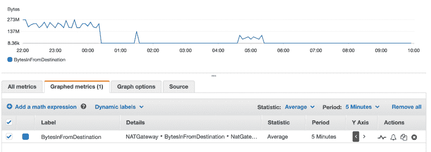

# 我们如何通过 Amazon ECS Fargate 每月损失 800 美元

> 原文：<https://dev.to/raphael_jambalos/secret-costs-of-ecs-fargate-4j3b>

众所周知，应用程序容器化有助于降低服务器成本。**但如果设计不当，会增加带宽成本等其他成本**。在这篇文章中，我将告诉你当我们第一次使用 ECS-Fargate 时，我们是如何收取 800 美元的带宽费用的。

# 不过先来一点上下文...

当您第一次部署 ECS 服务时，ECS 代理从 Dockerhub 或 ECR 之类的映像注册中心获取您的 Docker 映像。有了这个下载的映像，代理将通过命令`docker run your-docker-image`生成一个 docker 容器。然后，ECS 运行健康检查，查看您的应用程序是否正在运行。如果通过健康检查，负载平衡器会将流量重定向到容器。如果它没有通过几次健康检查，容器就会被终止。然后 docker 代理尝试从同一个映像启动另一个容器。

ECS 有两种类型的服务，它们在处理重启尝试的方式上有所不同。

### 【①ECS-EC2

在 ECS-EC2 中，您管理运行容器的 EC2 实例。您可以运行的集装箱数量受到车队的 CPU 和内存容量的限制。如果实例没有图像，它会下载一次并将其存储在本地。因此，在第一次下载之后，映像已经在实例中了。当 docker 代理执行`docker run`时，它会在本地获取图像。

### (2) ECS-Fargate

运行容器的底层 EC2 实例是从你那里抽象出来的。您无权访问运行您的容器的 EC2 实例。AWS 为您管理这些实例；因此，服务变成*无服务器*。只需支付一点额外费用，您就可以从管理 EC2 实例的操作负担中解脱出来。

容器第一次运行的 EC2 实例很有可能与第二次运行的不同。因此，每当 ECS 试图生成另一个容器时，代理都必须从 ECR 获取您的映像。

# 这就是我们被收费的原因...

我正在将我们的服务从 ECS-EC2 迁移到 ECS-Fargate。但是，我无法正确设置一项服务。我在错误配置的状态下离开了服务。由于服务制作的容器配置错误，所以它从不在其中运行应用程序。所以，它一直没有通过健康检查。几次失败后，容器被破坏，服务试图制作另一个。**由于 ECS-Fargate 容器下的实例不断变化，它*每次重启时都需要*下载我的 500MB docker 映像。**想象一下，每 2-3 分钟 500MB 是如何在一个月内轻松达到 16TB 的。

# 我们是如何发现的...

我过去工作的时间之一是检查我们的 AWS 法案。我期望节省大量成本，因为我们从拥有 10 个 m5.large EC2 实例减少到只有 1 个 m5.large 实例和几个 ECS-Fargate 容器。但是节省的钱还不到我预期的一半。所以我深入调查，发现我们的 NAT 网关费用增加了 6 倍。我们的带宽消耗从 38GB/月增加到 16TB/月！

NAT 网关是一个实体，私有子网中的资源通过它访问互联网。它的每 GB 流量收费 0.045 美元。

# 小小的实验

由于成本的增加与 ECS Fargate 的升级同时发生，我决定关闭我们所有的容器几分钟。带宽消耗突然下降:

为了缩小特定服务的范围，我决定打开所有服务，除了我配置错误的那个服务。成本突然又上涨了！！这时我发现在 ECS Fargate 中让服务处于错误配置状态会增加成本。

# 故事的寓意...

不要让您的 ECS 服务处于错误配置状态。如果你不能完成设置，至少把容器数设置为零，这样它就不会继续生成容器。

另外，**将你的 AWS 账单作为反馈机制**。在你的账单的某一方面突然出现意想不到的费用可能意味着出了问题。

特别感谢我的编辑艾伦，他帮助这篇文章变得更加连贯。

我很高兴听取你对这篇文章的评论/反馈。就在下面评论吧，或者给我留言！